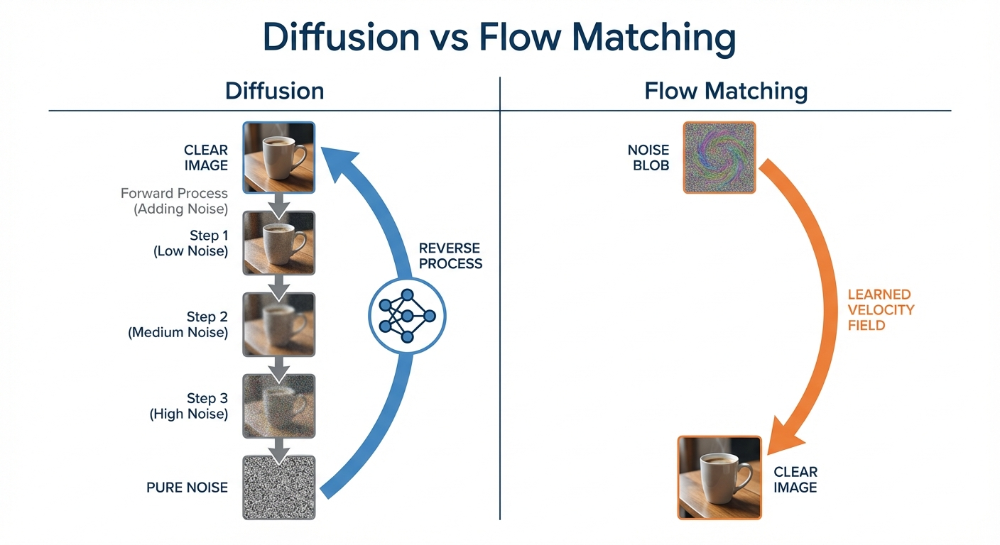

::: {.callout-note appearance="simple"}
## TL;DR

- **Diffusion models** gradually add noise to data, then learn to reverse the process
- **Flow matching** learns a velocity field that directly transports noise to data
- Both achieve state-of-the-art results; flow matching is often simpler to train
:::

## Series Overview

This multi-part series explores the theory behind modern generative models. Each post builds on the previous one:

| Part | Topic | What You'll Learn |
|------|-------|-------------------|
| **Part 1** | [Introduction](../1-intro/) (this post) | High-level overview of diffusion and flow matching |
| **Part 2** | [Understanding Flows](../2-flows/) | Vector fields, trajectories, and flows — the foundation |
| **Part 3** | [Probability Paths](../3-probability-paths/) | How we define paths from noise to data |
| **Part 4** | [The Flow Matching Loss](../4-flow-matching-loss/) | The marginalization trick that makes training work |
| *Part 5+* | *Coming soon* | Diffusion models deep dive, SDEs, and more |

## What Are We Building?

Diffusion models and flow matching power today's best generative AI systems — Stable Diffusion, DALL-E, Midjourney, and Flux. Despite their different formulations, both solve the same fundamental problem:

> **How do we learn to transform random noise into structured data?**

If we can do this, we can generate new images, audio, video, or any data type by starting with random noise and "flowing" toward realistic samples.

## Diffusion Models: The Noisy Path

The key idea behind diffusion models is surprisingly simple:

1. **Forward process**: Take real data and gradually corrupt it with noise until it becomes pure random noise
2. **Reverse process**: Train a neural network to undo this corruption step by step

Think of it like this: if you slowly blur a photograph until it's unrecognizable static, the neural network learns to "unblur" it. At generation time, you start with pure static and apply the learned unblurring process to create a new image.

The forward process is fixed (just adding noise), so the only thing we need to learn is how to reverse it. The network is trained to predict how much noise was added at each step.

## Flow Matching: The Direct Path

Flow matching takes a more direct approach:

1. **Define a path**: Specify how to smoothly interpolate between noise and data
2. **Learn the velocity**: Train a neural network to predict the direction of motion along this path

Imagine dropping a leaf into a river. The current (vector field) tells the leaf which way to move at each moment. If we design the currents correctly, leaves dropped anywhere in the "noise region" will flow toward the "data region."

The simplest path is a straight line between a noise sample and a data sample. The network learns the velocity field that produces these straight-line trajectories.

## How Do They Compare?

| Aspect | Diffusion | Flow Matching |
|--------|-----------|---------------|
| Corruption process | Gradual noise addition | Direct interpolation |
| What the network learns | How much noise to remove | Which direction to move |
| Sampling method | Iterative denoising | Following the learned flow |
| Underlying theory | Score matching | Optimal transport |
| Path type | Stochastic (random) | Deterministic (fixed) |

## The Deep Connection

Despite their different presentations, diffusion and flow matching are deeply related. Every diffusion model has an equivalent "probability flow" formulation that looks like flow matching. The score function (gradient of log probability) in diffusion corresponds to the velocity field in flow matching.

This connection means insights from one framework often transfer to the other, and modern systems sometimes combine ideas from both.

## What's Next?

In the following posts, we'll develop the mathematical machinery to understand these methods properly:

- [**Part 2**](../2-flows/): We'll define what "flows" and "vector fields" actually mean
- [**Part 3**](../3-probability-paths/): We'll see how to construct paths from noise to data
- [**Part 4**](../4-flow-matching-loss/): We'll discover the clever trick that makes training tractable

By the end, you'll understand not just *what* these models do, but *why* they work.

## References

1. Ho, J., Jain, A., & Abbeel, P. (2020). [Denoising Diffusion Probabilistic Models](https://arxiv.org/abs/2006.11239). *NeurIPS*.
2. Lipman, Y., et al. (2023). [Flow Matching for Generative Modeling](https://arxiv.org/abs/2210.02747). *ICLR*.
3. Song, Y., et al. (2021). [Score-Based Generative Modeling through Stochastic Differential Equations](https://arxiv.org/abs/2011.13456). *ICLR*.
