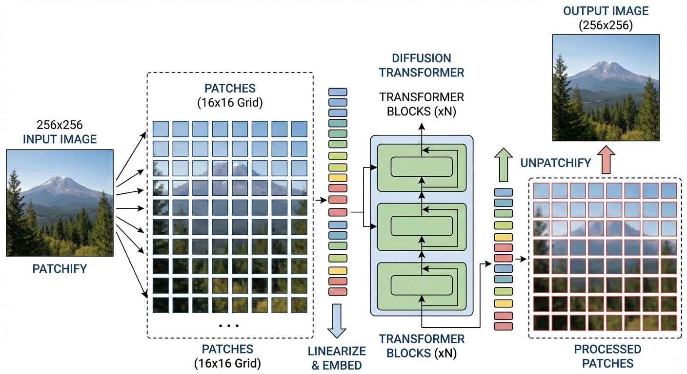
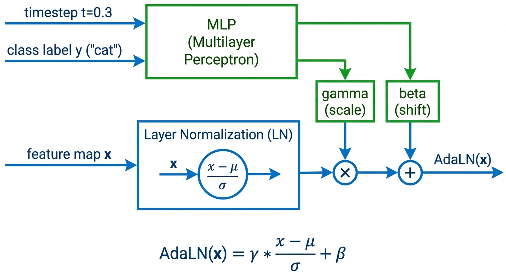
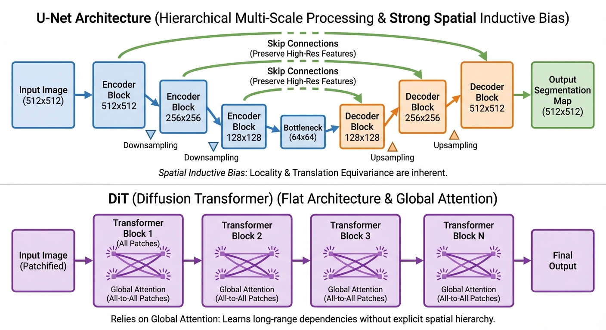

::: {.callout-note appearance="simple"}

## TL;DR

- **Vision Transformer (ViT)** treats images as sequences of patches — this enables transformers to process images without convolutions
- **Diffusion Transformer (DiT)** adapts ViT for diffusion by adding time/class conditioning via AdaLN
- **Key insight**: DiT = ViT + AdaLN conditioning + latent space operation
- **Trade-off**: DiT scales better than U-Net but needs more data/compute to overcome weak spatial bias

:::

In the [previous post](../9-unet/), we covered U-Net — the dominant architecture for diffusion models. But recent work shows that **transformers can match or exceed U-Net performance** while offering better scalability.

This post covers:
1. **Vision Transformer (ViT)** — the foundation that DiT builds upon
2. **Diffusion Transformer (DiT)** — how to adapt ViT for diffusion models
3. **When to use DiT vs U-Net** — practical guidance

## Vision Transformer (ViT) Primer {#sec-vit}

Before understanding DiT, we need to understand **Vision Transformer (ViT)** — the architecture it's built on.^[[Dosovitskiy et al., 2020](https://arxiv.org/abs/2010.11929)]

::: {.callout-tip appearance="simple"}
## Intuition: The Problem ViT Solves

Transformers revolutionized NLP with attention mechanisms that capture long-range dependencies. But transformers expect **sequences of tokens** — how do you apply them to 2D images?

**The breakthrough**: Treat image patches as "visual words." A 224×224 image split into 16×16 patches becomes a sequence of $(224/16)^2 = 196$ tokens. Now standard transformer machinery applies!
:::

### The ViT Architecture

![Vision Transformer (ViT) architecture from Dosovitskiy et al. (2020). Left: image is split into patches, linearly projected, combined with position embeddings, and processed by a transformer encoder. A learnable [class] token (position 0) aggregates information for classification. Right: the transformer encoder block structure with layer norm, multi-head attention, MLP, and residual connections.](vit-architecture-original.png){#fig-vit}

**Step-by-step**:

1. **Patchify**: Split image into non-overlapping $p \times p$ patches
   - Input: $H \times W \times C$ image
   - Output: $N = (H/p) \times (W/p)$ patches, each of size $p^2 \cdot C$

2. **Linear embedding**: Project each flattened patch to dimension $d$
   $$z_i = W_{\text{embed}} \cdot \text{flatten}(\text{patch}_i) + b$$
   - This is just a learnable linear layer applied to each patch

3. **Add position embeddings**: Since attention is permutation-invariant, we must tell the model where each patch came from
   $$z_i \leftarrow z_i + e_{\text{pos}}^{(i)}$$
   - Position embeddings are learnable vectors (one per position)
   - Without this, the model couldn't distinguish a patch at top-left from bottom-right!

4. **Prepend [CLS] token**: A special learnable token that aggregates information
   - After processing, the [CLS] token's output is used for classification

5. **Transformer encoder**: Stack of identical blocks, each containing:
   - Multi-head self-attention (patches attend to all other patches)
   - MLP (feed-forward network)
   - Layer normalization and residual connections

::: {.callout-tip appearance="simple"}
## Intuition: What Does Patch Attention Learn?

Just like words "fox" and "jumps" share semantic relationships, visual patches relate to one another:^[[Pinecone, "Vision Transformers Explained"](https://www.pinecone.io/learn/series/image-search/vision-transformers/)]

- **Texture relationships**: All sky patches attend to each other, learning "blueness" is consistent
- **Structural relationships**: A horse's left ear patch attends to its right ear patch, learning symmetry
- **Semantic relationships**: Wheel patches attend to window patches, learning "car-ness"

This global attention — every patch sees every other patch — is what lets ViT capture long-range dependencies that CNNs struggle with.
:::

6. **Classification head**: MLP on the final [CLS] token representation

### Why Patches? The Quadratic Cost Problem

::: {.callout-tip appearance="simple"}
## Intuition: Why Not Use Pixels as Tokens?

You might wonder: why not treat each pixel as a token?

**The math**: A 224×224 image = 50,176 pixels. Self-attention is $O(n^2)$, so attention would require $50,176^2 \approx 2.5$ billion operations per layer!

**Patches reduce this**: With 16×16 patches, we get only 196 tokens. Attention cost: $196^2 = 38,416$ operations — a **65,000× reduction**.

The trade-off: We lose some fine-grained spatial information, but gain computational tractability.
:::

### ViT vs CNNs: Inductive Bias

| Property | CNNs | ViT |
|----------|------|-----|
| **Local bias** | Built-in (kernels are small) | None (attention is global) |
| **Translation equivariance** | Built-in (same kernel everywhere) | Must learn from data |
| **Data efficiency** | Good (bias helps with limited data) | Poor (needs lots of data) |
| **Scalability** | Limited (hard to scale past ~1B params) | Excellent (scales predictably) |

**Key insight**: ViT has **weaker inductive bias** than CNNs. This is a disadvantage with limited data (must learn what CNNs get "for free"), but an advantage at scale (fewer constraints on what it can learn).

## From ViT to DiT {#sec-vit-to-dit}

Now we can understand DiT as **ViT adapted for diffusion**. The key question: what changes are needed?

::: {.callout-tip appearance="simple"}
## Intuition: What's Different About Diffusion?

**ViT for classification**:
- Input: image → Output: class label
- No conditioning needed (besides the image itself)

**DiT for diffusion**:
- Input: noisy image → Output: noise prediction (same size as input)
- Must condition on timestep $t$ and optionally class $y$
- No [CLS] token needed (we want image output, not a single vector)
:::

### The Three Key Adaptations

**1. Remove [CLS] token, add decoder**
- ViT: Uses [CLS] token for classification
- DiT: Uses all patch tokens, decodes back to image via linear layer

**2. Operate in latent space** (see [Latent Diffusion in Part 9](../9-unet/#sec-modern))
- ViT: Works on raw pixels (224×224 is manageable)
- DiT: Works on VAE latents (raw 512×512 would be 65,536 tokens!)

**3. Add conditioning mechanism (AdaLN)**
- ViT: No timestep/class conditioning
- DiT: Must inject $t$ and $y$ into every block

## Diffusion Transformer (DiT) {#sec-dit}

### Motivation: Why Move Beyond U-Net?

::: {.callout-tip appearance="simple"}
## Intuition: The Scaling Problem

U-Net works great, so why change? The problem is **scaling**.

**U-Net's issue**: Adding more layers or channels hits diminishing returns. The hierarchical structure (downsampling → bottleneck → upsampling) limits how much compute you can effectively use.

**Transformer's advantage**: It's just **repeated identical blocks**. Want 2× the compute? Add more layers or wider hidden dimensions. This simplicity makes transformers scale predictably — a property called "scaling laws."

**Trade-off**: Transformers have weaker spatial bias than convolutions. They need more data and compute to learn what convolutions get "for free." But at massive scale (1000s of GPU-days), transformers win.
:::

Recent work shows transformer architectures can exceed U-Net performance:^[[Peebles & Xie, 2023](https://arxiv.org/abs/2212.09748)]

| Property | U-Net | DiT |
|----------|-------|-----|
| **Scaling** | Diminishing returns past ~1B params | Predictable: 2× compute → better FID |
| **Design** | Complex (skip connections, multi-resolution) | Simple (stack identical blocks) |
| **Spatial bias** | Strong (convolutions) | Weak (must learn from data) |
| **Best for** | Limited compute, few data | Massive compute, lots of data |

### The DiT Architecture

::: {.callout-tip appearance="simple"}
## Intuition: How Transformers See Images

Transformers expect **sequences of tokens** (like words in a sentence). But images are 2D grids!

**The solution**: Split the image into non-overlapping patches and treat each patch as a "visual word."

**Example**: A 256×256 image with 16×16 patches becomes $(256/16)^2 = 256$ tokens. Now the transformer can process it just like a sentence of 256 words!

**The catch**: Attention is $O(n^2)$ in sequence length. A 512×512 image with 16×16 patches = 1024 tokens = 1 million attention computations per layer. This is why DiT operates in **latent space** (more on this below).
:::

{#fig-dit-patchify}

DiT adapts Vision Transformer (ViT) for diffusion:^[[Encord, "Diffusion Transformer Models Guide"](https://encord.com/blog/diffusion-models-with-transformers/)]

1. **Patchify**: Split latent into $p \times p$ non-overlapping patches
2. **Embed**: Linear projection maps each patch to a token vector (dimension $d$)
3. **Add position**: Learnable position embeddings tell the model where each patch came from
4. **Process**: Stack of transformer blocks (self-attention + MLP)
5. **Decode**: Linear layer maps tokens back to patches, reshape to image

### Why Latent Space is Essential {#sec-latent}

::: {.callout-tip appearance="simple"}
## Intuition: The Sequence Length Problem

Running DiT in pixel space is prohibitively expensive. Here's why:

**Pixel space**: 256×256×3 image with patch size 2 → $(256/2)^2 = 16,384$ tokens
**Attention cost**: $16,384^2 \approx 270$ million operations per layer!

**Latent space**: VAE compresses 256×256×3 → 32×32×4, then patch size 2 → $(32/2)^2 = 256$ tokens
**Attention cost**: $256^2 = 65,536$ operations per layer

That's a **4000× reduction** in attention cost. Latent diffusion isn't optional for DiT — it's essential.
:::

{#fig-latent-diffusion-dit}

**Patch size trade-off**:

| Patch Size | Tokens (from 64×64 latent) | Quality | Compute |
|------------|---------------------------|---------|---------|
| 2 | 1024 | Best (FID 2.27) | Highest |
| 4 | 256 | Good | Medium |
| 8 | 64 | Lower | Fastest |

### Conditioning via AdaLN-Zero {#sec-adaln}

Now for the key question: how does DiT handle time $t$ and class label $y$?

::: {.callout-tip appearance="simple"}
## Intuition: Why Not Just Add Tokens?

The obvious approach: add $t$ and $y$ as extra tokens in the sequence. But this wastes capacity — every layer processes these tokens even though their values never change!

**AdaLN's insight**: Instead of adding tokens, **modulate the layer normalization**. The conditioning doesn't participate in attention — it just adjusts how the layers process features.

**Analogy**: Think of an audio equalizer. The EQ settings don't become part of the music — they adjust the gain and tone of what's playing. AdaLN adjusts the "gain and tone" of each layer based on timestep and class.
:::

{#fig-adaln}

**How AdaLN works** — For each transformer block:

1. **Embed conditioning**: $c = \text{MLP}(e_t + e_y)$ where $e_t, e_y$ are time/class embeddings
2. **Predict 6 parameters**: $(\gamma_1, \beta_1, \alpha_1, \gamma_2, \beta_2, \alpha_2) = \text{Linear}(c)$
3. **Modulate attention branch**:
   - Scale and shift after LayerNorm: $x' = \gamma_1 \cdot \text{LN}(x) + \beta_1$
   - Gate the residual: $x = x + \alpha_1 \cdot \text{Attention}(x')$
4. **Modulate MLP branch**:
   - Scale and shift: $x' = \gamma_2 \cdot \text{LN}(x) + \beta_2$
   - Gate the residual: $x = x + \alpha_2 \cdot \text{MLP}(x')$

::: {.callout-tip appearance="simple"}
## Intuition: Why "Zero" in AdaLN-Zero?

The $\alpha$ (gating) parameters are initialized to **zero**. This means at initialization, each DiT block computes:
$$x_{\text{out}} = x + 0 \cdot \text{Attention}(x) = x$$

The block is an **identity function** — it just passes the input through unchanged! This makes training 28-layer networks stable because the model starts simple and gradually learns to use each layer.

**Why this works so well**: Research shows that zero-initialized weights gradually converge to a Gaussian-like distribution during training.^[[OpenReview, "Unveiling the Secret of AdaLN-Zero"](https://openreview.net/forum?id=E4roJSM9RM)] This smooth convergence is more stable than random initialization — the network learns to "turn on" conditioning gradually rather than starting with noisy modulation.
:::

**Why AdaLN-Zero wins**:^[[Peebles & Xie, 2023](https://arxiv.org/abs/2212.09748)]

| Method | How it works | Cost | ImageNet FID |
|--------|-------------|------|--------------|
| **In-context** | Append $t$, $y$ as extra tokens | $O(d)$ | 5.67 |
| **Cross-attention** | Attend over condition embeddings | $O(d^2)$ | 3.75 |
| **AdaLN** | Modulate LayerNorm scale/shift | $O(d)$ | 2.98 |
| **AdaLN-Zero** | AdaLN + zero-init gating | $O(d)$ | **2.27** |

**Note on text conditioning**: For free-form text prompts (not class labels), cross-attention works better than AdaLN. This is what Stable Diffusion uses — the text encoder outputs a sequence of embeddings, and each DiT block cross-attends to them. See [Part 9](../9-unet/) for more on how conditioning flows through the network.

## Comparison: U-Net vs DiT {#sec-comparison}

{#fig-comparison}

::: {.callout-important appearance="simple"}
## When to Use Each

**Use U-Net if:**
- You're training on limited compute (< 100 GPU-days)
- Working in pixel space (not latent diffusion)
- You need strong performance out-of-the-box with less data
- Example: Fine-tuning Stable Diffusion on a custom domain

**Use DiT if:**
- You have massive compute and data (foundation model scale)
- Working in latent space with a pretrained VAE
- You want best-in-class scalability and are willing to pay the compute cost
- Example: Training a class-conditional ImageNet model from scratch
:::

Here's how the architectures compare:^[[APXML, "U-Net vs Transformer Comparison"](https://apxml.com/courses/advanced-diffusion-architectures/chapter-3-transformer-diffusion-models/unet-vs-transformer-diffusion)]

| Aspect | U-Net | DiT |
|--------|-------|-----|
| **Inductive bias** | Strong (convolution = local, translation-invariant) | Weak (attention = global, permutation-invariant) |
| **Scalability** | Diminishing returns past ~1B parameters | Predictable scaling: 2× compute → better FID |
| **Training cost** | Lower (100s of GPU-days for Stable Diffusion) | Higher (1000s of GPU-days for DiT-XL/2) |
| **Sample quality (@ equivalent cost)** | Better on small/mid budgets | Better at massive scale |
| **Conditioning** | Ad-hoc (inject time, add cross-attn for text) | Principled (AdaLN, cross-attn, or in-context) |
| **Architecture complexity** | High (skip connections, resolution-dependent attn) | Low (repeat identical blocks) |
| **Memory efficiency** | Better (hierarchical = smaller feature maps) | Worse (all patches processed at full resolution) |

::: {.callout-warning appearance="simple"}
## Common Misconception

**"Transformers are always better than CNNs"** — Not true for diffusion! U-Nets remain state-of-the-art for many applications because they encode strong spatial priors. DiT only wins when you have enough data and compute to overcome its lack of inductive bias.^[[Dhariwal & Nichol, 2021](https://arxiv.org/abs/2105.05233)]
:::

**Empirical result**: DiT-XL/2 achieves FID 2.27 on ImageNet 256×256, beating the previous best (LDM) of 3.60. But this required training on 256 TPU-v3 cores — far more than U-Net baselines.^[[Peebles & Xie, 2023](https://arxiv.org/abs/2212.09748)]

## DiT Model Configurations {#sec-configs}

DiT comes in four configurations borrowed from ViT:^[[Peebles & Xie, 2023](https://arxiv.org/abs/2212.09748)]

| Model | Hidden Dim | Depth | Heads | Parameters | Gflops |
|-------|-----------|-------|-------|------------|--------|
| DiT-S | 384 | 12 | 6 | 33M | 0.4 |
| DiT-B | 768 | 12 | 12 | 130M | 5.6 |
| DiT-L | 1024 | 24 | 16 | 458M | 35.6 |
| DiT-XL | 1152 | 28 | 16 | 675M | 119 |

The naming follows ViT conventions (S=Small, B=Base, L=Large, XL=Extra Large), and the configs were chosen based on ViT scaling research.

## Evaluating Generative Models: FID {#sec-fid}

We've mentioned "FID 2.27" several times — but what does this actually mean?

::: {.callout-tip appearance="simple"}
## Intuition: How Do You Measure Image Quality?

You can't just compare generated images to training images pixel-by-pixel (that would penalize valid variations). Instead, we compare **high-level features** — does the model generate things that "look like" real images at a semantic level?

**Fréchet Inception Distance (FID)** does exactly this:^[[Heusel et al., 2017](https://arxiv.org/abs/1706.08500)]
1. Pass real images through a pretrained Inception network → get feature vectors
2. Pass generated images through the same network → get feature vectors
3. Compare the **distributions** of these features (mean and covariance)
:::

**How FID works**:^[[Machine Learning Mastery, "FID for Evaluating GANs"](https://machinelearningmastery.com/how-to-implement-the-frechet-inception-distance-fid-from-scratch/)]

1. **Extract features**: Use Inception v3's 2048-dimensional penultimate layer activations
2. **Assume Gaussian**: Model both real and generated feature distributions as multivariate Gaussians
3. **Compute distance**: Calculate the Fréchet distance between the two Gaussians:
   $$\textcolor{blue}{\text{FID}} = \|\textcolor{green}{\mu_r} - \textcolor{orange}{\mu_g}\|^2 + \text{Tr}(\textcolor{green}{\Sigma_r} + \textcolor{orange}{\Sigma_g} - 2(\textcolor{green}{\Sigma_r} \textcolor{orange}{\Sigma_g})^{1/2})$$
   where $(\textcolor{green}{\mu_r}, \textcolor{green}{\Sigma_r})$ and $(\textcolor{orange}{\mu_g}, \textcolor{orange}{\Sigma_g})$ are the mean/covariance of $\textcolor{green}{\text{real}}$ and $\textcolor{orange}{\text{generated}}$ features

**Interpreting FID scores**:
- **Lower is better** — FID = 0 means identical distributions
- **ImageNet benchmarks**: FID < 5 is excellent, FID < 10 is good
- DiT-XL/2 achieves **FID 2.27** on ImageNet 256×256 (state-of-the-art as of 2023)

**Why FID over other metrics?**^[[Wikipedia, "Fréchet Inception Distance"](https://en.wikipedia.org/wiki/Fr%C3%A9chet_inception_distance)]
- **Inception Score (IS)**: Only looks at generated images, ignores real data distribution
- **FID**: Compares generated vs real — captures both quality AND diversity
- **Limitation**: Assumes Gaussian features, biased on small samples

::: {.callout-note appearance="simple"}
**Note**: FID is computed on a specific dataset (usually ImageNet) with specific image resolution. FID scores aren't directly comparable across different datasets or resolutions.
:::

## Modern DiT Variants {#sec-variants}

DiT has become the backbone for several state-of-the-art models. Recent research has also improved the core conditioning mechanism — **adaLN-Gaussian** initializes modulation weights from Gaussian distributions (instead of zero), yielding a 2.16% FID improvement over AdaLN-Zero.^[[OpenReview, "Unveiling the Secret of AdaLN-Zero"](https://openreview.net/forum?id=E4roJSM9RM)]

**Stable Diffusion 3 (SD3)**:
- Uses "Multi-Modal Diffusion Transformer" (MM-DiT)
- Separate transformer streams for text and image, with cross-attention
- Text conditioning via T5 and CLIP embeddings

**Flux**:
- Builds on DiT with improved text understanding
- Uses rectified flow instead of DDPM-style diffusion
- T5 + CLIP ensemble for text encoding

**Sora** (OpenAI):
- Video generation using DiT
- Treats video as sequence of patch tokens across space and time
- Enables variable resolution and duration

## Summary {#sec-summary}

::: {.callout-note appearance="simple"}
## Key Takeaways

**Vision Transformer (ViT)**:
- Treats images as patch sequences, enabling transformers for vision
- Key components: patchify → linear embed → position encoding → transformer blocks → classifier
- Weaker inductive bias than CNNs (must learn locality), but scales better

**Diffusion Transformer (DiT)**:
- DiT = ViT adapted for diffusion (no [CLS] token, adds decoder, adds AdaLN)
- **AdaLN-Zero**: Inject timestep/class by modulating LayerNorm parameters, not adding tokens
- Zero initialization of gating parameters → blocks start as identity → stable training
- Must operate in latent space (4000× attention cost reduction)

**When to use DiT vs U-Net**:
- U-Net: Limited compute, pixel space, need spatial bias
- DiT: Massive compute, latent space, want scaling laws

**The bigger picture**: U-Net and DiT are different ways to parameterize the same math ($u_\theta(x_t, t)$). The architecture choice is about trade-offs: inductive bias vs scalability, data efficiency vs ultimate performance.
:::

## References

**Foundational Papers:**

- Dosovitskiy, A., et al. (2020). [An Image is Worth 16x16 Words: Transformers for Image Recognition at Scale](https://arxiv.org/abs/2010.11929). *ICLR 2021*. (ViT)
- Peebles, W., & Xie, S. (2023). [Scalable Diffusion Models with Transformers](https://arxiv.org/abs/2212.09748). *ICCV 2023*. (DiT)
- Dhariwal, P., & Nichol, A. (2021). [Diffusion Models Beat GANs on Image Synthesis](https://arxiv.org/abs/2105.05233). *NeurIPS 2021*.

**Latent Diffusion:**

- Rombach, R., et al. (2022). [High-Resolution Image Synthesis with Latent Diffusion Models](https://arxiv.org/abs/2112.10752). *CVPR 2022*. (Stable Diffusion)

**Educational Resources:**

- Encord. [Diffusion Transformer (DiT) Models: A Beginner's Guide](https://encord.com/blog/diffusion-models-with-transformers/). Blog post.
- Lightly AI. [Diffusion Transformers Explained: The Beginner's Guide](https://www.lightly.ai/blog/diffusion-transformers-dit). Blog post.
- DiT Project Page. [Scalable Diffusion Models with Transformers](https://www.wpeebles.com/DiT). Official project page.
- APXML. [U-Net vs Transformer Comparison for Diffusion](https://apxml.com/courses/advanced-diffusion-architectures/chapter-3-transformer-diffusion-models/unet-vs-transformer-diffusion). Course material.
- Towards Data Science. [Diffusion Transformer Explained](https://towardsdatascience.com/diffusion-transformer-explained-e603c4770f7e/). Comprehensive walkthrough.
- Pinecone. [Vision Transformers (ViT) Explained](https://www.pinecone.io/learn/series/image-search/vision-transformers/). Excellent visual explanations of patch embeddings and attention.
- AI Summer. [How the Vision Transformer (ViT) works in 10 minutes](https://theaisummer.com/vision-transformer/). Concise tutorial.
