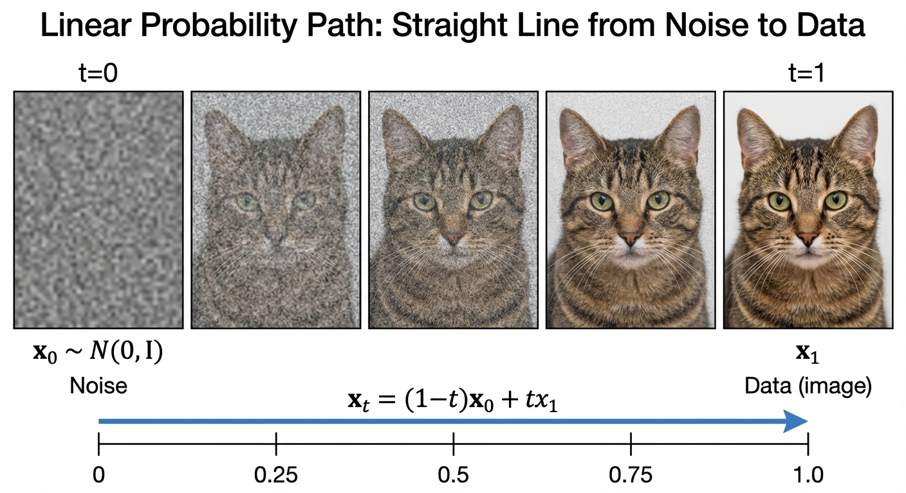

::: {.callout-note appearance="simple"}
## TL;DR

- **We build a working image generator from scratch** using flow matching on CIFAR-10
- **Same techniques power production systems** like Stable Diffusion, Flux, and Sora
- **Classifier-free guidance (CFG)** lets us control what class to generate
- **Full code included** — run it yourself on Google Colab
:::

## From Theory to Practice

In the previous posts, we built up the mathematical foundations of flow matching:

- [**Part 2**](../2-flows/): Vector fields and flows
- [**Part 4**](../4-flow-matching-loss/): The marginalization trick and CFM loss
- [**Part 7**](../7-training/): Training algorithms
- [**Part 9**](../9-unet/): U-Net architecture

Now it's time to put it all together. We'll build a **conditional image generator** that can create CIFAR-10 images of any class — airplanes, cars, cats, dogs, and more.

::: {.callout-tip appearance="simple"}
## Try it yourself

The complete notebook runs in ~1-2 hours on a free Colab GPU.
:::

## Setup

We'll use a few key libraries:

- **PyTorch** and **torchvision** for deep learning and data
- **diffusers** from Hugging Face for the [U-Net architecture](../9-unet/) (the same library behind Stable Diffusion!)
- **torchdiffeq** for ODE integration during sampling

See the [companion notebook](notebook.ipynb) for the complete implementation. The setup code is in the `setup` cell.

## Loading CIFAR-10

CIFAR-10 contains 60,000 32×32 color images across 10 classes. We normalize to [-1, 1] — centering around zero helps with stable training.

See the `data-loading` cell in the [companion notebook](notebook.ipynb) for data loading code.

## The U-Net Architecture

We use `UNet2DModel` from the `diffusers` library. This is the **same architecture** that powers Stable Diffusion and other state-of-the-art models.

::: {.callout-tip appearance="simple"}
## Why U-Net?

The U-Net's encoder-decoder structure with skip connections is perfect for image generation:

- **Encoder** captures global context at low resolutions
- **Decoder** reconstructs fine details at high resolutions
- **Skip connections** preserve spatial information that would otherwise be lost
:::

Key features of our model:

- **Time conditioning**: Sinusoidal embeddings tell the network "where we are" in the flow ($t \in [0,1]$)
- **Class conditioning**: Embedding layer tells the network "what to generate" (airplane, cat, etc.)
- **Attention layers**: Self-attention at lower resolutions for global context

See the `unet-architecture` cell in the [companion notebook](notebook.ipynb) for the full U-Net configuration.

## Flow Matching: The Core Idea

Recall from [Part 4](../4-flow-matching-loss/) that flow matching learns a vector field to transport noise to data. Here's the intuition:

::: {.callout-tip appearance="simple"}
## Analogy: GPS Navigation

Think of flow matching like GPS navigation. You want to get from point A (noise) to point B (image). The network learns the **velocity** — which direction to move at each moment. Follow the velocity long enough, and you arrive at your destination.
:::

### The Gaussian CondOT Path {#sec-gaussian-condot}

We use the **Gaussian CondOT path** — the same formulation from [Part 7](../7-training/):

$$x_t = \alpha_t \cdot z + \beta_t \cdot \epsilon$$ {#eq-gaussian-path}

where:

- $z \sim p_{\text{data}}$ is a real image
- $\epsilon \sim \mathcal{N}(0, I)$ is noise
- $\alpha_t = t$ and $\beta_t = 1 - t$ (linear schedule)

This gives us the **linear interpolation**:

$$x_t = t \cdot z + (1-t) \cdot \epsilon$$ {#eq-linear-path}

{#fig-linear-path}

::: {.callout-note appearance="simple"}
## Boundary Conditions

| Time | $\alpha_t$ | $\beta_t$ | $x_t$ |
|------|------------|-----------|-------|
| $t = 0$ | 0 | 1 | $\epsilon$ (pure noise) |
| $t = 1$ | 1 | 0 | $z$ (clean data) |

The path starts at noise and ends at data — exactly what we need for generation!
:::

::: {.callout-tip appearance="simple"}
## Why This Path?

This is the **optimal transport** path — the straight line from noise to data. Compared to Gaussian variance-preserving paths used in DDPM ([Part 5](../5-diffusion-sde/)):

1. **Constant vector field**: $u_t = z - \epsilon$ doesn't change with time
2. **Straighter trajectories**: Fewer ODE steps needed (10-50 vs 1000)
3. **Same math**: The [marginalization trick](../4-flow-matching-loss/) still applies
:::

**The conditional vector field** is remarkably simple. Taking the derivative of $x_t = t \cdot z + (1-t) \cdot \epsilon$:

$$u_t(x_t | z) = \frac{d x_t}{dt} = z - \epsilon$$ {#eq-cond-velocity}

This is **constant in time**! The direction from noise to image is simply their difference.

**The CFM loss** (from [Part 4](../4-flow-matching-loss/)) trains the network to predict this vector field:

$$\mathcal{L}_{\text{CFM}} = \mathbb{E}_{t, z, \epsilon} \left[ \| u_t^\theta(x_t) - (z - \epsilon) \|^2 \right]$$ {#eq-cfm-loss}

The implementation is straightforward — sample $t$, compute $x_t$, and minimize MSE between predicted and target vector field. See the `flow-matching-loss` cell in the [companion notebook](notebook.ipynb) for the complete implementation.

## Classifier-Free Guidance {#sec-cfg}

We want to generate images of a *specific* class (e.g., "airplane"), not just any random image. **Classifier-Free Guidance (CFG)** is the standard solution, used in DALL-E, Stable Diffusion, and virtually all modern image generators.

### The Key Insight

Recall from [Part 8](../8-guidance/) that for Gaussian paths, there's a beautiful connection to Bayes' rule. The **conditional score** decomposes as:

$$\nabla_x \log p_t(x | y) = \underbrace{\nabla_x \log p_t(x)}_{\text{unconditional}} + \underbrace{\nabla_x \log p_t(y | x)}_{\text{classifier gradient}}$$

This tells us: to generate class $y$, take the unconditional direction and **add** the classifier gradient. CFG approximates this without training a separate classifier.

### Training: Label Dropout

During training, we **randomly drop class labels** with probability $\eta$ (typically 10%). When dropped, we replace with a "null" class token. This teaches one model to do two things:

| Input | Model learns |
|-------|-------------|
| Real label $y$ | Conditional: $u_t^\theta(x_t | y)$ |
| Null label $\emptyset$ | Unconditional: $u_t^\theta(x_t | \emptyset)$ |

### Sampling: Guided Velocity

At inference, we **blend** both predictions:

$$\tilde{u}_t = u_t^\theta(x_t | \emptyset) + w \cdot \bigl(u_t^\theta(x_t | y) - u_t^\theta(x_t | \emptyset)\bigr)$$ {#eq-cfg}

Rearranging: $\tilde{u}_t = (1-w) \cdot u_t^\theta(x_t | \emptyset) + w \cdot u_t^\theta(x_t | y)$

The **guidance scale** $w$ controls conditioning strength:

| $w$ | Effect |
|-----|--------|
| 0 | Pure unconditional (ignores class) |
| 1 | Standard conditional |
| 2-4 | Typical range — sharper, more on-topic |
| >8 | Oversaturated, artifacts |

::: {.callout-warning appearance="simple"}
## Common Pitfall

High guidance ($w > 8$) amplifies the class signal so much that images become oversaturated with artifacts. Start with $w = 2$ and adjust.
:::

See the `cfg-implementation` cell in the [companion notebook](notebook.ipynb) for the `CFGVelocityWrapper` class that applies this formula during sampling.

## Training

The training loop is straightforward:

1. Sample a batch of images $z$ and labels $y$
2. Compute the flow matching loss ([-@eq-cfm-loss])
3. Backpropagate and update weights
4. Repeat

See the `training-loop` cell in the [companion notebook](notebook.ipynb) for the complete training code.

### Hyperparameters

| Parameter | Value | Why? |
|-----------|-------|------|
| Batch size | 128 | Fits on Colab GPU, provides stable gradients |
| Learning rate | 2e-4 | Standard for diffusion models |
| Label dropout | 0.1 | 10% enables CFG without hurting conditional quality |
| Epochs | 50+ | More is better; 100+ for publication-quality |

## Sampling

To generate images, we solve the ODE (recall [Part 2](../2-flows/) — flows are generated by integrating vector fields):

$$\frac{dx_t}{dt} = u_t^\theta(x_t | y)$$ {#eq-ode}

Starting from noise $\epsilon$ at $t=0$ and integrating to $t=1$:

1. Sample initial noise $\epsilon \sim \mathcal{N}(0, I)$
2. Use `torchdiffeq.odeint` to solve the ODE with the CFG-guided vector field
3. The final state at $t=1$ is our generated image

See the `sampling` cell in the [companion notebook](notebook.ipynb) for the complete sampling implementation.

## Results

After training, we can generate images for any CIFAR-10 class. See the `results` and `guidance-comparison` cells in the [companion notebook](notebook.ipynb) for generated samples and visualizations.

### Effect of Guidance Scale

Higher guidance scale $w$ means stronger class conditioning — but too high leads to artifacts. The notebook demonstrates this with samples at $w \in \{1, 2, 4, 8\}$.

::: {.callout-note appearance="simple"}
## Summary

We built a complete conditional image generator using flow matching:

1. **U-Net architecture** from `diffusers` with time and class conditioning
2. **Gaussian CondOT path**: $x_t = t \cdot z + (1-t) \cdot \epsilon$ with constant vector field $u_t = z - \epsilon$ ([-@eq-linear-path], [-@eq-cond-velocity])
3. **CFM loss**: Train to predict the vector field ([-@eq-cfm-loss])
4. **Classifier-free guidance**: Blend conditional and unconditional predictions ([-@eq-cfg])
5. **ODE sampling**: Integrate from noise ($t=0$) to image ($t=1$) via [-@eq-ode]

The same techniques — with larger models and datasets — power Stable Diffusion 3, Flux, DALL-E 3, and Sora. You now understand the core mechanics behind these systems!
:::

## What's Next?

This concludes our diffusion & flow matching series! Here are some extensions to explore:

- **Diffusion Transformers (DiT)**: Replace U-Net with a transformer ([Part 10](../10-diffusion-transformers/))
- **Latent diffusion**: Work in compressed latent space for higher resolution
- **Text conditioning**: Replace class labels with text embeddings (CLIP)
- **Better samplers**: DPM-Solver, Euler ancestral, etc.

## References

1. Lipman, Y., Chen, R. T., Ben-Hamu, H., Nickel, M., & Le, M. (2022). [Flow Matching for Generative Modeling](https://arxiv.org/abs/2210.02747). *ICLR 2023*.

2. Ho, J., & Salimans, T. (2022). [Classifier-Free Diffusion Guidance](https://arxiv.org/abs/2207.12598). *NeurIPS 2022 Workshop*.

3. Tong, A., et al. (2024). [Flow Matching Guide and Code](https://arxiv.org/abs/2412.06264). *Meta AI*.
