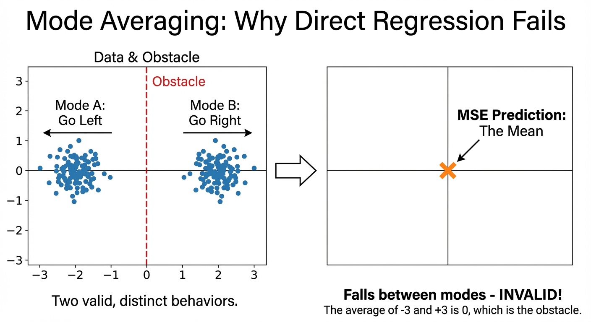
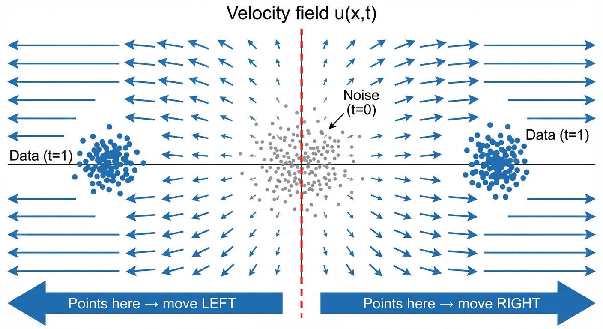
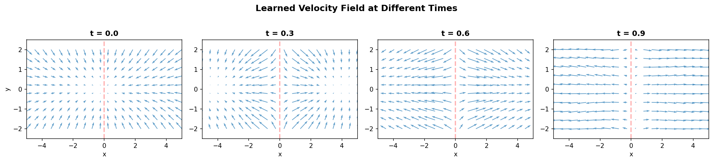
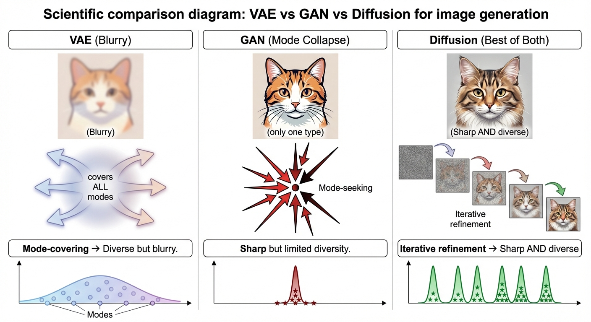
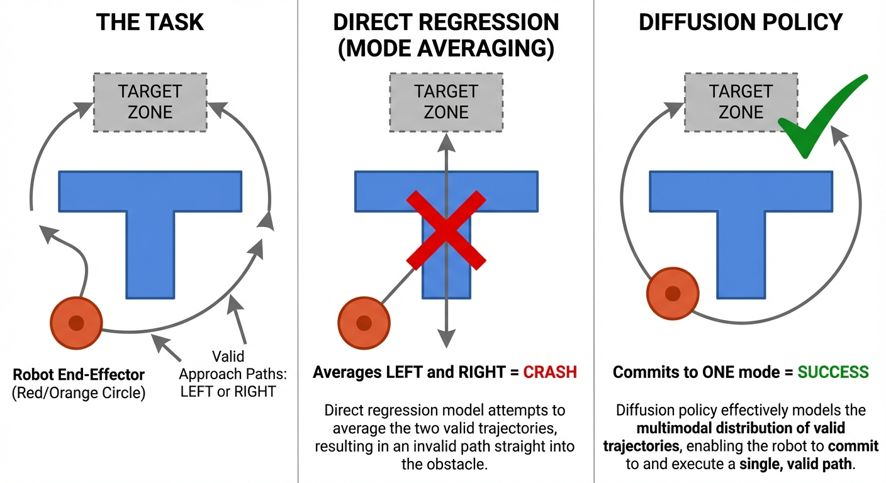

::: {.callout-note appearance="simple"}
## TL;DR

- **The problem**: When one input has many valid outputs (e.g., "generate a cat" → infinitely many valid cats), direct regression with MSE loss outputs the **average** of all possibilities — a blurry mess
- **Why it fails**: MSE-optimal prediction is mathematically guaranteed to be the mean $\mathbb{E}[y|x]$, which falls *between* modes and is often invalid
- **The solution**: Diffusion/flow matching learns a **vector field** that has a unique answer at each point, while stochasticity comes from initial noise — enabling sharp, diverse samples
- **Applications**: Image generation (Stable Diffusion, DALL-E), robotics (Diffusion Policy), video prediction — anywhere outputs are inherently multimodal
:::

::: {.callout-tip appearance="simple"}
## 🧪 Interactive Demo

Want to see the mode averaging problem in action? Check out the [companion notebook](why_diffusion.ipynb) where you can:

- Train a direct regressor and watch it collapse to the mean
- Train a flow matching model and see it capture both modes
- Visualize the learned vector field at different timesteps
:::

## The Problem: One Input → Many Valid Outputs

Consider these tasks:

| Task | Input | Valid Outputs |
|------|-------|---------------|
| Image generation | "a cat sitting" | Infinitely many cats (different breeds, poses, lighting, backgrounds...) |
| Robot control | Current state | Multiple valid actions (go left OR right around obstacle) |
| Video prediction | Current frame | Many possible futures (object moves in any direction) |

These are all **one-to-many mappings**. For a single input, there exist multiple — often infinitely many — correct outputs.

The natural question is: why can't we just train a neural network to directly predict the output?

```
f_θ: input → output
```

Let's try it.

## Why Direct Regression Fails: Mode Averaging {#sec-mode-averaging}

### The Mathematical Inevitability

When you train a neural network with MSE loss:

$$
\textcolor{blue}{\mathcal{L}} = \mathbb{E}\left[\|\textcolor{purple}{f_\theta(x)} - \textcolor{green}{y}\|^2\right]
$$

where $\textcolor{blue}{\text{loss}}$ measures error between $\textcolor{purple}{\text{prediction}}$ and $\textcolor{green}{\text{target}}$.

The optimal solution is provably the **conditional mean**:

$$
\textcolor{purple}{f^*(x)} = \textcolor{red}{\mathbb{E}[y \mid x]}
$$

where the $\textcolor{purple}{\text{optimal prediction}}$ equals the $\textcolor{red}{\text{average of all valid outputs}}$.

::: {.callout-tip appearance="simple"}
## Intuition: Why Mean Minimizes MSE

Think of MSE as finding the point closest to all targets **on average**. If you're playing darts and trying to minimize your average squared distance to several targets, the optimal strategy is to aim at their **center of mass** (the mean). This is true regardless of how spread out the targets are — aiming at the mean always minimizes the total squared distances.
:::

::: {.callout-note collapse="true"}
## Proof: Why Mean Minimizes MSE (Variance Decomposition)

**The key insight**: MSE decomposes into variance (irreducible) plus bias (what we control).

For any prediction $a$, we can use the "add and subtract the mean" trick:

$$
\begin{aligned}
\mathbb{E}[(Y - a)^2] &= \mathbb{E}[(Y - \mathbb{E}[Y] + \mathbb{E}[Y] - a)^2] && \text{(add zero: } \mathbb{E}[Y] - \mathbb{E}[Y]\text{)} \\
&= \mathbb{E}\left[\underbrace{(Y - \mathbb{E}[Y])^2}_{\text{variance term}} + 2\underbrace{(Y - \mathbb{E}[Y])}_{\text{zero mean}}(\mathbb{E}[Y] - a) + \underbrace{(\mathbb{E}[Y] - a)^2}_{\text{bias term}}\right] \\
&= \text{Var}(Y) + 0 + (\mathbb{E}[Y] - a)^2
\end{aligned}
$$ {#eq-mse-decomp}

**Why does the cross-term vanish?** The middle term contains $\mathbb{E}[Y - \mathbb{E}[Y]]$, which is the expected deviation from the mean — always zero by definition.

**The result**:

$$
\underbrace{\mathbb{E}[(Y - a)^2]}_{\text{MSE}} = \underbrace{\text{Var}(Y)}_{\text{can't change this}} + \underbrace{(\mathbb{E}[Y] - a)^2}_{\text{minimized when } a = \mathbb{E}[Y]}
$$

Since variance is fixed (the data is what it is), minimizing MSE is equivalent to minimizing $(\mathbb{E}[Y] - a)^2$ — a parabola with minimum at $a^* = \mathbb{E}[Y]$.
:::

**The consequence**: When outputs are multimodal (multiple valid answers), the mean falls *between* the modes — often in a region of **zero probability**.

### Visual Example: The Moving Object

Imagine predicting where an object will move. It can go left OR right with equal probability:

```
Training data:
  - 50% of examples: object moves LEFT  → position (-3, 0)
  - 50% of examples: object moves RIGHT → position (+3, 0)

MSE-optimal prediction:
  → Mean of [(-3, 0), (+3, 0)] = (0, 0)
  → The object is predicted to stay in the CENTER
  → But no training example ever showed this!
```

The mean $(0, 0)$ is a **statistical Frankenstein** — it corresponds to no real outcome.

{#fig-mode-averaging}

Here's what this looks like when we actually train models on a 2D bimodal distribution:

 to reproduce this experiment.](direct-vs-flow-comparison.png){#fig-direct-vs-flow}

### Real-World Consequences

| Domain | What Mode Averaging Produces |
|--------|------------------------------|
| **Image generation** | Blurry images (average of all possible images) |
| **Video prediction** | Ghostly, transparent objects (superposition of futures) |
| **Robot control** | Invalid actions (e.g., go THROUGH obstacle instead of around) |
| **VAE reconstructions** | Loss of fine details, smoothed textures |

::: {.callout-warning}
## Common Misconception

"Blurry outputs mean the model needs more capacity or training."

**Reality**: Blurriness from mode averaging is a **fundamental limitation of MSE loss**, not a capacity problem. A perfectly trained, infinitely large network with MSE loss will STILL output blurry averages for multimodal targets.
:::

### Wait — Doesn't MSE Work Fine for Most Neural Networks? {#sec-when-mse-works}

Great question! Yes, MSE loss powers countless successful models. The key distinction is whether the **ground truth is unique** for each input.

**MSE works great when targets are unimodal (one correct answer):**

| Task | Input | Target | Why MSE Works |
|------|-------|--------|---------------|
| Image classification | Image | Class label | Each image has ONE true class |
| Depth estimation | RGB image | Depth map | Each scene has ONE true depth |
| Pose estimation | Image | Joint positions | Person has ONE true pose |
| Speech recognition | Audio | Transcript | Each utterance has ONE transcription |
| Object detection | Image | Bounding boxes | Objects have ONE true location |

In these tasks, $\mathbb{E}[y \mid x] = y_{\text{true}}$ because there's only one correct answer. The mean IS the answer.

**MSE fails when targets are multimodal (many valid answers):**

| Task | Input | Target | Why MSE Fails |
|------|-------|--------|---------------|
| Image generation | "a cat" | Image | Infinitely many valid cats |
| Super-resolution | Low-res image | High-res image | Many valid high-freq details |
| Future prediction | Current frame | Next frame | Many possible futures |
| Imitation learning | State | Action | Multiple valid strategies |
| Inpainting | Masked image | Completed image | Many valid completions |

::: {.callout-tip appearance="simple"}
## The Key Question

Ask yourself: **"Given this input, is there exactly ONE correct output, or could multiple outputs all be valid?"**

- One correct answer → MSE is fine
- Multiple valid answers → You need a generative model (diffusion, flow matching, GANs, etc.)
:::

This is why we never had "blurry classification" problems — each image belongs to exactly one class. But the moment we flip the task to "generate an image of class X," we enter multimodal territory.

### Other Solutions to the Multimodal Problem {#sec-other-solutions}

Diffusion/flow matching isn't the ONLY way to handle multimodal outputs. Here are the main approaches:

| Approach | How It Avoids Mode Averaging | Trade-offs |
|----------|------------------------------|------------|
| **GANs** | Discriminator penalizes blurry outputs; generator must commit to ONE mode | Mode collapse, training instability |
| **Autoregressive** | Generate one token at a time; each step is unimodal given context | Slow sequential generation |
| **VAE + adversarial loss** | Add discriminator to VAE to enforce sharpness | More complex training |
| **Mixture Density Networks** | Explicitly predict mixture of Gaussians | Must pre-specify number of modes |
| **Normalizing Flows** | Learn invertible transform; exact likelihood | Architecture constraints |
| **Discretization (VQ-VAE)** | Convert to tokens, use classification per token | Quantization artifacts |
| **Diffusion / Flow Matching** | Iterative refinement; each step is simple | Slow sampling (many steps) |

::: {.callout-note collapse="true"}
## Why Not Just Use Autoregressive Models?

Autoregressive models ARE used for images — and they're making a strong comeback!

**Key autoregressive image models:**

| Model | Year | FID (ImageNet 256) | Notes |
|-------|------|-------------------|-------|
| DALL-E 1 | 2021 | - | VQ-VAE + 12B GPT, pioneered text-to-image |
| Parti$^{[7]}$ | 2022 | 3.22 | 20B params, encoder-decoder Transformer |
| LlamaGen$^{[8]}$ | 2024 | 2.18 | Vanilla LLaMA architecture, 3.1B params |
| **VAR**$^{[9]}$ | 2024 | **1.73** | NeurIPS 2024 Best Paper, 20x faster |
| DiT (diffusion) | 2023 | 2.27 | For comparison |

**The breakthrough: VAR (Visual Autoregressive Modeling)**

VAR won **NeurIPS 2024 Best Paper** by changing HOW autoregressive generation works:

- Instead of "next-token" (raster scan), it predicts "next-scale" (coarse → fine)
- **20x faster** than standard autoregressive models
- **FID 1.73** — beating diffusion transformers (DiT: 2.27)
- Exhibits GPT-like scaling laws (power-law correlation -0.998)

**Traditional AR limitations (mostly solved by VAR):**

1. ~~**Speed**~~: VAR's next-scale approach parallelizes within each scale
2. ~~**Arbitrary ordering**~~: VAR uses natural coarse-to-fine ordering
3. **Discrete tokens**: Still requires VQ-VAE, but codebook quality has improved (LlamaGen: 0.94 rFID reconstruction)

**Where autoregressive excels:**

- **Text**: Language IS sequential — perfect fit
- **Unified multimodal**: Single architecture for text + image + video (Gemini, GPT-4V)
- **Inference-time scaling**: Discrete tokens enable beam search and early pruning

**2025 update**: Hybrid approaches like **HART**$^{[10]}$ (MIT/NVIDIA) combine AR + diffusion, achieving **9x speedup** over pure diffusion with comparable quality.
:::

::: {.callout-note appearance="simple"}
## Why Diffusion Won (For Now)

**The turning point**: In 2021, Dhariwal & Nichol published "Diffusion Models Beat GANs on Image Synthesis"$^{[11]}$, achieving FID 2.97 on ImageNet 128×128 (vs BigGAN's 6.02). By 2022, Stable Diffusion, DALL-E 2, and Imagen cemented diffusion's dominance.

**Why diffusion beat GANs:**

| Aspect | Diffusion | GANs |
|--------|-----------|------|
| Training | Stable — single denoising objective | Unstable — adversarial min-max game |
| Diversity | High recall, covers full distribution | Mode collapse under truncation |
| Scaling | Smooth scaling to larger models | Requires careful tuning at scale |

**Where GANs still win**: Real-time applications. GANs generate in ~0.03s vs diffusion's ~10s — a **1000x speed difference**. For video games and interactive apps, GANs remain relevant.

**What powers modern systems:**

- **Sora**: Diffusion Transformer (DiT), latent diffusion
- **DALL-E 3**: Latent diffusion + U-Net + CLIP
- **SD3**: MM-DiT + Rectified Flow (straighter trajectories, fewer steps)
- **Flux**: 12-32B DiT + Flow Matching

The main diffusion downside — slow sampling — is being addressed by consistency models$^{[12]}$ (1-4 step generation) and distillation.

*Note: The field is evolving fast. VAR now beats DiT on ImageNet, and hybrid AR+diffusion approaches are emerging.*
:::

## The Solution: Diffusion and Flow Matching

The key insight: instead of learning the impossible mapping `input → multimodal output`, we learn a **different problem** that IS well-posed.

### What Diffusion/Flow Matching Actually Learns

We don't learn:
```
z ~ N(0,I) → image    ❌ (ill-posed, one-to-many)
```

We learn:
```
(noisy image x_t, time t) → velocity/direction to move    ✓ (well-posed!)
```

Then we **integrate** this vector field to generate samples:

1. Sample initial noise $x_0 \sim \mathcal{N}(0, I)$
2. Follow the learned vector field from $t=0$ to $t=1$
3. Arrive at a generated sample $x_1$

### Why This Works: The Three Key Insights

#### Insight 1: The Velocity Prediction Has a Unique Answer {#sec-insight-velocity}

Even when the data distribution is multimodal, the **conditional expected velocity** is well-defined and unique. For the [Gaussian CondOT path](../11-practical-flow-matching/#sec-gaussian-condot) where $x_t = (1-t)x_0 + tx_1$:

$$
\textcolor{blue}{u_t^\theta(x_t)} \approx \mathbb{E}[\textcolor{green}{x_1} - \textcolor{orange}{x_0} \mid x_t]
$$ {#eq-velocity-target}

where $\textcolor{blue}{\text{learned velocity}}$ approximates the expected direction from $\textcolor{orange}{\text{noise}}$ to $\textcolor{green}{\text{data}}$.

::: {.callout-note appearance="simple"}
This formula is for the **linear (OT) path**. For general [Gaussian probability paths](../3-probability-paths/) with $x_t = \alpha_t z + \beta_t \epsilon$ (where $z$ is data and $\epsilon$ is noise), the target velocity is $u_t(x_t|z) = \dot{\alpha}_t z + \dot{\beta}_t \epsilon$. The key insight — that the velocity is well-posed — holds for **all** path choices.
:::

Why is the velocity well-posed? Because the spatial position of $x_t$ **already encodes** information about which mode it's heading toward:

- Points near the LEFT mode → velocity points LEFT
- Points near the RIGHT mode → velocity points RIGHT

The network learns to **separate modes spatially**. At any given $(x_t, t)$, there's one optimal direction to move.

::: {.callout-tip appearance="simple"}
## Intuition

Think of it like rivers flowing to the ocean. Even though there are many rivers (modes), at any point in space, the water has one direction to flow. The vector field is deterministic; the variety comes from where you start (which river you're in).
:::

{#fig-velocity-field}

The vector field also evolves over time. Here's what it looks like at different timesteps from the trained model:

{#fig-velocity-evolution}

#### Insight 2: Stochasticity Comes from Initial Noise {#sec-insight-noise}

The multimodality in generation comes from **sampling different initial noise**:

- Different $x_0 \sim \mathcal{N}(0, I)$ → different trajectories → different final samples
- The learned vector field is **deterministic**
- Randomness is "front-loaded" into the initial sample

This is why **the same seed produces the same image** in Stable Diffusion — the vector field is deterministic, only the starting point is random.

#### Insight 3: Iterative Refinement Avoids Averaging {#sec-insight-iterative}

Instead of making one prediction that must handle all uncertainty, diffusion makes **many small predictions**:

| Stage | Noise Level | What the Model Predicts |
|-------|-------------|------------------------|
| Early ($t \approx 0$) | High | Broad direction toward data manifold |
| Middle | Medium | Progressive mode selection based on trajectory |
| Late ($t \approx 1$) | Low | Fine details within chosen mode |

At high noise, the model CAN'T distinguish modes (everything looks like noise), so averaging is appropriate. At low noise, the trajectory has already committed to a mode, so there's only one valid direction.

Each individual step is **simple enough** that mode averaging doesn't cause problems.

## Application: Image Generation

### Why "Generate a Cat" is Multimodal

The prompt "a cat" is compatible with:

- Orange tabby, black cat, calico, siamese...
- Sitting, standing, lying down, jumping...
- Indoors, outdoors, on furniture...
- Photo-realistic, cartoon, oil painting...

A direct text→image model would average ALL of these → blurry, generic cat-like blob.

### How Diffusion Solves It

1. **Sample noise** $x_0 \sim \mathcal{N}(0, I)$ — this random sample determines WHICH cat we'll generate
2. **Condition on text** — "a cat" guides the vector field toward cat-like images
3. **Iteratively denoise** — early steps pick broad category, later steps add details
4. **Output sharp image** — we committed to ONE mode throughout the trajectory

### VAE vs GAN vs Diffusion

| Model | Strategy | Result |
|-------|----------|--------|
| **VAE** | Mode-covering (cover ALL modes) | Diverse but blurry (averaging) |
| **GAN** | Mode-seeking (focus on FEW modes) | Sharp but mode collapse |
| **Diffusion** | Mode-covering + iterative refinement | Sharp AND diverse |

{#fig-vae-gan-diffusion}

Diffusion achieves the best of both worlds: it covers the full distribution (diversity) while producing sharp samples (no averaging).

## Application: Robotics (Diffusion Policy)

### The Problem with Behavioral Cloning

Traditional imitation learning uses regression:

$$
\textcolor{purple}{\pi_\theta(s)} = \arg\min_\theta \mathbb{E}\left[\|\textcolor{purple}{\pi_\theta(s)} - \textcolor{green}{a_{\text{demo}}}\|^2\right]
$$

where $\textcolor{purple}{\text{learned policy}}$ is trained to match $\textcolor{green}{\text{demonstration actions}}$. When demonstrations contain multiple valid strategies, the policy learns their **average**.

### Concrete Example: Push-T Task

A robot must push a T-shaped block to a target using a circular end-effector. To push from the bottom, the policy can approach from **either left or right** — creating a multimodal action distribution.

{#fig-push-t}

**Observed failure modes from the paper$^{[1]}$:**

| Method | Behavior | Failure Mode |
|--------|----------|--------------|
| **LSTM-GMM** | Gets stuck near T block | Biased toward one mode; failed to reach end-zone in 8/20 trials |
| **IBC** | Premature termination | Left T block early in 6/20 trials; struggles with high-dim action sampling |
| **BET** | Jittery, indecisive | Failed to commit to single mode due to lack of temporal consistency |
| **Diffusion Policy** | Approaches from left OR right, commits | ✓ Learns multimodal behavior, commits within each rollout |

**Real-world Push-T results:**

| Method | Success Rate |
|--------|-------------|
| Human | 100% |
| **Diffusion Policy** | **95%** |
| LSTM-GMM | 20% |
| IBC | 0% |

### How Diffusion Policy Works

**Diffusion Policy**$^{[1]}$ represents the policy as a conditional denoising process:

$$
\pi_\theta(a \mid s) = \text{Diffusion}(a \mid s)
$$

**Key architectural choices:**

| Parameter | Value | Why It Matters |
|-----------|-------|----------------|
| Observation horizon | 2 steps | Past context for decision-making |
| Action prediction horizon | 16 steps | Predicts sequence, not single action |
| Action execution horizon | 8 steps | Execute 8, then re-plan (like MPC) |
| Inference steps | 10-16 (DDIM) | ~0.1s latency on RTX 3080 |

### Benchmark Results

Tested on **12 tasks across 4 benchmarks** (RoboMimic, Push-T, Block Pushing, Franka Kitchen):

| Task Category | Diffusion Policy | Improvement |
|---------------|-----------------|-------------|
| Average across all tasks | - | **+46.9%** over best baseline |
| Block Pushing (push 2 blocks) | 94% | +32% over BET (71%) |
| Franka Kitchen (4+ objects) | 96% | +213% over BET (44%) |

### Beyond Diffusion Policy: The 2024-2025 Landscape

::: {.callout-note collapse="true"}
## Other Diffusion/Flow Methods in Robotics

| Method | Year | Params | Key Innovation |
|--------|------|--------|----------------|
| **ACT**$^{[13]}$ | 2023 | 80M | CVAE + Transformer, faster inference |
| **Octo**$^{[14]}$ | 2024 | 93M | Open-source generalist, 800k trajectories |
| **RDT-1B**$^{[15]}$ | 2024 | 1.2B | Largest diffusion foundation model, 46 datasets |
| **π₀**$^{[5]}$ | 2024 | 3.3B | VLM + flow matching, 50Hz dexterous control |

**π₀ (Physical Intelligence)** uses **flow matching** instead of diffusion:

- **3.3B parameters**: 3B VLM (PaliGemma) + 300M action expert
- **Training**: 10,000+ hours across 7 robot platforms, 68 tasks
- **50 Hz control**: Critical for dexterous manipulation (laundry folding, box assembly)
- **27-40ms latency**: Fast enough for reactive tasks
- **Why flow matching?** More stable, fewer hyperparameters, better for high-frequency actions
:::

::: {.callout-tip appearance="simple"}
## Why This Matters for Robotics

Human demonstrations are inherently multimodal — people solve the same task different ways. Diffusion/flow matching handles this without hand-engineering mixture models. The **46.9% improvement** and **95% vs 0-20%** real-world success rates aren't incremental — they represent a paradigm shift in imitation learning.
:::

## Connecting to the Math: Flow Matching

For readers who've followed the [flow matching derivations](../4-flow-matching-loss/), here's the connection:

The **Conditional Flow Matching** loss is (from [Part 4](../4-flow-matching-loss/)):

$$
\textcolor{blue}{\mathcal{L}_{\text{CFM}}} = \mathbb{E}_{t, z, x}\left[\|\textcolor{purple}{u_t^\theta(x)} - \textcolor{green}{u_t^{\text{target}}(x|z)}\|^2\right]
$$

where $\textcolor{blue}{\text{loss}}$ measures error between $\textcolor{purple}{\text{predicted velocity}}$ and $\textcolor{green}{\text{target velocity}}$, with $z \sim p_{\text{data}}$ as a data sample.

For the **Gaussian CondOT path** we use throughout this series ([Part 7](../7-training/)):

$$
x_t = t \cdot z + (1-t) \cdot \epsilon, \quad \epsilon \sim \mathcal{N}(0, I)
$$

the target velocity simplifies to $u_t^{\text{target}}(x|z) = z - \epsilon$.

This looks like MSE regression! Why doesn't it suffer from mode averaging?

**Because the target $(z - \epsilon)$ is conditioned on a specific $(z, \epsilon)$ pair.**

During training:
- We sample a specific noise $\epsilon$ and specific data point $z$
- The target velocity $z - \epsilon$ is **unique** for this pair
- No averaging happens at the training level

The magic: training on these **conditional** velocities implicitly learns the correct **marginal** vector field that transports the noise distribution to the data distribution.

::: {.callout-note collapse="true"}
## Why Conditional ≈ Marginal (The CFM Theorem)

The key theorem of Conditional Flow Matching states:

$$
\nabla_\theta \mathcal{L}_{\text{CFM}} = \nabla_\theta \mathcal{L}_{\text{FM}}
$$

Training with the simple conditional loss has the same gradients as training with the intractable marginal loss. See [Part 4](../4-flow-matching-loss/) for the full derivation.
:::

::: {.callout-note appearance="simple"}
## Summary

We started with a fundamental question: why can't we directly learn `label → image`?

The answer is **mode averaging**: MSE loss provably converges to the mean of all valid outputs, which is often blurry or invalid when multiple modes exist.

Diffusion and flow matching solve this by:

1. **Reframing the problem**: Learn velocity/denoising direction instead of direct output
2. **Front-loading randomness**: Stochasticity comes from initial noise, not the learned function
3. **Iterative refinement**: Many small, well-posed predictions instead of one ill-posed prediction

This insight — that the velocity prediction is well-posed even when the generation problem isn't — is why diffusion models power Stable Diffusion, DALL-E 3, Sora, and state-of-the-art robotics systems.
:::

## References

[1] [Diffusion Policy: Visuomotor Policy Learning via Action Diffusion](https://arxiv.org/abs/2303.04137). Chi et al., *RSS 2023*.

[2] [Flow Matching for Generative Modeling](https://arxiv.org/abs/2210.02747). Lipman et al., *ICLR 2023*.

[3] [Deep Unsupervised Learning using Nonequilibrium Thermodynamics](https://arxiv.org/abs/1503.03585). Sohl-Dickstein et al., *ICML 2015*.

[4] [High-Resolution Image Synthesis with Latent Diffusion Models](https://arxiv.org/abs/2112.10752). Rombach et al., *CVPR 2022*.

[5] [π₀: A Vision-Language-Action Flow Model for General Robot Control](https://arxiv.org/abs/2410.24164). Black et al., *Physical Intelligence 2024*.

[6] [What are Diffusion Models?](https://lilianweng.github.io/posts/2021-07-11-diffusion-models/). Lilian Weng, *2021*.

[7] [Scaling Autoregressive Models for Content-Rich Text-to-Image Generation](https://arxiv.org/abs/2206.10789). Yu et al. (Parti), *TMLR 2022*.

[8] [Autoregressive Model Beats Diffusion: Llama for Scalable Image Generation](https://arxiv.org/abs/2406.06525). Sun et al. (LlamaGen), *2024*.

[9] [Visual Autoregressive Modeling: Scalable Image Generation via Next-Scale Prediction](https://arxiv.org/abs/2404.02905). Tian et al. (VAR), *NeurIPS 2024 Best Paper*.

[10] [HART: Efficient Visual Generation with Hybrid Autoregressive Transformer](https://arxiv.org/abs/2410.10812). Tang et al., *ICLR 2025*.

[11] [Diffusion Models Beat GANs on Image Synthesis](https://arxiv.org/abs/2105.05233). Dhariwal & Nichol, *NeurIPS 2021*.

[12] [Consistency Models](https://arxiv.org/abs/2303.01469). Song et al., *ICML 2023*.

[13] [Learning Fine-Grained Bimanual Manipulation with Low-Cost Hardware (ACT)](https://arxiv.org/abs/2304.13705). Zhao et al., *RSS 2023*.

[14] [Octo: An Open-Source Generalist Robot Policy](https://octo-models.github.io/). Ghosh et al., *RSS 2024*.

[15] [RDT-1B: A Diffusion Foundation Model for Bimanual Manipulation](https://arxiv.org/abs/2410.07864). Liu et al., *2024*.
