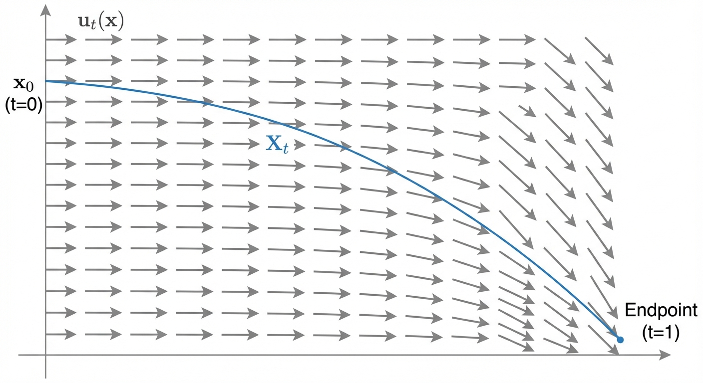
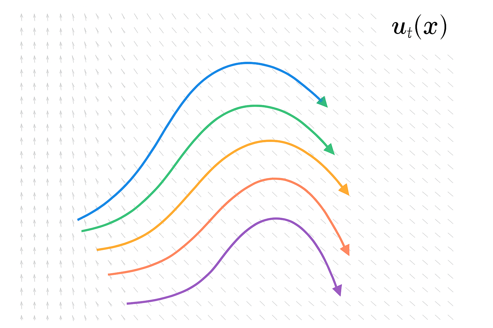

::: {.callout-note appearance="simple"}

## TL;DR

- A **vector field** tells you which direction to move at each point in space
- A **flow** is the map that shows where every point ends up after following the vector field
- This is the mathematical foundation for flow matching: we'll learn a vector field that "flows" noise into data

:::

# Understanding Flows

In flow matching, we learn a vector field that transports samples from noise to data. But what exactly *is* a vector field? What does it mean to "follow" one? This post builds the intuition you'll need.

## Intuition: Think of a River

Imagine a river with currents flowing in different directions at different locations.

- **Vector field** *u*ₜ(*x*): The current at each point — it tells a particle "if you're here, move in this direction"
- **Trajectory** *X*ₜ: Following one leaf dropped in the river — where is *that specific leaf* at time *t*?
- **Flow** φₜ(*x*): A map that answers "where does *any* leaf end up at time *t*, given it started at position *x*?"

The key insight: *X*ₜ tracks one particle, while φₜ describes how the *entire space* transforms over time.

## Formal Definition

Every ODE is defined by a vector field *u*ₜ(*x*). A solution *X*ₜ starting from *x*₀ must satisfy:

$$
\begin{aligned}
\frac{dX_t}{dt} &= u_t(X_t) \\
X_0 &= x_0 \quad (\text{initial condition})
\end{aligned}
$$

In words: "your velocity equals whatever the vector field says at your current location."

## From Trajectory to Flow

The trajectory *X*ₜ answers: "where am I at time *t*, given I started at *x*₀?"

But what if we want to know the answer for *any* starting point? That's the **flow** φₜ(*x*): a function that takes any starting position *x* and returns where it ends up at time *t*.

$$
X_t = \phi_t(x_0)
$$

For one specific starting point *x*₀, the trajectory and flow give the same answer. But the flow is more general — it's the entire "transformation rule" for all points.

## Flow Equation

Since the flow satisfies the ODE, we can substitute *X*ₜ = φₜ(*x*₀):

$$
\begin{aligned}
\frac{dX_t}{dt} &= u_t(X_t) \implies \frac{d \phi_t(x_0)}{dt} = u_t(\phi_t(x_0)) \\
X_0 &= x_0 \implies \phi_0(x_0) = x_0
\end{aligned}
$$

The second line says: at t=0, every point is where it started (the flow is the identity map).

::: {.callout-note appearance="simple"}
## Summary

The core vocabulary:

- **Vector field** *u*ₜ(*x*): assigns directions to points in space. "What direction should I move at position *x*?"
- **Trajectory** *X*ₜ: follows those directions from a single starting point. "Where is this one particle at time *t*?"
- **Flow** φₜ(*x*): describes where *all* points end up. "Where does any point *x* end up at time *t*?"

The relationship: *X*ₜ = φₜ(*x*₀).

This is the foundation. Next, we'll use flows to transform *probability distributions*, the key to generative modeling.
:::

## What's Next?

We now understand how vector fields generate flows. For generative modeling, we need flows that transform *probability distributions*: from noise to data.

Next: how to construct **probability paths** that smoothly interpolate between a noise distribution and a data distribution, and the vector fields that generate them.
