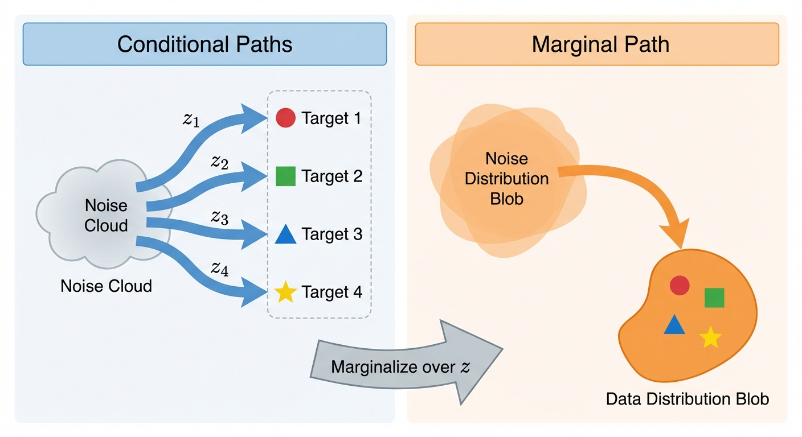
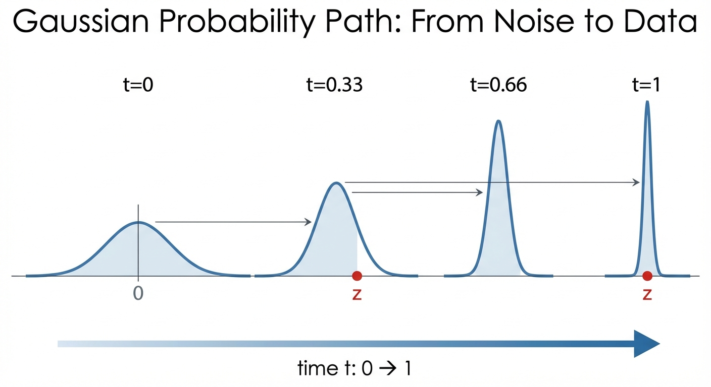

::: {.callout-note appearance="simple"}

## TL;DR

- A **probability path** is a smooth interpolation between noise and data distributions
- We build it from **conditional paths** (one per data point), then marginalize to get the full path
- The **Gaussian probability path** $p_t(x|z) = \mathcal{N}(\alpha_t z, \beta_t^2 I)$ is the most common choice
- We derive the **conditional vector field** that generates this path — this becomes our training target

:::

# Probability Paths: From Noise to Data

In the [previous post](../2-flows/), we learned that vector fields generate flows. Now we need to design a flow that transforms *probability distributions* — specifically, one that turns noise into data.

The key idea: instead of thinking about individual particles, we'll think about how an entire *distribution* of particles evolves over time. This is what a **probability path** describes.

## Conditional Probability Path

Why "conditional"? Because it's easier to think about one data point at a time. A **conditional probability path** $p_t(x|z)$ describes how probability mass moves from noise toward a *specific* target point $z$.

Formally, it's a family of distributions over $\mathbb{R}^d$ such that

$$
\begin{aligned}
p_0(\cdot | z) = p_{init}, \quad
p_1(\cdot | z) = \delta_z \quad \forall z \in \mathbb{R}^d
\end{aligned}
$$ {#eq-conditional-path}
In other words, a conditional probability path interpolates between the initial distribution $p_{init}$ and a single data point from $p_{data}$.

## Marginal Probability Path

Conditional paths are useful for construction, but what we really care about is the **marginal probability path** $p_t(x)$ — the distribution we'd see if we sampled many different target points $z$ from the data distribution and looked at where all the probability mass ends up.

We obtain it by first sampling $z \sim p_{data}$ and then sampling $x \sim p_t(\cdot | z)$:

$$
\begin{aligned}
&z \sim p_{data}, \quad x \sim p_t(\cdot | z) \\
p_t(x) &= \int p_t(x, z) dz \\
&= \int p_t(x | z) p_{data}(z) dz
\end{aligned}
$$

We can verify that $p_t(x)$ interpolates between $p_{init}$ and $p_{data}$.

**At $t=0$:** The conditional distribution equals the initial distribution for all $z$, so $p_{init}(x)$ factors out of the integral:

$$
\begin{aligned}
p_0(x) &= \int p_0(x | z) p_{data}(z) dz \\
&= \int p_{init}(x) p_{data}(z) dz && \text{(since } p_0(\cdot|z) = p_{init} \text{)} \\
&= p_{init}(x) \int p_{data}(z) dz && \text{(factor out } p_{init}(x) \text{)} \\
&= p_{init}(x) && \text{(probability integrates to 1)}
\end{aligned}
$$

**At $t=1$:** The conditional distribution collapses to a point mass at $z$. To evaluate this integral, we use the **sifting property** of the Dirac delta:

$$
\int f(z) \delta_z(x) \, dz = f(x)
$$

To understand this, think of $\delta_z(x)$ as the limit of increasingly narrow, tall functions that integrate to 1 — for example, a Gaussian centered at $z$ with vanishing variance:

$$
\delta_{z,\epsilon}(x) = \frac{1}{\epsilon\sqrt{2\pi}} e^{-(x-z)^2/(2\epsilon^2)} \xrightarrow{\epsilon \to 0} \delta_z(x)
$$

As $\epsilon \to 0$, all the "mass" concentrates at $x = z$. So when we integrate $f(z)\delta_{z,\epsilon}(x)$ over $z$, only the value near $z = x$ contributes, giving $f(x)$. Applying this:

$$
\begin{aligned}
p_1(x) &= \int p_1(x | z) p_{data}(z) dz \\
&= \int \delta_z(x) p_{data}(z) dz && \text{(since } p_1(\cdot|z) = \delta_z \text{)} \\
&= p_{data}(x) && \text{(sifting property)}
\end{aligned}
$$

## Example: Gaussian Probability Paths

The abstract definition is nice, but what does a probability path actually *look like*? The most common choice is a **Gaussian probability path**, where each $p_t(x|z)$ is a Gaussian whose mean drifts toward $z$ and whose variance shrinks over time.

The conditional Gaussian probability path is defined as:

$$
\textcolor{blue}{\mathbf{p}_t(\cdot | z)} = \mathcal{N}(\textcolor{green}{\alpha_t z}, \textcolor{orange}{\beta_t^2} I_d)
$$

where $\textcolor{blue}{\text{conditional distribution}}$ has mean $\textcolor{green}{\text{interpolated toward data}}$ and variance $\textcolor{orange}{\text{noise level}}$.

where $\alpha_t$ and $\beta_t$ are noise schedulers, and they are continously, **monotonically** differentiable functions with the following conditions:

$$
\begin{aligned}
\alpha_0 &= \beta_1 = 0 \\
\beta_0 &= \alpha_1 = 1
\end{aligned}
$$

which implies

$$
\begin{aligned}
\mathbf{p}_0(\cdot | z) &= \mathcal{N}(0, I_d) \\
\mathbf{p}_1(\cdot | z) &= \lim_{\beta \to 0} \mathcal{N}(z, \beta^2 I_d) = \delta_z
\end{aligned}
$$ {#eq-path-boundary}

As the variance vanishes, the Gaussian concentrates all its mass at the mean $z$, converging (in distribution) to the Dirac delta $\delta_z$.

Therefore, this Gaussian probability path satisfies ([-@eq-conditional-path]) and is a valid conditional probability path.

Intuitively, given a data point $z$ at time $t=1$, we gradually add noise to it for lower t till $t=0$.

## Conditional Vector Field for Gaussian Paths

We've defined a probability path — but remember from [Part 2](../2-flows/), flows are generated by *vector fields*. So what vector field generates our Gaussian probability path?

This is the key question: if we can find this vector field, it becomes our **training target**. We'll train a neural network to approximate it.

Let us construct the conditional vector field (where $\dot{\alpha}_t = \frac{\partial \alpha_t}{\partial t}$ and $\dot{\beta}_t = \frac{\partial \beta_t}{\partial t}$ denote time derivatives):

$$
\begin{aligned}
\textcolor{blue}{u_t^{\text{target}}(x | z)} &= \textcolor{green}{(\dot{\alpha}_t - \frac{\dot{\beta}_t}{\beta_t} \alpha_t) z} + \textcolor{orange}{\frac{\dot{\beta}_t}{\beta_t} x} \\
\end{aligned}
$$

where the $\textcolor{blue}{\text{target velocity}}$ has a $\textcolor{green}{\text{term pointing toward data } z}$ and an $\textcolor{orange}{\text{adjustment based on current position } x}$.

We can show that this conditional vector field is valid in the sense that its ODE trajectories $X_t$ satisfies
$$
\begin{aligned}
X_t &\sim p_t(\cdot | z) = \mathcal{N}(\alpha_t z, \beta_t^2 I_d) \\
X_0 &\sim \mathcal{N}(0, I_d)
\end{aligned}
$$

How do we prove this?
Let us first construct a conditional flow model $\phi_t^{target}(x_0 | z)$

$$
\begin{aligned}
\psi_t^{target}(x_0 | z) &= \alpha_t z + \beta_t x_0 \\
x_0 \sim \mathcal{N}(0, I_d)
\end{aligned}
$$

We can show that the conditional flow model satisfies the conditional probability path:

$$
\begin{aligned}
X_t &= \psi_t^{target}(X_0 | z) \\
&= \alpha_t z + \beta_t X_0 \\
&\sim \mathcal{N}(\alpha_t z, \beta_t^2 I_d) && \text{(since } X_0 \sim \mathcal{N}(0, I_d) \text{)}
\end{aligned}
$$

here we have used the property of the Gaussian distribution: if $X \sim \mathcal{N}(\mu, \sigma^2 I_d)$, then $aX + b \sim \mathcal{N}(a\mu + b, a^2 \sigma^2 I_d)$.

We conclude that the conditional flow model satisfies the conditional probability path.

Then we use the definition of the conditional flow model to get the conditional vector field:

$$
\begin{aligned}
\frac{d}{dt} \psi_t^{target}(x_0 | z) &= u_t^{target}(\psi_t^{target}(x_0 | z) | z) \\
\iff \\
\dot{\alpha}_t z + \dot{\beta}_t x_0 = u_t^{target}(\alpha_t z + \beta_t x_0 | z) \\
\end{aligned}
$$

we know that

$$
x_t = \alpha_t z + \beta_t x_0
\iff \\
x_0 = \frac{x_t - \alpha_t z}{\beta_t}
$$

substituting $x_0$ with $\frac{x_t - \alpha_t z}{\beta_t}$ in the above equation, we get

$$
\begin{aligned}
u_t^{target}(x_t | z) = (\dot{\alpha}_t - \frac{\dot{\beta}_t}{\beta_t} \alpha_t) z + \frac{\dot{\beta}_t}{\beta_t} x_t \\
\end{aligned}
$$

Why do this? Because the vector filed must be written as
$$
u_t(x | z)
$$
where x is the current position at time t.

::: {.callout-note appearance="simple"}
## Summary

We constructed **probability paths** that interpolate from noise to data. The key insight: build the marginal path $p_t(x)$ from simpler **conditional paths** $p_t(x|z)$, each targeting a specific data point.

For Gaussian paths $p_t(x|z) = \mathcal{N}(\alpha_t z, \beta_t^2 I)$, we derived the conditional vector field:
$$
\textcolor{blue}{u_t^{target}(x|z)} = \textcolor{green}{(\dot{\alpha}_t - \frac{\dot{\beta}_t}{\beta_t} \alpha_t) z} + \textcolor{orange}{\frac{\dot{\beta}_t}{\beta_t} x}
$$

This is our training target — but there's a catch: it depends on $z$, which we don't know at generation time. The next post resolves this with the marginalization trick.
:::

## What's Next?

We now have:

1. **Probability paths** that interpolate from noise to data
2. **Conditional vector fields** that generate these paths

But there's a problem: these are *conditional* on knowing the target data point $z$. At generation time, we don't know $z$ — that's what we're trying to generate!

In the [next post](../4-flow-matching-loss/), we'll see how the **marginalization trick** solves this problem, allowing us to train on conditional targets while learning a marginal vector field that works without knowing $z$.

