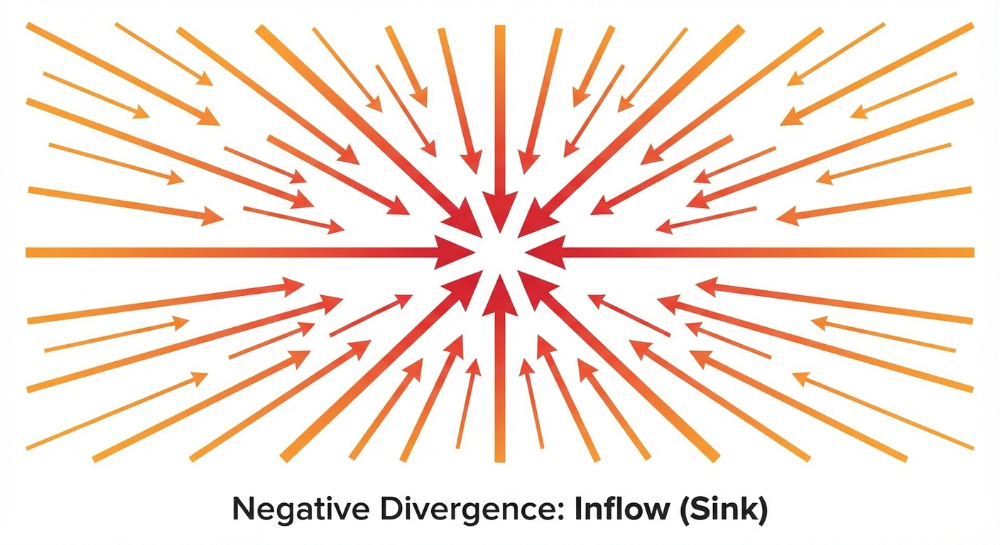
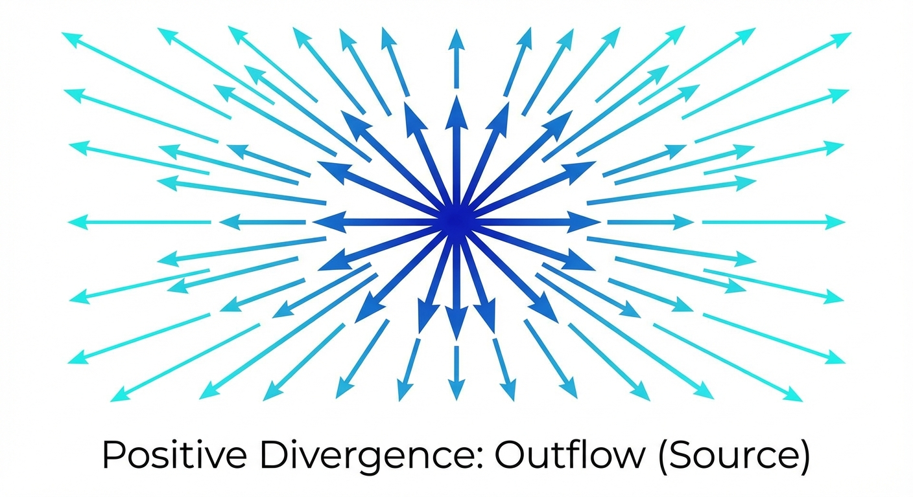
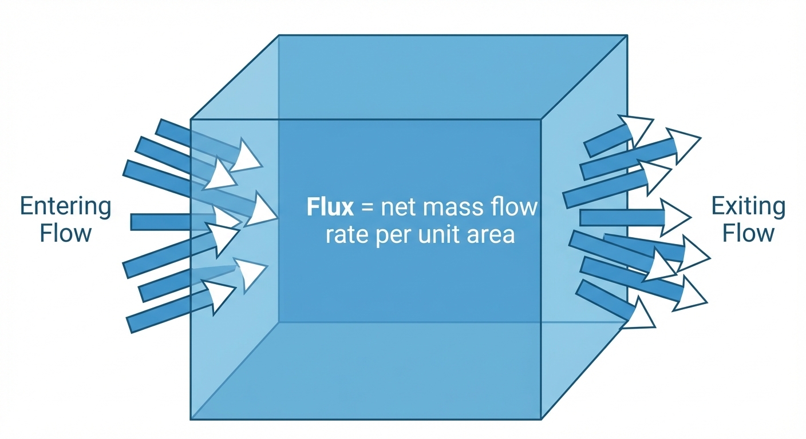

::: {.callout-note appearance="simple"}

## TL;DR

- **The problem**: We have conditional vector fields *u*ₜ(*x*|*z*), but at generation time we don't know *z*
- **The solution**: The marginalization trick — training on conditional targets is *equivalent* to learning the marginal vector field
- **The loss**: Simply ‖*u*ₜ^θ(*x*) - *u*ₜ^target(*x*|*z*)‖², averaged over time *t*, data *z*, and noise *x*₀
- **Why it works**: The continuity equation guarantees the marginal vector field follows the marginal probability path

:::

# The Flow Matching Loss: Why Training Works

In the previous post, we constructed conditional probability paths and conditional vector fields. But there's a fundamental problem: these are *conditional* on knowing the target data point *z*. At generation time, we don't know *z* — that's what we're trying to generate!

This post explains how the **marginalization trick** solves this problem.

## The Problem We're Solving

Let's step back and understand what we're trying to achieve.

::: {.callout-note appearance="simple"}
## Our Goal

Train a neural network *u*ₜ^θ(*x*) that can transform noise into samples from the data distribution. To do this, we need a **training target** — a vector field that the network should learn to approximate.
:::

**The ideal target** is the marginal vector field *u*ₜ^target(*x*) that follows the marginal probability path *p*ₜ(*x*). If our network learns this, it can generate samples by:

1. Start with noise *x*₀ sampled from the initial distribution
2. Follow the learned vector field: d*x*/d*t* = *u*ₜ^θ(*x*)
3. Arrive at a sample from the data distribution at t=1

**The problem**: We can't compute *u*ₜ^target(*x*) directly! It would require integrating over the entire data distribution — intractable.

**The solution**: The marginalization trick. It tells us that:

1. We can design simple **conditional** vector fields *u*ₜ^target(*x*|*z*) (one for each data point *z*)
2. Training on these conditional targets is **equivalent** to training on the marginal target
3. The trained network will learn the marginal vector field — exactly what we need for generation

This is why the marginalization trick is so powerful: it turns an intractable problem into a tractable one.

## The Marginalization Trick

Given a conditional vector field *u*ₜ^target(*x*|*z*) that follows the conditional probability path *p*ₜ(·|*z*), we can construct a marginal vector field *u*ₜ(*x*) that follows the marginal probability path *p*ₜ(*x*):

$$
u_t^{target}(x) = \int u_t^{target}(x | z) \frac{p_t(x | z) p_{data}(z)}{p_t(x)} dz
$$

This is the marginalization trick. To prove it, we will use the continuity equation.

## The Continuity Equation

::: {.callout-tip appearance="default"}
## Theorem: Continuity Equation

Let us consider a flow model with vector field *u*ₜ^target with *X*₀ sampled from the initial distribution. Then *X*ₜ follows *p*ₜ for all 0 ≤ t ≤ 1 if and only if

$$
\partial_t p_t(x) = -\nabla \cdot (p_t u_t^{target})(x) \quad \text{for all } x \in \mathbb{R}^d, 0 \leq t \leq 1
$$

where ∂ₜ*p*ₜ(*x*) denotes the time-derivative of *p*ₜ(*x*).
:::

We will skip the proof of the continuity equation.

∇· is the divergence operator in vector calculus. Its input is a vector and output is a scalar.

If the divergence is negative, it means that the vector field is pointing inwards toward this point.

The divergence measures the net outflow of density from a point. Negative divergence means net inflow of density into this point.

If you're not familiar with vector calculus, I recommend Steve Brunton's video [The Divergence of a Vector Field: Sources and Sinks](https://www.youtube.com/watch?v=So7vlARGs68&list=PLMrJAkhIeNNQromC4WswpU1krLOq5Ro6S&index=4). He also covers the continuity equation in the context of fluid dynamics: [The Continuity Equation: A PDE for Mass Conservation](https://www.youtube.com/watch?v=Fk3X6o39KEI&list=PLMrJAkhIeNNQromC4WswpU1krLOq5Ro6S&index=7).

### Physics Background

The continuity equation originates from physics:

$$
\frac{\partial \rho}{\partial t} + \nabla \cdot J = 0
$$

where ρ is the mass density and *J* is the mass flux. The equation was derived from Gauss's Divergence Theorem. It's also called the mass conservation equation.

The flux is defined as the product of mass density and the velocity field *F*:

$$
J = \rho F
$$

Intuitively, the flux measures the amount of mass flow rate per unit area through a surface.

The mass conservation equation states that the rate of change of mass in a volume equals the net outflow of mass through the surface of the volume. It's a fundamental law: mass cannot be created or destroyed within a defined system.

In the context of flow models, the mass density is the probability density and the velocity field is *u*ₜ(*x*). The continuity equation then becomes:

$$
\frac{d}{dt} p_t(x) = -\nabla \cdot (u_t p_t)(x)
$$

This is the continuity equation in the context of flow models.

## Proof of the Marginalization Trick

Now we can return to the marginalization trick. We just need to show that the marginal vector field *u*ₜ(*x*) satisfies the continuity equation.

**Step 1:** Expand the marginal path using the conditional definition:

$$
\partial_t p_t(x) = \partial_t \int p_t(x | z) p_{data}(z) \, dz = \int \partial_t p_t(x | z) p_{data}(z) \, dz
$$

**Step 2:** Apply the continuity equation to each conditional path *p*ₜ(·|*z*):

$$
= \int -\nabla \cdot (p_t(x | z) \, u_t^{target}(x | z)) \, p_{data}(z) \, dz
$$

**Step 3:** Use linearity of the divergence operator:

$$
= - \nabla \cdot \left( \int p_t(x | z) \, u_t^{target}(x | z) \, p_{data}(z) \, dz \right)
$$

**Step 4:** Multiply and divide by *p*ₜ(*x*):

$$
= - \nabla \cdot \left( p_t(x) \int u_t^{target}(x | z) \frac{p_t(x | z) p_{data}(z)}{p_t(x)} \, dz \right)
$$

**Step 5:** Recognize the marginal vector field definition:

$$
= - \nabla \cdot (u_t p_t)(x)
$$

By the Continuity Equation, we have shown that the marginal vector field *u*ₜ(*x*) satisfies the continuity equation. Therefore, the marginal vector field *u*ₜ(*x*) follows the marginal probability path *p*ₜ(*x*) and we are done.

::: {.callout-tip appearance="simple"}
## Key Takeaway

The marginalization trick is what makes flow matching **tractable**. Here's the practical workflow:

1. **Design** a simple conditional vector field *u*ₜ^target(*x*|*z*) (e.g., pointing from noise toward data point *z*)
2. **Train** by sampling (*z*, *x*) pairs and minimizing ‖*u*ₜ^θ(*x*) - *u*ₜ^target(*x*|*z*)‖²
3. **Generate** by following the learned *u*ₜ^θ from noise — it approximates the marginal vector field

The magic: even though we only ever see conditional targets during training, the network learns the marginal vector field that generates the full data distribution.
:::

::: {.callout-note appearance="simple"}
## Summary

We proved the **marginalization trick**: training on conditional targets *u*ₜ^target(*x*|*z*) is mathematically equivalent to training on the intractable marginal *u*ₜ^target(*x*). The key step was showing that the cross-term 𝔼[*u*ₜ^θ · *u*ₜ^target] simplifies when we expand the marginal definition — the intractable *p*ₜ(*x*) cancels.

This gives us the **Conditional Flow Matching (CFM) loss**:

$$
\mathcal{L}_{CFM}(\theta) = \mathbb{E}_{t,z,x}[\|u_t^\theta(x) - u_t^{target}(x|z)\|^2]
$$

The flow matching framework is now complete for deterministic sampling. Next, we'll add stochasticity to get diffusion models.
:::

## What's Next?

We've now covered the complete flow matching framework — from vector fields to probability paths to the training loss. But remember from [Part 1](https://aheadofrobotics.substack.com/p/diffusion-and-flow-matching-part) that diffusion models take a different approach: they add **stochasticity** to the process.

In the next post, we'll see how **diffusion models** generalize flow matching by adding a noise term to the ODE, turning it into an SDE. We'll discover:

- How to derive SDEs using **infinitesimal updates** instead of derivatives
- Why the random term σₜd*W*ₜ enables new behaviors
- The connection between Brownian motion and continuous randomness
