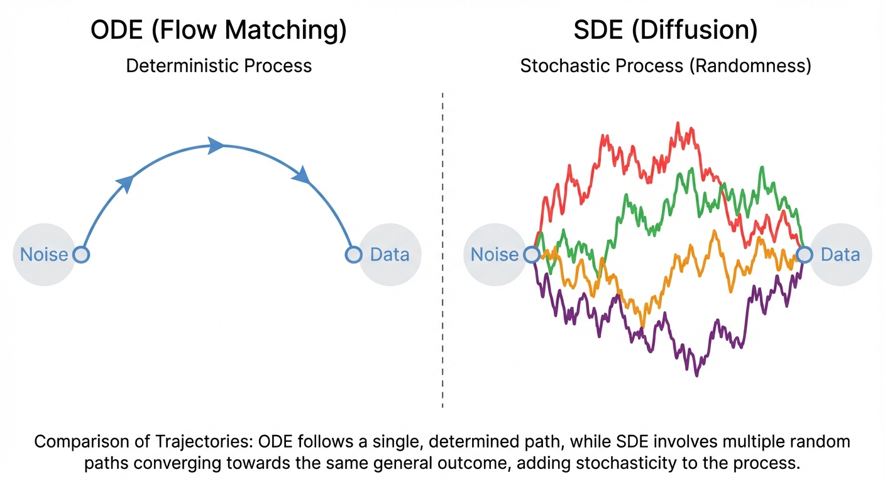

::: {.callout-note appearance="simple"}

## TL;DR

- **Diffusion models** add stochasticity to the ODE: $dX_t = u_t(X_t)dt + \sigma_t dW_t$
- **Key insight**: We derive SDEs by thinking in terms of *infinitesimal updates* rather than derivatives
- The **Brownian motion** term $dW_t$ represents continuous random perturbations
- Setting $\sigma_t = 0$ recovers the deterministic ODE from flow matching

:::

# Diffusion Models: Adding Stochasticity

In [Parts 2-4](../2-flows/), we developed flow matching — a framework where a neural network learns a vector field $u_t^\theta(x)$ that transports noise to data via an ODE:

$$
dX_t = u_t^\theta(X_t) \, dt
$$

This is elegant, but there's another approach that dominated generative modeling before flow matching emerged: **diffusion models**. Instead of following a deterministic path, diffusion models add randomness at each step.

Why would we want randomness? It turns out that stochasticity can help exploration during sampling, improve sample diversity, and connects to a rich mathematical theory. Let's see how.

## The Problem with Derivatives

Before we add stochasticity, let's revisit how we think about ODEs. The standard formulation uses derivatives:

$$
\frac{d}{dt} X_t = u_t(X_t)
$$

This says: "the instantaneous rate of change of $X_t$ equals the vector field $u_t$ evaluated at $X_t$."

::: {.callout-warning appearance="simple"}
## The Challenge
Derivatives are elegant for deterministic systems, but they become problematic when we want to add randomness. A random process doesn't have a well-defined derivative in the classical sense — the path is too "jagged" due to the random perturbations.
:::

To add stochasticity properly, we need a different way to think about dynamics — one that doesn't rely on taking derivatives.

## From Derivatives to Infinitesimal Updates

Instead of asking "what is the derivative?", we can ask: "what happens over a small time step $h$?"

Starting from the ODE, we can write:

$$
\frac{1}{h}(X_{t+h} - X_t) = u_t(X_t) + R_t(h)
$$

where $R_t(h)$ is an error term that goes to zero as $h \to 0$. Rearranging:

$$
X_{t+h} = X_t + h \cdot u_t(X_t) + h \cdot R_t(h)
$$

::: {.callout-tip appearance="simple"}
## Intuition
This says: "where you end up = where you started + (small step) × (direction) + (small error)". As $h \to 0$, the error term vanishes and we recover the ODE behavior.
:::

This **infinitesimal update** formulation is exactly what we need. It describes the dynamics without ever taking a derivative — we just describe how the state changes over small time intervals.

## Adding Stochasticity: The SDE

Now we can add randomness naturally. At each small time step, we add a random perturbation:

$$
X_{t+h} = X_t + \underbrace{h \cdot u_t(X_t)}_{\text{deterministic drift}} + \underbrace{\sigma_t (W_{t+h} - W_t)}_{\text{random perturbation}} + \underbrace{h \cdot R_t(h)}_{\text{error term}}
$$

Here:

- $u_t(X_t)$ is the **drift** — the deterministic direction (same as in flow matching)
- $\sigma_t$ is the **diffusion coefficient** — controls how much randomness we add
- $W_t$ is **Brownian motion** — a mathematical model of continuous random motion
- $W_{t+h} - W_t$ is the random increment over the time interval $[t, t+h]$

As $h \to 0$, we write this compactly as the **stochastic differential equation (SDE)**:

$$
dX_t = u_t(X_t) \, dt + \sigma_t \, dW_t
$$ {#eq-sde}

::: {.callout-important appearance="simple"}
## Key Point
Notice that we never took a derivative of the random process! The SDE notation $dX_t$ is shorthand for the infinitesimal update, not an actual derivative. This is why SDEs can describe processes with random, non-differentiable paths.
:::

When $\sigma_t = 0$, the SDE reduces to an ODE, and we recover flow matching.

## What is Brownian Motion?

**Brownian motion** $W_t$ (also called a Wiener process) is the canonical model of continuous random motion. You can think of it as:

- At each infinitesimal time step $dt$, we add a random displacement
- This displacement is Gaussian with mean 0 and variance $dt$
- Displacements at different times are independent

::: {.callout-tip appearance="simple"}
## Intuition
Imagine tracking a pollen grain in water under a microscope. It jiggles randomly due to molecular collisions — that's Brownian motion. The $dW_t$ term captures this "pure randomness" mathematically.
:::

The key property is that $W_{t+h} - W_t \sim \mathcal{N}(0, h \cdot I)$. So over a small time step:

$$
X_{t+h} \approx X_t + u_t(X_t) \cdot h + \sigma_t \sqrt{h} \cdot \epsilon, \quad \epsilon \sim \mathcal{N}(0, I)
$$

This is the **Euler-Maruyama** discretization — the simplest way to simulate an SDE numerically. Notice how the noise scales with $\sqrt{h}$, not $h$ — this is a fundamental property of Brownian motion.

## The Diffusion Coefficient

The diffusion coefficient $\sigma_t$ controls the "temperature" of the random noise:

- **Large $\sigma_t$**: More exploration, paths spread out quickly
- **Small $\sigma_t$**: More deterministic, paths stay close to the drift
- **$\sigma_t = 0$**: Pure ODE (flow matching)

In diffusion models, $\sigma_t$ is typically a **schedule** that varies with time. Common choices:

| Schedule | $\sigma_t$ | Used in |
|----------|------------|---------|
| Variance Preserving (VP) | $\sqrt{\beta_t}$ | DDPM |
| Variance Exploding (VE) | $\sqrt{\frac{d[\sigma^2(t)]}{dt}}$ | NCSN/NCSNv2 |
| Sub-VP | Interpolation | Score SDE |

The choice of schedule affects sample quality, training stability, and generation speed.

## Forward and Reverse Processes

In diffusion models, we typically define:

1. **Forward process**: An SDE that gradually adds noise to data until it becomes pure noise
2. **Reverse process**: An SDE that removes noise, going from noise back to data

The forward process is usually simple and fixed (e.g., just adding Gaussian noise). The challenge is learning to reverse it.

::: {.callout-note appearance="simple"}
## The Key Question
Given the forward SDE that corrupts data into noise, what is the reverse SDE that transforms noise back into data?
:::

It turns out there's a beautiful mathematical result: the reverse SDE depends on something called the **score function** — the gradient of the log probability density. But how do we learn this score function? That's the subject of the next post.

## Summary

We've now extended flow matching to handle stochasticity:

| Concept | Flow Matching (ODE) | Diffusion (SDE) |
|---------|---------------------|-----------------|
| Dynamics | $dX_t = u_t(X_t) dt$ | $dX_t = u_t(X_t) dt + \sigma_t dW_t$ |
| Paths | Deterministic | Stochastic |
| Key idea | Learn vector field | Learn vector field + add noise |
| Derivation | Via derivatives | Via infinitesimal updates |

The key insight: **we derive SDEs through infinitesimal updates, not derivatives**. This lets us naturally incorporate randomness into the dynamics.

## What's Next?

We've seen how to add stochasticity to get an SDE, but we haven't yet addressed the core challenge: **how do we train a neural network to reverse the diffusion process?**

In [Part 6](../6-score-matching/), we'll discover:

- The **score function** $\nabla_x \log p_t(x)$ and why it's central to diffusion models
- **Denoising score matching** — the clever trick that makes training tractable
- The **probability flow ODE** — how every SDE has an equivalent deterministic formulation
- How this connects diffusion models back to flow matching

## References

1. Ho, J., Jain, A., & Abbeel, P. (2020). [Denoising Diffusion Probabilistic Models](https://arxiv.org/abs/2006.11239). *NeurIPS*.
2. Song, Y., Sohl-Dickstein, J., Kingma, D. P., Kumar, A., Ermon, S., & Poole, B. (2021). [Score-Based Generative Modeling through Stochastic Differential Equations](https://arxiv.org/abs/2011.13456). *ICLR*.
3. Sohl-Dickstein, J., Weiss, E., Maheswaranathan, N., & Ganguli, S. (2015). [Deep Unsupervised Learning using Nonequilibrium Thermodynamics](https://arxiv.org/abs/1503.03585). *ICML*.
