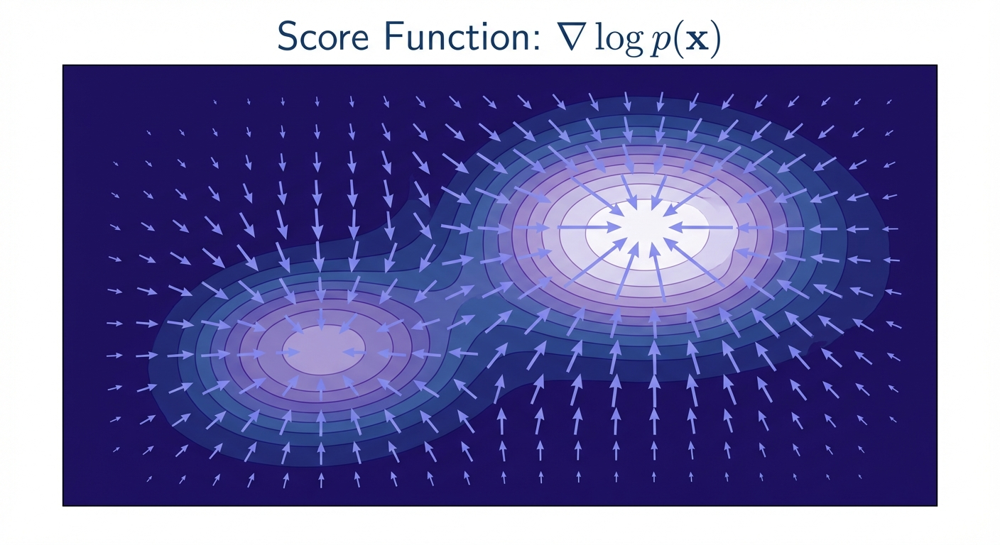
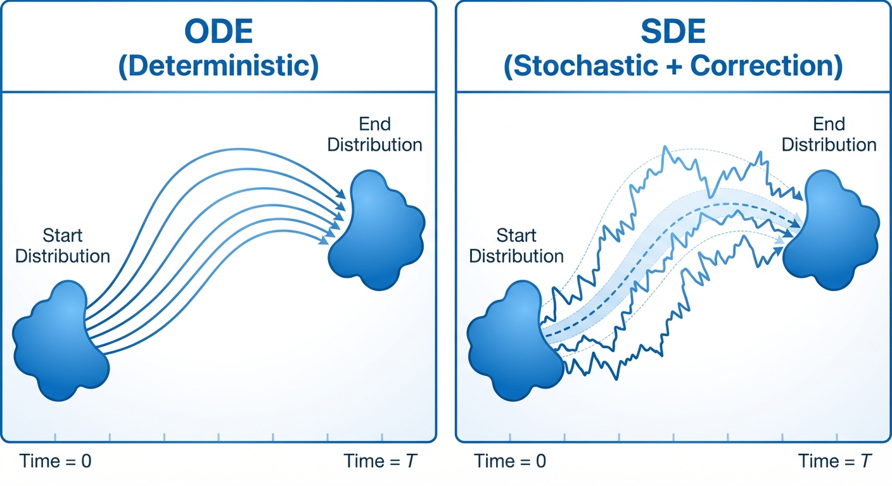
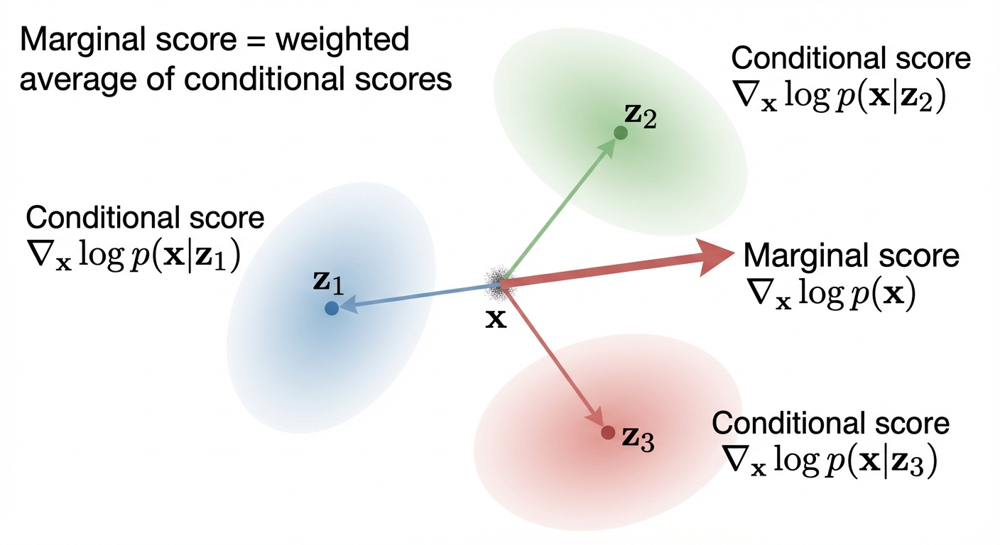
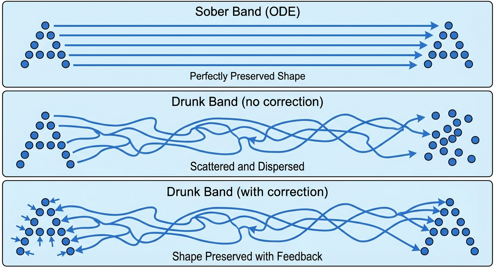
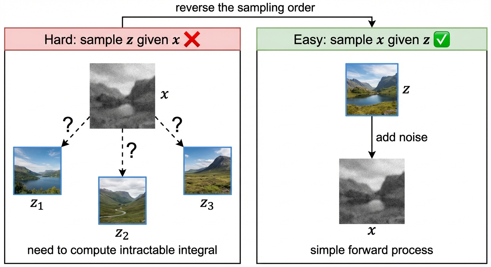

::: {.callout-note appearance="simple"}
## TL;DR

- The **score function** $\nabla \log p_t(x)$ tells us which direction increases probability — it's the key to extending flow matching to SDEs
- We can't compute the marginal score directly, but we can express it as an expectation of **conditional scores** (which we *can* compute analytically)
- The magic of training: least-squares regression automatically computes the right expectation — no intractable integrals required!
- **Real-world impact**: This is how Stable Diffusion, DALL-E, and Sora learn to denoise images
:::

In the previous post, we constructed the training target for flow matching models. Now we face a new challenge: **how do we extend this to SDEs?**

The answer involves a beautiful mathematical object called the **score function** — the gradient of log probability. This post shows how score functions connect ODEs to SDEs, and reveals the elegant trick that makes training tractable.

Let's start with the key theorem that bridges these two worlds.

::: {.callout-tip appearance="simple"}

## Theorem: SDE Extension Trick
Let $u_t^{target}(x)$ be the flow matching vector field that generates the probability path $p_t$ via the ODE (i.e., the ODE $dX_t = u_t^{target}(X_t)dt$ with $X_0 \sim p_{init}$ satisfies $X_t \sim p_t$).

For any diffusion coefficient $\sigma_t \geq 0$, we can construct an **SDE** that follows the same probability path $p_t$:

$$
\begin{aligned}
dX_t &= [u_t^{target}(X_t) + \frac{\sigma_t^2}{2} \nabla \log p_t(X_t)] \, dt + \sigma_t \, dW_t \\
X_0 &\sim p_{\text{init}} \\
\implies X_t &\sim p_t \quad \text{for all } 0 \leq t \leq 1
\end{aligned}
$$

where $\nabla \log p_t(x)$ is the **marginal score function** of $p_t$.

The same identity holds if we replace the marginal probability $p_t(x)$ and vector field $u_t^{target}(x)$ with the conditional probability $p_t(x | z)$ and vector field $u_t^{target}(x | z)$.
:::

## From Marginal to Conditional Scores

The theorem above requires the **marginal score** $\nabla \log p_t(x)$. But there's a problem: computing this directly requires integrating over all possible data points $z$ — computationally intractable!

The solution is to express the marginal score as an expectation of **conditional scores** $\nabla \log p_t(x|z)$, which we *can* compute analytically.

$$
\begin{aligned}
\nabla \log p_t(x) &= \frac{\nabla p_t(x)}{p_t(x)} && \text{(chain rule)} \\[0.5em]
& = \frac{\nabla \int p_t(x | z) p_{data}(z) dz}{p_t(x)} && \text{(marginalization)} \\[0.5em]
& = \frac{\int \nabla p_t(x | z) p_{data}(z) dz}{p_t(x)} && \text{(Leibniz rule}^* \text{)} \\[0.5em]
& = \int \nabla \log p_t(x | z) \frac{p_t(x | z) p_{data}(z)}{p_t(x)} dz && \text{(see below)}
\end{aligned}
$$

**Step-by-step reasoning:**

1. **Chain rule**: $\nabla \log f = \frac{\nabla f}{f}$
2. **Marginalization**: $p_t(x) = \int p_t(x|z) p_{data}(z) dz$ (law of total probability)
3. **Leibniz rule**$^*$: swap $\nabla_x$ and $\int_z$
4. **Rewrite** using $\nabla p = p \nabla \log p$ (derived below)

$^*$ Swapping $\nabla$ and $\int$ requires regularity conditions (the Leibniz integral rule). This holds when the integrand is smooth and its derivative is bounded by an integrable function — standard assumptions for "nice" probability densities.

::: {.callout-note collapse="true"}
## Derivation of the last step
The key is to rewrite $\nabla p_t(x|z)$ using the **chain rule for logarithms**.

**Chain rule for $\log$:** If $f(x) > 0$, then $\nabla_x \log f(x) = \frac{1}{f(x)} \nabla_x f(x)$

(This is the multivariate generalization of $\frac{d}{dx}\log f = \frac{1}{f}\frac{df}{dx}$ from single-variable calculus.)

Rearranging:
$$
\nabla p_t(x|z) = p_t(x|z) \cdot \nabla \log p_t(x|z)
$$

Substituting this into the integral:
$$
\frac{\int \nabla p_t(x | z) p_{data}(z) dz}{p_t(x)} = \frac{\int p_t(x|z) \cdot \nabla \log p_t(x | z) \cdot p_{data}(z) dz}{p_t(x)}
$$

Since $p_t(x)$ doesn't depend on $z$, we can move it inside the integral:
$$
= \int \nabla \log p_t(x | z) \cdot \frac{p_t(x | z) p_{data}(z)}{p_t(x)} dz
$$
:::

Notice that $\frac{p_t(x | z) p_{data}(z)}{p_t(x)} = p(z | x, t)$ by **Bayes' theorem** (since $p_t(x,z) = p_t(x|z) p_{data}(z) = p(z|x,t) p_t(x)$), so this is an **expectation over the posterior**:
$$
\nabla \log p_t(x) = \mathbb{E}_{z \sim p(z | x, t)}[\nabla \log p_t(x | z)]
$$

The conditional score function $\nabla \log p_t(x | z)$ is usually something we can calculate analytically (e.g., for Gaussian conditionals).

::: {.callout-note appearance="simple"}
## Example: Gaussian Conditional Score Function
For a Gaussian conditional $p_t(x | z) = \mathcal{N}(x; \alpha_t z, \beta_t^2 I_d)$ where $x \in \mathbb{R}^d$, the conditional score function is:
$$
\nabla_x \log p_t(x | z) = -\frac{x - \alpha_t z}{\beta_t^2}
$$

**Derivation:** The multivariate Gaussian PDF with mean $\mu$ and covariance $\Sigma$ is:
$$
p(x) = \frac{1}{(2\pi)^{d/2} |\Sigma|^{1/2}} \exp\left(-\frac{1}{2}(x - \mu)^T \Sigma^{-1} (x - \mu)\right)
$$

For isotropic covariance $\Sigma = \beta_t^2 I_d$ (a diagonal matrix with $\beta_t^2$ on every diagonal):

- **Determinant:** $|\Sigma| = (\beta_t^2)^d$ (product of diagonal entries), so $|\Sigma|^{1/2} = \beta_t^d$
- **Inverse:** $(cI)^{-1} = \frac{1}{c}I$, so $\Sigma^{-1} = \frac{1}{\beta_t^2}I_d$

Substituting into the Gaussian PDF:
$$
p_t(x | z) = \frac{1}{(2\pi \beta_t^2)^{d/2}} \exp\left(-\frac{\|x - \alpha_t z\|^2}{2\beta_t^2}\right)
$$

Taking the log:
$$
\log p_t(x | z) = \underbrace{-\frac{d}{2}\log(2\pi \beta_t^2)}_{\text{constant in } x} - \frac{\|x - \alpha_t z\|^2}{2\beta_t^2}
$$

Taking the gradient with respect to $x \in \mathbb{R}^d$ (the constant term vanishes):
$$
\begin{aligned}
\nabla_x \log p_t(x | z) &= -\frac{1}{2\beta_t^2} \nabla_x \|x - \alpha_t z\|^2 && \text{(gradient of constant is 0)} \\[0.5em]
&= -\frac{1}{2\beta_t^2} \cdot 2(x - \alpha_t z) && \text{(chain rule: } \nabla_x \|x-a\|^2 = 2(x-a) \text{)} \\[0.5em]
&= -\frac{x - \alpha_t z}{\beta_t^2} && \text{(cancel } \frac{1}{2} \cdot 2 = 1 \text{)}
\end{aligned}
$$

(We used $\nabla_x \|x - a\|^2 = 2(x - a)$, which follows from $\|x-a\|^2 = (x-a)^T(x-a)$.)
::: 

## Proving the SDE Extension Trick

Now that we understand conditional scores, let's prove why the SDE Extension Trick works. The key tool is the **Fokker-Planck equation**, which extends the continuity equation (from Part 4) to handle SDEs.

::: {.callout-tip appearance="simple"}
## Theorem: Fokker-Planck Equation
Consider an SDE:
$$
\begin{aligned}
&X_0 \sim p_{\text{init}} \\
&dX_t = u_t(X_t) dt + \sigma_t dW_t \\
\end{aligned}
$$

Then $X_t \sim p_t(x)$ for all $0 \leq t \leq 1$ iff the Fokker-Planck equation holds:

$$
\begin{aligned}
\partial_t p_t(x) = -\nabla \cdot (p_t u_t)(x) + \frac{\sigma_t^2}{2} \Delta p_t(x) \\
\end{aligned}
$$

where $\Delta$ is the Laplacian operator
$$
\Delta w_t(x) = \nabla \cdot (\nabla w_t)(x)
$$
:::

We know that $u_t^{target}(x)$ is a valid vector field that follows the probability path $p_t$ for the ODE, then it must satisfy the continuity equation:

$$
\partial_t p_t(x) = -\nabla \cdot (p_t u_t^{target})(x)
$$

::: {.callout-note collapse="true"}
## Why can we start with the continuity equation?

This may seem circular: we're proving something about SDEs, but we start with the continuity equation (which is for ODEs). Here's why this works:

1. **We already have** a probability path $p_t$ and vector field $u_t^{target}$ from flow matching
2. **By construction**, $u_t^{target}$ was defined so that the ODE $dX_t = u_t^{target}(X_t)dt$ follows $p_t$
3. **Therefore**, the continuity equation above holds — this is just restating what we already know

The question is: **given this $p_t$, can we find an SDE drift that also follows $p_t$?** We substitute the continuity equation (a known fact) into the Fokker-Planck equation and solve for what the SDE drift must be.
:::

Our goal is to find an SDE drift term $u_t^{sde}$ that satisfies the Fokker-Planck equation.

It turns out we can algebraically derive the SDE drift term $u_t^{sde}$ from the continuity equation:

$$
\begin{aligned}
\partial_t p_t(x) &= -\nabla \cdot (p_t u_t^{target})(x) && \text{(continuity equation from Part 4)} \\[0.5em]
&= \underbrace{-\nabla \cdot (p_t u_t^{target})(x) - \frac{\sigma_t^2}{2} \Delta p_t(x)}_{\text{will become } -\nabla \cdot (p_t u_t^{sde})} + \underbrace{\frac{\sigma_t^2}{2} \Delta p_t(x)}_{\text{diffusion term}} && \text{(add \& subtract } \frac{\sigma_t^2}{2} \Delta p_t \text{)}
\end{aligned}
$$

Note that we already have the last term in the Fokker-Planck equation, now we just need to manipulate the first two terms to match the Fokker-Planck equation.

$$
\begin{aligned}
&-\nabla \cdot (p_t u_t^{target})(x) - \frac{\sigma_t^2}{2} \Delta p_t(x) \\[0.5em]
&= -\nabla \cdot (p_t u_t^{target})(x) - \frac{\sigma_t^2}{2} \nabla \cdot (\nabla p_t)(x) && \text{(Laplacian definition: } \Delta f = \nabla \cdot \nabla f \text{)} \\[0.5em]
&= -\nabla \cdot (p_t u_t^{target})(x) -  \nabla \cdot \left(\frac{\sigma_t^2}{2}\nabla p_t\right)(x) && \text{(linearity: } \nabla \cdot (c \mathbf{v}) = c \nabla \cdot \mathbf{v} \text{)} \\[0.5em]
&=- \nabla \cdot \left (p_t u_t^{target} + \frac{\sigma_t^2}{2} \nabla p_t \right)(x) && \text{(linearity: } \nabla \cdot \mathbf{u} + \nabla \cdot \mathbf{v} = \nabla \cdot (\mathbf{u} + \mathbf{v}) \text{)} \\[0.5em]
&=- \nabla \cdot \left (p_t u_t^{target} + \frac{\sigma_t^2}{2} p_t \nabla \log p_t \right)(x) && \text{(chain rule: } \nabla p = p \nabla \log p \text{)} \\[0.5em]
&=- \nabla \cdot \left (p_t \big [u_t^{target} + \frac{\sigma_t^2}{2} \nabla \log p_t \big ] \right)(x) && \text{(factor out } p_t \text{)}
\end{aligned}
$$

Therefore, if we set
$$
u_t^{sde} = u_t^{target} + \frac{\sigma_t^2}{2} \nabla \log p_t
$$

then it satisfies the Fokker-Planck equation.

$$
\partial_t p_t(x) = -\nabla \cdot (p_t u_t^{sde})(x) + \frac{\sigma_t^2}{2} \Delta p_t(x)
$$

To understand this intuitively, the SDE can be seen as follows:
$$
\begin{aligned}
dX_t = [\underbrace{u_t^{target}(X_t)}_{\text{ODE drift}} + \underbrace{\frac{\sigma_t^2}{2} \nabla \log p_t(X_t)}_{\text{score correction}}] dt + \underbrace{\sigma_t dW_t}_{\text{noise}}
\end{aligned}
$$

### Intuition: The Drunken Marching Band

Imagine a marching band trying to move from one end of a football field to the other in perfect formation.

**The ODE (The Sober Band)**

* Every band member walks in a straight, precalculated line ($u_t^{target}$)
* From the sky, the 'A' shape moves smoothly across the field ($p_t$)

**The SDE (The Drunken Band)**

Now imagine we force every band member to be drunk. They stumble randomly ($\sigma_t dW_t$).

The problem: If they try to walk the same path as the sober band plus the stumbling, they will wander off. The 'A' shape will get fuzzy and eventually dissolve into a blob. The "probability path" is ruined.

**The "Forcing" (The Drift Correction)**

To fix this, we have to cheat. We have to "force" the SDE to match the ODE's shape.

* The solution: We tell band members: "Since you are drunk and stumbling outward, you must strictly aim slightly inward to compensate".

If the stumbling pushes them away from the formation, we add an extra "Pull" (correction drift) pointing back towards the center of the formation.

* The result: individual band members are stumbling like crazy (stochastic), but because we added the extra "inward pull", the macro shape (helicopter view, i.e., the probability distribution) looks identical to the sober band.

## Summary

We first find the marginal vector field $u_t^{target}$ that follows the probability path $p_t$ for the ODE, then we can construct an SDE vector field $u_t^{sde}$ that follows the same probability path $p_t$ by making it satisfy the Fokker-Planck equation.

$$
u_t^{sde} = u_t^{target} + \frac{\sigma_t^2}{2} \nabla \log p_t
$$

And this is our training target. Because we cannot compute the marginal score function $\nabla \log p_t$ analytically, we will convert it to the conditional score function $\nabla \log p_t(x | z)$ instead

$$
\nabla \log p_t(x) = \mathbb{E}_{z \sim p(z | x, t)}[\nabla \log p_t(x | z)]
$$

## How Training Actually Works

You might wonder: "I know how to compute $\nabla \log p_t(x|z)$ for a given $z$, but what about the other terms? How do I compute the expectation over $p(z|x,t)$?"

The key insight is that **we don't compute the integral explicitly**. Instead, we use a clever sampling trick.

::: {.callout-important appearance="simple"}
## The Training Trick: Reverse the Sampling Order

The expectation is over the posterior $p(z|x,t)$, which is hard to sample from. But we can **reverse the sampling order**:

1. Sample $z \sim p_{data}(z)$ — pick a data point
2. Sample $x \sim p_t(x|z)$ — generate its noisy version at time $t$
3. Compute $\nabla \log p_t(x|z)$ — this we know analytically!
4. Train $s_\theta(x, t)$ to predict this value

**Why this works:** When we sample $(z, x)$ this way, we're sampling from the joint distribution $p_t(x, z) = p_t(x|z) \cdot p_{data}(z)$.
:::

The training loss becomes:
$$
\mathcal{L}(\theta) = \mathbb{E}_{t \sim \text{Uniform}[0,1]} \mathbb{E}_{z \sim p_{data}} \mathbb{E}_{x \sim p_t(x|z)} \left[ \|s_\theta(x, t) - \nabla_x \log p_t(x|z)\|^2 \right]
$$

::: {.callout-note collapse="true"}
## Why does this give us the marginal score?

This is the **score matching identity**. When we minimize the loss above, the optimal $s_\theta^*(x,t)$ satisfies:
$$
s_\theta^*(x, t) = \mathbb{E}_{z \sim p(z|x,t)}[\nabla \log p_t(x|z)] = \nabla \log p_t(x)
$$

Intuitively: for a given $x$, different $z$'s could have produced it. The network learns to average over all possible $z$'s, weighted by how likely each $z$ was to produce this $x$ — which is exactly the posterior $p(z|x,t)$.

**But wait — where did the normalization $p_t(x)$ go?**

Recall from earlier that the marginal score involves $\frac{p_t(x|z) p_{data}(z)}{p_t(x)}$. The denominator $p_t(x)$ is intractable (it's a marginal over all possible $z$'s). So how can training work without computing it?

The answer lies in a fundamental property of **least-squares regression**:

> When you minimize squared error over samples from a joint distribution $p(x, z)$, the optimal predictor $f^*(x)$ equals the **conditional expectation** $\mathbb{E}_{z|x}[g(x,z)]$.

Mathematically, if we minimize:
$$
\min_f \mathbb{E}_{(x,z) \sim p(x,z)} \left[ \|f(x) - g(x,z)\|^2 \right]
$$

then the optimal solution is $f^*(x) = \mathbb{E}_{z \sim p(z|x)}[g(x,z)]$.

**Applied to our training:**

- We sample $(z, x)$ from the joint $p_t(x, z) = p_t(x|z) \cdot p_{data}(z)$
- We regress $s_\theta(x, t)$ onto $g(x,z) = \nabla \log p_t(x|z)$
- The optimal $s_\theta^*$ automatically becomes $\mathbb{E}_{z|x}[\nabla \log p_t(x|z)]$

The posterior weighting $p(z|x,t) = \frac{p_t(x|z) p_{data}(z)}{p_t(x)}$ emerges implicitly from the **sampling frequencies**: data points $z$ that are more likely to produce a given $x$ will appear more often in our training batches at that $x$. The neural network learns this weighting through gradient descent — we never need to compute $p_t(x)$ explicitly!
:::

**In practice, you never compute $\frac{p_t(x|z) p_{data}(z)}{p_t(x)}$** — you just sample and regress! The neural network implicitly learns to marginalize over $z$.

## What's Next

We've established the theoretical foundation: we know *what* to train (the score function) and *why* the training procedure works (least-squares regression gives us the conditional expectation).

In the next two posts, we'll dive into the practical details:

- **Part 7**: The complete training algorithm — how to implement score matching in practice
- **Part 8**: Sampling and inference — how to generate new samples from the trained model

## References

- Hyvärinen, A. (2005). [Estimation of Non-Normalized Statistical Models by Score Matching](https://jmlr.org/papers/v6/hyvarinen05a.html). *Journal of Machine Learning Research, 6*, 695–709. — The original score matching paper.

- Vincent, P. (2011). [A Connection Between Score Matching and Denoising Autoencoders](https://direct.mit.edu/neco/article/23/7/1661/7677/A-Connection-Between-Score-Matching-and-Denoising). *Neural Computation, 23*(7), 1661–1674. — Shows that denoising is equivalent to score matching.

- Song, Y., Sohl-Dickstein, J., Kingma, D. P., Kumar, A., Ermon, S., & Poole, B. (2021). [Score-Based Generative Modeling through Stochastic Differential Equations](https://arxiv.org/abs/2011.13456). *ICLR 2021 (Outstanding Paper Award)*. — The SDE framework unifying score-based models.

- Lipman, Y., Chen, R. T. Q., Ben-Hamu, H., Nickel, M., & Le, M. (2023). [Flow Matching for Generative Modeling](https://arxiv.org/abs/2210.02747). *ICLR 2023*. — The flow matching framework connecting to our exposition.