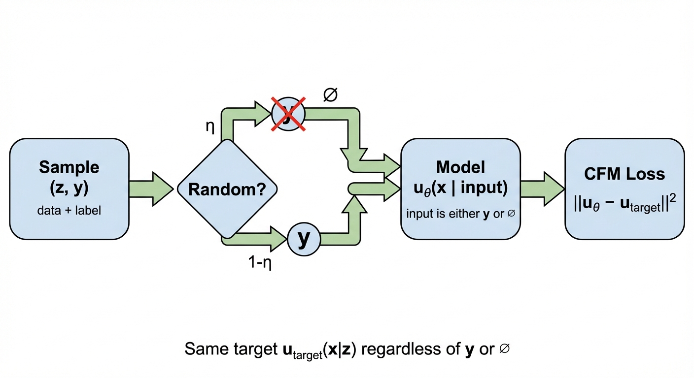
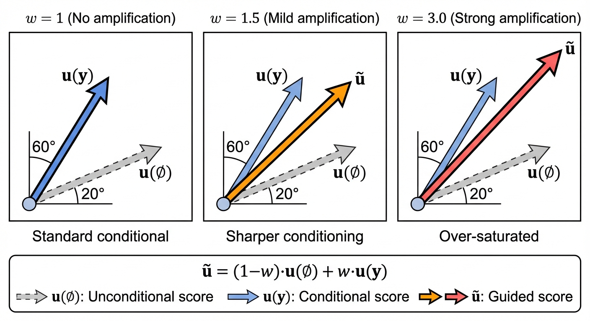

::: {.callout-note appearance="simple"}

## TL;DR

- **Guided generation** conditions the model on additional information $y$ (e.g., text prompts, class labels)
- **CFG training**: Standard loss + randomly drop conditioning with probability $\eta$ (10-20%)
- **CFG sampling**: Amplify conditioning by extrapolating: $\tilde{u}_t = u_t(\emptyset) + w \cdot (u_t(y) - u_t(\emptyset))$
- For **Gaussian paths**, CFG = amplifying the classifier gradient; for general flows it's purely empirical

:::

So far, the generative models we have discussed are all **unconditional** models, i.e., they generate samples from the target probability distribution $p_{data}$ without any additional information. In this post, we will discuss how to make these models **conditional** on some additional information like a text prompt $y$.

To avoid notation and terminology clash with the use of the word "**conditional**" to refer to conditioning on $z \sim p_{data}$, we will use the term "**guided**" to refer specifically to conditioning on $y$.

{#fig-cfg-concept}

::: {#guided-generation .callout-note appearance="simple"}

Def: Guided Generative Model

A guided diffusion model is defined by the SDE:

$$
\begin{aligned}
dX_t &= [u_t^{target}(X_t | y) + \frac{\sigma_t^2}{2} \nabla \log p_t(X_t | y)] dt + \sigma_t dW_t \\
X_0 &\sim p_{init} \\
\implies X_t &\sim p_t(\cdot | y) \quad \text{for all } 0 \leq t \leq 1
\end{aligned}
$$

When $\sigma_t = 0$, the SDE reduces to the ODE for guided flow matching:
$$
dX_t = u_t^{target}(X_t | y) dt, \quad X_0 \sim p_{init}
$$
:::

## Guidance for Flow Models

Now let us imagine we have a label $y$ for each data $z$. For images, some of them are "dog" and some of them are "cat". Given a fixed label $y$, we can think of $p_{data}(z | y)$ as a "slice" of the data distribution — the subset of data points with that label.

Given a fixed label $y$, the CFM loss is defined as before:

$$
L_{CFM, y}(\theta) = \mathbb{E}_{t, z \sim p_{data}(z|y), x \sim p_t(x|z)} \left[ \|u_t^\theta(x | y) - u_t^{target}(x | z)\|^2 \right]
$$

The target $u_t^{target}(x | z)$ is exactly the same as in unconditional flow matching (see [Part 3](../3-probability-paths/)): the vector field that transports noise toward data point $z$. For Gaussian paths with $x = \alpha_t z + \beta_t \epsilon$:

$$
u_t^{target}(x | z) = \dot{\alpha}_t z + \dot{\beta}_t \epsilon
$$

**How does training on $u_t^{target}(x|z)$ give us $u_t^{target}(x|y)$?** This is the [marginalization trick](../4-flow-matching-loss/) again. The key insight is:

$$
u_t^{target}(x | z, y) = u_t^{target}(x | z)
$$

**Why?** Because the probability path $p_t(x|z)$ only depends on $z$ — once you know the specific data point $z$, the label $y$ provides no additional information about how to add noise to it. The noise-adding process is purely mechanical and doesn't care about labels.

Therefore, the [marginalization formula from Part 4](../4-flow-matching-loss/#the-marginalization-formula) applies directly:

$$
\begin{aligned}
u_t^{target}(x | y) &= \mathbb{E}_{z \sim p_t(z|x,y)}[u_t^{target}(x | z, y)] \\
&= \mathbb{E}_{z \sim p_t(z|x,y)}[u_t^{target}(x | z)]
\end{aligned}
$$

**What does this mean?** Given noisy sample $x$ and label $y$, the marginal vector field is an average over all possible clean data points $z$ that could have generated $x$, weighted by the posterior $p_t(z|x,y)$. The label $y$ constrains which $z$ values are plausible, but once a specific $z$ is chosen, the vector field $u_t^{target}(x|z)$ is the same regardless of $y$.

We never compute this expectation explicitly — least-squares regression does it for us (see [Part 6](../6-score-functions/)). By sampling $(z, y) \sim p_{data}(z, y)$ and regressing against $u_t^{target}(x|z)$, the model learns $u_t^\theta(x|y) \approx u_t^{target}(x|y)$.

You can think of $u_t^\theta(x | y)$ as a specific model just for the data slice $p_{data}(z|y)$ with label $y$. We could build separate models for each label $y$ and train them separately, but this is not efficient. Instead, we want to train a single model that works for all $y$, so the model takes input $[x, y, t]$ instead of only $[x, t]$ as before.

Now, we want to minimize the expected loss over all possible labels $y$. The total loss is the expectation of the label-specific losses $L_{CFM, y}$:

$$
\begin{aligned}
\mathcal{L}_{CFM}(\theta) &= \mathbb{E}_{y \sim p_{data}(y)} \left[ L_{CFM, y}(\theta) \right] \\
&= \mathbb{E}_{y \sim p_{data}(y)} \left[ \mathbb{E}_{t, z \sim p_{data}(z|y), x \sim p_t(x|z)} \left[ \|u_t^\theta(x | y) - u_t^{target}(x | z)\|^2 \right] \right] \\
&= \mathbb{E}_{t, y \sim p_{data}(y), z \sim p_{data}(z|y), x \sim p_t(x|z)} \left[ \|u_t^\theta(x | y) - u_t^{target}(x | z)\|^2 \right]
\end{aligned}
$$

By the definition of joint probability:
$$
p_{data}(z, y) = p_{data}(z | y) \, p_{data}(y)
$$

we can merge these two expectations into one:

$$
\mathbb{E}_{y \sim p_{data}(y), z \sim p_{data}(z | y)} = \mathbb{E}_{(z, y) \sim p_{data}(z, y)}
$$

Substituting back, we get:

$$
\mathcal{L}_{CFM}(\theta) = \mathbb{E}_{t,(z,y) \sim p_{data}(z, y), x \sim p_t(x|z)} \left[ \|u_t^\theta(x | y) - u_t^{target}(x | z)\|^2 \right]
$$

In practice, sampling $(z, y) \sim p_{data}(z, y)$ would involve a dataloader that returns batches of both $z$ and $y$.

### The Problem: Weak Conditioning

While the above training procedure is theoretically valid, it was empirically observed that images generated with this procedure did not fit well enough to the desired label $y$. The generated samples were correct on average, but lacked the strong conditioning that users wanted.

::: {.callout-tip appearance="simple"}
## The Solution: Amplify Conditioning at Sampling Time

Both **Classifier Guidance** and **Classifier-Free Guidance (CFG)** are sampling-time techniques. The idea is the same: scale up the "conditioning direction" to get stronger adherence to the label $y$.

The derivations below show *why* this works mathematically. The difference between the two methods is *how* you compute the conditioning direction:

| Method | How to get the conditioning direction | Extra training required? |
|--------|--------------------------------------|--------------------------|
| Classifier Guidance | Train a separate classifier $p_t(y\|x)$ | Yes (classifier) |
| CFG | Use label dropout so one model estimates both terms | No |
:::

### Classifier Guidance

::: {.callout-important appearance="simple"}
## Important: Gaussian Paths Required
The derivation below relies on **Gaussian probability paths** $p_t(x|z) = \mathcal{N}(\alpha_t z, \beta_t^2 I)$. The score $\nabla \log p_t(x)$ is a property of the marginal distribution — it exists mathematically regardless of whether we're training a diffusion model or flow model. For Gaussian paths, the [conversion formula](../7-training/#conversion-formula) relates this score to the vector field, enabling the derivation below.
:::

Recall from [Part 7](../7-training/) that for Gaussian conditional probability path $p_t(x|z) = \mathcal{N}(\alpha_t z, \beta_t^2 I_d)$, we can use the [conversion formula](../7-training/#conversion-formula) to write the marginal vector field in terms of the marginal score:

$$
\begin{aligned}
u_t^{target}(x) = a_t x + b_t \nabla \log p_t(x) \\
(a_t, b_t) = (\frac{\dot{\alpha}_t}{\alpha_t}, \frac{\dot{\alpha}_t \beta_t^2}{\alpha_t} - \dot{\beta}_t \beta_t) \\
\end{aligned}
$$

Replacing the vector field and score function with guided ones, we get:

$$
\begin{aligned}
u_t^{target}(x | y) = a_t x + b_t \nabla \log p_t(x | y)
\end{aligned}
$$

we can expand the guided score function using Bayes' rule:

$$
\begin{aligned}
\nabla \log p_t(x | y) &= \nabla \log \frac{p_t(y|x) p_t(x)}{p_t(y)} \\
&= \nabla \log p_t(y|x) + \nabla \log p_t(x) - \nabla \log p_t(y) \\
& \text{(gradient is with respect to $x$, so $\nabla \log p_t(y)$ is a zero vector)} \\
& = \nabla \log p_t(y|x) + \nabla \log p_t(x)\\
\end{aligned}
$$

Plugging back to the guided vector field, we get:

$$
\begin{aligned}
u_t^{target}(x | y) &= a_t x + b_t \nabla \log p_t(x | y) \\
&= a_t x + b_t (\nabla \log p_t(y|x) + \nabla \log p_t(x)) \\
&= \underbrace{a_t x + b_t \nabla \log p_t(x)}_{u_t^{target}(x)} +b_t \nabla \log p_t(y|x) \\
&= u_t^{target}(x) + b_t \nabla \log p_t(y|x) \\
\end{aligned}
$$

Notice the shape of the above equation: the guided vector field is a sum of the unguided vector field plus a guided score $\nabla \log p_t(y|x)$. The term $\log p_t(y | x)$ is considered as a classifier which gives the likelihood of the label $y$ given the data $x$.

It has been empirically observed that scaling up the contribution of $\nabla \log p_t(y|x)$ by a **guidance scale** $w > 1$ gives better outputs. 

$$
\tilde{u}_t^{target}(x | y) = u_t^{target}(x) + w \cdot b_t \nabla \log p_t(y|x)
$$

Note that this is a heuristic: for $w \neq 1$, we do not sample from the true guided distribution $p_{data}(z | y)$.

In the early works, people trained actual classifiers and use them to guide via the above procedure.  But it has drawbacks:

- Requires training an **extra classifier** on noisy data
- The classifier must handle all noise levels $t \in [0, 1]$
- Complicates the training pipeline

### Classifier-Free Guidance (CFG)

**Classifier-free guidance (CFG)**$^{[2]}$ achieves the same amplification without training a separate classifier. The key idea: rewrite the classifier gradient in terms of vector fields we can learn from a single model.

#### Deriving the CFG Formula

Using Bayes' rule, we can rewrite the classifier gradient:
$$
\nabla \log p_t(y|x) = \nabla \log p_t(x|y) - \nabla \log p_t(x)
$$

Plugging back into the scaled guided vector field $\tilde{u}_t^{target}(x | y)$:
$$
\begin{aligned}
\tilde{u}_t^{target}(x | y) &= u_t^{target}(x) + w \cdot b_t \nabla \log p_t(y|x) \\
&= u_t^{target}(x) + w \cdot b_t (\nabla \log p_t(x|y) - \nabla \log p_t(x))
\end{aligned}
$$

From the conversion formula, we can express scores in terms of vector fields:
$$
\begin{aligned}
\nabla \log p_t(x) &= \frac{1}{b_t} (u_t^{target}(x) - a_t x) \\
\nabla \log p_t(x|y) &= \frac{1}{b_t} (u_t^{target}(x | y) - a_t x) \\
\end{aligned}
$$

Substituting back and simplifying (the $a_t x$ and $b_t$ terms cancel):
$$
\begin{aligned}
\tilde{u}_t^{target}(x | y) &= u_t^{target}(x) + w \cdot (u_t^{target}(x | y) - u_t^{target}(x)) \\
&= (1-w) \cdot u_t^{target}(x) + w \cdot u_t^{target}(x | y)
\end{aligned}
$$

This is the **CFG formula**: the scaled guided vector field is a linear combination of the unguided and guided vector fields:
$$
\textcolor{blue}{\tilde{u}_t^{target}(x | y)} = (1-w) \cdot \textcolor{green}{u_t^{target}(x)} + w \cdot \textcolor{orange}{u_t^{target}(x | y)}
$$

where $\textcolor{blue}{\text{CFG output}}$ interpolates between $\textcolor{green}{\text{unconditional}}$ and $\textcolor{orange}{\text{conditional}}$ velocities. When $w > 1$, we extrapolate *beyond* the conditional direction, amplifying the effect of conditioning.

#### Training {#cfg-training}

To use the CFG formula, we need both $u_t^\theta(x|y)$ (guided) and $u_t^\theta(x|\emptyset)$ (unguided). Instead of training two separate models, we train a **single model** that handles both by introducing a null token $\emptyset$:

$$
u_t^\theta(x | \emptyset) \approx u_t^{target}(x) \quad \text{(unconditional)}
$$

**Training procedure:**

1. Sample $(z, y) \sim p_{data}(z, y)$ — a data point with its label
2. With probability $\eta$ (typically 10-20%), replace $y$ with $\emptyset$
3. Minimize the CFM loss: $\|u_t^\theta(x | y) - u_t^{target}(x | z)\|^2$

{#fig-cfg-training}

**Why does this work?** The target $u_t^{target}(x | z)$ is always the same — it doesn't depend on $y$. What changes is the **model input**:

- When we keep $y$: the model learns $u_t^\theta(x | y) \approx$ conditional vector field
- When we drop $y$: the model learns $u_t^\theta(x | \emptyset) \approx$ marginal vector field

By training with $\emptyset$ on random samples from all classes, the model learns the marginal (average over all conditionals) — exactly what we need for the CFG formula.

::: {.callout-note appearance="simple"}
## Key Point
The training loss is identical to standard guided CFM. The only change is randomly dropping the label with probability $\eta$. The CFG formula $\tilde{u}_t$ is **not used during training** — it only appears at sampling time.
:::

#### Sampling {#cfg-sampling}

At inference time, we use the trained model to compute both outputs and combine them:

$$
\textcolor{blue}{\tilde{u}_t^\theta(x | y)} = \textcolor{green}{u_t^\theta(x | \emptyset)} + \textcolor{purple}{w} \cdot (\textcolor{orange}{u_t^\theta(x | y)} - \textcolor{green}{u_t^\theta(x | \emptyset)})
$$

where $\textcolor{blue}{\text{CFG output}}$ = $\textcolor{green}{\text{unconditional}}$ + $\textcolor{purple}{\text{guidance scale}}$ × ($\textcolor{orange}{\text{conditional}}$ − $\textcolor{green}{\text{unconditional}}$).

Equivalently: $\tilde{u}_t^\theta = (1-w) \cdot u_t^\theta(x|\emptyset) + w \cdot u_t^\theta(x|y)$

**Sampling procedure:**

1. Sample $x_0 \sim p_{init}$ (e.g., Gaussian noise)
2. At each step, run the model twice: once with $y$, once with $\emptyset$
3. Combine outputs using the CFG formula with guidance scale $w$
4. Integrate the ODE/SDE using $\tilde{u}_t^\theta$

The guidance scale $w$ controls the strength of conditioning:

- $w = 1$: No amplification (standard conditional generation)
- $w > 1$: Amplified conditioning (sharper, more "on-prompt" samples)
- $w \gg 1$: Over-saturation (artifacts, reduced diversity)

{#fig-guidance-scale}

::: {.callout-warning appearance="simple"}
## What about non-Gaussian flows?

The CFG formula $(1-w)u_t(x) + w \cdot u_t(x|y)$ is just a weighted interpolation — you can apply it to **any** vector fields regardless of path type. What changes is the **interpretation**:

- **Gaussian paths**: This interpolation = amplifying a classifier gradient $\nabla \log p_t(y|x)$ (the derivation above)
- **Non-Gaussian paths**: The formula still works empirically, but we lose the classifier gradient interpretation. Why does interpolating vector fields improve conditioning? It remains theoretically unclear$^{[1]}$.

In practice, most modern systems (Stable Diffusion, Flux, etc.) use Gaussian paths, so this distinction rarely matters.
:::

::: {.callout-note appearance="simple"}
## Summary

We extended flow matching and diffusion models to **guided generation** — conditioning on labels, text prompts, or other side information $y$.

**Classifier-free guidance (CFG)** in two steps:

| Phase | What happens | Formula used |
|-------|--------------|--------------|
| **Training** | Random label dropout with probability $\eta$ | Standard CFM loss |
| **Sampling** | Combine conditional + unconditional outputs | $\tilde{u}_t = (1-w) \cdot u_t(\emptyset) + w \cdot u_t(y)$ |

The derivation shows *why* CFG works: for Gaussian paths, the difference $u_t(x|y) - u_t(x|\emptyset)$ approximates the classifier gradient $\nabla \log p_t(y|x)$. Scaling by $w > 1$ amplifies this gradient, improving sample quality at the cost of diversity.
:::

## References

[1] [Classifier-Free Guidance is a Predictor-Corrector](https://arxiv.org/abs/2408.09000). Bradley & Nakkiran. *arXiv 2024*.

[2] [Classifier-Free Diffusion Guidance](https://arxiv.org/abs/2207.12598). Ho & Salimans. *NeurIPS Workshop 2021*.

[3] [Diffusion Models Beat GANs on Image Synthesis](https://arxiv.org/abs/2105.05233). Dhariwal & Nichol. *NeurIPS 2021*.

[4] [Guided Flows for Generative Modeling and Decision Making](https://arxiv.org/abs/2311.13443). Zheng et al. *arXiv 2023*.
