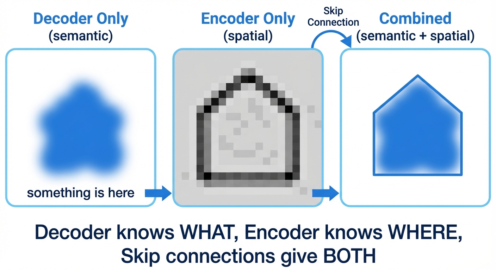
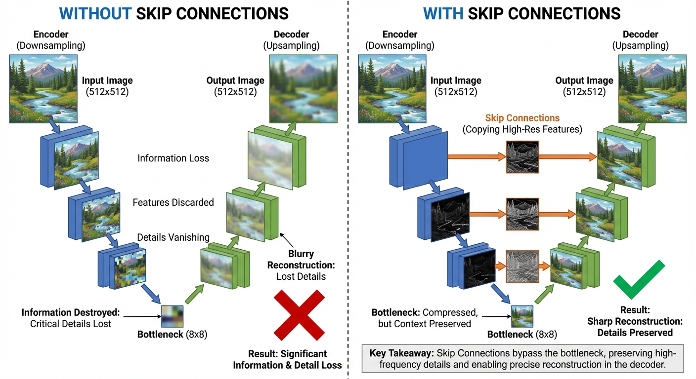
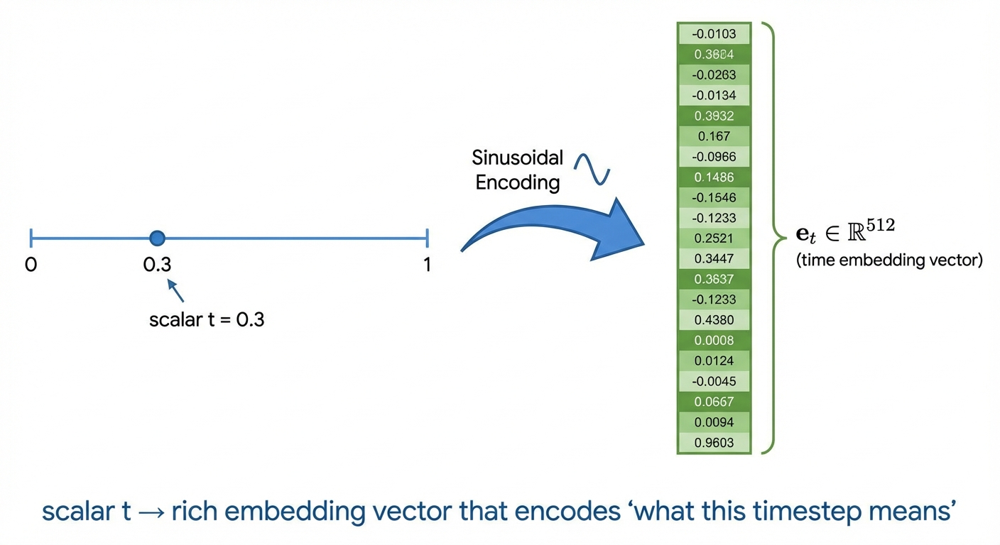
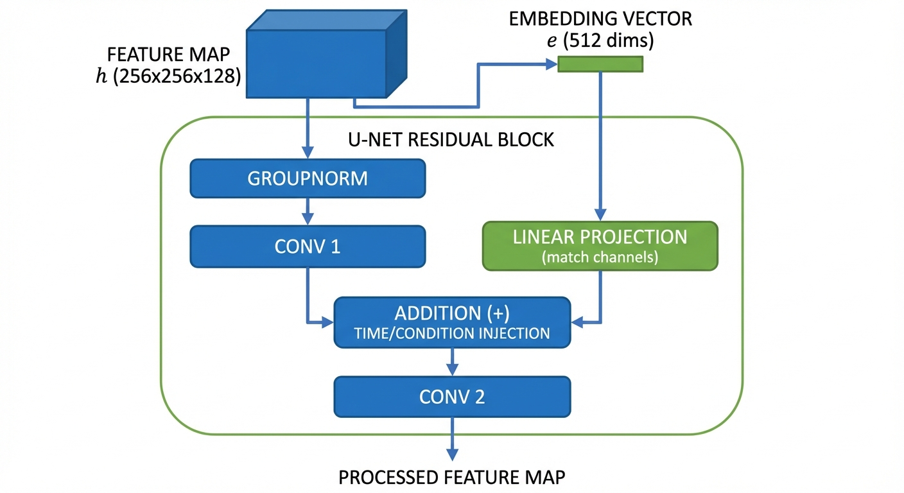

::: {.callout-note appearance="simple"}

## TL;DR

- **Why architecture matters**: The network must predict noise at different timesteps while preserving spatial structure — this is unlike any standard vision task
- **U-Net dominates** for pixel-space diffusion (Stable Diffusion, DALL-E 2) because skip connections preserve fine details lost during downsampling
- **Skip connections** fuse semantic (decoder) and spatial (encoder) information — essential for precise reconstruction
- **Time conditioning**: Sinusoidal embeddings convert timestep $t$ into a high-dimensional vector that modulates network behavior

:::

We've spent several posts deriving the mathematical theory of diffusion models: [probability paths](../3-probability-paths/), [flow matching objectives](../4-flow-matching-loss/), and [score functions](../6-score-functions/). But here's the practical question: **how do we actually build a neural network that can denoise images at arbitrary timesteps?**

This isn't a standard image-to-image translation problem. The network needs to:
1. Handle the *same noisy image* differently depending on time $t$ (aggressive denoising at $t \approx 0$, gentle refinement at $t \approx 1$)
2. Preserve spatial structure while processing high-dimensional inputs (a 512×512 RGB image is 786,432 dimensions!)
3. Support flexible conditioning (text prompts, class labels, spatial masks)

In this post, we'll cover **U-Net** — the dominant architecture for diffusion models. For transformer-based approaches (DiT), see [Part 10: Diffusion Transformers](../10-diffusion-transformers/).

## The Learning Problem {#sec-learning-problem}

::: {.callout-tip appearance="simple"}
## Intuition: What Makes Diffusion Different

Unlike a classifier (image → label) or segmentation model (image → mask), diffusion models perform a unique task: **image + time → velocity field**. The network must predict *which direction to move in pixel space* to denoise the image, and this direction changes dramatically with time.
:::

Recall from [Part 4](../4-flow-matching-loss/) and [Part 7](../7-training/) that our goal is to learn a neural network that can predict either:

1. **Vector field**: $u_\theta(x_t, t, y) \approx u_t(x_t)$ for flow matching
   (Points in the direction of clean data)

2. **Score function**: $s_\theta(x_t, t, y) \approx \nabla_{x_t} \log p_t(x_t)$ for score-based diffusion
   (Gradient of the log-probability — also points toward high-density regions)

Here $y$ is an optional conditioning input (class label, text prompt, or other control signal).

Both are fundamentally the same task: given noisy image $x_t$, timestep $t$, and condition $y$, output a same-sized tensor that tells us "how to update each pixel."

::: {.callout-tip appearance="simple"}
## Why Same Dimensions? The Vector Field Property

You might wonder: why does the output need to be the same size as the input?

**Mathematical reason**: A vector field $u_t : \mathbb{R}^d \to \mathbb{R}^d$ maps each point in space to a **direction in the same space**. Think of a weather map showing wind: at each $(x, y)$ location, there's a wind velocity vector pointing in some direction. The velocity lives in the same 2D space as the location.

**Physical meaning**: The vector field tells us "how to update $x_t$" when we solve the ODE $\frac{dx_t}{dt} = u_t(x_t)$. To add this update to $x_t$ (which is $H \times W \times C$), the update $u_t(x_t)$ must also be $H \times W \times C$ — we need one "velocity" value per pixel per channel.

**Score function case**: Similarly, $s_t(x_t) = \nabla_{x_t} \log p_t(x_t)$ is a gradient with respect to $x_t$, which by definition has the same shape as $x_t$.

This is why U-Net (input size = output size) is so natural for diffusion — it exactly matches the mathematical structure!
:::

**Why is this hard?** Consider the architectural requirements:

- **Time conditioning is critical**: At $t=0.1$ (mostly noise), the network should make large corrections toward data. At $t=0.9$ (nearly clean), only subtle refinements. The *same* network must handle both.
- **Multi-scale reasoning**: Need to capture both global structure ("this is a dog") and fine details ("the fur texture here")
- **High resolution**: Operating on 512×512×3 images = 786k dimensions
- **Flexible conditioning**: Should accept class labels, text prompts, or spatial control signals

## U-Net Architecture {#sec-unet}

### The Encoder-Decoder Baseline

The natural starting point for an image-to-image network is an **encoder-decoder** architecture:

1. **Encoder**: Progressively downsample the input (512×512 → 256×256 → 128×128 → ... → 8×8)
   - Reduces spatial resolution while increasing channels
   - Extracts increasingly abstract features

2. **Bottleneck**: Process at the lowest resolution (e.g., 8×8×512)
   - Rich semantic representation, but tiny spatial size

3. **Decoder**: Progressively upsample back to original size (8×8 → ... → 512×512)
   - Reconstructs the output from the compressed representation

**The problem**: The 8×8 bottleneck is a severe **information bottleneck**. Spatial details are destroyed during downsampling and can't be recovered during upsampling. You'd get blurry, imprecise outputs.

::: {.callout-tip appearance="simple"}
## Intuition: Why Encoder-Decoder Fails for Diffusion

Imagine compressing an image down to 8×8, then trying to reconstruct it to 512×512. You'd lose all fine details!

For diffusion models, this is catastrophic — we need to predict pixel-level noise patterns. If the bottleneck destroys spatial information, the decoder has no way to know "what texture pattern existed at pixel (247, 381)?"
:::

### The U-Net Solution: Skip Connections

{#fig-unet}

U-Net solves the information bottleneck problem with **skip connections**:^[[Ronneberger et al., 2015](https://arxiv.org/abs/1505.04597)]

**The idea**: Instead of forcing all information through the bottleneck, create **direct pathways** from encoder to decoder at matching resolutions. The decoder can now access high-resolution features that haven't been compressed.

**The architecture**:
1. **Encoder**: Same as before — downsample from 512×512 to 8×8
2. **Bottleneck**: Same as before — process at 8×8
3. **Decoder**: Upsample back up, BUT at each level, **concatenate** the corresponding encoder features
4. **Skip connections**: The gray arrows in @fig-unet — copy features across the U

This creates the characteristic U-shape, giving the architecture its name. U-Net has become the workhorse for pixel-space diffusion models powering DALL-E 2, Stable Diffusion, and Midjourney.

### How Skip Connections Actually Work {#sec-skip-connections}

::: {.callout-tip appearance="simple"}
## Intuition: Semantic vs Spatial Information

Here's the key insight:^[[Computerphile, "U-Net Explained"](https://www.youtube.com/watch?v=NhdzGfB1q74)]

- **Decoder features** (after upsampling): Rich in **semantic information** — "this region contains a bike"
- **Encoder features** (before downsampling): Rich in **spatial information** — "these exact pixels are where the bike is"

Skip connections let subsequent decoder layers operate on **both**:
- Semantic understanding from the decoder: "I'm reconstructing a bike here"
- Spatial precision from the encoder: "The bike's exact pixel locations are here"

This combination is exactly what you need to reconstruct fine details!

**Preventing "forgetting"**: Deep networks tend to lose low-level features as information passes through many layers.^[[AI Summer, "Skip Connections"](https://theaisummer.com/skip-connections/)] Skip connections reintroduce these features, ensuring the decoder doesn't have to "remember" what the encoder saw — it can access it directly.
:::

{#fig-semantic-spatial}

{#fig-skip-concat}

**The operation**: Concatenate encoder and decoder feature maps along the channel dimension:
- Same spatial size (256×256)
- Encoder: 128 channels of **"where things are"** (spatial precision)
- Decoder: 256 channels of **"what things are"** (semantic understanding)
- Result: 384 channels combining both types of information

**Why this is crucial for diffusion**: Predicting pixel-level noise patterns requires knowing both:
1. **Semantic**: "This region is a dog's fur" (from decoder's global understanding)
2. **Spatial**: "The fur texture at pixel (247, 381) has this exact pattern" (from encoder's preserved high-res features)

Without skip connections, the 8×8 bottleneck would destroy all spatial precision, leaving only blurry semantic understanding.

{#fig-skip-comparison}

### Adaptations for Diffusion

The original U-Net was designed for segmentation (image → mask). For diffusion, we need (image, time, condition) → velocity field. Here's how it's adapted:^[[Ho et al., 2020](https://arxiv.org/abs/2006.11239)]

#### Time Embedding: Teaching the Network "What Time Is It?"

::: {.callout-tip appearance="simple"}
## Intuition: Why Can't We Just Feed in $t$ Directly?

The network needs to behave **completely differently** at different timesteps:
- At $t=0.1$ (mostly noise): "Remove lots of noise, focus on global structure"
- At $t=0.9$ (nearly clean): "Make tiny adjustments, preserve existing details"

If you just feed in the scalar $t=0.1$ vs $t=0.9$, the network has no way to know these are fundamentally different regimes! It's like giving someone two numbers (0.1 vs 0.9) and expecting them to understand the profound behavioral difference they imply.

**Solution**: Convert $t$ into a rich, high-dimensional vector that encodes "what this timestep means" — this is called an **embedding**.
:::

**What is an embedding?** A mapping from a simple input (like a number $t$ or a word) to a high-dimensional vector that captures its "meaning." Here: scalar $t \in [0,1]$ → vector $e_t \in \mathbb{R}^{512}$ (or whatever dimension matches the network's channels).

{#fig-time-embedding}

**How it's done** — Sinusoidal position encoding:^[[Milvus AI, "Sinusoidal embeddings in diffusion"](https://milvus.io/ai-quick-reference/how-are-sinusoidal-embeddings-implemented-in-diffusion-models)]

$$
t \to [\sin(2^0 \pi t), \cos(2^0 \pi t), \sin(2^1 \pi t), \cos(2^1 \pi t), \sin(2^2 \pi t), \cos(2^2 \pi t), \ldots] \to \text{MLP} \to e_t
$$

Think of it like encoding the number using multiple "frequencies" — low frequencies ($2^0 = 1$) capture coarse time differences, high frequencies ($2^{10} = 1024$) capture fine distinctions.

**Why sinusoidal?** Three key properties:
1. **Smooth**: Similar timesteps ($t=0.5$ vs $t=0.51$) get similar embeddings → network can interpolate
2. **Distinctive**: Different timesteps ($t=0.1$ vs $t=0.9$) get very different embeddings → network can learn distinct behaviors
3. **Generalizable**: Unlike learned embeddings, sinusoidal encodings work for *any* timestep value — a model trained with 50 steps still works with 1000 steps at inference^[[arXiv, "Disappearance of Timestep Embedding"](https://arxiv.org/html/2405.14126v1)]

**How it's used**: The time embedding $e_t$ is added to the feature maps at every resolution level of the U-Net, allowing each layer to "know" what time it is and adjust its processing accordingly.

#### Injecting Time and Condition into the Network {#sec-injection}

::: {.callout-tip appearance="simple"}
## How $t$ and $y$ Actually Flow Through the Network

Here's the concrete mechanism:

**Step 1**: Create embeddings
- Time: $t \to \text{sinusoidal + MLP} \to e_t \in \mathbb{R}^{512}$
- Condition (if any): $y \to \text{embedding layer} \to e_y \in \mathbb{R}^{512}$
- Combine: $e = e_t + e_y$ (element-wise addition)^[[HuggingFace Diffusers, CombinedTimestepLabelEmbeddings](https://github.com/huggingface/diffusers/blob/main/src/diffusers/models/embeddings.py)]

*Why addition?* Both embeddings live in the same vector space with the same dimensions. Adding them creates a combined signal that encodes both "what time is it?" and "what are we generating?". The network learns to interpret this combined embedding during training.

**Step 2**: Inject at every residual block^[[LabML.ai, "U-Net for DDPM"](https://nn.labml.ai/diffusion/ddpm/unet.html)]

{#fig-time-injection}

The embedding $e$ is projected to match the number of channels, then added to the feature map between two convolutions. This allows the conditioning to modulate how each channel processes information.
:::

**Alternative injection methods**:^[[LabML.ai, "U-Net for Stable Diffusion"](https://nn.labml.ai/diffusion/stable_diffusion/model/unet.html)]
- **AdaGN (Adaptive Group Normalization)**: Use $e$ to predict scale/shift for group normalization
- **Cross-attention** (for text): Don't add $e$, instead let features attend to text embeddings
- **FiLM (Feature-wise Linear Modulation)**: Predict channel-wise scale and shift from $e$

Different implementations use different methods, but the core idea is the same: **let the conditioning signal $e$ modify how the network processes features**.

#### Other Conditioning Mechanisms
- **Spatial conditioning**: Concatenate additional input channels (e.g., edge maps for ControlNet) — happens at the input, not via embeddings

**Self-attention layers**:
- Added at lower resolutions (e.g., 16×16, 8×8) where the quadratic cost is manageable
- Captures long-range dependencies — e.g., ensuring a dog's tail matches its head

## Training Considerations {#sec-training}

### Loss Functions {#sec-loss}

U-Net is trained with standard diffusion objectives (see [Part 7](../7-training/)):

**Flow matching** (Conditional Flow Matching loss):
$$\mathcal{L}_{FM}(\theta) = \mathbb{E}_{t, z \sim p_{data}, x_t \sim p_t(\cdot|z)} \|u_\theta(x_t, t) - u_t(x_t|z)\|^2$$ {#eq-flow-matching-loss}

**Score matching** (Denoising Score Matching loss):
$$\mathcal{L}_{DSM}(\theta) = \mathbb{E}_{t, z \sim p_{data}, x_t \sim p_t(\cdot|z)} \|s_\theta(x_t, t) - s_t(x_t|z)\|^2$$ {#eq-score-matching-loss}

::: {.callout-note appearance="simple"}
**Note**: We train by regressing against **conditional** targets ($u_t(x_t|z)$ conditioned on data point $z$), but the network learns to approximate the **marginal** vector field $u_t(x_t)$ needed for generation. This is the [marginalization trick](../4-flow-matching-loss/) — training on conditional targets is equivalent to learning the marginal.
:::

The architecture doesn't change the learning objective — only how we parameterize the function $u_\theta(x_t, t, y)$ or $s_\theta(x_t, t, y)$.

### Parameterization Tricks {#sec-parameterization}

::: {.callout-tip appearance="simple"}
## Intuition: What Should the Network Predict?

You might think: "predict the velocity field $u_t$." But there are equivalent formulations that work better in practice:
- **Noise prediction**: Predict the noise $\epsilon$ that was added
- **Data prediction**: Predict the clean image $x_0$
- **Velocity prediction**: Predict the direction to move

These are mathematically equivalent (related by simple algebra), but training dynamics differ!
:::

**Common parameterizations**:

1. **Noise prediction** ($\epsilon$-parameterization): Network outputs $\epsilon_\theta(x_t, t) \approx \epsilon$ where $x_t = \alpha_t x_0 + \sigma_t \epsilon$
   - Most common for DDPM-style training
   - Works well across all timesteps

2. **Velocity prediction** ($v$-parameterization): Network directly predicts $v_\theta(x_t, t) \approx u_t(x_t)$
   - Natural for flow matching
   - Better for consistency models

3. **Data prediction** ($x_0$-parameterization): Network predicts $\hat{x}_0 = f_\theta(x_t, t)$
   - Sometimes easier to interpret (direct image prediction)
   - Can be unstable at high noise levels

**Which to use?** $\epsilon$-prediction is the safe default. Some recent work uses $v$-prediction for improved stability.

**Prediction target scheduling**: Some methods interpolate between parameterizations based on $t$ — e.g., predict noise at early steps, data at late steps.

## Practical Implementation {#sec-practical}

### Hyperparameters {#sec-hyperparameters}

**Typical U-Net configuration** (Stable Diffusion scale):
- Base channels: 128-320
- Channel multipliers: [1, 2, 4, 4] → max channels ≈ 1280
- Attention resolutions: [32, 16, 8] (spatial sizes where attention is applied)
- Residual blocks per level: 2
- Total parameters: ~800M-1B (depending on depth)

### Computational Efficiency {#sec-efficiency}

**U-Net optimizations**:
- **Flash Attention** for self-attention layers (2-4× speedup)
- **Mixed precision (FP16/BF16)** training (2× memory reduction)
- **Gradient checkpointing** trades compute for memory (enables 2× larger batches)
- **Latent diffusion** (VAE compress 512×512×3 → 64×64×4, saving 64× compute)

::: {.callout-tip appearance="simple"}
## Real-World Costs

**Stable Diffusion (U-Net)**: Trained on 256 A100 GPUs for ~150k steps (~200 GPU-days), cost ~$600k

Training from scratch is expensive! Fine-tuning pretrained models costs 100-1000× less.
:::

## Modern Variants and Extensions {#sec-modern}

The basic U-Net we've covered forms the foundation — but practical systems like Stable Diffusion add several innovations. Here are the most impactful:

### Architectural Innovations

1. **Latent Diffusion Models (LDM)**^[[Rombach et al., 2022](https://arxiv.org/abs/2112.10752)] — **Most important innovation**

   {#fig-latent-diffusion}

   ::: {.callout-tip appearance="simple"}
   ## Why Latent Space?

   Running diffusion directly on 512×512 images is prohibitively expensive. The key insight: **perceptual compression** via a pretrained VAE removes imperceptible high-frequency details, letting the diffusion model focus on semantic content.^[[Louis Bouchard, "Latent Diffusion Models Explained"](https://www.louisbouchard.ai/latent-diffusion-models/)]
   :::

   - **VAE Encoder**: Compress 512×512×3 → 64×64×4 latents (64× reduction)
   - **Diffusion in latent space**: U-Net denoises with text conditioning via cross-attention
   - **VAE Decoder**: Reconstruct latent → full resolution image
   - Powers Stable Diffusion, DALL-E 3, Midjourney

2. **Cascaded diffusion**^[[Ho et al., 2022](https://arxiv.org/abs/2106.15282)]
   - Train separate models for 64×64 → 256×256 → 1024×1024
   - Each stage focuses on appropriate level of detail
   - Used by DALL-E 2, Imagen

### Conditioning Mechanisms {#sec-conditioning}

**Text-to-image**:
- Encode text with CLIP or T5 → cross-attention in U-Net blocks
- Stable Diffusion uses CLIP, Imagen uses T5

**Spatial control** (ControlNet^[[Zhang et al., 2023](https://arxiv.org/abs/2302.05543)]):
- Additional encoder branch processes control signal (edges, depth, pose)
- Outputs merged into main U-Net via "zero convolutions"
- Enables precise spatial guidance without retraining base model

**Adapters** (LoRA, etc.):
- Fine-tune only low-rank adaptations of weight matrices
- 100× fewer parameters than full fine-tuning
- Popular for personalization ("Train this model on my face")

::: {.callout-note appearance="simple"}
**Looking for Diffusion Transformers?** See [Part 10: Diffusion Transformers](../10-diffusion-transformers/) for how transformers (DiT) are adapted for diffusion models.
:::

## Summary {#sec-summary}

::: {.callout-note appearance="simple"}
## Key Takeaways

We've seen how the mathematical theory of diffusion models (learning $u_t(x_t, t)$ or $s_t(x_t, t)$) translates into practical neural network architectures.

**Why architecture matters uniquely for diffusion:**
- Unlike standard vision tasks, diffusion networks must handle time-dependent denoising while preserving spatial structure
- The architecture must process images at multiple scales (global structure + fine details) and adapt behavior based on timestep $t$

**U-Net's key components:**
- **Skip connections** solve the information bottleneck problem — semantic features from the decoder combine with spatial features from the encoder
- **Time embedding**: Sinusoidal encoding converts scalar $t$ into high-dimensional vector that modulates network behavior
- **Condition injection**: Time and class embeddings are combined ($e = e_t + e_y$) and injected into every residual block
- Strong inductive bias (convolutions + locality) works well with limited data and compute

**Why U-Net dominates:**
- Powers Stable Diffusion, DALL-E 2, and most practical applications
- Formula: $\epsilon$-prediction + sinusoidal time embedding + cross-attention for text → state-of-the-art text-to-image
- Latent diffusion (VAE + U-Net) makes high-resolution generation practical
:::

**What's next?** In [Part 10: Diffusion Transformers](../10-diffusion-transformers/), we'll see how transformers (DiT) offer an alternative architecture with better scaling properties. Then we'll explore **sampling algorithms** — numerical methods for solving the learned ODE/SDE to transform noise into images.

## References

**Foundational Papers:**

- Ronneberger, O., Fischer, P., & Brox, T. (2015). [U-Net: Convolutional Networks for Biomedical Image Segmentation](https://arxiv.org/abs/1505.04597). *MICCAI 2015*.
- Ho, J., Jain, A., & Abbeel, P. (2020). [Denoising Diffusion Probabilistic Models](https://arxiv.org/abs/2006.11239). *NeurIPS 2020*.
- Dhariwal, P., & Nichol, A. (2021). [Diffusion Models Beat GANs on Image Synthesis](https://arxiv.org/abs/2105.05233). *NeurIPS 2021*.

**Latent Diffusion & Applications:**

- Rombach, R., Blattmann, A., Lorenz, D., Esser, P., & Ommer, B. (2022). [High-Resolution Image Synthesis with Latent Diffusion Models](https://arxiv.org/abs/2112.10752). *CVPR 2022*. (Stable Diffusion)
- Ho, J., Saharia, C., Chan, W., Fleet, D. J., Norouzi, M., & Salimans, T. (2022). [Cascaded Diffusion Models for High Fidelity Image Generation](https://arxiv.org/abs/2106.15282). *JMLR 2022*.
- Zhang, L., Rao, A., & Agrawala, M. (2023). [Adding Conditional Control to Text-to-Image Diffusion Models](https://arxiv.org/abs/2302.05543). *ICCV 2023*. (ControlNet)

**Educational Resources:**

- Computerphile. [How U-Net Works (U-Net Explained)](https://www.youtube.com/watch?v=NhdzGfB1q74). Video tutorial with excellent visual explanations of skip connections.
- LabML.ai. [U-Net model for DDPM](https://nn.labml.ai/diffusion/ddpm/unet.html). Annotated PyTorch implementation with detailed explanations of time embedding injection.
- LabML.ai. [U-Net for Stable Diffusion](https://nn.labml.ai/diffusion/stable_diffusion/model/unet.html). Annotated implementation showing ResBlock time conditioning.
- Hugging Face. [The Annotated Diffusion Model](https://huggingface.co/blog/annotated-diffusion). Step-by-step DDPM implementation guide.
- Hugging Face Diffusers. [Embedding Implementations](https://github.com/huggingface/diffusers/blob/main/src/diffusers/models/embeddings.py). Source code showing CombinedTimestepLabelEmbeddings and other conditioning mechanisms.
- AI Summer. [How Diffusion Models Work: The Math from Scratch](https://theaisummer.com/diffusion-models/). Tutorial.
- AI Summer. [Intuitive Explanation of Skip Connections in Deep Learning](https://theaisummer.com/skip-connections/). Technical explainer.
- Analytics Vidhya. [All You Need to Know About Skip Connections](https://www.analyticsvidhya.com/blog/2021/08/all-you-need-to-know-about-skip-connections/). Blog post.
- Milvus AI. [How are sinusoidal embeddings implemented in diffusion models?](https://milvus.io/ai-quick-reference/how-are-sinusoidal-embeddings-implemented-in-diffusion-models). AI Quick Reference.
- Medium. [Understanding Skip Connections in U-Net Architecture](https://medium.com/@preeti.gupta02.pg/understanding-skip-connections-in-convolutional-neural-networks-using-u-net-architecture-b31d90f9670a). Blog post.
