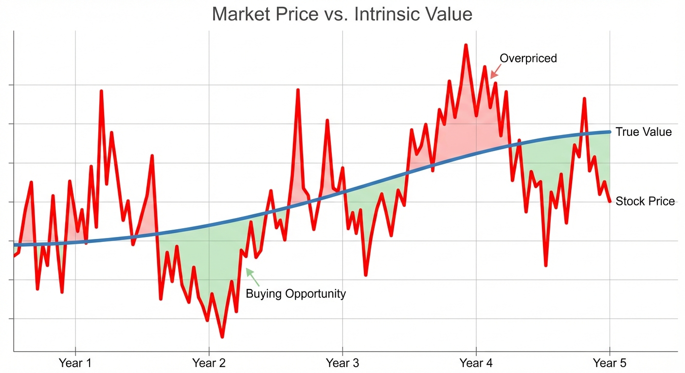

::: {.callout-note appearance="simple"}
## TL;DR

- Every business has a **true worth** based on the money it generates — separate from its stock price
- Stock prices bounce around with market emotions; the underlying value changes slowly
- Warren Buffett made $100+ billion by buying businesses when prices fell far below true worth
- You don't need complex math — if it's not obviously a bargain, pass
:::

## The $100+ Billion Question

Most people buy stocks based on price movements. "It's going up!" or "It just dropped 20%!"

Warren Buffett — who turned $10,000 into over $100 billion — does something different. He ignores what the stock price is doing. Instead, he asks one question:

**"What is this business actually worth?"**

If the price is way below the true worth, he buys. If it's not obvious, he walks away. That's it.

This simple idea made him the most successful investor in history. This series explains how he does it.

{#fig-price-value}

## Who This Series Is For

You don't need a finance degree. You don't need to know what a "P/E ratio" is (though we'll explain it). You just need to be curious about how successful investors actually think.

Maybe you have a 401(k) and wonder if you're doing it right. Maybe you've heard about "value investing" but the jargon feels like a foreign language. Maybe you're tired of "hot tips" that go nowhere.

This series cuts through the noise. We'll study Warren Buffett's actual methods — sourced from his own letters and speeches — in plain language anyone can understand.

::: {.callout-warning appearance="simple"}
## What This Series Won't Do

This isn't a get-rich-quick guide. Buffett spent 60+ years refining his approach. You won't become an expert overnight. But you will learn to think about investing differently — and that's the first step.
:::

## The House Analogy

Imagine you're buying a house.

The asking price is $500,000. But that's just what the seller wants. To know if it's a good deal, you'd ask: "What is this house actually worth?"

You might look at:

- What similar houses sold for nearby
- How much rent it could generate
- The condition of the roof, foundation, plumbing
- The neighborhood's trajectory

If you determine the house is worth $600,000 and they're asking $500,000, that's a good deal. If it's worth $400,000, you'd walk away (or negotiate hard).

**Stocks work the same way.** Behind every stock is a real business — with customers, products, and profits. That business has a true worth, separate from whatever the stock price says today.

Buffett calls this the **"intrinsic value"** — the actual worth of the business, based on the money it will generate over time.

## Buffett's Definition

Here's how Buffett explains it (from his 1992 letter to shareholders):

> "Intrinsic value is the discounted value of the cash that can be taken out of a business during its remaining life."

Let's translate that:

- **"The cash that can be taken out"** — Real money the owner could put in their pocket. Not accounting tricks. Actual cash.

- **"During its remaining life"** — All the future profits, not just this year's.

- **"Discounted"** — A dollar next year is worth less than a dollar today (because you could invest today's dollar and grow it). So future profits are adjusted downward.

Think of it like buying a rental property. The "intrinsic value" is all the rent you'll collect over the years, minus expenses, adjusted for the fact that money later is worth less than money now.

::: {.callout-tip appearance="simple"}
## Price vs. Value: Buffett's Famous Line

"Price is what you pay. Value is what you get."

The stock market gives you a price every second. Your job is to figure out the value — and only buy when price is way below it.
:::

## Why the Stock Price Lies

If intrinsic value exists, why doesn't the stock price just match it?

Because markets are emotional. Stock prices reflect what millions of people *feel* about a company right now — not what it's actually worth.

When there's good news, people pile in, pushing prices too high. When there's bad news, they panic and sell, pushing prices too low. The business itself hasn't changed much. The emotions changed.

Buffett's insight: **these emotional swings create opportunities**. When fear pushes a stock price far below intrinsic value, that's when you buy. When greed pushes it far above, you sell (or at least don't buy).

## The "Obviously Cheap" Test

Here's the surprising part: Buffett doesn't use complex math.

His partner Charlie Munger revealed:

> "Warren often talks about these discounted cash flows, but I've never seen him do one. If it isn't perfectly obvious that it's going to work out well, he tends to go on to the next idea."

And Buffett confirmed:

> "It's true. If [the value of a company] doesn't just scream out at you, it's too close."

Think about that. The greatest investor in history doesn't use spreadsheets. He uses common sense.

If you need a calculator to figure out whether something is cheap, it probably isn't cheap *enough*. The best bargains are obvious.

::: {.callout-important appearance="simple"}
## Approximately Right > Precisely Wrong

Munger on fancy financial models:

> "Some of the worst business decisions I've seen came with detailed analysis. The higher math was false precision."

A model that says a stock is worth "$47.32 per share" creates an illusion of certainty. But change one assumption slightly and that number swings to $60 or $35. The precision is fake.

Better to know something is "definitely worth more than $40" and buy it at $25. You might be wrong about whether it's worth $50 or $60, but you're still making money.
:::

## A Real Example: See's Candies

In 1972, Buffett bought See's Candies (a California chocolate company) for $25 million.

Here's what he knew:

- The business was earning about $5 million per year
- It had loyal customers who loved the brand
- It could probably raise prices over time

His calculation was basically: "I'm paying 5 times earnings for a business that might grow forever. That sounds good."

No spreadsheets. No 10-year projections. Just common sense about a business he understood.

**The result?** See's has generated over **$2 billion** in profits since 1972. From a $25 million investment. An 80x return.

## What We'll Cover in This Series

This series has 13 parts. Here's the roadmap:

| Part | Topic | The Big Question |
|------|-------|------------------|
| 1 | What is Intrinsic Value? (this post) | What is a business really worth? |
| 2 | [Owner Earnings](../2-owner-earnings/) | How much cash actually goes in your pocket? |
| 3 | [Why Buffett Ignores Wall Street Math](../3-wacc-beta/) | What discount rate should you use? |
| 4 | [Circle of Competence](../4-circle-competence/) | How do you know you understand a business? |
| 5 | [Economic Moats](../5-moats/) | What protects a business from competition? |
| 6 | [The Institutional Imperative](../6-institutional-imperative/) | Why do smart managers make dumb decisions? |
| 7 | [The Yardstick Rate](../7-discount-rate/) | How do you compare investments fairly? |
| 8 | [Margin of Safety](../8-margin-safety/) | How much buffer do you need? |
| 9 | [When to Walk Away](../9-when-to-pass/) | What makes Buffett say "no"? |
| 10-12 | Case Studies | See's, Coca-Cola, Apple — real examples |
| 13 | [The Complete Checklist](../13-framework/) | Putting it all together |

## The Bottom Line

Every business has an intrinsic value — what it's actually worth based on the cash it will generate.

Stock prices bounce around based on emotions. They're often wrong.

When price falls far below intrinsic value, that's a buying opportunity. When it's not obvious, pass.

You don't need complex math. If you need a spreadsheet to prove something is cheap, it isn't cheap enough.

::: {.callout-note appearance="simple"}
## Summary

Intrinsic value is what a business is actually worth — all the cash it will generate over its lifetime, adjusted to today's dollars. Stock prices fluctuate with emotions, but true value changes slowly.

Buffett's approach: only buy when the price is obviously below intrinsic value. If you need complex calculations to figure it out, move on to something easier.

**Next up**: [Part 2 — Owner Earnings](../2-owner-earnings/). Not all "profits" are real. We'll learn to calculate what actually goes in an owner's pocket.
:::

## References

1. Buffett, W. (1992). [Berkshire Hathaway Shareholder Letter](https://www.berkshirehathaway.com/letters/1992.html). Berkshire Hathaway Inc.

2. Munger, C. (1996). Berkshire Hathaway Annual Meeting. [CNBC Buffett Archive](https://buffett.cnbc.com/video/1996/05/06/afternoon-session---1996-berkshire-hathaway-annual-meeting.html).

3. Buffett, W. (2007). [Berkshire Hathaway Shareholder Letter](https://www.berkshirehathaway.com/letters/2007ltr.pdf). Berkshire Hathaway Inc.
