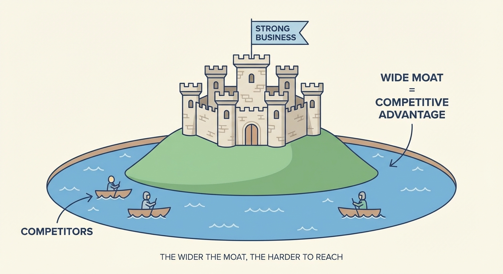

::: {.callout-note appearance="simple"}
## TL;DR

- An **economic moat** is what protects a business from competitors — like a castle's moat
- Buffett looks for two types: **lowest cost** or **strongest brand**
- The ultimate test: can the company raise prices without losing customers?
- Warning: "Most moats aren't worth a damn" — be skeptical of claimed advantages
:::

## The Castle Metaphor

Imagine a medieval castle. What keeps invaders out?

The moat — that deep trench of water surrounding the walls. The wider and deeper the moat, the harder for attackers to get across.

Buffett uses this image for businesses:

> "What we're trying to find is a business with a wide and long-lasting moat around it — protecting a terrific economic castle with an honest lord in charge."

The **castle** is the business and its profits.
The **moat** is whatever stops competitors from taking those profits.

{#fig-moat}

## Two Types of Moats

After decades of investing, Buffett identified two main sources of competitive protection:

### 1. Being the Cheapest

If you can make something for less than anyone else, you win. Competitors either match your prices (and earn less) or charge more (and lose customers).

**Example: Costco**
Costco keeps a limited selection, negotiates hard with suppliers, and passes savings to customers. Competitors can't match both their prices and their quality without losing money.

**Example: GEICO**
GEICO sells car insurance directly to customers — no local agents taking commissions. This means lower costs, which means lower prices, which means more customers, which means even lower costs. The advantage reinforces itself.

### 2. Having the Strongest Brand

When customers pay more for your product even though cheaper alternatives exist, you have a brand moat. This is about psychology, not just product features.

**Example: Coca-Cola**
Plenty of cheaper colas exist. People still buy Coke. Why? 130+ years of brand building created emotional associations that no marketing budget can replicate.

**Example: See's Candies**
In California, See's means "the gift you bring when visiting someone." That emotional connection lets them charge premium prices for chocolate that objectively isn't that different from competitors.

## The Ultimate Test: Pricing Power

How do you know if a moat is real? Buffett gave the definitive test:

> "The single-most important decision in evaluating a business is pricing power. If you've got the power to raise prices without losing business to a competitor, you've got a very good business. And if you have to have a prayer session before raising the price by a tenth of a cent, then you've got a terrible business."

This is the moat test. Forget market share data and profit margins. Ask one question:

**Can this business raise prices 10% without losing significant customers?**

If yes → There's a moat.
If no → There isn't.

See's Candies raised prices nearly every year for decades. Volume barely budged. That's a moat.

Airlines have "price wars" constantly. That's no moat.

::: {.callout-important appearance="simple"}
## Pricing Power > Good Management

From the same interview:

> "The single most important decision in evaluating a business is pricing power."

Not management quality. Not growth rate. Not market size. **Pricing power.**

A mediocre manager running a business with pricing power will do fine. A brilliant manager running a commodity business will struggle.
:::

## Moats That Last

Finding a moat isn't enough. You need one that persists.

Buffett:

> "A moat that must be continuously rebuilt will eventually be no moat at all."

This is why he's cautious about technology. Today's tech moat can evaporate with the next innovation cycle:
- Microsoft's Windows dominance → disrupted by smartphones
- Nokia's phone leadership → destroyed by the iPhone
- Blockbuster's video rental network → wiped out by streaming

Compare to Coca-Cola's brand, which has lasted 130+ years. Or GEICO's cost advantage, which has persisted for 90+ years.

**Questions to ask:**

1. Has this advantage lasted at least 10 years?
2. Can it be copied if a competitor spends enough money?
3. Does technology threaten to make it obsolete?
4. Does it depend on specific people who could leave?

## "Most Moats Aren't Worth a Damn"

Buffett's warning:

> "Most moats aren't worth a damn."

Many companies claim competitive advantages. Few actually have them. Watch for:

**"We have 60% market share"** — Market share isn't a moat. It's a current state that can change. Blockbuster had huge market share too.

**"We have patents"** — Patents expire. And competitors often design around them.

**"Our CEO is brilliant"** — If the advantage walks out the door every night, it's not a real moat.

**"Regulations protect us"** — Regulations can change with the next election.

## Case Study: See's Candies

Let's see a real moat in action.

When Buffett bought See's in 1972:
- Price: $1.85 per pound

By 1997:
- Price: $8.80 per pound

That's nearly **5x higher prices** with only 2% annual volume growth.

Customers didn't leave. They kept paying more. Because See's had an emotional monopoly in California — it meant something to give someone See's chocolates.

That's pricing power. That's a moat.

::: {.callout-note appearance="simple"}
## Summary

An economic moat is whatever stops competitors from stealing a company's profits — like a castle's moat stops invaders.

Buffett looks for two types: **lowest cost producer** (like GEICO) or **strongest brand** (like Coca-Cola).

The ultimate test is **pricing power**: can the company raise prices without losing customers? If yes, there's a moat. If not, there isn't.

Be skeptical. Most claimed advantages aren't real. And moats that require constant rebuilding aren't really moats.

**Next up**: [Part 6 — The Institutional Imperative](../6-institutional-imperative/). Even great businesses can be ruined by management. Here's why smart people make dumb decisions.
:::

## References

1. Buffett, W. (1986). [Berkshire Hathaway Shareholder Letter](https://www.berkshirehathaway.com/letters/1986.html). Berkshire Hathaway Inc.

2. Buffett, W. (2011). Financial Crisis Inquiry Commission Testimony. [Bloomberg](https://www.bloomberg.com/news/articles/2011-02-18/buffett-says-pricing-power-more-important-than-good-management).

3. Buffett, W. (1995). Berkshire Hathaway Annual Meeting. [CNBC Buffett Archive](https://buffett.cnbc.com/video/1995/05/01/buffett-most-moats-arent-worth-a-damn.html).
