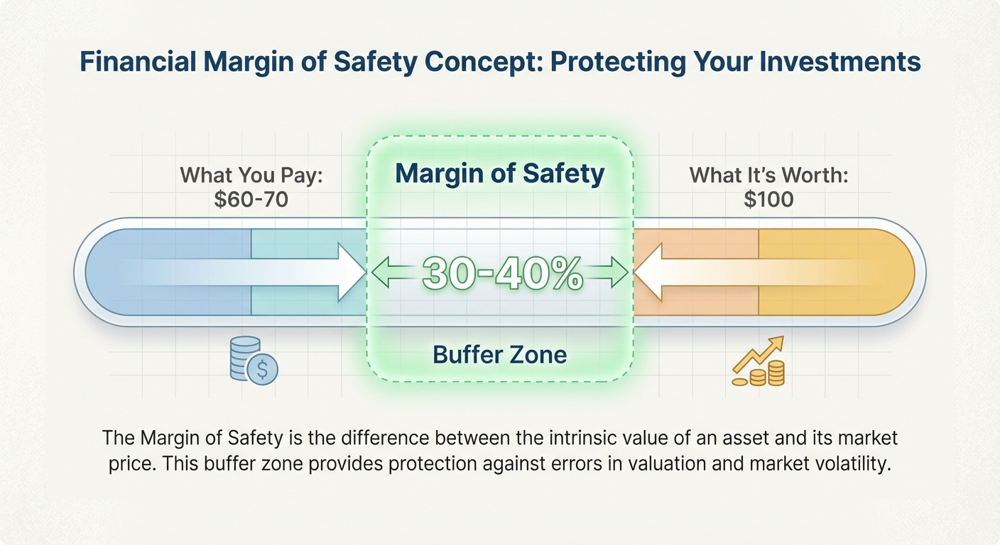

::: {.callout-note appearance="simple"}
## TL;DR

- **Margin of safety** = buying things for less than they're worth
- Buffett: "We defined value investing as buying dollars for fifty cents"
- This buffer protects against mistakes, bad luck, and surprises
- If you're right about the value, you make money. If you're wrong, the margin might save you.
:::

## The Bridge Analogy

Imagine you're an engineer building a bridge.

You calculate that the bridge needs to hold 10,000 pounds. Do you:
- A) Build it to hold exactly 10,000 pounds, or
- B) Build it to hold 30,000 pounds?

Obviously B. Because your calculations might be wrong. Because weather, wear, and unexpected heavy loads happen. Because margins save lives.

Buffett applies the same logic to investing:

> "When you build a bridge, you insist it can carry 30,000 pounds, but you only drive 10,000 pound trucks across it. And that same principle works in investing."

If you think a stock is worth $100, you don't buy it at $95. You buy it at $60 or $70 — leaving a big buffer for error.

{#fig-margin}

## The Cornerstone Principle

In his 1992 letter, Buffett was explicit:

> "We insist on a margin of safety in our purchase price. If we calculate the value of a common stock to be only slightly higher than its price, we're not interested in buying. We believe this margin-of-safety principle... **to be the cornerstone of investment success.**"

"Cornerstone." The foundation everything else rests on.

This idea came from his mentor Benjamin Graham, who summarized value investing in three words: **margin of safety**.

Buffett later put it simply: value investing means "buying dollars for fifty cents."

## What the Margin Protects Against

### 1. Your Mistakes

You estimated the business is worth $100 per share. But what if you're wrong?

Maybe you overestimated future growth. Maybe you missed a competitive threat. Maybe the industry is changing faster than you thought.

If you paid $95, you're underwater with any error.
If you paid $60, you can be wrong by 30% and still break even.

### 2. Bad Luck

Even perfect analysis can't predict everything:
- Economic recessions happen
- Key executives leave unexpectedly
- New competitors emerge from nowhere
- Regulations change

The margin of safety absorbs these shocks.

### 3. Things You Don't Know

The most dangerous risks are the ones you haven't thought of.

By paying well below estimated value, you're implicitly protected against unknown unknowns. You don't need to list every possible disaster — the buffer covers them all.

## How Much Margin Do You Need?

It depends on how confident you are.

| Situation | Margin Needed |
|-----------|---------------|
| Business you deeply understand, stable and predictable | 25-30% |
| Good business with some uncertainty | 35-50% |
| More uncertain or cyclical | 50%+ |

The less certain you are about the value, the more margin you need.

::: {.callout-tip appearance="simple"}
## The Washington Post Example

In 1973, Buffett bought Washington Post stock when:
- Market value: $80 million
- Estimated true value: $400-500 million

That's a 75-80% margin of safety.

Even if Buffett's estimate was off by 50%, he still got a huge bargain. That's what a screaming margin looks like.
:::

## Buffett's Evolution: Moats as Margin

Here's a subtle but important point.

Graham, Buffett's mentor, focused on **price** as the margin of safety. Buy cheap enough and you're protected.

Buffett evolved the concept:

> "If you understood a business perfectly — the future of a business — you would need very little in the way of a margin of safety."

In other words: if a business has a strong moat (see [Part 5](../5-moats/)) and you really understand it, the predictability itself provides protection.

This is why Buffett pays more for great businesses. See's Candies, Coca-Cola, and Apple weren't "cheap" by Graham's standards. But their durability provided its own margin of safety.

**Two sources of margin:**
1. **Price discount** — Paying far less than estimated value
2. **Business quality** — Owning something so durable that surprises are unlikely

The best investments have both.

## Putting It Into Practice

### Step 1: Estimate the Value

Using the techniques from earlier posts, figure out what you think the business is worth.

### Step 2: Determine Your Required Margin

How confident are you? How stable is the business? Pick a margin that matches your uncertainty.

### Step 3: Calculate Your Maximum Price

If you estimate value at $100 and require 30% margin:

**Max Price = $100 × (1 - 0.30) = $70**

Don't pay more than $70.

### Step 4: Wait

The stock might never reach your target. That's okay. Move on to other opportunities.

The margin of safety isn't just math. It's discipline.

## Common Mistakes

::: {.callout-warning appearance="simple"}
## Mistake #1: "It's Cheap Because the Stock Dropped"

A stock falling 40% isn't automatically a margin of safety.

Maybe it dropped because the business is genuinely worse. Maybe the original price was too high.

Margin of safety means: price is below **intrinsic value**. Not just below yesterday's price.
:::

::: {.callout-warning appearance="simple"}
## Mistake #2: Using Too Small a Margin

A 5% discount isn't a margin of safety. It's noise.

Small estimation errors could wipe it out. If you're not getting at least 25-30% off, the buffer probably isn't real.
:::

::: {.callout-warning appearance="simple"}
## Mistake #3: Forgetting the Margin Over Time

You bought at a 40% margin. The stock rises to your estimated value. Now there's no margin left.

Consider: Is this still a wonderful business that will keep compounding? Or should you take profits and wait for the next opportunity?
:::

## The Bottom Line

Margin of safety means buying things for less than they're worth — "buying dollars for fifty cents."

This buffer protects against your mistakes, bad luck, and things you haven't thought of.

The required margin depends on your confidence. More uncertainty = larger margin needed.

The best investments combine price margin (paying far below value) with quality margin (owning something durable and predictable).

::: {.callout-note appearance="simple"}
## Summary

Margin of safety is the cornerstone of successful investing. It means paying significantly less than your estimate of intrinsic value.

Like an engineer building a bridge stronger than needed, you build in a buffer for error.

The margin protects against your own mistakes, unexpected events, and unknown unknowns.

**Next up**: [Part 9 — When to Walk Away](../9-when-to-pass/). Sometimes the best investment decision is to do nothing. Here's why patience is Buffett's secret weapon.
:::

## References

1. Buffett, W. (1992). [Berkshire Hathaway Shareholder Letter](https://www.berkshirehathaway.com/letters/1992.html). Berkshire Hathaway Inc.

2. Graham, B. (1949). *The Intelligent Investor*. Harper & Brothers.

3. Buffett, W. (1984). "The Superinvestors of Graham-and-Doddsville." Columbia Business School Magazine.
