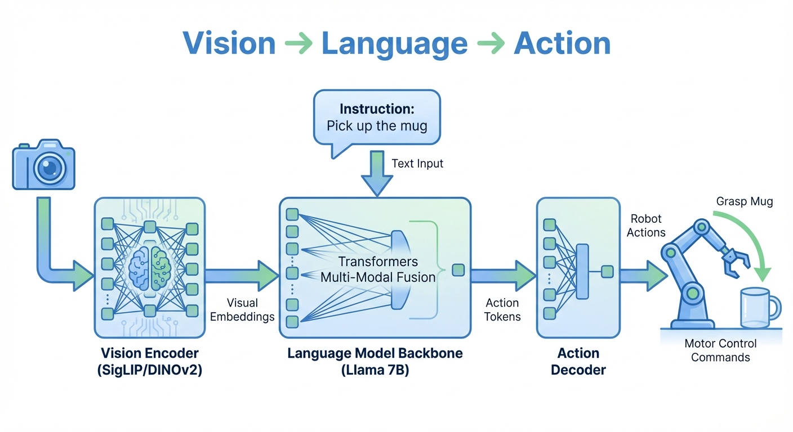

::: {.callout-note appearance="simple"}
## TL;DR

- **Robot learning** is rapidly evolving with diffusion models and foundation models
- **Vision-Language-Action (VLA)** models unify perception, language, and control
- **Diffusion Policy** brings the power of diffusion models to robot action generation
- This series documents my journey from diffusion models into robotics research
:::

## Why Robot Learning Matters Now

After spending time understanding [diffusion models and flow matching](../../diffusion/1-intro/), I realized these same techniques are revolutionizing robotics. The same principles that generate photorealistic images from noise can generate precise robot actions from observations — and the field is moving remarkably fast.

What makes this moment particularly exciting? For decades, robots excelled at repetitive factory tasks but struggled with everyday manipulation — folding laundry, cooking meals, clearing tables. That's changing. Recent breakthroughs in Vision-Language-Action (VLA) models are enabling robots to understand natural language instructions, perceive complex scenes, and execute dexterous manipulation tasks that seemed impossible just a few years ago.

This series documents my journey into robot learning, starting from the foundations and working toward understanding these cutting-edge VLA models.

## Series Overview (Planned)

| Part | Topic | Status |
|------|-------|--------|
| **Part 0** | Introduction & Roadmap (this post) | Published |
| **Part 1** | [Background & Current State of the Field](../1-background/) | Published |
| **Part 2** | [Diffusion Policy: From Images to Actions](../1-diffusion-policy/) | Draft |
| **Part 3** | Vision-Language-Action Models | Planned |
| **Part 4** | Simulation Environments (MuJoCo, Isaac) | Planned |
| **Part 5** | Training with LeRobot | Planned |
| **Part 6** | Real-World Deployment | Planned |

## The Big Picture: From Images to Actions

Here's the core idea that connects image generation to robot control: **the same denoising process that creates images can generate robot actions**.

### How VLA Models Work

Vision-Language-Action models integrate three capabilities into a unified system:

{#fig-vla-pipeline}

As shown in @fig-vla-pipeline, the pipeline flows as follows:

1. **Vision Encoder**: Processes camera images into visual embeddings (using models like SigLIP or DINOv2)
2. **Language Model Backbone**: Combines visual embeddings with natural language instructions (e.g., Llama 7B)
3. **Action Decoder**: Translates the model's output into executable robot commands

This architecture enables robots to understand both *what they see* and *what they're asked to do*, then generate appropriate actions — all in one end-to-end system.

### The Diffusion Analogy

Think of a painter creating a portrait. They don't paint pixel-perfect details immediately — they start with rough outlines, gradually refining through many small adjustments until the final image emerges. Diffusion models work similarly: starting from pure noise, they iteratively remove noise through learned denoising steps until a coherent image appears.

**Diffusion Policy** applies this exact principle to robotics:

| Image Diffusion | Action Diffusion |
|-----------------|------------------|
| Random pixels → Photorealistic image | Random actions → Precise trajectory |
| Conditioned on text prompt | Conditioned on visual observation |
| Iterative denoising | Iterative action refinement |
| Handles multiple valid images | Handles multiple valid action sequences |

### Why This Matters: The Multimodality Problem

Consider a robot picking up a mug. A human might grasp the handle from the left, from the right, or grab the body directly — all equally valid. Traditional methods (like simple supervised learning) average these strategies together, producing an invalid "middle" action where the robot reaches between all options and grasps nothing.

Diffusion models elegantly solve this. Just as they can generate many different images from the same text prompt, they can generate different action strategies from the same observation. Each denoising process starts from random noise, naturally exploring different modes of the action distribution without collapsing to a useless average.

**The result**: Diffusion Policy achieves an average **46.9% improvement** over prior methods across manipulation benchmarks.$^{[1]}$

## Learning Roadmap

### Phase 1: Foundational Papers

Start with these to build core understanding:

| Paper | Why Read It | Link |
|-------|-------------|------|
| **Diffusion Policy** (Chi et al., 2023) | THE foundational paper connecting diffusion to robot control | [Project Page](https://diffusion-policy.cs.columbia.edu/) / [arXiv](https://arxiv.org/abs/2303.04137) |
| **Octo** (2024) | Open-source 93M param generalist policy, good baseline | [arXiv](https://arxiv.org/abs/2405.12213) |
| **OpenVLA** (2024) | Open-source 7B VLA, outperforms RT-2-X with 7x fewer params | [arXiv](https://arxiv.org/abs/2406.09246) |

### Phase 2: Core VLA Models

| Paper | Key Contribution |
|-------|------------------|
| **RT-2** (Google DeepMind, 2023) | First major VLA — co-trained VLM on robot trajectories |
| **π0 (Pi-Zero)** (Physical Intelligence, 2024) | Flow-matching for 50Hz continuous actions, 8 embodiments |
| **3D Diffusion Policy** (RSS 2024) | Extends diffusion policy to 3D representations |

### Phase 3: Cutting Edge (2025)

| Paper | Notes |
|-------|-------|
| **GR00T N1** (NVIDIA, March 2025) | Dual-system VLA for humanoids |
| **Helix** (Figure AI, Feb 2025) | First VLA controlling full humanoid upper body |
| **SmolVLA** (Hugging Face, 2025) | 450M param compact VLA, trained on LeRobot |
| **FLOWER** (CoRL 2025) | Efficient VLA with diffusion head, 950M params |

### Survey Papers

For comprehensive overviews:

- [Diffusion Models for Robotic Manipulation: A Survey](https://www.frontiersin.org/journals/robotics-and-ai/articles/10.3389/frobt.2025.1606247/full) (Frontiers, July 2025)
- [Foundation Models in Robotics](https://journals.sagepub.com/doi/full/10.1177/02783649241281508) (IJRR 2024/2025)
- [VLA Survey](https://vla-survey.github.io/) — comprehensive VLA review

### Curated Paper Lists

- [mbreuss/diffusion-literature-for-robotics](https://github.com/mbreuss/diffusion-literature-for-robotics) — categorized diffusion + robotics papers
- [Awesome-Robotics-Foundation-Models](https://github.com/robotics-survey/Awesome-Robotics-Foundation-Models)
- [HITSZ-Robotics/DiffusionPolicy-Robotics](https://github.com/HITSZ-Robotics/DiffusionPolicy-Robotics)

## Tools & Frameworks

### Simulation Environments

| Tool | Best For | Tradeoffs |
|------|----------|-----------|
| **MuJoCo** | RL research, fast iteration | Most popular (3800+ citations), steep learning curve |
| **Isaac Lab/Sim** (NVIDIA) | Massive parallel training (1000s of envs) | Requires GPU, slower single-instance |
| **PyBullet** | Beginners, prototyping | Easy to start, less accurate |
| **Gazebo** | Real-world transfer + ROS | Best ROS integration |

**Recommendation**: Start with **MuJoCo** for algorithm development. Use **Isaac Lab** when you need scale.

### Training Frameworks

#### LeRobot (Hugging Face) — Start Here

The most accessible entry point for robot learning research:

- **GitHub**: [huggingface/lerobot](https://github.com/huggingface/lerobot)
- **Free Course**: [Hugging Face Robotics Course](https://huggingface.co/learn/robotics-course/unit0/1)
- **Tutorial**: [Robot Learning Tutorial](https://huggingface.co/spaces/lerobot/robot-learning-tutorial)

LeRobot v0.4.0 includes π0, π0.5, GR00T N1.5 policies, and LIBERO/Meta-World simulation support.

#### Other Tools

- **robomimic** — imitation learning library
- **RLlib / Stable-Baselines3** — RL algorithms
- **RLDS** — Google's robot learning dataset format

### Benchmarks

| Benchmark | Tasks | Notes |
|-----------|-------|-------|
| **CALVIN** | 34 (language-conditioned) | Long-horizon, 24hrs play data |
| **LIBERO** | 130+ | Lifelong learning focus |
| **RLBench** | 100 | Largest variety, motion planning demos |
| **SimplerEnv** | Google RT tasks | Simulated version of real robot tasks |

::: {.callout-warning}
## Benchmark Caveat
[LIBERO-PRO](https://arxiv.org/abs/2510.03827) (2025) showed that many SOTA models with 90%+ accuracy largely rely on task memorization rather than genuine understanding. Keep this in mind when evaluating results.
:::

## Hardware Options

For real-world experiments (optional but valuable):

| Hardware | Cost | Notes |
|----------|------|-------|
| **SO-101** | ~$660 | [GitHub](https://github.com/TheRobotStudio/SO-ARM100), LeRobot compatible |
| **Koch v1.1** | ~$500 | Good for education |
| **AhaRobot** | ~$1,000 | Dual-arm mobile, open-source |
| **ALOHA 2** | ~$20k | Bimanual teleoperation, [project page](https://aloha-2.github.io/) |

## My Learning Plan

Here's my personal roadmap:

1. **Week 1-2**: Read Diffusion Policy paper thoroughly, run their code
2. **Week 2-4**: Complete [LeRobot tutorial](https://huggingface.co/spaces/lerobot/robot-learning-tutorial) and [HF Robotics Course](https://huggingface.co/learn/robotics-course/unit0/1)
3. **Month 2**: Train policies on LIBERO/CALVIN in simulation
4. **Month 3+**: Pick a research direction (3D representations, efficiency, real-world transfer)
5. **Optional**: Build an SO-101 arm (~$660) for real-world experiments

## Key Concepts Preview

Before diving into papers, here are the core concepts you'll encounter:

### Behavioral Cloning (BC)
Learning actions directly from expert demonstrations via supervised learning. Simple but struggles with distribution shift.

### Diffusion Policy
Represents robot policy as a conditional denoising diffusion process. Handles multimodal action distributions gracefully.

### Vision-Language-Action (VLA) Models
End-to-end models that take images + language instructions and output robot actions. Built on pretrained VLMs.

### Flow Matching in Robotics
π0 uses flow matching instead of diffusion for faster inference (50Hz continuous actions).

### Sim-to-Real Transfer
Training in simulation and deploying on real robots. Domain randomization and system identification are key techniques.

## What's Next?

In Part 1, we'll dive deep into **Diffusion Policy** — understanding exactly how diffusion models are adapted for robot control, the key design choices (action chunking, receding horizon), and why it outperforms prior methods.

::: {.callout-note appearance="simple"}
## Summary

Robot learning is at an exciting inflection point. The convergence of three trends makes this the right time to dive in:

1. **Algorithmic breakthroughs**: Diffusion models and flow matching provide expressive policies that handle real-world complexity
2. **Foundation models**: Vision-Language-Action models leverage pretrained VLMs, dramatically reducing training data requirements
3. **Accessible tools**: Open frameworks (LeRobot), simulation (MuJoCo, Isaac), and affordable hardware (SO-101) lower the barrier to entry

The field has matured from laboratory demos to practical systems. Physical Intelligence's π0 controls 8 different robot embodiments. Figure AI's humanoids perform household tasks. OpenVLA provides an open-source 7B parameter model anyone can fine-tune.

This series will take you from the fundamentals (why learning-based approaches? why diffusion?) through the mathematics and implementation details, eventually reaching cutting-edge VLA models. Whether you're an ML engineer wanting practical insights, a researcher seeking intuition, or a curious developer exploring the field — there's a path for you here.

**Next up**: In [Part 1](../1-background/), we'll build the conceptual foundation by understanding why classical robotics struggles, what makes reinforcement learning impractical for real robots, and why multimodal action distributions require expressive generative models.
:::

## References

[1] [Chi, C., et al. "Diffusion Policy: Visuomotor Policy Learning via Action Diffusion."](https://arxiv.org/abs/2303.04137) *RSS*, 2023.

### Recommended Starting Points

- [LeRobot Documentation](https://github.com/huggingface/lerobot) — Open-source robot learning framework
- [Hugging Face Robotics Course](https://huggingface.co/learn/robotics-course/) — Free, hands-on tutorials
- [Robot Learning: A Tutorial (Capuano et al.)](https://arxiv.org/abs/2510.12403) — Comprehensive survey with code
