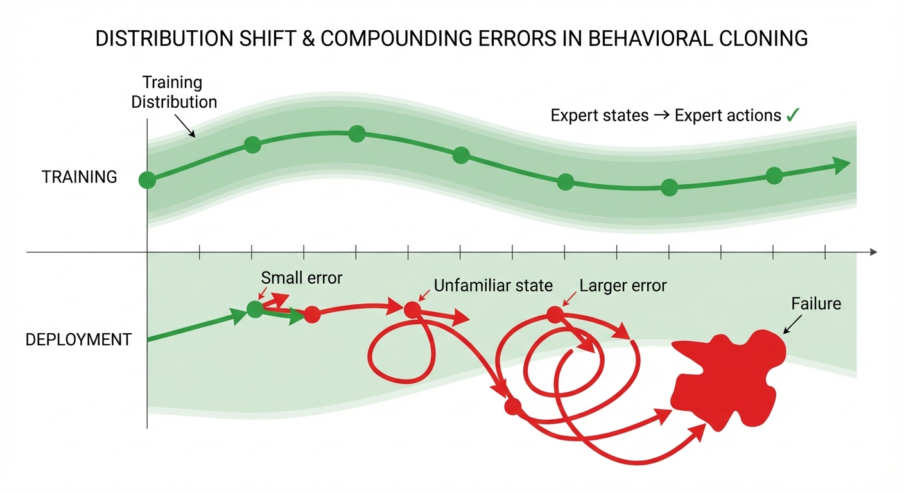
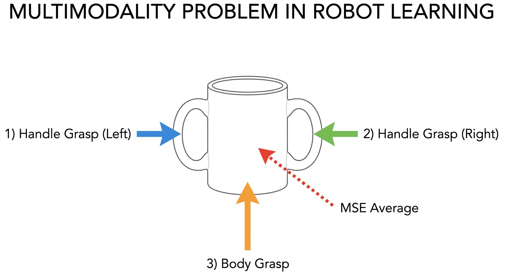

::: {.callout-note appearance="simple"}
## TL;DR

- **Classical robotics** relies on hand-crafted dynamics models — works for factories, fails for kitchens
- **Reinforcement Learning (RL)** learns from rewards but needs millions of trials — impractical for real robots
- **Behavioral Cloning (BC)** learns from demonstrations via supervised learning — the foundation of modern robot learning
- **Multimodality** (multiple valid solutions) breaks naive BC; expressive models like diffusion handle it well
- This post builds the conceptual foundation for understanding Diffusion Policy in [Part 2](../1-diffusion-policy/)
:::

## Why This Post? {#sec-why}

In [Part 0](../0-intro/), we surveyed the robot learning landscape. Before diving into Diffusion Policy, we need to understand the problems it solves. This post answers three questions:

1. **Why learning?** What's wrong with classical robotics?
2. **Why not RL?** What makes reinforcement learning hard for real robots?
3. **Why diffusion?** What problem does it solve that simpler approaches can't?

The structure follows the excellent [Robot Learning: A Tutorial](https://arxiv.org/abs/2510.12403)$^{[1]}$ by Capuano et al., which covers these topics with hands-on LeRobot code.

## Classical Robotics: Why We Need Learning {#sec-classical}

### The Traditional Approach

For decades, robotics has relied on **explicit dynamics models**. The idea: if we know how the robot and environment behave, we can compute the right actions analytically.

Mathematically, we model the system as a differential equation. The state $x$ (robot joint positions, object locations, etc.) evolves according to:

$$
\dot{x} = f(x, u)
$$ {#eq-dynamics}

where $u$ is the control input (motor torques, joint velocities) and $f$ is a *known* function describing the physics. Given this model, we have powerful tools:

- **Motion planning** — find collision-free paths to the goal
- **Trajectory optimization** — compute optimal control sequences
- **Feedback control** — stabilize using PID, LQR, or MPC

This works beautifully for **structured environments**: industrial arms on assembly lines (known geometry), drones following GPS waypoints (simple dynamics), or self-driving on HD-mapped highways.

### Where Classical Methods Fail {#sec-classical-limits}

But consider these tasks:

- **Folding laundry** — deformable objects with infinite configurations
- **Cooking in a home kitchen** — unstructured layouts, variable ingredients
- **Manipulating novel objects** — no pre-built model exists

The problem is **modeling complexity**. Writing down $f(x, u)$ in @eq-dynamics for cloth dynamics involves partial differential equations with unknown material properties. Contact-rich manipulation requires modeling friction, deformation, and object geometry — which vary across objects. Even if we could write these models, they wouldn't generalize.

::: {.callout-important}
## The Core Insight

Instead of hand-engineering dynamics models that won't generalize, **learn the mapping from observations to actions directly from data**.

This is the paradigm shift that enables robots to operate in unstructured, real-world environments.
:::

## Reinforcement Learning: The Theory {#sec-rl}

If we're going to learn, how? The natural framework is **Reinforcement Learning (RL)** — learning from trial and error.

### The MDP Framework {#sec-mdp}

Robot learning is formalized as a **Markov Decision Process (MDP)**, which captures the essential structure of sequential decision-making:

::: {.callout-note appearance="simple"}
## Definition: Markov Decision Process

An MDP is defined by the tuple $(\mathcal{S}, \mathcal{A}, p, r, \gamma)$:

- **State** $s_t \in \mathcal{S}$ — everything relevant about the robot and environment
- **Action** $a_t \in \mathcal{A}$ — motor commands, joint velocities, gripper controls
- **Transition** $p(s_{t+1} | s_t, a_t)$ — probability of next state given current state and action
- **Reward** $r(s_t, a_t) \in \mathbb{R}$ — scalar feedback signal for task success
- **Discount** $\gamma \in [0, 1]$ — how much to value future vs. immediate rewards
:::

A **policy** $\pi(a_t | s_t)$ maps states to actions (possibly stochastically). The RL objective is to find the policy that maximizes expected cumulative discounted reward:

$$
\pi^* = \arg\max_\pi \mathbb{E}_{\pi}\left[ \sum_{t=0}^{T} \gamma^t r(s_t, a_t) \right]
$$ {#eq-rl-objective}

In words: find the action-selection strategy that collects the most reward over time.

### Why RL is Hard for Real Robots {#sec-rl-challenges}

RL has achieved remarkable results — mastering Atari games$^{[2]}$, defeating world champions at Go$^{[3]}$, and training simulated humanoids to walk. But these successes share a common thread: **cheap, fast simulation**. For real robots, RL faces fundamental challenges:

| Challenge | Why It's Hard |
|-----------|---------------|
| **Sample inefficiency** | RL algorithms often need millions of environment interactions. Real robots can't run 24/7 for months. |
| **Reward specification** | What's the reward for "fold the shirt nicely"? Designing rewards that capture human intent is notoriously difficult.$^{[4]}$ |
| **Safety** | Random exploration can damage the robot, break objects, or harm humans nearby. |
| **Sim-to-real gap** | Policies trained in simulation often fail on real hardware due to modeling errors.$^{[5]}$ |

::: {.callout-tip appearance="simple"}
## Intuition: The Scale Problem

Training a simulated humanoid to walk takes approximately 10 billion environment steps.$^{[6]}$ At real-time (1 step per 0.01s), that's roughly **3,000 years** of continuous robot operation. Even with 100 robots running in parallel, we'd need 30 years.
:::

Research has made progress on each challenge — sample-efficient algorithms (SAC, TD3), offline RL, sim-to-real transfer with domain randomization — but contact-rich manipulation remains difficult. This motivates a different approach.

## Imitation Learning: Learning from Demonstrations {#sec-imitation}

What if we skip the reward function entirely and learn directly from expert demonstrations?

### Behavioral Cloning {#sec-bc}

**Behavioral Cloning (BC)** is the simplest form of imitation learning: treat it as supervised learning.

Given a dataset of expert demonstrations — state-action pairs collected from a human teleoperating the robot:

$$
\mathcal{D} = \{(s_1, a_1), (s_2, a_2), \ldots, (s_N, a_N)\}
$$ {#eq-demo-dataset}

We train a neural network policy $\pi_\theta$ to predict the expert's action given the state. The loss is simply mean squared error:

$$
\mathcal{L}(\theta) = \mathbb{E}_{(s,a) \sim \mathcal{D}} \left[ \| \pi_\theta(s) - a \|^2 \right]
$$ {#eq-bc-loss}

That's it. Standard supervised learning — no reward function, no environment interaction during training, no exploration.

### Why BC Works for Robotics {#sec-bc-advantages}

| Advantage | Explanation |
|-----------|-------------|
| **Data efficient** | Hundreds of demonstrations, not millions of trials |
| **No reward design** | Demonstrations *implicitly* encode the task objective |
| **Safe data collection** | Human teleoperates; robot never explores randomly |
| **Works with real hardware** | Collect demos on the real robot, train offline |

This explains BC's popularity: it lets us leverage human expertise directly, avoiding RL's sample efficiency and reward design problems.

### The Distribution Shift Problem {#sec-distribution-shift}

BC has a fundamental issue that limited its effectiveness for years: **compounding errors** due to distribution shift.$^{[7]}$

Here's the problem. During training, the policy sees states from the expert's trajectory — the states a skilled human visits while performing the task. During deployment, the robot executes its *own* policy, which makes small mistakes. These mistakes push the robot into states the expert never visited. The policy was never trained on these states, so it makes worse predictions, leading to worse states, and so on:

{#fig-distribution-shift}

::: {.callout-warning}
## The Quadratic Error Bound

Ross et al.$^{[7]}$ proved that BC's error grows **quadratically** with the task horizon $T$. If the policy makes error $\varepsilon$ per step, the total error scales as $O(T^2 \varepsilon)$, not $O(T\varepsilon)$ as you might hope. For long-horizon tasks, this is catastrophic.
:::

**Solutions** to distribution shift include:

1. **DAgger**$^{[7]}$ — iteratively collect more demonstrations in states the learned policy visits
2. **Action chunking** — predict sequences of actions, reducing the number of decision points
3. **Expressive policy classes** — handle multimodal action distributions (more on this next)

## The Multimodality Problem {#sec-multimodality}

Distribution shift isn't the only issue. Even with perfect training data coverage, naive BC fails on a surprisingly common class of problems.

### Why Averaging Fails {#sec-averaging}

Consider picking up a mug. A human might:

- Grasp the handle from the left
- Grasp the handle from the right
- Grasp the body with a power grip
- Pinch the rim

All are valid. If your demonstration dataset contains examples of all these strategies, what happens when you train with MSE loss?

The network learns to predict the **average** action — reaching for somewhere *between* all the options, which corresponds to **none of them**. The robot might reach toward the center of the mug and miss everything.

{#fig-multimodality}

::: {.callout-warning}
## Common Misconception: "Just Collect Consistent Data"

A natural reaction is "just have demonstrators use the same strategy." But multimodality is unavoidable in real-world manipulation. Even the same person grasping the same mug will vary their approach based on subtle factors (arm position, comfort, habit). Eliminating multimodality requires unrealistic constraints on data collection.
:::

### From Deterministic to Probabilistic Policies {#sec-policy-representations}

The solution is to represent the policy as a **probability distribution** over actions, not a single prediction. Different architectures handle multimodality with varying success:

| Representation | Handles Multimodality? | Notes |
|----------------|------------------------|-------|
| **MLP + MSE loss** | No | Averages modes together |
| **Gaussian policy** | Poorly | Can only model one "bump" |
| **Mixture of Gaussians** | Somewhat | Fixed number of modes, must choose in advance |
| **VAE**$^{[8]}$ | Better | Latent space can capture structure |
| **Diffusion models**$^{[9]}$ | Excellent | Learns arbitrary distributions |

This is why Diffusion Policy$^{[9]}$ works so well — diffusion models are *designed* to learn complex, multimodal distributions. They represent the entire action distribution, not just its mean.

## Generative Models: A Preview {#sec-generative}

Before diving into Diffusion Policy in [Part 2](../1-diffusion-policy/), let's preview the generative modeling approaches used in robot learning.

### Variational Autoencoders (VAE)

VAEs learn a compressed **latent space** that captures the structure of the data:

- **Encoder** $q_\phi(z | x)$: compress observation $x$ to latent code $z$
- **Decoder** $p_\theta(x | z)$: reconstruct observation from latent
- **Sampling**: draw $z \sim \mathcal{N}(0, I)$, then decode to generate new data

**In robotics**: ACT (Action Chunking with Transformers)$^{[8]}$ uses a conditional VAE to generate action sequences. The latent variable captures *which* strategy to use (left grasp vs. right grasp), while the decoder generates the full action trajectory for that strategy.

### Diffusion Models

Diffusion models learn to reverse a noise-adding process:

1. **Forward process**: Gradually add Gaussian noise to data until it becomes pure noise
2. **Reverse process**: Train a neural network to denoise step-by-step
3. **Sampling**: Start from noise, iteratively denoise to generate a sample

**In robotics**: Diffusion Policy$^{[9]}$ generates action trajectories by denoising. Each "sample" from the diffusion model is a full action sequence.

### Flow Matching

Flow matching learns a direct, continuous transformation from noise to data:

$$
\frac{dx}{dt} = v_\theta(x, t)
$$ {#eq-flow-ode}

where $v_\theta$ is a learned velocity field. Simpler training than diffusion, often faster inference.

**In robotics**: π₀$^{[10]}$ uses flow matching to achieve 50Hz real-time control, enabling continuous, smooth actions rather than discrete action chunks.

## Prerequisites Summary {#sec-prerequisites}

Before proceeding to [Part 2: Diffusion Policy](../1-diffusion-policy/), ensure you're comfortable with:

### Mathematical Background

- **Probability**: expectations, conditional distributions, Bayes' rule, sampling
- **Neural networks**: loss functions, gradient descent, basic architectures (MLP, CNN, Transformer)
- **Control vocabulary**: state, action, policy, trajectory (the MDP formalism from @sec-mdp)

### Conceptual Understanding

- Why classical robotics struggles with unstructured tasks (@sec-classical-limits)
- The trade-offs between RL and imitation learning (@sec-rl-challenges vs. @sec-bc-advantages)
- Why multimodal action distributions break naive BC (@sec-multimodality)
- The basic idea behind generative models (@sec-generative)

### Recommended Resources

| Resource | Focus |
|----------|-------|
| [Robot Learning: A Tutorial](https://arxiv.org/abs/2510.12403)$^{[1]}$ | Comprehensive coverage with LeRobot code |
| [MIT Underactuated Robotics Ch. 21](https://underactuated.mit.edu/imitation.html) | Imitation learning theory |
| [Lilian Weng's Policy Gradient Post](https://lilianweng.github.io/posts/2018-04-08-policy-gradient/) | RL foundations |
| [What are Diffusion Models?](https://lilianweng.github.io/posts/2021-07-11-diffusion-models/) | Diffusion intuition |
| [LeRobot Tutorial](https://huggingface.co/spaces/lerobot/robot-learning-tutorial) | Hands-on practice |

## What's Next? {#sec-next}

With this foundation, we're ready for [Part 2: Diffusion Policy](../1-diffusion-policy/). We'll see how diffusion models elegantly solve the multimodality problem and why "generating actions like generating images" is such a powerful idea.

::: {.callout-note appearance="simple"}
## Summary

Classical robotics works when we can write down the dynamics — factory floors, not kitchens. RL learns without explicit models but demands millions of trials and carefully designed rewards, making it impractical for real robots learning contact-rich manipulation.

Imitation learning sidesteps these issues by learning directly from demonstrations, but faces two challenges: **distribution shift** (errors compound as the robot visits unfamiliar states) and **multimodality** (averaging over multiple valid strategies produces invalid actions).

The key insight: we need policy representations expressive enough to capture *distributions* over actions, not just point predictions. Diffusion models provide exactly this — which is why Diffusion Policy has become the foundation of modern robot learning. In Part 2, we'll see precisely how.
:::

## References

[1] [Capuano, F., Pascal, C., Zouitine, A., Wolf, T., & Aractingi, M. "Robot Learning: A Tutorial."](https://arxiv.org/abs/2510.12403) *arXiv:2510.12403*, 2025.

[2] [Mnih, V., et al. "Human-level control through deep reinforcement learning."](https://www.nature.com/articles/nature14236) *Nature*, 2015.

[3] [Silver, D., et al. "Mastering the game of Go with deep neural networks and tree search."](https://www.nature.com/articles/nature16961) *Nature*, 2016.

[4] [Hadfield-Menell, D., et al. "The Off-Switch Game."](https://arxiv.org/abs/1611.08219) *IJCAI*, 2017. (On reward misspecification)

[5] [Zhao, W., et al. "Sim-to-Real Transfer in Deep Reinforcement Learning for Robotics: A Survey."](https://arxiv.org/abs/2009.13303) *arXiv*, 2020.

[6] [Schulman, J., et al. "Proximal Policy Optimization Algorithms."](https://arxiv.org/abs/1707.06347) *arXiv*, 2017.

[7] [Ross, S., Gordon, G., & Bagnell, J. A. "A Reduction of Imitation Learning and Structured Prediction to No-Regret Online Learning."](https://arxiv.org/abs/1011.0686) *AISTATS*, 2011. (DAgger paper)

[8] [Zhao, T., et al. "Learning Fine-Grained Bimanual Manipulation with Low-Cost Hardware."](https://arxiv.org/abs/2304.13705) *RSS*, 2023. (ACT paper)

[9] [Chi, C., et al. "Diffusion Policy: Visuomotor Policy Learning via Action Diffusion."](https://arxiv.org/abs/2303.04137) *RSS*, 2023.

[10] [Black, K., et al. "π₀: A Vision-Language-Action Flow Model for General Robot Control."](https://arxiv.org/abs/2410.24164) *arXiv*, 2024.
