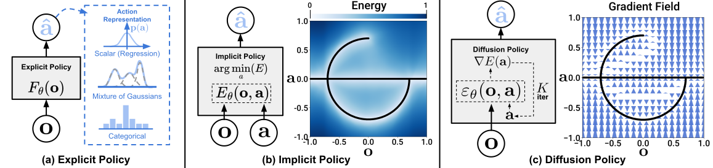
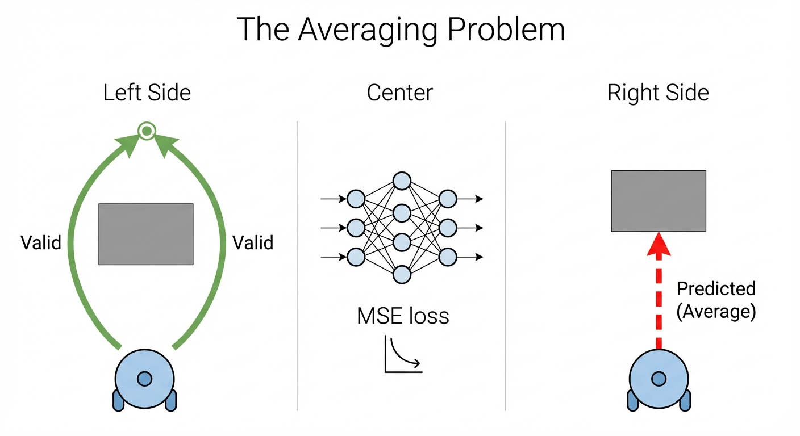
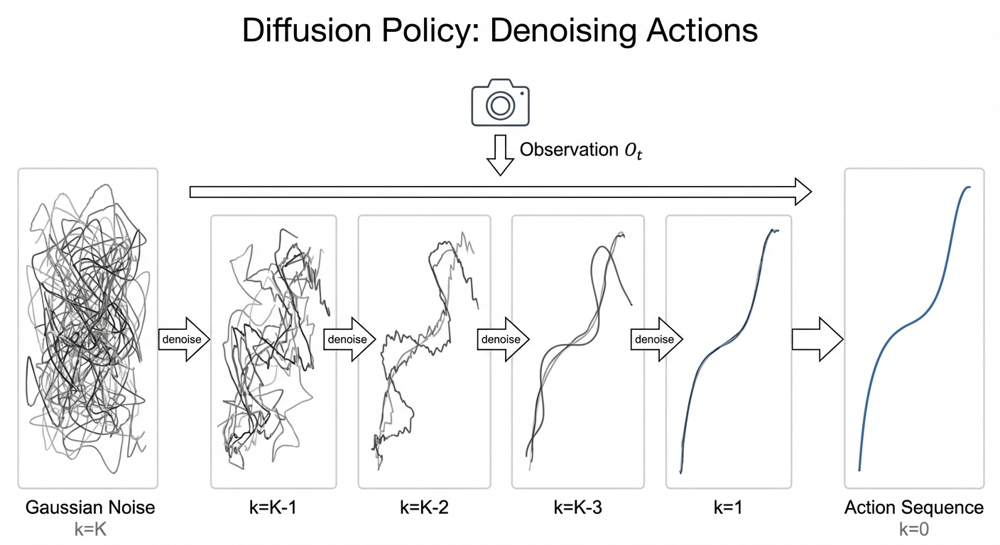
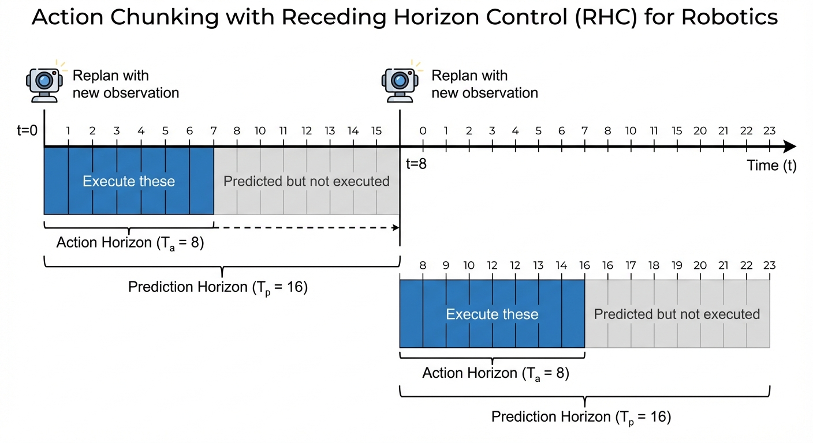
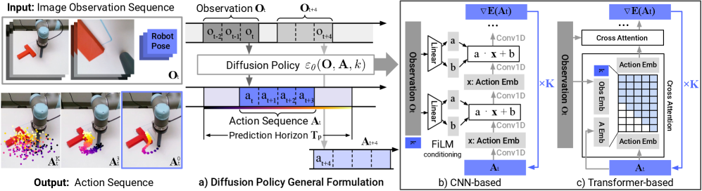
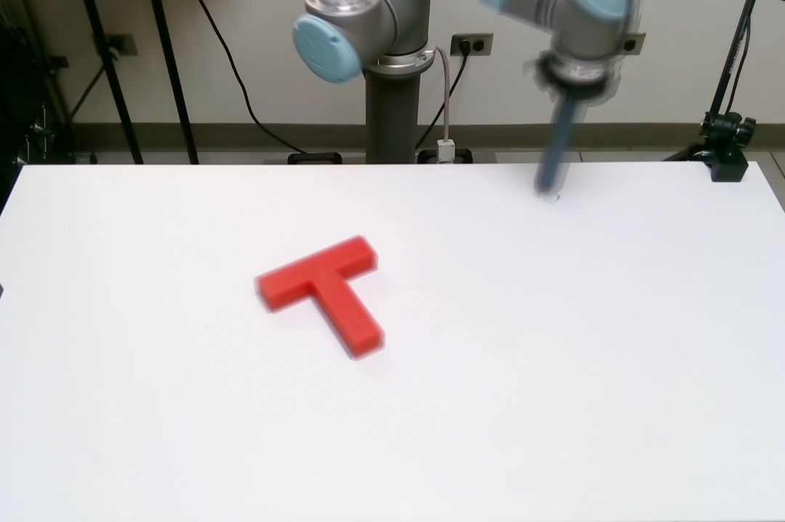
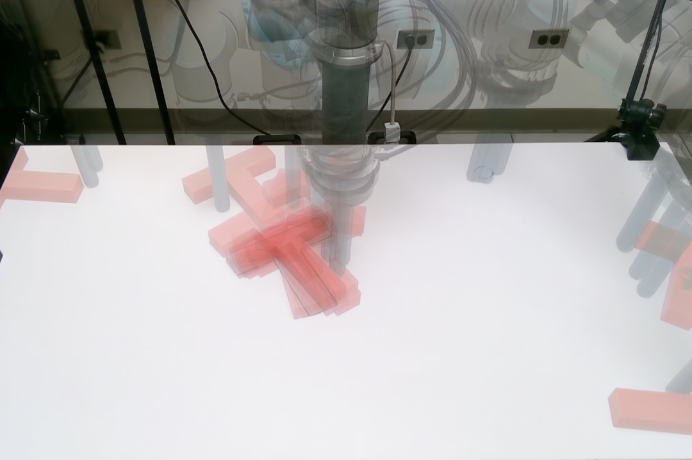
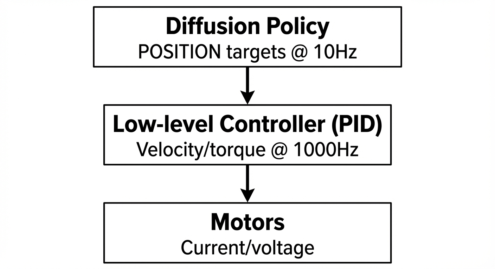
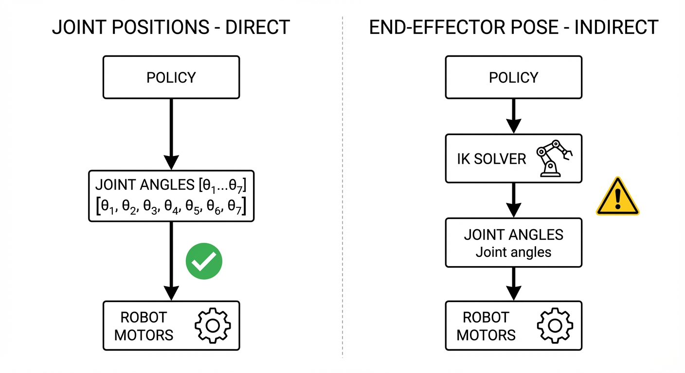

Train a robot to avoid an obstacle. Show it 100 demos going left, 100 going right. What does it learn?

It drives straight into the wall.

This isn't a bug. It's a fundamental flaw in how we've been teaching robots for decades. The neural network *averages* "go left" and "go right" into "go straight ahead" — directly into the obstacle.

In 2023, a single paper fixed this. **Diffusion Policy**$^{[1]}$ showed that the same technique generating Stable Diffusion images could teach robots to move — and outperformed everything before it by 46.9%.

{#fig-teaser}

::: {.callout-note appearance="simple"}
## TL;DR

**Diffusion Policy** (Chi et al., RSS 2023)$^{[1]}$ — 2,000+ citations, now the standard approach for robot learning.

- **Problem**: Behavioral cloning averages multiple valid actions → nonsense
- **Fix**: Generate actions like images — denoise from random noise
- **Result**: 46.9% improvement across 12 tasks
:::

## Explicit Policies (And Why They Fail) {#sec-explicit}

Your first instinct for robot learning is probably: "collect demos, train a neural net to predict actions." This is the **explicit policy** approach — direct regression from observations to actions:

$$
\pi_\theta(s) = \arg\min_\theta \mathbb{E}_{(s,a) \sim \mathcal{D}} \left[ \| \pi_\theta(s) - a \|^2 \right]
$$ {#eq-bc-loss}

Here $s$ is the **state** (what the robot observes), $a$ is the **action** (what it should do), and $\mathcal{D}$ is your dataset of expert demonstrations. Train a network $\pi_\theta$ to minimize the mean squared error between predicted and demonstrated actions. What could go wrong?

As it turns out, quite a lot.

## The Multimodality Problem {#sec-multimodality}

Consider a robot approaching an obstacle. In your demonstrations, sometimes the expert goes **left**, sometimes **right** — both are valid. What does a standard neural network trained with MSE loss learn?

{#fig-multimodal}

::: {#multimodal-problem .callout-warning appearance="default"}
## The Averaging Disaster

When demonstrations contain multiple valid actions for the same state, MSE loss produces the **average** of those actions. Going left and going right averages to going **straight ahead** — directly into the obstacle (@fig-multimodal).

This isn't a rare edge case. Multimodality appears everywhere in manipulation:

- **Short-horizon**: Approach an object from the left or right
- **Long-horizon**: Different orderings of subtasks (stack blocks A-B-C or C-B-A)
- **Grasping**: Multiple valid grasp poses for the same object
:::

The mathematical reason is fundamental: neural networks with continuous activations draw smooth curves through data. They cannot represent the **sharp discontinuity** between "go left" and "go right" — the decision boundary would need to be infinitely steep.$^{[2]}$

### What About Mixture Models?

You might think: "Use a Gaussian Mixture Model (GMM) to capture multiple modes!" Methods like LSTM-GMM try this, but face challenges:

- Must **pre-specify** the number of modes (how many valid actions exist?)
- Often **biased toward one mode** in practice
- Struggles with **high-dimensional** action spaces

These are still **explicit policies** — they output actions directly, just with a more flexible distribution.

### Implicit Policies

**Implicit policies** take a different approach: instead of outputting actions directly, they learn an **energy function** $E(s, a)$ over state-action pairs. Low energy = good action. This naturally represents multimodal distributions — multiple actions can have low energy.

Energy-based methods like Implicit BC (IBC)$^{[3]}$ can represent arbitrary distributions, but require **negative sampling** during training — notoriously unstable and prone to mode collapse.

## Enter Diffusion Policy

{#fig-policy-types}

Here's the key insight from Chi et al.$^{[1]}$: **diffusion models naturally represent multimodal distributions**. The same property that lets them generate diverse images lets them generate diverse robot actions.

::: {.callout-tip appearance="simple"}
## Intuition: From Images to Actions

In image generation, diffusion starts with noise and iteratively refines it into a coherent image. For robotics, we start with noise and refine it into a coherent **action sequence**:

| Image Diffusion | Action Diffusion |
|-----------------|------------------|
| Random pixels → Image | Random actions → Trajectory |
| Conditioned on text prompt | Conditioned on visual observation |
| Multiple valid images per prompt | Multiple valid trajectories per observation |
:::

The denoising process acts like **gradient descent on a learned energy landscape**. Different random initializations converge to different modes — the policy "commits" to one valid action sequence per rollout while learning the full multimodal distribution.

### Why Diffusion Handles Multimodality

Three mechanisms make this work:

1. **Stochastic initialization**: Each inference starts from random Gaussian noise, naturally exploring different modes

2. **Score function learning**: Instead of predicting actions directly, the network predicts the **gradient** of log-probability. This sidesteps the normalization constant that makes energy-based methods unstable

3. **Iterative refinement**: Langevin dynamics sampling follows the learned gradient field toward high-probability regions, allowing the model to express arbitrarily complex distributions

::: {.callout-note collapse="true"}
## What is Langevin Dynamics?

**Langevin dynamics** is a sampling algorithm that draws samples from a distribution using only its **score function** $\nabla \log p(x)$:

$$
x_{t+1} = x_t + \frac{\eta}{2} \nabla \log p(x_t) + \sqrt{\eta} \, \epsilon, \quad \epsilon \sim \mathcal{N}(0, I)
$$

**Intuition**: It's gradient ascent with noise.

- The gradient term $\nabla \log p(x)$ pushes toward high-probability regions
- The noise term $\sqrt{\eta} \epsilon$ prevents getting stuck and enables exploration of multiple modes

**Why it matters for diffusion**: The reverse diffusion process is essentially Langevin dynamics with a time-varying score. The SDE formulation from [Part 6](../../diffusion/6-score-functions/) of our diffusion series shows this connection:

$$
dX_t = \underbrace{u_t^{target}}_{\text{deterministic flow}} + \underbrace{\frac{\sigma_t^2}{2} \nabla \log p_t}_{\text{score correction}} \, dt + \sigma_t \, dW_t
$$

The score correction term is the Langevin-like component — it counteracts noise dispersion by pointing toward high-probability regions.
:::

Watch this in action — Diffusion Policy learns both modes and commits to one per episode:



*Diffusion Policy commits to one mode per rollout while learning multiple valid trajectories. Video from [Chi et al.](https://diffusion-policy.cs.columbia.edu/)$^{[1]}$*

Now let's see exactly how this works mathematically.

## The Diffusion Policy Formulation {#sec-formulation}

Understanding the math is essential for debugging, tuning, and extending the method. Let's make this precise. Given an observation $O_t$, we want to sample from the action distribution $p(A_t | O_t)$, where $A_t$ is a **sequence** of future actions (more on this shortly).

### Forward Process (Training)

During training, we gradually corrupt clean action sequences with noise. This teaches the network what noise "looks like" at each corruption level:

$$
A_t^k = \sqrt{\bar{\alpha}_k} \cdot A_t^0 + \sqrt{1 - \bar{\alpha}_k} \cdot \epsilon, \quad \epsilon \sim \mathcal{N}(0, I)
$$ {#eq-forward}

Here $A_t^0$ is the **clean action sequence** from demonstrations, $\epsilon$ is **random Gaussian noise**, $k$ indexes **diffusion timesteps** (not robot timesteps), and $\bar{\alpha}_k$ is a noise schedule controlling how much signal remains at step $k$.

::: {.callout-note appearance="simple" collapse="true"}
## Notation: DDPM (This Paper) vs Continuous Diffusion (Our Series)

This paper uses **DDPM** (Ho et al. 2020), which is a **discrete-time** formulation. Our [diffusion series](../../diffusion/5-diffusion-sde/) uses a **continuous-time SDE** formulation (Song et al. 2021), which came later and simplified many things.

| | DDPM (this paper, 2020) | Continuous SDE (our series, 2021+) |
|--|-------------------------|-------------------------------------|
| **Time** | Discrete: $k \in \{0, 1, ..., K\}$ | Continuous: $t \in [0, 1]$ |
| **Convention** | $k=0$ = data, $k=K$ = noise | $t=0$ = noise, $t=1$ = data |
| **Forward process** | Markov chain with noise schedule $\alpha_k, \beta_k$ | SDE: $dX_t = f_t dt + g_t dW_t$ |
| **Training** | Variational lower bound derivation | Direct score matching |
| **Noise schedule** | Must carefully design $\beta_1, ..., \beta_K$ | Simpler, often just linear |

**Why continuous simplifies things:**

1. **No complex schedules**: DDPM requires careful tuning of discrete $\beta_k$ values. Continuous formulation uses simpler schedules.
2. **Cleaner math**: Theorems become equalities instead of bounds. The loss is tight, not a lower bound.
3. **Flexible sampling**: Can use any number of steps at inference (10, 50, 100) without retraining.

**The formulas:**

| DDPM (discrete) | Continuous SDE (our series) |
|-----------------|------------------------------|
| $A^k = \sqrt{\bar{\alpha}_k} A^0 + \sqrt{1-\bar{\alpha}_k} \epsilon$ | $dX_t = u_t(X_t) dt + \sigma_t dW_t$ |
| Forward: add noise step-by-step | Forward: continuous noising process |
| Reverse: predict $\epsilon$, denoise | Reverse: follow score $\nabla \log p_t$ |

The connection: DDPM is a **discretization** of the continuous VP-SDE. See [Part 5](../../diffusion/5-diffusion-sde/) for the SDE derivation and [Part 6](../../diffusion/6-score-functions/) for score functions.
:::

### Reverse Process (Inference) 

At test time, we start from pure noise and iteratively denoise (@fig-denoising):

{#fig-denoising}

$$
A_t^{k-1} = \frac{1}{\sqrt{\alpha_k}} \left( A_t^k - \frac{1 - \alpha_k}{\sqrt{1 - \bar{\alpha}_k}} \epsilon_\theta(O_t, A_t^k, k) \right) + \sigma_k z
$$ {#eq-reverse}

Here $\epsilon_\theta$ is a neural network predicting the noise, $z \sim \mathcal{N}(0, I)$ is fresh noise for stochasticity, and $\alpha_k, \sigma_k$ are schedule parameters. See the derivation below for how this formula arises.

::: {.callout-note collapse="true"}
## Derivation: Where Does This Equation Come From?

**The goal**: We want to reverse the noising process. Given a noisy action, recover the clean one.

**The key idea**: If we knew what noise was added, we could subtract it out. We train a neural network to predict that noise.

**Variables** (refer back to these):

| Symbol | Meaning |
|--------|---------|
| $A^0$ | Clean action (what we want) |
| $A^k$ | Noisy action at diffusion step $k$ |
| $\epsilon$ | The actual noise that was added (unknown at inference) |
| $\epsilon_\theta$ | Network's **prediction** of the noise |
| $\bar{\alpha}_k$ | Cumulative noise schedule (how much signal remains at step $k$) |

**Step 1 — The forward process is a simple formula:**

From @eq-forward, we can write any noisy action as:
$$A^k = \underbrace{\sqrt{\bar{\alpha}_k}}_{\text{signal scaling}} \cdot A^0 + \underbrace{\sqrt{1-\bar{\alpha}_k}}_{\text{noise scaling}} \cdot \epsilon$$

This is just: (scaled clean action) + (scaled noise). No iterative steps needed.

**Step 2 — Rearrange to solve for the clean action:**

If we knew the noise $\epsilon$, we could solve for the clean action $A^0$:
$$A^0 = \frac{A^k - \sqrt{1-\bar{\alpha}_k} \cdot \epsilon}{\sqrt{\bar{\alpha}_k}}$$

Read this as: "subtract the scaled noise from the noisy action, then rescale."

**Step 3 — Train a network to predict the noise:**

We don't know the true noise $\epsilon$ at inference time. So we train a neural network $\epsilon_\theta$ to predict it from the noisy action and observation.

Substituting the network's prediction gives us an **estimate** of the clean action:
$$\hat{A}^0 = \frac{A^k - \sqrt{1-\bar{\alpha}_k} \cdot \epsilon_\theta(O, A^k, k)}{\sqrt{\bar{\alpha}_k}}$$

**Step 4 — Use the estimate to take a denoising step:**

We want $p(A^{k-1} | A^k)$ — the reverse step. Using Bayes and conditioning on $A^0$:

$$q(A^{k-1} | A^k, A^0) = \mathcal{N}(A^{k-1}; \tilde{\mu}_k, \tilde{\sigma}_k^2 I)$$

The posterior mean and variance work out to:
$$
\tilde{\mu}_k = \frac{\sqrt{\bar{\alpha}_{k-1}} \beta_k}{1-\bar{\alpha}_k} A^0 + \frac{\sqrt{\alpha_k}(1-\bar{\alpha}_{k-1})}{1-\bar{\alpha}_k} A^k
$$
$$
\tilde{\sigma}_k^2 = \frac{\beta_k (1-\bar{\alpha}_{k-1})}{1-\bar{\alpha}_k}
$$

where $\beta_k = 1 - \alpha_k$ (noise added at step $k$).

Now substitute our estimate $\hat{A}^0$ from Step 3. After simplification (grouping terms in $A^k$ and $\epsilon_\theta$), we get @eq-reverse:

$$
A^{k-1} = \frac{1}{\sqrt{\alpha_k}} \left( A^k - \frac{1-\alpha_k}{\sqrt{1-\bar{\alpha}_k}} \epsilon_\theta \right) + \sigma_k z
$$

The first term removes predicted noise; the second adds fresh noise for the next step.

**Connection to our diffusion series:**

In [Part 6](../../diffusion/6-score-functions/), we derived the conditional score function for a Gaussian. For DDPM's forward process $p_k(A^k | A^0) = \mathcal{N}(\sqrt{\bar{\alpha}_k} A^0, (1-\bar{\alpha}_k) I)$:

$$\nabla_{A^k} \log p_k(A^k | A^0) = -\frac{A^k - \sqrt{\bar{\alpha}_k} A^0}{1-\bar{\alpha}_k} = -\frac{\epsilon}{\sqrt{1-\bar{\alpha}_k}}$$

(The second equality uses the forward process: $A^k - \sqrt{\bar{\alpha}_k} A^0 = \sqrt{1-\bar{\alpha}_k} \epsilon$)

**Predicting noise is equivalent to predicting the score direction!** The network learns which way leads to valid actions.

In [Part 6](../../diffusion/6-score-functions/), we also showed the SDE extension trick — given an ODE with drift $u_t$, we can add noise while preserving the same probability path:
$$dX_t = \left[u_t^{target} + \frac{\sigma_t^2}{2} \nabla \log p_t\right] dt + \sigma_t dW_t$$

The score term $\frac{\sigma_t^2}{2} \nabla \log p_t$ corrects for noise dispersion, pointing samples toward high-probability regions. The DDPM reverse step is a discrete-time version of this principle.
:::

::: {.callout-tip appearance="simple"}
## Intuition: What the Network Learns

The network $\epsilon_\theta(O_t, A_t^k, k)$ learns to answer: "Given this noisy action sequence and this observation, what noise was added?"

Equivalently, it learns the **score function** — the gradient of log-probability pointing toward valid actions. The denoising process follows this gradient field from noise toward high-probability action sequences.
:::

### Training Objective

The training objective is beautifully simple. We add noise to expert actions, then train the network to predict what noise was added:

The loss is simply mean squared error between true and predicted noise:

$$
\mathcal{L}(\theta) = \mathbb{E}_{k, \epsilon, (A_t^0, O_t)} \left[ \| \epsilon - \epsilon_\theta(O_t, A_t^k, k) \|^2 \right]
$$ {#eq-loss}

This elegant formulation avoids the normalization constant entirely — we never need to compute $Z = \int \exp(-E(a)) da$.

So far, we've focused on *what* to predict. But there's another crucial design choice: predicting **sequences** of actions, not just single steps. This turns out to be just as important as the diffusion formulation itself.

## Action Chunking: Predicting Sequences {#sec-action-chunking}

A crucial design choice in Diffusion Policy is predicting **sequences** of future actions rather than single-step actions. This is called **action chunking**, and it solves several problems at once.

### The Compounding Error Problem

In standard closed-loop control, errors compound quadratically:

::: {.callout-warning appearance="simple"}
## Compounding Errors in Imitation Learning

With matched train/test distributions, total error scales as $O(\epsilon T)$ — linear in horizon $T$.

With distribution shift (the reality), error scales as $O(\epsilon T^2)$ — **quadratic** growth.$^{[4]}$

A small mistake pushes the robot into unfamiliar states, causing larger mistakes, causing even more unfamiliar states...
:::

Action chunking dramatically reduces this: a 500-step task with chunk size $k=100$ becomes effectively a **5-step problem**.

### The Idle Action Problem

Human demonstrations contain pauses — waiting before prying open a lid, hesitating before a delicate insertion. A single-step policy sees the same observation and must choose between "stay still" and "move" — impossible from current state alone.

With action chunking, the sequence encodes timing implicitly: "stay still for 10 steps, then move." The behavior becomes Markovian again as long as pauses fit within a chunk.

### The Three Horizons

{#fig-action-chunking}

Diffusion Policy uses three temporal parameters (@fig-action-chunking):

| Parameter | Symbol | Typical Value | Description |
|-----------|--------|---------------|-------------|
| Observation horizon | $T_o$ | 2 | Past observation steps used as context |
| Prediction horizon | $T_p$ | 16 | Future actions predicted by the model |
| Action horizon | $T_a$ | 8 | Actions actually executed before replanning |

The key insight is $T_a < T_p$: we predict more actions than we execute, then **replan** with updated observations.

### Receding Horizon Control

This creates a receding horizon scheme:

```
Time 0: Predict actions [0, 1, 2, ..., 15]
        Execute actions [0, 1, 2, ..., 7]

Time 8: Observe new state
        Predict actions [8, 9, 10, ..., 23]
        Execute actions [8, 9, 10, ..., 15]

Time 16: Observe, replan, execute...
```

::: {.callout-tip appearance="simple"}
## Intuition: GPS Navigation

Think of it like a GPS that continuously replans. You compute a route to the destination (prediction horizon), drive for a few miles (action horizon), then replan based on current position. This balances commitment to plans with responsiveness to new information.
:::

**Temporal ensembling** further improves smoothness: query the policy at every timestep, producing overlapping predictions, then average them with exponential weights. This creates a voting mechanism across multiple predictions.$^{[5]}$

With the formulation and temporal structure established, what neural network architectures work best for learning the denoising function $\epsilon_\theta$?

## Network Architectures {#sec-architectures}

What neural network actually learns the denoising function $\epsilon_\theta$? The architecture choice significantly impacts both performance and training stability.

{#fig-architectures}

Diffusion Policy supports two architectures, each with distinct tradeoffs:

### CNN-Based (U-Net)

The default architecture uses a **1D temporal U-Net** (see @fig-architectures(b)):

- **Visual encoder**: ResNet-18 with spatial softmax pooling (extracts 32 keypoints per image)
- **Denoising network**: 1D convolutions along the time axis with FiLM conditioning
- **Conditioning**: Observations modulate every convolution layer via scale/shift

**Strengths**: Stable training, fewer hyperparameters, good default choice
**Weakness**: Low-pass filtering bias — struggles with high-frequency action changes

### Transformer-Based

The alternative uses a **decoder-only transformer** (see @fig-architectures(c)):

- **Encoder**: Processes conditioning (timestep embedding + observation embedding)
- **Decoder**: Generates action sequence with causal attention
- **Cross-attention**: Actions attend to observation embeddings in each layer

**Strengths**: Better for complex tasks, captures long-range dependencies
**Weakness**: More hyperparameter-sensitive, requires careful tuning

::: {.callout-note appearance="simple"}
## Practical Recommendation

Start with the **CNN architecture** (DP-C). It's more stable and works well on most tasks. Switch to transformer (DP-T) if you see performance plateaus on complex, long-horizon tasks.
:::

## Visual Conditioning {#sec-conditioning}

Both architectures need to incorporate visual observations. A key design choice distinguishes Diffusion Policy from earlier diffusion-based planning methods: **what distribution do we model?**

### Conditional vs. Joint Distributions

Diffusion Policy models the **conditional distribution** $p(A_t | O_t)$ — actions given observations. This contrasts with Diffuser$^{[7]}$ (Janner et al. 2022), which models the **joint distribution** $p(A_t, O_t)$ over both actions and observations.

::: {.callout-tip appearance="simple"}
## Intuition: Planning vs. Reacting

| Approach | What it models | How it generates actions |
|----------|----------------|--------------------------|
| **Diffuser** (joint $p(A, O)$) | Actions *and* future states together | Denoise both actions and predicted future observations |
| **Diffusion Policy** (conditional $p(A \| O)$) | Actions *given* observations | Denoise only actions, observations are fixed inputs |

Diffuser generates **trajectories** — sequences of (action, state) pairs. It must predict what will happen in the world. Diffusion Policy generates only **actions** — it doesn't predict future states, just reacts to current observations.
:::

From the paper:

> "This formulation allows the model to predict actions conditioned on observations **without the cost of inferring future states**, speeding up the diffusion process and improving the accuracy of generated actions."

The practical benefits:

1. **No state prediction errors**: Diffuser must accurately predict future observations to plan through them. Errors compound. Diffusion Policy sidesteps this entirely — it never predicts what the world will look like.

2. **Faster inference**: Denoising a 16-step action sequence is faster than denoising a 16-step trajectory of (action, observation) pairs. The exclusion of observation features from the denoising output "significantly improves inference speed and better accommodates real-time control."

3. **More accurate actions**: The network capacity focuses entirely on action quality, not split between action and state prediction.

### Why Conditional Modeling Works

You might wonder: is directly conditioning on observations theoretically valid? Don't we need to model the full joint distribution to capture dependencies?

The answer comes from how conditional diffusion training works (see [Guidance in our diffusion series](../../diffusion/8-guidance/)). The key insight:

::: {.callout-note appearance="simple"}
## The Marginalization Trick

When training conditional diffusion, the noise target $\epsilon$ doesn't depend on the conditioning variable $O_t$:
$$
u_t^{target}(A_t^k | A_t^0, O_t) = u_t^{target}(A_t^k | A_t^0)
$$

Why? Because the forward process (adding noise to actions) is purely mechanical — it doesn't care about observations. The noise schedule corrupts actions the same way regardless of what the robot saw.
:::

This means we can train the conditional model $p(A|O)$ with the same loss as unconditional diffusion — we just include $O_t$ as an additional network input:

$$
\mathcal{L}(\theta) = \mathbb{E}_{k, \epsilon, (A_t^0, O_t)} \left[ \| \epsilon - \epsilon_\theta(O_t, A_t^k, k) \|^2 \right]
$$

The network learns to denoise actions *given* observations. By sampling $(A_t^0, O_t)$ pairs from demonstration data and regressing against the noise $\epsilon$, least-squares regression automatically learns the conditional distribution — no joint modeling required.

This is identical to how text-to-image diffusion works: Stable Diffusion models $p(\text{image} | \text{text})$, not $p(\text{image}, \text{text})$. The conditioning (text prompt) enters through cross-attention, and the model learns to generate images that match the prompt without ever modeling the joint distribution of images and text.

### Efficient Feature Extraction

A practical benefit of conditional modeling: observations are extracted **once** per inference, not once per denoising step.

1. Extract visual features from images
2. Run 10-100 denoising iterations using those same features
3. Total visual encoding cost: 1x, not 10-100x

For **FiLM conditioning** (CNN architecture), the observation modulates the denoising network at every layer:

::: {.callout-note collapse="true"}
## How FiLM Conditioning Works

**The idea**: Instead of concatenating the observation to the input (which only affects the first layer), we let the observation **modulate every layer** of the network.

**The mechanism**: For each hidden layer with features $h$:

$$
h' = \gamma(O_t, k) \odot h + \beta(O_t, k)
$$ {#eq-film}

| Symbol | Meaning |
|--------|---------|
| $h$ | Hidden features from the denoising network (e.g., 256-dim vector) |
| $\gamma$ | **Scale** parameters — "how much to amplify each feature" |
| $\beta$ | **Shift** parameters — "what baseline to add to each feature" |
| $\odot$ | Element-wise multiplication |
| $O_t, k$ | The observation and diffusion timestep |

**Intuition**: A small network takes $(O_t, k)$ and outputs $\gamma$ and $\beta$ vectors. These act like "dials" that adjust how the main network processes information:

- $\gamma$ controls **which features matter** — amplify task-relevant features, suppress irrelevant ones
- $\beta$ controls **the baseline** — shift feature activations based on context

**Example**: If the observation shows "gripper is near the cup", FiLM might amplify features related to grasping and suppress features related to navigation.

**Why it works**: This is more expressive than simple concatenation. The observation can influence *how* the network computes, not just *what* it computes on.
:::

One remaining challenge: the iterative denoising is slow. If we need 100 steps per action prediction, that's too slow for real-time robotics.

## DDIM: Fast Inference {#sec-ddim}

Standard DDPM requires as many denoising steps as training noise levels (typically 100). This is too slow for real-time control.

**DDIM** (Denoising Diffusion Implicit Models)$^{[6]}$ decouples training and inference:

- **Training**: 100 noise levels
- **Inference**: 10 denoising steps
- **Result**: ~0.1 second latency on an NVIDIA 3080

### Why Can We Skip Steps?

This seems suspicious: we trained the network to denoise step-by-step, so how can we skip 90% of steps at inference?

::: {.callout-tip appearance="simple"}
## The Key Insight

DDPM training teaches the network to predict the **noise $\epsilon$** added at each step — not just "how to go from step $k$ to step $k-1$".

This noise prediction implicitly encodes the **direction toward the clean data**:
$$
\hat{A}^0 = \frac{A^k - \sqrt{1-\bar{\alpha}_k} \cdot \epsilon_\theta(A^k, k)}{\sqrt{\bar{\alpha}_k}}
$$

From any noisy point $A^k$, we can directly estimate the clean action $\hat{A}^0$.
:::

DDIM exploits this: instead of taking tiny steps, it **jumps directly toward the predicted clean point**, then adds back the appropriate noise level for the target step.

::: {.callout-note collapse="true"}
## How Does DDIM Actually "Jump"? Why Not Jump Directly to $A^0$?

**The full DDIM update formula** (equation 12 from the paper) has **three components**:

$$
A^{k-1} = \underbrace{\sqrt{\bar{\alpha}_{k-1}} \cdot \hat{A}^0}_{\text{(1) predicted clean}} + \underbrace{\sqrt{1-\bar{\alpha}_{k-1} - \sigma_k^2} \cdot \epsilon_\theta}_{\text{(2) direction to } A^k} + \underbrace{\sigma_k \epsilon}_{\text{(3) noise}}
$$

where $\hat{A}^0 = \frac{A^k - \sqrt{1-\bar{\alpha}_k} \cdot \epsilon_\theta}{\sqrt{\bar{\alpha}_k}}$ is the predicted clean action.

| Component | What it does |
|-----------|--------------|
| (1) Predicted clean | Where we think the clean data is, scaled to target noise level |
| (2) Direction to $A^k$ | Points back toward current noisy sample — preserves consistency |
| (3) Random noise | Optional stochasticity (σ=0 for deterministic DDIM) |

**For deterministic DDIM** (σ=0, what Diffusion Policy uses):

$$
A^{k'} = \sqrt{\bar{\alpha}_{k'}} \cdot \hat{A}^0 + \sqrt{1-\bar{\alpha}_{k'}} \cdot \epsilon_\theta
$$

**Step-by-step what happens:**

1. Start at $A^{100}$ (pure noise)
2. Predict noise $\epsilon_\theta(A^{100}, 100)$
3. Compute predicted clean: $\hat{A}^0 = \frac{A^{100} - \sqrt{1-\bar{\alpha}_{100}} \cdot \epsilon_\theta}{\sqrt{\bar{\alpha}_{100}}}$
4. **Jump to intermediate level** $A^{90}$ using the formula above
5. From $A^{90}$, predict noise again → get a **better** $\hat{A}^0$
6. Jump to $A^{80}$, repeat...

**Why can't we just output $\hat{A}^0$ directly?**

Because the noise prediction $\epsilon_\theta$ is **imperfect**. The network makes errors, and these errors are amplified when we directly invert the formula.

| Noise level | Signal-to-noise | Prediction quality |
|-------------|-----------------|-------------------|
| $k=100$ (mostly noise) | Low | Poor — hard to see the clean data |
| $k=50$ (mixed) | Medium | Better — more signal to work with |
| $k=10$ (mostly clean) | High | Good — easy to predict small noise |

**The iterative refinement helps because:**

- Each step moves to a **lower noise level** where predictions are more accurate
- Errors from step $k$ get **corrected** at step $k-1$
- It's like GPS: walk partway, get a new reading (more accurate now), adjust course

**Can we do one-step generation?**

Yes, but it requires special training:

- **Consistency Models**$^{[9]}$ train the network to map ANY noise level directly to $A^0$
- **Progressive Distillation** trains a student network to match a multi-step teacher in fewer steps

These methods achieve 1-4 step generation but need extra training. Standard DDPM/DDIM networks aren't optimized for single-step accuracy.
:::

### Intuition: GPS vs. Turn-by-Turn

Think of navigation:

- **DDPM** is like turn-by-turn directions: "In 100 meters, turn left. In 50 meters, turn right..." You must follow every instruction.

- **DDIM** is like having GPS coordinates: you know the destination, so you can take larger steps (highways) while still ending at the same place.

The network's noise prediction acts as "destination coordinates" — it points toward clean data regardless of the current noise level.

### Why It Works Theoretically

DDIM defines a **non-Markovian** diffusion process that has the same **marginal distributions** as DDPM at each timestep $t$, but allows deterministic jumps between any two timesteps.

The mathematics: DDPM's forward process is:
$$
A^k = \sqrt{\bar{\alpha}_k} A^0 + \sqrt{1 - \bar{\alpha}_k} \epsilon
$$

This is a **closed-form expression** — we can jump directly from $A^0$ to any $A^k$ without intermediate steps. DDIM simply inverts this relationship, using the network's noise estimate to reconstruct the trajectory.

::: {.callout-note appearance="simple"}
## Practical Trade-off

Fewer steps = faster but noisier. Diffusion Policy uses 10 inference steps (10× speedup) with minimal quality loss. For robotics, this trade-off is worthwhile: real-time control matters more than perfect trajectory smoothness.
:::

::: {.callout-note collapse="true"}
## Why Not Just Train with 10 Steps Too?

You might ask: if we can infer with 10 steps, why train with 100?

**Key clarification**: Training with "100 noise levels" does NOT mean running 100 sequential steps per training example. Instead:

1. Sample a random noise level $k \sim \text{Uniform}(1, 100)$
2. Add noise at that level: $A^k = \sqrt{\bar{\alpha}_k} A^0 + \sqrt{1-\bar{\alpha}_k} \epsilon$
3. Train the network to predict $\epsilon$

Each training batch sees a **random mix** of noise levels. The network learns to denoise at ALL corruption levels — from barely noisy ($k=1$) to pure noise ($k=100$).

**Can you train with fewer levels?** Yes! Recent work shows this is task-dependent:

| Task Type | Optimal Training Steps | Why |
|-----------|------------------------|-----|
| Refinement (denoising, super-resolution) | **10-100** | Small changes need few corruption levels |
| Conditional generation (Diffusion Policy) | **100** | Moderate complexity |
| Unconditional image generation | **1000** | Must learn full data distribution |

Fast-DDPM$^{[8]}$ showed that for medical image-to-image tasks (a form of conditional generation), **10 training steps** can actually outperform more — additional steps hurt quality because the "convergence area" (late timesteps) provides diminishing returns. While robotics differs from medical imaging, the principle applies: conditional generation needs fewer steps than unconditional.

**The key asymmetry**: Training samples noise levels in parallel (cheap), inference runs steps sequentially (expensive). So even if you train with many levels, you want to infer with few.

**For robotics**: Diffusion Policy uses 100 training steps — a reasonable middle ground for conditional action generation. This is much less than the 1000 steps typical for image generation.
:::

This enables **10Hz real-time control** — fast enough for most manipulation tasks.

## Results {#sec-results}

We've covered the theory: multimodality problem, diffusion solution, action chunking, architectures, and fast inference. But does it actually work? It was evaluated on 12 tasks across 4 benchmarks:

### Simulation Results

| Task | Diffusion Policy | Best Baseline | Improvement |
|------|------------------|---------------|-------------|
| Push-T | **95%** | 20% (LSTM-GMM) | +75% |
| Block Push (4 blocks) | **84%** | 28% (BET) | +56% |
| ToolHang | **89%** | 73% (LSTM-GMM) | +16% |
| Transport | **94%** | 90% (LSTM-GMM) | +4% |

**Average improvement: 46.9%** across all tasks.

### Real-World Results

On physical robots (UR5, Franka):

| Task | Success Rate |
|------|--------------|
| Push-T (UR5) | 95% |
| Mug Flipping | 90% |
| Sauce Pouring | 0.74 IoU (vs 0.79 human) |

### The Push-T Visualization

The Push-T task beautifully demonstrates multimodal learning. The robot must push a T-shaped block to a target pose — approachable from left or right.

::: {#fig-pusht-comparison layout-ncol=2}

{#fig-pusht-dp}

{#fig-pusht-baseline}

Real-world Push-T results comparing Diffusion Policy to LSTM-GMM baseline. Figures from Chi et al.$^{[1]}$
:::

The difference is striking (@fig-pusht-comparison):

- **LSTM-GMM** (@fig-pusht-baseline): Biased toward one approach, gets stuck
- **IBC**: Fails to commit, produces jittery motion
- **BET**: Indecisive, oscillates between modes
- **Diffusion Policy** (@fig-pusht-dp): Learns both modes, commits to one per episode

### Robustness to Perturbations

The policy also handles unexpected disturbances gracefully — occlusion, perturbation during pushing, and interference during the finish:



*Diffusion Policy recovers from hand occlusion (0:05) and physical perturbation (0:11, 0:39). Video from [Chi et al.](https://diffusion-policy.cs.columbia.edu/)$^{[1]}$*

## Common Misconceptions {#sec-misconceptions}

Given these strong results, you might wonder what the catch is. Let's address the most common concerns:

::: {.callout-warning appearance="default"}
## Common Misconception: "Diffusion is too slow for robotics"

With DDIM, inference takes ~100ms — fast enough for 10Hz control. The [Consistency Policy](https://consistency-policy.github.io/) further reduces this to single-step generation via distillation.
:::

::: {.callout-warning appearance="default"}
## Common Misconception: "You need thousands of demonstrations"

Diffusion Policy achieves strong results with **50-200 demonstrations**. The action chunking reduces effective horizon, and diffusion's inductive biases help generalization.
:::

::: {.callout-warning appearance="default"}
## Common Misconception: "Position control causes compounding errors"

Counterintuitively, **position control outperforms velocity control** for Diffusion Policy. Why?

1. **Absolute positions are easier to denoise** than relative velocities — the network learns "where to be" rather than "how fast to move"
2. **Built-in error correction**: If the robot drifts, the next position target corrects it automatically
3. **Velocity control compounds errors**: Small prediction errors accumulate over time
4. **Robustness to latency**: Position targets remain valid even with control delays
:::

::: {.callout-note collapse="true"}
## But How Does Position Control Actually Work?

You might wonder: don't motors need velocity/torque commands to move? How can a policy output just positions?

The answer is the **control hierarchy**:

{#fig-control-hierarchy width="60%"}

The robot's **built-in PID controller** handles the position → velocity conversion:

$$
\text{velocity} = K_p \cdot (\text{target} - \text{current}) + K_d \cdot \frac{d(\text{error})}{dt}
$$

This runs at ~1000Hz internally — much faster than the policy's 10Hz outputs.

**Analogy**: It's the difference between:

- **Velocity control**: "Turn steering wheel 15° left for 2 seconds" — if timing is off, you crash
- **Position control**: "Drive to GPS coordinates (37.77, -122.42)" — the car continuously corrects toward target

The low-level controller is "free" — it's already on the robot. The policy just says *where* to go, not *how*.
:::

::: {.callout-note collapse="true"}
## Joint Positions vs. End-Effector Positions

"Position control" can mean two different things:

| Representation | What it specifies | Example |
|----------------|-------------------|---------|
| **Joint positions** | Angle of each motor | `[θ₁, θ₂, θ₃, θ₄, θ₅, θ₆, θ₇]` |
| **End-effector pose** | Gripper location + orientation | `[x, y, z, roll, pitch, yaw]` |

**Diffusion Policy uses joint positions** — and so do ACT, ALOHA, and π₀.

**Why not end-effector?** If you specify gripper position `(x, y, z)`, the robot must solve **inverse kinematics (IK)** to find joint angles:

{#fig-joint-vs-effector}

IK is problematic because:

- **Non-unique**: Multiple joint configurations reach the same point (elbow up vs down)
- **Can fail**: Near singularities or workspace boundaries
- **Adds latency**: Extra computation between policy and robot

**Why some papers still use end-effector:**

- **Cross-robot transfer**: Different arms have different joints, but all have a gripper at `(x, y, z)`
- **Easier demonstrations**: Humans think in "move gripper here", not joint angles

| | Joint positions | End-effector pose |
|--|-----------------|-------------------|
| **Precision** | ✅ Direct | ⚠️ IK errors |
| **Cross-robot** | ❌ Robot-specific | ✅ Generalizes |
| **Demos** | ⚠️ Need joint recording | ✅ Natural teleoperation |
:::

::: {.callout-note collapse="true"}
## Did Later Papers Adopt Position Control?

The field has split into two camps:

| Approach | Papers | Control Mode | Trade-off |
|----------|--------|--------------|-----------|
| **Joint positions** | ACT, ALOHA, π₀, GR00T N1 | Absolute positions | High precision, single embodiment |
| **Delta end-effector** | RT-1, RT-2, OpenVLA, Octo | Relative deltas | Cross-robot transfer |

**Key finding**: Papers focused on **precision manipulation** (ACT, ALOHA, π₀) use absolute joint positions — validating Diffusion Policy's insight. Papers focused on **cross-embodiment transfer** (RT-X, OpenVLA) use delta end-effector because it generalizes across different robot arms.

Both camps adopted **action chunking** to reduce compounding errors — which provides similar benefits to position control.
:::

## Connection to Optimal Control Theory {#sec-control-theory}

The empirical results are impressive, but why does diffusion work so well? Here's a surprising theoretical result: for simple systems, diffusion policy **provably recovers the optimal controller**.

### The Setup

Consider the simplest possible robotics scenario:

- **Linear dynamics**: $s_{t+1} = As_t + Ba_t + w_t$ where $w_t \sim \mathcal{N}(0, \Sigma_w)$
- **Expert uses linear feedback**: $a_t = -Ks_t$ (e.g., from solving an LQR problem)

Here $s_t$ is the state, $a_t$ is the action, and $K$ is the optimal feedback gain matrix.

### The Result

When you train a diffusion policy on demonstrations from this expert, the optimal denoiser converges to:

$$
\epsilon_\theta(s, a, k) = \frac{1}{\sigma_k}(a + Ks)
$$

::: {.callout-tip appearance="simple"}
## Why This Matters

At inference time, DDIM sampling finds the **global minimum** at $a = -Ks$ — exactly the optimal control law!

The diffusion policy doesn't just imitate actions. It **recovers the underlying control structure**.
:::

### Intuition: What's Happening?

Think about what the denoiser is doing:

1. **During training**: It sees state-action pairs $(s, a)$ where $a = -Ks + \text{noise}$
2. **It learns**: The "noise" relative to the clean action is $(a - (-Ks)) = a + Ks$
3. **At inference**: Starting from random noise, DDIM iteratively removes this "error", converging to $a = -Ks$

The diffusion process is essentially learning: *"given this state, what's the residual between noisy and optimal action?"*

### Multi-Step Extension

For trajectory prediction ($T_p > 1$), diffusion learns to predict:

$$
a_{t+t'} = -K(A - BK)^{t'} s_t
$$

This is exactly what you'd get from rolling out the optimal controller! The policy **implicitly learns the task-relevant dynamics model** $(A - BK)$ needed to predict future optimal actions.

::: {.callout-note appearance="simple"}
## The Deep Insight

This analysis shows diffusion isn't just "memorizing demonstrations" — it's **learning the structure of optimal control**. For linear systems, this is provable. For nonlinear robotic tasks, empirical results suggest similar structure-learning happens.

This may explain why diffusion generalizes well: it captures the underlying control law, not just surface-level action patterns.
:::

## Who's Using This?

This theoretical grounding helps explain why Diffusion Policy has become the foundation for robot learning research:

- **Physical Intelligence (π₀)**: Their flagship robot policy uses diffusion for action generation
- **Google DeepMind**: Incorporated diffusion into several manipulation systems
- **Stanford Mobile ALOHA**: Uses diffusion for bimanual mobile manipulation
- **NVIDIA Isaac Lab**: Supports diffusion policy training out of the box

If you hear "diffusion for robotics" in 2024-2025, it almost certainly traces back to this paper.

## Practical Implementation

If you want to try Diffusion Policy yourself:

1. **LeRobot**: Hugging Face's [LeRobot library](https://github.com/huggingface/lerobot) includes Diffusion Policy with pretrained weights

2. **Official Implementation**: The [original codebase](https://github.com/real-stanford/diffusion_policy) includes all benchmarks

3. **Simulation First**: Start with Push-T in simulation before moving to real hardware

::: {.callout-note collapse="true"}
## Training Hyperparameters

From the paper's recommended settings:

- **Observation horizon**: $T_o = 2$
- **Prediction horizon**: $T_p = 16$
- **Action horizon**: $T_a = 8$
- **Training diffusion steps**: 100
- **Inference diffusion steps**: 10 (DDIM)
- **Batch size**: 256
- **Learning rate**: 1e-4 with cosine decay
:::

## Open Questions and Recent Progress {#sec-open-questions}

If you want to try it yourself, the code is available and well-documented. But the original Diffusion Policy paper left several open questions. Here's what we know now (as of early 2026):

### 1. "Diffusion is Too Slow" — Solved ✅

| Method | Year | Inference Time | Speedup |
|--------|------|----------------|---------|
| Diffusion Policy | 2023 | ~1000ms | 1x |
| [Consistency Policy](https://arxiv.org/abs/2405.07503) | 2024 | ~100ms | 10x |
| [OneDP](https://arxiv.org/abs/2410.21257) | 2024 | **16ms (62Hz)** | 40x |
| [LightDP](https://arxiv.org/abs/2508.00697) | 2025 | **2.7ms** | 93x |

**Key techniques**: Consistency distillation, model pruning, streaming approaches. LightDP achieves <10ms on mobile hardware (iPhone 13).

### 2. "Can't Scale to Humanoids" — Solved ✅

| System | DoF | Key Innovation |
|--------|-----|----------------|
| [iDP3 on Fourier GR1](https://arxiv.org/abs/2410.10803) | 25 | Egocentric 3D diffusion, no calibration |
| [Boston Dynamics Atlas](https://bostondynamics.com/blog/large-behavior-models-atlas-find-new-footing/) | **50** | 450M param DiT, flow-matching, 30Hz control |
| [RDT-1B](https://arxiv.org/abs/2410.07864) | 14+ | 1.2B params, 46 datasets |

Boston Dynamics + Toyota Research Institute deployed a 450M parameter Diffusion Transformer controlling the full Atlas humanoid for industrial tasks (rope tying, tire manipulation).

### 3. Optimal Action Chunk Length — Task-Dependent ⚠️

No universal answer. Research findings:

| Task Type | Optimal Chunk | Why |
|-----------|---------------|-----|
| Long-horizon manipulation | 8-16 steps | Balances consistency and replanning |
| High-precision contact | 1-4 steps | Needs fast reactive feedback |
| Bimanual coordination | 50-100 steps | Requires temporal coherence |

**Key insight**: [Control-theoretic analysis](https://arxiv.org/abs/2507.09061) shows action chunking provides **stability guarantees** by circumventing exponential error compounding — but longer isn't always better.

**Adaptive methods** now exist: [BID](https://arxiv.org/abs/2408.17355) selects optimal chunks at test-time, [Real-Time Chunking](https://www.pi.website/research/real_time_chunking) enables smooth execution for VLAs.

### 4. Why Does Diffusion Actually Work? — Surprising Answer 🤔

The most interesting recent finding from [Simchowitz et al. (2025)](https://arxiv.org/abs/2512.01809):

::: {.callout-important appearance="simple"}
## Plot Twist

Diffusion policies do **NOT** owe their success primarily to capturing multimodality or expressing complex distributions.

The actual mechanism: **iterative computation with supervised intermediate steps**.

A simple two-step regression policy (MIP) matches flow-based policy performance on most benchmarks.
:::

This suggests the "diffusion" framing may be less important than:
- Multiple refinement steps (iterative computation)
- Intermediate supervision during training
- Appropriate stochasticity for exploration

### 5. Nonlinear Control Theory — Active Research 📚

The linear LQR result from the paper has been extended:

- **[Elamvazhuthi et al. (2024)](https://arxiv.org/abs/2402.02297)**: For control-affine systems, diffusion can exactly track trajectories when **Lie bracket controllability conditions** hold
- **[S2Diff (2025)](https://arxiv.org/abs/2509.25375)**: Lyapunov-guided diffusion provides stability guarantees via the "Almost Lyapunov theorem"
- **[DIAL-MPC (2024)](https://lecar-lab.github.io/dial-mpc/)**: MPPI is equivalent to a single-stage diffusion process — connecting sampling-based MPC to score functions

**Open question**: Can we characterize exactly what "structure" diffusion learns for general nonlinear tasks?

## Research Insights {#sec-insights}

Beyond the technical contributions and open problems, this paper offers deeper lessons for researchers:

### The Real Contribution Isn't "Diffusion for Robotics"

The surface-level reading is "we applied diffusion to robot actions." The actual insight is deeper: **the choice of action distribution representation fundamentally limits what a policy can learn**.

Before this paper, people tried to fix multimodality with more data, bigger networks, or clever losses. This paper says: *the problem is architectural* — Gaussian outputs can't represent multimodal distributions, period. No amount of training fixes that.

### Challenging Dogma Leads to Insight

The position control finding is counterintuitive. For years, robotics assumed velocity/delta control was better because it's "local" and doesn't compound errors. This paper shows the opposite — **for learned policies with observation noise, position control wins**.

Why? Because learned policies aren't perfect. Given imperfect predictions, position control provides free error correction via the low-level controller.

**Broader lesson**: Optimal design for *perfect* systems differs from optimal design for *learned* systems with errors. Question assumptions that were derived for classical (non-learned) settings.

### The Right Factorization Depends on the Task

The choice to model $p(A|O)$ instead of $p(A, O)$ is a statement about **what the robot needs to know**:

- **Diffuser** models the joint $p(A, O)$ because it's doing *planning* — predicting what will happen
- **Diffusion Policy** models the conditional $p(A|O)$ because it's doing *reaction* — trusting observations to arrive

**Research direction**: Hybrid approaches might use different factorizations at different horizons — plan long-term (joint), react short-term (conditional).

### Action Chunking Connects to Temporal Abstraction

Predicting 16 actions instead of 1 isn't just about smoothness — it's a form of **temporal abstraction**. This connects to:

- **Options framework** in RL (Sutton et al.)
- **Motor primitives** in neuroscience
- **Hierarchical planning** in classical robotics

**Research direction**: Maybe the right abstraction for robot learning isn't actions or trajectories, but "motion sketches" — intent without over-specification.

### The Meta-Lesson: Import and Adapt

The biggest insight is methodological: **import successful techniques from adjacent fields and carefully adapt them**.

Diffusion worked for images because images are high-dimensional and multimodal. Robot actions share these properties. The adaptation (conditional modeling, action chunks, position control) required domain knowledge, but the core insight transferred.

**Research strategy**: When stuck, ask "what other field solved a structurally similar problem?"

## What's Next?

Diffusion Policy works. But it has a limitation: you need to train a separate policy for every task.

What if you could tell a robot "pick up the red cup" in natural language — and it just does it? No task-specific training. No reward engineering.

That's where **Vision-Language-Action (VLA) models** come in. They combine the language understanding of GPT-4 with the action generation of Diffusion Policy. The result: robots that learn from the internet and follow arbitrary instructions.

In [Part 2](../2-vla/), we'll explore how π0, OpenVLA, and other VLAs are creating the first generalist robot policies — and why 2024-2026 is shaping up to be robotics' "GPT moment."

::: {.callout-note appearance="simple"}
## Summary

We've seen why naive behavioral cloning fails — averaging multimodal actions produces nonsense — and how **Diffusion Policy** solves this by representing actions as a denoising process. The key innovations are:

1. **Diffusion for actions**: Start from noise, iteratively refine into valid trajectories
2. **Action chunking**: Predict sequences to reduce compounding errors and capture temporal dependencies
3. **Receding horizon**: Balance commitment with responsiveness by replanning frequently
4. **Efficient conditioning**: Extract visual features once, reuse across denoising steps

The result is a **46.9% average improvement** over prior methods, with strong real-world performance on manipulation tasks.

The framework is surprisingly simple once you see it: replace the image output of a diffusion model with action sequences, condition on observations instead of text, and apply standard denoising. The elegance lies in how naturally diffusion handles the multimodality that makes robot learning hard.
:::

---

*Push-T comparison figures (@fig-pusht-comparison) from the [Diffusion Policy project page](https://diffusion-policy.cs.columbia.edu/), used with attribution.*

## References

[1] Chi, C., Feng, S., Du, Y., Xu, Z., Cousineau, E., Burchfiel, B., & Song, S. [Diffusion Policy: Visuomotor Policy Learning via Action Diffusion](https://arxiv.org/abs/2303.04137). *RSS 2023*, *IJRR 2024*. [Project page](https://diffusion-policy.cs.columbia.edu/)

[2] [Decisiveness in Imitation Learning for Robots](https://research.google/blog/decisiveness-in-imitation-learning-for-robots/). *Google Research Blog, 2023*.

[3] Florence, P., Lynch, C., Zeng, A., Ramirez, O., Wahid, A., Downs, L., Wong, A., Lee, J., Mordatch, I., & Tompson, J. [Implicit Behavioral Cloning](https://arxiv.org/abs/2109.00137). *CoRL 2021*.

[4] Ross, S., Gordon, G., & Bagnell, D. [A Reduction of Imitation Learning and Structured Prediction to No-Regret Online Learning](https://arxiv.org/abs/1011.0686). *AISTATS 2011*.

[5] Zhao, T., Kumar, V., Levine, S., & Finn, C. [Learning Fine-Grained Bimanual Manipulation with Low-Cost Hardware](https://arxiv.org/abs/2304.13705). *RSS 2023*. (ACT paper)

[6] Song, J., Meng, C., & Ermon, S. [Denoising Diffusion Implicit Models](https://arxiv.org/abs/2010.02502). *ICLR 2021*.

[7] Janner, M., Du, Y., Tenenbaum, J., & Levine, S. [Planning with Diffusion for Flexible Behavior Synthesis](https://arxiv.org/abs/2205.09991). *ICML 2022*. (Diffuser)

[8] Jiang, Z., et al. [Fast-DDPM: Fast Denoising Diffusion Probabilistic Models for Medical Image-to-Image Generation](https://arxiv.org/abs/2405.14802). *arXiv 2024*. (Shows 10 training steps can outperform 100 for refinement tasks)

[9] Song, Y., et al. [Consistency Models](https://arxiv.org/abs/2303.01469). *ICML 2023*. (One-step generation via distillation)

## Further Reading

- [Diving into Diffusion Policy with LeRobot](https://radekosmulski.com/diving-into-diffusion-policy-with-lerobot/) — Excellent code walkthrough
- [Diffusion Policy Project Page](https://diffusion-policy.cs.columbia.edu/) — Official demos and code
- [diffusion-literature-for-robotics](https://github.com/mbreuss/diffusion-literature-for-robotics) — Curated paper list
