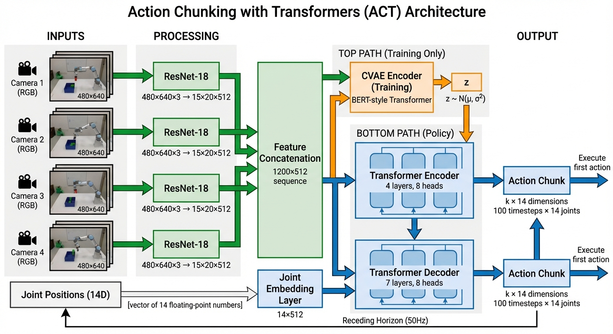

::: {.callout-note appearance="simple"}
## TL;DR

- **Action chunking** predicts sequences of actions instead of single actions, dramatically reducing compounding errors
- **ACT** combines CVAE + Transformers to achieve 80-90% success with just 50 demonstrations (10 minutes of data)
- **Key innovation**: Temporal ensembling with receding horizon control enables smooth, precise manipulation
- **Performance**: Chunk size k=100 improves success from 1% to 44% — action chunking is transformative
- **Trade-off**: ACT is faster and more data-efficient than Diffusion Policy, but less flexible for highly multimodal behaviors
:::

## Why Action Chunking Matters

Imagine teaching a robot to pick up a mug. In traditional behavioral cloning, the robot predicts one tiny action at a time — 50 micro-adjustments per second. Each prediction is an opportunity for error. Over a 10-second task, that's **500 chances to drift off course**. Errors compound exponentially, and the robot quickly enters states it never saw during training.

**Action chunking** solves this elegantly: instead of predicting the next 0.02 seconds of motion, predict the **next 2 seconds** all at once. The effective decision-making horizon drops from 500 steps to just 5. Compounding errors are reduced by a factor of 100.

This single idea — predicting action *sequences* instead of single actions — is the foundation of Action Chunking with Transformers (ACT), one of the most influential recent breakthroughs in robot imitation learning.

## The Problem with Single-Step Prediction

### Compounding Errors in Behavioral Cloning

Standard behavioral cloning treats robot learning as supervised learning: given observation $o_t$, predict action $a_t$. Simple, right?

The problem: **errors compound over time**. Here's why:

1. **Distribution shift**: Even a tiny prediction error moves the robot slightly off the demonstrated trajectory
2. **Novel states**: The robot enters states not present in the training data
3. **More errors**: Predictions from these novel states are even less accurate
4. **Exponential divergence**: In continuous control, errors grow exponentially with task horizon

For a 10-second task at 50Hz (500 timesteps), this compounds into catastrophic failure.

### The Non-Markovian Problem

There's a deeper issue: human demonstrations aren't perfectly Markovian. Consider a human pausing mid-motion before continuing. The observation is identical during the pause and when movement resumes, yet the action should be different.

**Single-step prediction cannot solve this** — it's theoretically impossible to map identical observations to different actions. The policy needs temporal context: "I've been stationary for 1 second, time to move" versus "I just started the pause."

### Temporal Dependencies Matter

Robot manipulation is inherently sequential:

- **Reaching**: Smooth acceleration and deceleration phases
- **Grasping**: Coordinated finger closure over time
- **Placement**: Gradual force application to avoid dropping objects

Single-step policies must learn these temporal patterns implicitly through recurrent architectures or history stacking. Action chunking makes temporal structure **explicit** by predicting entire motion sequences.

## Action Chunking: The Core Idea

### From Points to Trajectories

Action chunking changes the learning objective:

- **Standard BC**: $\pi(a_t | o_t)$ — predict single action
- **Action Chunking**: $\pi(a_{t:t+k} | o_t)$ — predict k-step action sequence

At timestep $t$, the policy outputs $k$ future actions: $[a_t, a_{t+1}, ..., a_{t+k-1}]$.

### How Horizon Reduction Works

Consider a 10-second manipulation task:

| Approach | Control Freq | Total Steps | Decisions | Error Opportunities |
|----------|--------------|-------------|-----------|---------------------|
| Single-step | 50Hz | 500 | 500 | 500 |
| Action chunking (k=100) | 50Hz | 500 | 5 | 5 |

The robot still executes 500 actions, but makes only **5 high-level decisions** instead of 500 micro-decisions. Compounding errors are reduced by **100×**.

### Receding Horizon Control

Action chunking implements a form of **receding horizon control** (also called Model Predictive Control):

1. **Plan**: Generate a sequence of k future actions
2. **Execute**: Perform only the first few actions
3. **Replan**: Get a new observation and generate a new sequence
4. **Repeat**: The planning horizon continuously "recedes" forward

This balances **planning** (looking ahead) with **reactivity** (incorporating new observations).

## ACT Architecture

Action Chunking with Transformers (ACT) was introduced in the 2023 paper ["Learning Fine-Grained Bimanual Manipulation with Low-Cost Hardware"](https://arxiv.org/abs/2304.13705) by Tony Z. Zhao, Vikash Kumar, Sergey Levine, and Chelsea Finn. It combines action chunking with a Conditional Variational Autoencoder (CVAE) and Transformer architecture.

### System Overview

{#fig-act-architecture}

As shown in @fig-act-architecture, ACT consists of three main components:

1. **Vision Backbone**: ResNet-18 processes RGB images from 4 camera views
2. **CVAE Encoder** (training only): Encodes demonstrated action sequences into latent variable $z$
3. **Policy Decoder**: Transformer generates k-step action sequences conditioned on images, joint positions, and $z$

### The Role of CVAE

Why use a Variational Autoencoder instead of simple supervised learning?

#### The Multimodality Problem

Human demonstrations exhibit natural variability:

- **Task strategies**: Different valid approaches to the same task
- **Execution speed**: Hurried vs. careful movements
- **Motion style**: Direct paths vs. cautious, curved trajectories

Standard supervised learning averages these variations, often producing infeasible "middle ground" actions. The CVAE solves this by modeling the **distribution** of valid action sequences.

#### How CVAE Works

**Training:**

The encoder takes the current observation and the **actual demonstrated action sequence** and compresses them into a latent variable $z \sim \mathcal{N}(\mu, \sigma^2)$:

$$z = \mu + \sigma \cdot \epsilon, \quad \epsilon \sim \mathcal{N}(0, 1)$$

This **reparameterization trick** enables gradient flow through the stochastic sampling.

The decoder takes $z$ and the current observation and predicts the action sequence. The training loss has two terms:

$$\mathcal{L} = \mathcal{L}_{\text{reconst}} + \beta \cdot \mathcal{L}_{\text{KL}}$$

- **Reconstruction loss** ($L_1$ norm): Ensures accurate action prediction
- **KL divergence**: Regularizes the latent distribution toward a standard Gaussian prior

**Inference:**

At deployment, the encoder is **not used** (we don't have ground-truth actions). Instead:

1. Sample $z \sim \mathcal{N}(0, 1)$ from the prior
2. Pass $z$ and current observation through the decoder
3. Get the k-step action sequence

#### What Does z Represent?

The latent variable $z$ captures **stylistic variations** in execution:

- Execution speed (fast vs. slow)
- Movement smoothness (jerky vs. fluid)
- Force profiles (aggressive vs. gentle)
- Task decomposition strategies

By sampling different $z$ values during training, the model learns to generate diverse but valid behaviors. During inference, using $z=0$ (the prior mean) produces the "average" execution style.

### Transformer Architecture

ACT adapts the DETR (DEtection TRansformer) architecture for action prediction:

**Encoder:**
- 4 layers, 8 attention heads
- Input: concatenated vision features (1200×512), joint positions (512), and $z$ (512)
- Output: fused multi-modal representation

**Decoder:**
- 7 layers, 8 attention heads
- Uses fixed sinusoidal positional embeddings as queries
- Cross-attends to encoder output
- Output: k×14 dimensional tensor (k timesteps × 14 joint positions)

**Total parameters**: ~80 million (lightweight compared to VLA models with billions)

### Temporal Ensembling

A key innovation: ACT queries the policy at **every timestep**, producing overlapping action chunks. These are combined using exponential weighting:

$$a_t = \frac{\sum_{i=0}^{k-1} w_i \cdot A_t[i]}{\sum_{i=0}^{k-1} w_i}, \quad w_i = \exp(-m \cdot i)$$

where:
- $A_t[i]$ is the predicted action for timestep $t$ from the chunk generated $i$ steps ago
- $m$ is a hyperparameter controlling how quickly new predictions are incorporated

**Benefits:**
- **Smoothness**: Averages out prediction noise
- **Consistency**: Reduces modeling errors
- **Performance gain**: 3-4% improvement over no ensembling

This is analogous to a painter making multiple preliminary sketches and blending them into the final stroke — each individual prediction contributes, but recent predictions have higher weight.

## Training ACT

### Data Requirements

ACT is remarkably data-efficient:

- **50 demonstrations per task** (8-14 seconds each)
- **Total collection time**: 10-20 minutes
- **Control frequency**: 50Hz
- **Action space**: 14D absolute joint positions (2 arms × 7 DOF each)

### Training Configuration

Key hyperparameters from the [official implementation](https://github.com/tonyzhaozh/act):

```python
chunk_size = 100          # Predict 2 seconds ahead (100 steps at 50Hz)
hidden_dim = 512          # Transformer hidden dimension
num_encoder_layers = 4
num_decoder_layers = 7
nheads = 8                # Multi-head attention heads
dim_feedforward = 3200
kl_weight = 10            # β in the KL divergence term
learning_rate = 1e-5
batch_size = 8
epochs = 2000-5000        # Train longer for smoothness
```

### Training Procedure

```bash
python imitate_episodes.py \
  --task_name sim_transfer_cube_scripted \
  --ckpt_dir checkpoints \
  --policy_class ACT \
  --kl_weight 10 \
  --chunk_size 100 \
  --hidden_dim 512 \
  --batch_size 8 \
  --num_epochs 2000 \
  --lr 1e-5
```

**Training time**: ~5 hours on RTX 2080 Ti
**Inference time**: 0.01 seconds per forward pass (supports 50Hz control)

### Critical Training Tips

From the official repository:

> "If your ACT policy is jerky or pauses in the middle of an episode, just train for longer! Success rate and smoothness can improve way after loss plateaus."

**Practical guidelines:**
- Train for **5000+ epochs** for real-world tasks (not just until loss plateaus)
- Use **L1 loss** (not L2) for precise positioning tasks
- Set **β=10** for KL weight (balances reconstruction vs. regularization)
- CVAE is **essential for human data** (drops from 35% to 2% success without it)

## Performance Results

### Benchmark Tasks

ACT was evaluated on **6 real-world** fine manipulation tasks:

- Threading cable ties
- Slotting batteries with millimeter precision
- Opening translucent condiment cups (requires pinching, prying, tearing)
- Inserting power cables
- Sliding Ziploc bags
- Wiping spills

### Success Rates

| Task | ACT Success | Best Baseline |
|------|-------------|---------------|
| Slide Ziploc | 88% | 27% |
| Slot Battery | **96%** | 2% |
| Open Cup | 84% | 0% |
| Thread Ties | **92%** | — |

These results represent **dramatic improvements** over:
- BC-ConvMLP (standard behavior cloning)
- BeT (Behavior Transformers with history)
- RT-1 (discretized actions)
- VINN (non-parametric retrieval)

### Ablation Study Highlights

**Impact of chunk size**:

| Chunk Size | Success Rate |
|------------|--------------|
| k=1 (single-step) | 1% |
| k=10 | 12% |
| k=50 | 38% |
| **k=100** | **44%** |

The jump from 1% to 44% shows that **action chunking is transformative**, not just a marginal improvement.

**Impact of CVAE**:
- With CVAE: 35.3% success
- Without CVAE: 2% success

**Impact of temporal ensembling**:
- With ensembling: 38.6%
- Without ensembling: 35.3%

## ACT vs Diffusion Policy

Both ACT and Diffusion Policy use action chunking, but differ in the generative model:

| Aspect | ACT | Diffusion Policy |
|--------|-----|------------------|
| **Generative Model** | Conditional VAE | Diffusion Model |
| **Inference** | 1 forward pass | 16-100 denoising steps |
| **Speed** | Fast (0.01s) | Slower (0.16s) |
| **Data Efficiency** | High (50 demos) | Moderate (more data needed) |
| **Multimodality** | Good (but unimodal at inference) | Excellent |
| **Training Time** | Fast (5 hours) | Slower |
| **Parameters** | ~80M | Similar |
| **Consistency** | High (rigid adherence to demos) | Flexible, adaptive |

### When to Choose Each

**Use ACT when**:
- Fast training and inference are critical
- Data is limited (50-100 demonstrations)
- Tasks require consistent, repeatable execution
- Precision bimanual manipulation is needed

**Use Diffusion Policy when**:
- Highly multimodal behavior is needed
- Tasks involve extensive repetitive motions
- More training data is available
- Flexibility and adaptability matter more than speed

**Example**: ACT sometimes "freezes" mid-task on repetitive up-down motions, while Diffusion Policy handles these smoothly. However, ACT trains faster and requires less data.

## The ALOHA System

ACT was developed as part of the [ALOHA (A Low-cost Open-source Hardware System for Bimanual Teleoperation)](https://tonyzhaozh.github.io/aloha/) project, which makes bimanual manipulation research accessible.

### Hardware Specifications

- **Cost**: <$20,000 per system (each arm ~$5,000)
- **Tracking error**: <2cm (average 0.68cm)
- **Control frequency**: 50Hz
- **Cameras**: 4 RGB at 480×640 resolution
- **DOF**: 14 total (2 arms × 7 DOF each)

### Mobile ALOHA Results

The system extends to mobile manipulation with **co-training**: combining static and mobile demonstrations improves both.

**Co-training gains**:
- Average improvement: **34%** across tasks
- Individual task boosts: +45%, +20%, +80%, +95%, +80%

**Mobile tasks (>80% success)**:
- Sautéing and serving shrimp
- Opening two-door wall cabinets
- Lifting wine glass while wiping with other hand
- Multi-step cooking sequences

## Using ACT with LeRobot

The easiest way to get started with ACT is through [LeRobot](https://huggingface.co/docs/lerobot/en/act), Hugging Face's robot learning framework.

### Installation

```bash
pip install lerobot
```

### Training

```bash
lerobot-train \
  --dataset.repo_id=${HF_USER}/your_dataset \
  --policy.type=act \
  --output_dir=outputs/train/act_your_dataset \
  --policy.device=cuda \
  --wandb.enable=true \
  --policy.repo_id=${HF_USER}/act_policy
```

### Pre-trained Models

LeRobot provides pre-trained ACT policies on HuggingFace Hub:
- [lerobot/act_aloha_sim_insertion_human](https://huggingface.co/lerobot/act_aloha_sim_insertion_human)
- [lerobot/act_aloha_sim_transfer_cube_human](https://huggingface.co/lerobot/act_aloha_sim_transfer_cube_human)

## Key Takeaways

1. **Action chunking is transformative**: The 1% → 44% success rate improvement shows this is the right abstraction for imitation learning

2. **CVAE handles human variability**: Separating style ($z$) from task execution enables learning from noisy, variable demonstrations

3. **Temporal ensembling matters**: Combining overlapping predictions improves smoothness and reduces errors by 3-4%

4. **Train longer than loss suggests**: Smoothness and success rate improve well after reconstruction loss plateaus

5. **Data efficiency is remarkable**: 50 demonstrations (10 minutes of human time) achieve 80-90% success on contact-rich manipulation

6. **Speed vs. flexibility trade-off**: ACT is faster and more data-efficient than Diffusion Policy, but less flexible for highly multimodal behaviors

## Limitations and Future Work

**Current limitations**:
- **Repetitive motions**: Can freeze mid-task on cyclic movements
- **Multi-modal scenarios**: Inference uses single $z$ sample (unimodal)
- **Per-task training**: Original ACT is not multi-task (though extensions exist)

**Recent extensions**:
- **Bi-ACT**: Incorporates force/torque feedback
- **NL-ACT**: Adds natural language conditioning
- **One ACT Play**: Learns from single demonstrations
- **3D-ACT**: Uses point cloud inputs instead of RGB

## What's Next?

In Part 2, we'll explore **Diffusion Policy** in depth — understanding how diffusion models are adapted for action generation, why they handle multimodality better than VAEs, and how they compare to ACT in practice.

::: {.callout-note appearance="simple"}
## Summary

Action Chunking with Transformers (ACT) demonstrates that the right abstraction can transform learning efficiency. By predicting action sequences instead of single actions:

- **Horizon reduction**: Compounding errors drop by 100× (from 500 decisions to 5)
- **Temporal coherence**: Explicit modeling of motion primitives and temporal dependencies
- **Data efficiency**: 80-90% success with just 10 minutes of human demonstrations
- **Practical deployment**: Fast inference (0.01s) enables real-time 50Hz control

The combination of action chunking, CVAE for handling demonstration variability, and temporal ensembling for smoothness creates a powerful framework for learning precise manipulation from limited data.

Whether you're building research systems or deploying real robots, ACT provides a practical, accessible entry point into modern imitation learning. The [LeRobot implementation](https://huggingface.co/docs/lerobot/en/act) and [ALOHA hardware designs](https://tonyzhaozh.github.io/aloha/) make it easier than ever to experiment with these techniques.

**Next up**: In [Part 2](../2-diffusion-policy/), we'll dive into Diffusion Policy and understand why diffusion models are becoming the gold standard for robot action generation.
:::

## References

[1] [Zhao, T. Z., et al. "Learning Fine-Grained Bimanual Manipulation with Low-Cost Hardware."](https://arxiv.org/abs/2304.13705) *RSS*, 2023.

[2] [Chi, C., et al. "Diffusion Policy: Visuomotor Policy Learning via Action Diffusion."](https://arxiv.org/abs/2303.04137) *RSS*, 2023.

### Recommended Resources

- [ALOHA Project Website](https://tonyzhaozh.github.io/aloha/) — Hardware designs and demonstration videos
- [ACT Official GitHub Repository](https://github.com/tonyzhaozh/act) — Original implementation
- [LeRobot ACT Documentation](https://huggingface.co/docs/lerobot/en/act) — Easiest way to get started
- [The importance of action chunking in imitation learning](https://www.haonanyu.blog/post/action_chunking/) — Technical deep dive
