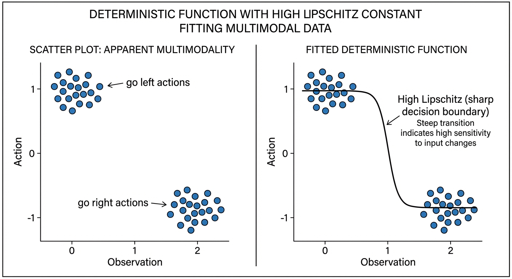

Diffusion Policy achieved a 46.9% improvement over baselines. The explanation seemed obvious: diffusion models capture multimodal action distributions, so robots commit to one valid action instead of averaging conflicting options into nonsense.

Everyone built on this intuition. Papers cited multimodality as the key insight. Researchers designed increasingly sophisticated distribution-matching objectives. The narrative became dogma.

But a new paper just ran the experiments to test it — and the evidence doesn't hold up. **Diffusion's success has almost nothing to do with multimodality.**

![The conventional wisdom (left): diffusion policies succeed through distributional learning (C1). The actual finding (right): stochasticity (C2) + iterative computation (C3) are sufficient — distribution matching contributes almost nothing. Figure from Pan et al.$^{[1]}$](teaser.png){#fig-teaser}

::: {.callout-note appearance="simple"}
## TL;DR

A comprehensive study across 28 benchmarks challenges why diffusion/flow policies work:

- **The myth**: Diffusion captures multimodal action distributions
- **The reality**: Two simpler components explain the gains — noise during training + iterative refinement
- **The proof**: A two-step regression policy (MIP) matches flow performance with 4.5× fewer compute steps
- **The implication**: You might be paying for complexity you don't need
:::

::: {.callout-note appearance="simple"}
## Paper Details

**Much Ado About Noising: Dispelling the Myths of Generative Robotic Control**$^{[1]}$

Pan, Anantharaman, Huang, Jin, Pfrommer, Yuan, Permenter, Qu, Boffi, Shi, Simchowitz

CMU, MIT, Toyota Research Institute

[arXiv:2512.01809](https://arxiv.org/abs/2512.01809) | [Project Page](https://simchowitzlabpublic.github.io/much-ado-about-noising-project/) | [Code](https://github.com/simchowitzlabpublic/much-ado-about-noising)

*Max Simchowitz and Guanya Shi are CMU faculty with ICML Best Paper awards; Nicholas Boffi leads CMU's generative AI theory group.*
:::

## The Conventional Wisdom {#sec-myths}

Before we can understand what the paper found, we need to establish what the field believed:

**Myth 1: Multimodality** — Diffusion policies work because they can represent multiple valid actions (go left OR go right) instead of averaging them (go straight into the wall).

**Myth 2: Expressivity** — Diffusion models can express more complex observation-to-action mappings than simple regression networks.

**Myth 3: Distribution Matching** — Learning the full action distribution $p(a|o)$ is fundamentally better than just predicting the mean action.

These explanations felt intuitive. They matched our understanding of diffusion for image generation. And they guided years of follow-up research.

The problem? The evidence doesn't support them.

The authors set out to test each myth with controlled experiments. Let's examine their methodology before trusting the conclusions.

## The Experimental Setup {#sec-setup}

This paper's strength is its comprehensive experimental design.

### Benchmarks (28 Tasks Total)

| Category | Benchmarks | Tasks |
|----------|------------|-------|
| State-based | Robomimic, Push-T, Kitchen, MetaWorld, Adroit | 15 |
| Pixel-based | Robomimic (image), Push-T (image) | 6 |
| Point cloud | Robomimic | 3 |
| Vision-language | LIBERO | 130 (4 suites) |

This is unusually thorough. Most papers cherry-pick 3-5 tasks where their method shines.

### Architectures Tested

A critical methodological choice: they test **identical architectures** for both generative (flow/diffusion) and regression policies. This controls for the confound that diffusion papers often use fancier networks.

- **Chi-UNet**: The original Diffusion Policy architecture
- **Chi-Transformer**: Transformer variant from Chi et al.
- **Sudeep-DiT**: Diffusion Transformer from recent work
- **MLPs and RNNs**: Traditional baselines

### Policy Types Compared

| Policy | Training | Inference | Components |
|--------|----------|-----------|------------|
| Regression | MSE loss | Single forward pass | Baseline |
| Flow | Flow matching loss | Multi-step ODE | C1 + C2 + C3 |
| Straight Flow | MSE on interpolant | Multi-step | C2 only |
| Residual Regression | MSE + residual | Multi-step | C3 only |
| MIP | MSE at two noise levels | Two-step | C2 + C3 |

Where the components are:

![The three components of generative control policies. **C1** (distributional learning) is what people thought mattered. **C2** (stochasticity) and **C3** (supervised iteration) are what actually drive performance. Figure from Pan et al.$^{[1]}$](key-ingredients.png){#fig-components}

- **C1 — Distributional learning**: Fitting the full conditional distribution $p(a|o)$ via flow matching or diffusion
- **C2 — Stochasticity injection**: Adding noise during training (the interpolant in flow matching)
- **C3 — Supervised iterative computation**: Generating outputs through multiple steps, each supervised during training

This decomposition is the paper's key contribution — isolating which components actually matter.

## Finding 1: Architecture Trumps Everything

The first surprise: when you give regression policies the same architecture as diffusion policies, the performance gap largely disappears.

> "Architecture choice dictates performance far more than the generative versus regression distinction."

On most benchmarks, properly-architected regression matches or approaches flow performance. The exceptions are high-precision insertion tasks (Square, Threading) — more on why later.

::: {.callout-important appearance="simple"}
## Implication for Practitioners

Before switching to diffusion, try upgrading your regression policy's architecture. You might get 80% of the benefit with 10% of the complexity.
:::

## Finding 2: Multimodality Doesn't Explain Performance

This is the most counterintuitive finding. The authors attack the multimodality hypothesis from three angles:

### Test 1: Do Action Distributions Have Multiple Modes?

They visualize action distributions at ambiguous states using t-SNE. If multimodality matters, we should see distinct clusters (left vs. right).

**Result**: Single clusters. Even at symmetric states where humans see obvious alternatives, the expert demonstrations form unimodal distributions.

Why? Human demonstrators are biased. They prefer one approach over another, even unconsciously. The "multimodal" states we imagine rarely appear in real data.

### Test 2: Does Stochastic Sampling Help?

If capturing multimodality is important, stochastic sampling (drawing from the full distribution) should outperform mean sampling (just taking the mode).

| Task | Stochastic | Mean | Difference |
|------|------------|------|------------|
| Tool-Hang | 0.80 | 0.78 | +2% |
| Kitchen | 0.99 | 0.99 | 0% |
| Transport | 0.96 | 0.94 | +2% |

**Result**: Negligible difference. The multimodal capacity isn't being used.

### Test 3: Remove Multimodality Entirely

They create a **deterministic expert dataset** — only one action per state, no ambiguity possible.

| Method | Performance |
|--------|-------------|
| Flow | 0.72 |
| Regression | 0.64 |

**Result**: Flow still wins. The advantage persists even when multimodality is impossible.

::: {.callout-tip appearance="simple"}
## The Insight

Diffusion policies aren't winning because they model multiple modes. They're winning for a different reason entirely.
:::

## Finding 3: Expressivity Is a Red Herring

Maybe diffusion models can fit more complex functions? The authors test this via **Lipschitz constants**.

::: {.callout-note appearance="simple"}
## What's a Lipschitz Constant?

The Lipschitz constant $L$ measures how "steep" or "sensitive" a function can be:

$$|f(x_1) - f(x_2)| \leq L \cdot |x_1 - x_2|$$

It bounds how much the output can change relative to input changes:

| Lipschitz Constant | Meaning |
|-------------------|---------|
| $L = 1$ | Output changes at most as fast as input |
| $L = 100$ | Output can change much faster — near-vertical jumps |

Higher Lipschitz = can fit sharper, more complex functions.
:::

Here's the key insight the paper makes: **what looks like multimodality can be fit by a deterministic function with sharp transitions.**

{#fig-lipschitz}

Consider a T-intersection where the robot could go left or right. This *seems* multimodal — two valid actions for similar observations. But a deterministic policy with high Lipschitz constant can fit this perfectly: slightly left of the decision boundary → go left; slightly right → go right. The transition is nearly vertical — a tiny change in observation causes a large change in action.

The policy isn't modeling a distribution over both options. It's learning a steep decision boundary that picks one action definitively based on subtle differences in the observation.

> "Data that appears multi-modal can be fit with a policy that has a high Lipschitz constant... This reflects a broader principle in control that we need only capture the mapping from observation to a **single effective action**, rather than reproduce the distribution over all possible actions."

**Theoretical result (Theorem 1)**: For log-concave (unimodal) distributions, flow-based policies have Lipschitz constants bounded by a constant factor of the underlying flow field. They can't be arbitrarily more expressive.

**Empirical result**: Regression policies actually show *higher* Lipschitz constants than flow policies.

The expressivity hypothesis doesn't hold up — if anything, regression can fit sharper functions.

## Finding 4: What Actually Matters

Through systematic ablations, the authors identify the true success factors:

### The Winning Combination: C2 + C3

| Components | Description | Performance |
|------------|-------------|-------------|
| C1 only | Distribution matching | ≈ Regression |
| C2 only | Stochasticity | ≈ Regression |
| C3 only | Iterative computation | < Regression |
| **C2 + C3** | **Stochasticity + Iteration** | **≈ Flow** |
| C1 + C2 + C3 | Full flow | Baseline |

Neither component alone helps. But together, they recover nearly all of flow's performance.

### The Minimal Iterative Policy (MIP)

To prove this, they design MIP — the simplest possible policy using C2 + C3:

```
Training:
1. Sample noise level t★ = 0.9 (fixed)
2. Create noisy action: a_noisy = (1-t★) * a_clean + t★ * noise
3. Train network to predict clean action from noisy action
4. Also train on t = 0 (no noise) for initialization

Inference:
1. Start from zero (not random noise)
2. Apply network once → get refined prediction
3. Apply network again → get final action
```

That's it. Two forward passes, no ODE solver, no noise schedule tuning.

**Results on LIBERO**:

| Dataset | Regression | Flow | MIP |
|---------|------------|------|-----|
| LIBERO Object | 92.6 | 97.4 | 95.8 |
| LIBERO Goal | 94.6 | 95.0 | 95.2 |
| LIBERO Spatial | 97.2 | 95.8 | 97.6 |
| LIBERO 10 | 78.0 | 81.6 | 82.2 |

MIP matches or exceeds flow on most tasks with 2 function evaluations instead of 9.

## The Real Mechanism: Manifold Adherence {#sec-manifold}

If not multimodality or expressivity, what explains the advantage?

The authors propose **manifold adherence** — the policy's ability to produce plausible actions even when encountering unfamiliar states.

::: {.callout-tip appearance="simple"}
## Analogy: Walking a Mountain Ridge

Imagine expert demonstrations trace a path along a mountain ridge (the "action manifold"). A regression policy memorizes the path perfectly — but step slightly off-trail, and it might direct you off a cliff. A policy with C2+C3 training learns the shape of the ridge itself. Even starting from mid-air, iterative refinement pulls you back toward the ridge.
:::

![Manifold adherence visualized. Starting from any point in action space, iterative refinement converges toward the expert manifold (the surface). Methods with C2+C3 stay closer to this surface even when the input state is unfamiliar. Figure from Pan et al.$^{[1]}$](manifold-adherence.png){#fig-manifold}

### The Off-Manifold Experiment

They design a clever test:

1. Collect expert actions at neighboring states
2. Compute the subspace spanned by these actions
3. For a new state, measure how much the predicted action deviates from this subspace

| Method | Off-Manifold Error | Validation Loss |
|--------|-------------------|-----------------|
| Regression | 0.058 | 0.073 |
| Straight Flow | 0.061 | 0.071 |
| Residual Regression | 0.057 | 0.062 |
| **MIP** | **0.043** | 0.069 |
| Flow | 0.032 | 0.074 |

All methods achieve similar validation loss. But only C2+C3 methods (MIP, Flow) achieve low off-manifold error.

::: {.callout-note appearance="simple"}
## The Mechanism

Supervised iterative computation + stochasticity creates an inductive bias toward staying on the "action manifold" — the space of actions that actually appear in demonstrations.

When the policy encounters an unfamiliar state, it produces an action that *could* plausibly be part of a demonstration, even if it's not exactly right.
:::

### Why Does This Work?

The intuition: training with noise injection forces the network to learn mappings from *anywhere in action space* back to the expert manifold. Even when starting from irrelevant noise, it must recover valid actions.

Think of it like **GPS navigation vs. memorized directions**:

- **Regression (memorized directions)**: "At the third light, turn left." Works perfectly on the trained route. But take a wrong turn? The directions are useless.

- **C2+C3 (GPS)**: Knows the destination and the general landscape. Even when off-route, it recalculates a path back. The iterative steps are like GPS recalculating: "In 100 meters, turn right to rejoin the route."

At test time, when distribution shift occurs (robot in unfamiliar state), the policy's bias toward the expert manifold keeps it from predicting completely nonsensical actions. It may not find the *optimal* action, but it finds *a plausible* action — one that looks like something an expert might do.

Regression policies lack this regularization. They can memorize training data but extrapolate poorly.

## Critical Analysis {#sec-analysis}

This paper is strong, but let me highlight limitations and open questions:

::: {.callout-warning appearance="default"}
## Common Misconception

**"This paper says diffusion doesn't work"** — No. Diffusion/flow policies work great. The paper questions *why* they work. The practical method is unchanged; our understanding of the mechanism is refined.
:::

### Limitation 1: Benchmark Selection

The benchmarks are primarily short-horizon manipulation tasks. The authors acknowledge:

> "Findings apply primarily to behavior cloning, with applicability to RL-finetuning, pretraining, and long-horizon planning remaining open questions."

For tasks requiring genuine long-horizon multimodal planning (assemble furniture with multiple valid orderings), the multimodality hypothesis might still hold.

### Limitation 2: Expert Quality

The "deterministic expert" experiment removes multimodality from data but uses scripted/optimal experts. Real human demonstrations have noise and suboptimality — might multimodality matter more there?

### Limitation 3: High-Precision Tasks

Flow still outperforms on insertion tasks (Square, Threading). The paper attributes this to "iterative refinement for precision" but doesn't fully explain why C2+C3 alone doesn't capture this.

### Open Question: Why Supervised Iteration?

The paper identifies *what* works (C2+C3) but not *why* at a fundamental level:

> "A theoretical framework explaining why stochastic supervision with MSE loss induces manifold adherence behavior remains elusive."

This is an invitation for theory work.

## Implications for the Field

### For Practitioners

1. **Don't cargo-cult diffusion.** If you're using diffusion "because it handles multimodality," reconsider. You might be paying complexity costs for benefits you're not receiving.

2. **Try MIP first.** Two-step refinement with noise training might be all you need.

3. **Invest in architecture.** Upgrading from MLP to U-Net/Transformer matters more than switching from regression to flow.

4. **Benchmark carefully.** The task you're solving might not actually benefit from generative approaches.

### For Researchers

1. **Mechanism matters.** "It works" isn't enough. Understanding *why* prevents building on false foundations.

2. **Ablate ruthlessly.** This paper's component decomposition (C1, C2, C3) is a model for rigorous analysis.

3. **Question conventional wisdom.** The multimodality story was appealing but unsupported. What other "obvious" explanations deserve scrutiny?

4. **Theory gap.** Why does C2+C3 induce manifold adherence? There's a paper in answering this.

### For the Diffusion Policy Narrative

This doesn't mean Diffusion Policy was wrong — it identified a method that works. But the explanation was incomplete.

The corrected narrative:

> Diffusion Policy works not because it models multimodal distributions, but because **supervised iterative computation with stochasticity injection** creates an inductive bias toward producing actions that look like expert demonstrations, even under distribution shift.

This is actually more useful! It tells us *which components to keep* when simplifying or extending the method.

## The Bigger Picture

This paper exemplifies healthy scientific progress. Diffusion Policy (Chi et al., 2023) made a practical breakthrough. This paper (Simchowitz et al., 2025) refines our understanding of *why*.

Both are valuable:

- Without Chi et al., we wouldn't have a method that works
- Without Simchowitz et al., we'd be optimizing the wrong things

The field now has better guidance for when to use generative approaches, what components matter, and where to focus future research.

::: {.callout-note appearance="simple"}
## Summary

**The Old Story**: Diffusion policies capture multimodal action distributions, avoiding the averaging problem.

**The New Story**: Diffusion policies succeed through supervised iterative computation + stochasticity, which creates an inductive bias for manifold adherence under distribution shift.

**Practical Takeaway**: A two-step regression policy (MIP) captures most benefits with fraction of the complexity. Reserve full diffusion/flow for tasks requiring high precision or genuine long-horizon multimodality.
:::

---

## References

[1] Pan, C., Anantharaman, G., Huang, N., Jin, C., Pfrommer, D., Yuan, C., Permenter, F., Qu, G., Boffi, N., Shi, G., & Simchowitz, M. [Much Ado About Noising: Dispelling the Myths of Generative Robotic Control](https://arxiv.org/abs/2512.01809). *arXiv 2025*.

[2] Chi, C., Feng, S., Du, Y., Xu, Z., Cousineau, E., Burchfiel, B., & Song, S. [Diffusion Policy: Visuomotor Policy Learning via Action Diffusion](https://arxiv.org/abs/2303.04137). *RSS 2023*.

[3] Lipman, Y., Chen, R. T. Q., Ben-Hamu, H., Nickel, M., & Le, M. [Flow Matching for Generative Modeling](https://arxiv.org/abs/2210.02747). *ICLR 2023*.

## Further Reading

- [Part 1: Diffusion Policy](../1-diffusion-policy/) — The foundational paper this work challenges
- [Project Page](https://simchowitzlabpublic.github.io/much-ado-about-noising-project/) — Visualizations and additional results
- [Code Repository](https://github.com/simchowitzlabpublic/much-ado-about-noising) — Reproduce the experiments
