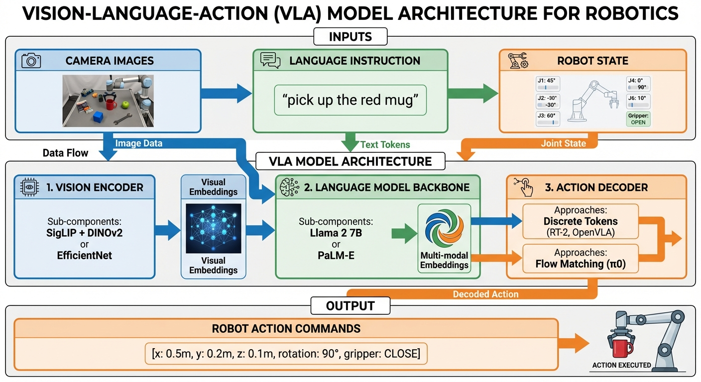
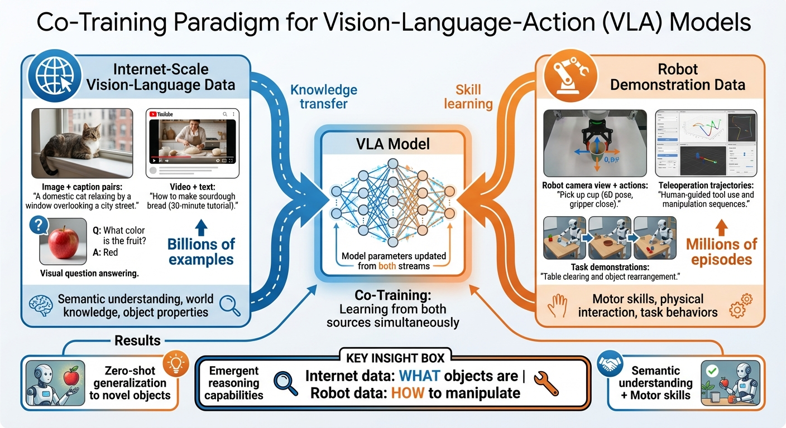

::: {.callout-note appearance="simple"}
## TL;DR

- **VLA models** unify vision, language, and action in end-to-end neural networks for robotic control
- **Co-training** on internet-scale vision-language data + robot demonstrations enables zero-shot generalization
- **Key innovation**: Treating robot actions as language tokens (RT-2) or continuous trajectories (π0)
- **Performance**: OpenVLA (7B) outperforms RT-2-X (55B) by 16.5% with 7× fewer parameters
- **Trade-offs**: VLAs excel at semantic understanding but face deployment challenges (latency, robustness)
:::

## What Are VLA Models? {#sec-what}

Imagine you're teaching someone to cook. You don't just show them what ingredients look like, or explain recipes in words, or demonstrate knife techniques in isolation. You integrate all three: "See these tomatoes? Dice them like this while following the recipe." That's exactly how **Vision-Language-Action (VLA)** models work.

VLA models are multimodal foundation models that process three inputs together:
1. **Vision**: Camera images of the robot's environment
2. **Language**: Natural language instructions ("pick up the red mug")
3. **Proprioception**: Robot's current state (joint positions, velocities)

And produce one output:
- **Actions**: Executable motor commands to control the robot

{#fig-vla-architecture}

As shown in @fig-vla-architecture, VLAs differ fundamentally from the specialized policies we've seen in [Part 1.5 (ACT)](../1.5-action-chunking/) and will see in Part 2 (Diffusion Policy). Instead of learning task-specific behaviors, VLAs aim for **generalist intelligence** — a single model that can handle diverse tasks across different environments and robot embodiments.

### Why VLA Models Matter Now

Recall from [Part 1](../1-background/#sec-multimodality) that robot learning faces a fundamental challenge: how do we create policies that generalize beyond their training data? Traditional approaches required collecting demonstrations for every task, on every robot, in every environment.

VLA models change this equation through **transfer learning**:
- Vision encoders pre-trained on billions of images understand object semantics without robot-specific training
- Language models pre-trained on internet text understand task instructions and spatial reasoning
- Robot demonstrations teach motor skills, but semantic knowledge comes "for free"

**The result**: RT-2 achieves **3× better generalization** than RT-1, with emergent capabilities like reasoning ("pick up an object that could be used as a hammer" → selects a rock).$^{[1]}$

::: {.callout-tip appearance="simple"}
## Intuition: The "Unified Brain" Analogy

Traditional robot systems are like separate departments in a company: the vision team processes images, the language team interprets commands, the planning team decides actions. Each hands off to the next, with information lost at every boundary.

VLA models are like a single expert who sees, understands, and acts simultaneously. When you ask a chef to "dice those tomatoes," they don't mentally translate to a planning module that sends commands to a motor control system. They just... do it. VLAs aim for this same integrated intelligence.$^{[2]}$
:::

## The Evolution of Robot Policies {#sec-evolution}

To understand why VLAs represent a paradigm shift, let's trace the evolution:

### Single-Task Policies (ACT, Diffusion Policy)

As we saw in [Part 1.5](../1.5-action-chunking/), ACT achieves impressive **80-90% success** on specific manipulation tasks with just 50 demonstrations. But each task requires:
- Task-specific data collection
- Separate model training
- No transfer between tasks

**Limitation**: You need N models for N tasks.

### Multi-Task Policies (RT-1)

RT-1 (2022) demonstrated that a single transformer could handle **700+ tasks** with 130k demonstrations across 13 robots.$^{[3]}$ This proved task-conditional control was feasible.

**Innovation**: Natural language task specification instead of task IDs.

**Limitation**: Still requires robot demonstrations for every task, even simple variations.

### Foundation Model Policies (RT-2, OpenVLA, π0)

VLA models leverage **vision-language pre-training** to achieve:
- Zero-shot execution of novel tasks
- Emergent reasoning capabilities
- Cross-embodiment transfer
- Semantic understanding of objects never seen in robot training

**The leap**: Instead of "learn from robot demos only," it's "inherit knowledge from internet-scale data, then specialize to robotics."

## The Three-Component Architecture {#sec-architecture}

Modern VLA models follow a consistent design pattern. Let's understand each component and the design choices.

### Component 1: Vision Encoder {#sec-vision-encoder}

**Purpose**: Transform raw pixels into semantic visual representations.

**Common Architectures**:

| Encoder | Pre-training | Strength | Used In |
|---------|--------------|----------|---------|
| **SigLIP** | Contrastive (image-text pairs) | Semantic understanding | OpenVLA, π0 |
| **DINOv2** | Self-supervised | Spatial relationships | OpenVLA (fused) |
| **EfficientNet** | ImageNet classification | Efficient inference | RT-1 |
| **CLIP** | Contrastive | General vision-language | Various |

**Key Design Choice: Fused Encoders**

OpenVLA discovered that combining SigLIP + DINOv2 works better than either alone:$^{[4]}$
- **SigLIP**: Understands "what" objects are (semantic categories)
- **DINOv2**: Understands "where" and spatial arrangements
- **Together**: Provides both semantic and geometric understanding

::: {.callout-tip appearance="simple"}
## Intuition: Why Fuse Vision Encoders?

Imagine describing a cluttered desk. One person excels at identifying objects ("That's a stapler, a mug, and scissors"). Another excels at spatial layout ("The mug is behind the stapler, to the left of the scissors"). Neither description alone is sufficient for manipulation — you need both "what" and "where." Fused encoders provide this dual perspective.$^{[4]}$
:::

### Component 2: Language Model Backbone {#sec-language-backbone}

**Purpose**: Process language instructions and fuse multimodal information.

**Common Choices**:

| Model | Parameters | Used In | Key Feature |
|-------|------------|---------|-------------|
| **Llama 2** | 7B | OpenVLA | Strong reasoning, open-source |
| **PaLM-E** | 12B-562B | RT-2 | Massive scale, embodied VLM |
| **Gemma** | 2B | π0 (PaliGemma) | Efficient, Google-optimized |
| **PaLI-X** | 55B | RT-2 | Vision-language specialist |

**Processing Flow**:
1. Language instruction tokenized: "pick up the red mug" → `[pick, up, the, red, mug]`
2. Vision features projected to language model dimension
3. Combined sequence processed by transformer
4. Output representations condition action generation

### Component 3: Action Decoder {#sec-action-decoder}

This is where VLA models diverge into two paradigms:

#### Paradigm A: Discrete Token Approach (RT-2, OpenVLA)

**Core idea**: Treat actions as language.

Actions are discretized into bins and represented as tokens:
- Continuous action: `[x=0.342, y=-0.156, z=0.891, ...]`
- Discretized (256 bins): `[token_87, token_102, token_228, ...]`

**Training**: Same cross-entropy loss as language modeling.

**Advantages**:
- Leverages existing LLM architecture and training infrastructure
- Simple to implement
- Proven to work at scale

**Disadvantages**:
- Limited precision (256 bins per dimension)
- Poor for high-frequency dexterous control
- Action space grows exponentially with dimensions

#### Paradigm B: Continuous Flow Approach (π0, Octo)

**Core idea**: Generate smooth action trajectories.

Uses **flow matching** or **diffusion** to produce continuous outputs:

$$
\frac{d\mathbf{a}}{dt} = v_\theta(\mathbf{a}, t, \mathbf{o}, \mathbf{c})
$$ {#eq-flow-matching}

where $\mathbf{a}$ is the action trajectory, $\mathbf{o}$ is the observation, and $\mathbf{c}$ is the language conditioning.

**Advantages**:
- High-frequency control (50-100 Hz)
- Precise for dexterous manipulation
- Naturally handles action chunking (recall [Part 1.5](../1.5-action-chunking/#sec-action-chunking))

**Disadvantages**:
- More complex training
- Slower inference (iterative generation)
- Requires more compute

::: {.callout-warning}
## Common Misconception: "VLAs Are Just LLMs for Robots"

While VLAs use similar architectures to LLMs, they face fundamentally different challenges:

1. **Continuous control**: Text generation is discrete; robot actions are continuous and high-frequency
2. **Physical constraints**: Language models don't need to reason about friction, gravity, or collision
3. **Compounding errors**: As discussed in [Part 1.5](../1.5-action-chunking/#sec-compounding), prediction errors in robotics compound over time — unlike static text generation
4. **Real-time requirements**: Robots need 10-100 Hz control; language models can take seconds per response

The architectural similarity is useful (we can leverage pre-training!), but the problem is distinctly different.$^{[5]}$
:::

## Co-Training: The Secret Sauce {#sec-cotraining}

The key innovation that makes VLAs work is **co-training** on two complementary data sources.

### Internet-Scale Vision-Language Data

**Sources**: LAION (image-text pairs), YouTube (video-text), VQA datasets, image captions

**Scale**: Billions of examples

**Provides**:
- Rich semantic knowledge (object properties, relationships, common-sense physics)
- Language grounding (understanding diverse instructions)
- World knowledge (what objects are typically used for)
- Generalization to novel objects

### Robot Demonstration Data

**Sources**: Human teleoperation, scripted behaviors, RL exploration

**Scale**: Thousands to millions of episodes

**Provides**:
- Motor skills and control policies
- Physical interaction knowledge
- Task-specific behaviors
- Embodiment-specific constraints

### The Co-Training Recipe

**RT-2's Approach**:$^{[1]}$

1. Start with pre-trained VLM (PaLM-E or PaLI-X)
2. Convert robot actions to text tokens
3. Fine-tune on robot data **while keeping** some web data in the training mix
4. This prevents catastrophic forgetting of semantic knowledge

**Result**: The model retains its understanding of "what a rock can be used for" while learning "how to grasp objects."

**OpenVLA's Approach**:$^{[4]}$

1. Start with Prismatic VLM (pre-trained on image-text pairs)
2. Fine-tune on 970k robot trajectories from Open X-Embodiment dataset
3. Use LoRA for parameter-efficient adaptation
4. Train for 15 days on 64 A100 GPUs

**Result**: 7B parameter model outperforms 55B RT-2-X.

{#fig-cotraining}

### Open X-Embodiment: The ImageNet of Robotics

The **Open X-Embodiment (OXE)** dataset revolutionized VLA training:$^{[6]}$
- **Collaboration**: 33 academic labs worldwide
- **Scale**: 1M+ episodes from 22 different robot embodiments
- **Diversity**: Multiple tasks, environments, morphologies

**Impact**:
- RT-1-X: **50% success rate improvement** across 5 robots
- RT-2-X: **3× performance** on multi-embodiment data
- Enables zero-shot transfer to new robot platforms

This dataset is to robotics what ImageNet was to computer vision — a foundation enabling transfer learning at scale.

## Key VLA Models {#sec-models}

Let's examine the landmark models that shaped the field.

### RT-1: Robotics Transformer (December 2022) {#sec-rt1}

**Paper**: [RT-1: Robotics Transformer for Real-World Control at Scale](https://arxiv.org/abs/2212.06817)$^{[3]}$

**Architecture**:
- **Vision**: EfficientNet-B3 (ImageNet pre-trained) → 81 tokens
- **TokenLearner**: Compresses 81 tokens → 8 tokens (2.4× faster inference)
- **Language Conditioning**: FiLM layers (Feature-wise Linear Modulation)
- **Transformer**: 8 layers, 19M parameters
- **Actions**: 7 DoF arm + 3 DoF base + mode

**Training Data**: 130k episodes, 700+ tasks, 13 robots over 17 months

**Innovation**: Proved transformers could scale to real-world robot control with natural language conditioning.

### RT-2: Actions as Language (July 2023) {#sec-rt2}

**Paper**: [RT-2: Vision-Language-Action Models](https://arxiv.org/abs/2307.15818)$^{[1]}$

**Key Insight**: Robot actions are just another language.

Instead of a separate action decoder, RT-2 represents actions as text tokens:
- Action: `[x, y, z, roll, pitch, yaw, gripper]`
- Discretized: `[87, 102, 228, 156, 91, 205, 127]`
- As text: `"87 102 228 156 91 205 127"`

This allows training on both:
- Vision-language data: `Image → "A dog playing fetch"`
- Robot data: `Image → "87 102 228 156 91 205 127"`

**Performance**:
- **3× improvement** in generalization over RT-1
- **32% → 62%** success on unseen scenarios

**Emergent Capabilities**:
- Symbol understanding: Place object on specific number or icon
- Semantic reasoning: "Pick the object that could be used as a hammer" → selects rock
- Comparative: "Pick the smallest object"
- Chain-of-thought: Multi-step reasoning for tool selection

::: {.callout-important}
## Key Insight: Web-Scale Pre-Training Transfers to Physical Control

RT-2's most surprising result: Knowledge learned from internet images transfers to physical manipulation. A model pre-trained on "images of rocks used as tools" can figure out how to grasp a rock appropriately — without ever seeing a robot grasp a rock during training.

This validates the hypothesis that semantic understanding and motor skills can be learned jointly.$^{[1]}$
:::

### OpenVLA: Open-Source 7B Model (June 2024) {#sec-openvla}

**Paper**: [OpenVLA: An Open-Source Vision-Language-Action Model](https://arxiv.org/abs/2406.09246)$^{[4]}$

**Architecture**:
1. **Fused Vision**: SigLIP + DINOv2 → image patch embeddings
2. **Projector**: Maps visual embeddings to LLM space
3. **Llama 2 7B**: Predicts tokenized actions
4. **Decoder**: Continuous actions from discrete tokens

**Training**:
- 970k robot demonstrations (Open X-Embodiment)
- 64 A100 GPUs for 15 days
- Built on Prismatic VLM

**Performance**: **+16.5%** vs RT-2-X (55B) across 29 tasks with **7× fewer parameters**

**Significance**: First major open-source VLA, democratizing research with MIT-licensed checkpoints and training code. Includes LoRA support for easy fine-tuning on consumer GPUs.

### π0 (Pi-Zero): Flow Matching VLA (October 2024) {#sec-pi0}

**Paper**: [π₀: A Vision-Language-Action Flow Model](https://arxiv.org/abs/2410.24164)$^{[7]}$

Developed by Physical Intelligence, π0 introduces **flow matching** for continuous control.

**Architecture**:
- **VLM Backbone**: PaliGemma (SigLIP + Gemma 2B) ≈ 3B parameters
- **Action Expert**: 300M parameter flow matching model
- **Total**: 3.3B parameters

**Key Innovation**: Instead of discrete tokens, flow matching generates continuous action trajectories at **50 Hz**:

$$\mathbf{a}_t = \text{FlowMatch}(\text{noise}, \text{VLM embeddings}, \text{robot state})$$ {#eq-pi0-action}

**Training**: 10,000+ hours across 7 robot platforms, 68 tasks

**Capabilities**: Laundry folding, table bussing, grocery bagging, box assembly — with strong zero-shot performance

**Evolution**: π0.5 demonstrates meaningful generalization to entirely new environments

### Octo: Modular Transformer Policy (May 2024) {#sec-octo}

**Paper**: [Octo: An Open-Source Generalist Robot Policy](https://arxiv.org/abs/2405.12213)$^{[8]}$

**Architecture**: Transformer-based diffusion policy (recall diffusion from [Part 1](../1-background/#sec-generative))

**Innovation**: Modular attention structure enables efficient cross-embodiment transfer
- Robot-agnostic core transformer
- Modality-specific tokenizers for different sensors
- Two sizes: Octo-Small (27M), Octo-Base (93M)

**Training**: 800k trajectories from Open X-Embodiment

**Flexibility**:
- Different camera configurations (workspace or wrist)
- Language commands OR goal images
- Works on 9 robot platforms without retraining

**Fine-tuning**: Adapts to new robots in **hours on consumer GPUs** with small datasets

## Performance Comparisons {#sec-performance}

How do VLAs compare to the specialized policies from [Part 1.5](../1.5-action-chunking/)?

### Success Rates: VLA vs. Specialized Policies

| Model | Type | Parameters | Success Rate | Data Efficiency | Generalization |
|-------|------|------------|--------------|-----------------|----------------|
| **ACT** | Task-specific | 80M | 80-90% (task-specific) | Excellent (50 demos) | None |
| **Diffusion Policy** | Task-specific | ~100M | 55-75% (bimanual) | Good (100s demos) | Limited |
| **OpenVLA** | Generalist VLA | 7B | 60-80% (multi-task) | Moderate (970k demos) | Excellent |
| **RT-2-X** | Generalist VLA | 55B | ~60% (multi-task) | Low (large-scale) | Excellent |
| **π0** | Generalist VLA | 3.3B | ~70%+ (multi-task) | Moderate (10k hours) | Excellent |

**Trade-off**: Task-specific policies (ACT, Diffusion Policy) achieve higher success on their trained tasks but require retraining for each new task. VLAs have lower per-task performance but handle diverse tasks zero-shot.

### Head-to-Head Comparisons

**OpenVLA vs. RT-2-X** (across 29 tasks):$^{[4]}$
- OpenVLA: **+16.5%** absolute improvement
- With **7× fewer parameters** (7B vs 55B)
- RT-2-X wins only on semantic generalization (benefits from larger internet pre-training)

**OpenVLA vs. Diffusion Policy**:
- OpenVLA: **+20.4%** on multi-task scenarios
- Diffusion Policy still superior for single-task dexterous manipulation

**π0 vs. Baselines**:
- "Large improvements" over OpenVLA, Octo, ACT, and Diffusion Policy$^{[7]}$
- Especially strong on tasks requiring 50 Hz continuous control

### Zero-Shot Generalization

This is where VLAs truly shine:

**RT-2 Results**:$^{[1]}$
- Success rate **approximately doubles** vs. RT-1 on unseen scenarios
- **32% → 62%** on novel tasks

**OpenVLA Results**:$^{[4]}$
- **85% accuracy** on unseen robot/environment combinations
- **15% failure rate** on completely novel scenarios

**Cross-Embodiment Transfer**:
- RT-1-X: **+50%** success across 5 different robots$^{[6]}$
- RT-2-X: **3× performance** with multi-embodiment training$^{[6]}$

## Language Conditioning: Why It Matters {#sec-language}

Natural language conditioning provides three critical benefits:

### 1. Zero-Shot Task Specification

Instead of training N models for N tasks, train one model with language:

```python
# Same model, different tasks:
vla("pick up the red mug")       # Task 1
vla("open the drawer")            # Task 2
vla("fold the towel")             # Task 3
```

No retraining needed — just different instructions.

### 2. Semantic Understanding and Reasoning

Language models bring common-sense reasoning:

**RT-2 Examples**:$^{[1]}$
- "Pick an object that could serve as a hammer" → selects rock (not wrench!)
- "Bring me an energy drink for someone tired" → selects caffeinated beverage
- "Put the apple in the bowl marked with the same color" → color matching

These capabilities emerge from internet-scale pre-training, not robot demonstrations.

### 3. Human-Robot Communication

Natural language is the most intuitive interface:
- **No programming**: "Clean the table" vs. scripting task sequences
- **Adaptability**: "Put it over there" (gestures) works with vision grounding
- **Accessibility**: Non-experts can instruct robots

::: {.callout-tip appearance="simple"}
## Intuition: Language as a Universal Interface

Imagine if you could only teach a robot by showing it every possible scenario. You'd need demonstrations for "pick up red mug," "pick up blue mug," "pick up red cup," etc. — combinatorially explosive.

Language compresses this: "Pick up the [COLOR] [OBJECT]" captures infinite variations. The semantic understanding from language pre-training handles the combinatorics automatically.$^{[2]}$
:::

## Limitations and Open Challenges {#sec-limitations}

Despite impressive progress, VLAs face significant limitations:

### The Deployment Gap

**Lab Performance**: 80-90% success on benchmark tasks
**Real-World**: Drops to 60-80%, sometimes <30% under distribution shift

The gap between research demos and production deployment has "never been wider."$^{[9]}$

**Required Reliability**: Production robotics needs **>99.9%** success
**Current VLAs**: Achieve **60-80%**
**Impact**: At 95% success with thousands of daily picks = **50+ failures requiring human intervention per day**

### Inference Latency

**Required for Responsive Control**: 20-100 Hz (10-50ms per action)
**Current Performance**:
- OpenVLA (7B): ~6 Hz (~167ms)
- RT-2 (55B): 1-3 Hz (~333-1000ms)
- π0: 10 Hz (~100ms)

**Solution Attempts**:
- KV-caching and optimizations: reach 30-50 Hz
- Dual-system architectures: separate slow reasoning from fast control
- Smaller models (Octo-27M): sacrifice capability for speed

### Robustness Issues

**Distribution Shift**: Performance drops from **95% to <30%** under camera viewpoint changes$^{[9]}$

**Adversarial Vulnerability**: Models highly susceptible to sensor attacks and adversarial examples

**Perception Failures**: Struggles with:
- Partial occlusion
- Cluttered scenes
- Novel object shapes
- Depth estimation

### Data Hunger

Even "data-efficient" VLAs require:
- **OpenVLA**: 970k episodes across 22 robots
- **π0**: 10,000+ hours of demonstrations
- **Fine-tuning**: Still needs 100+ demonstrations per new task

Compare to:
- **ACT**: 50 demonstrations (10 minutes) for 80-90% success
- **Human**: A few examples to learn new manipulation

## The Future of VLAs {#sec-future}

Recent developments (2024-2025) point toward exciting directions:

### 1. More Efficient Architectures

**SmolVLA** (450M parameters): Demonstrates that smaller, specialized VLAs can match larger models on specific domains$^{[10]}$

**MiniVLA**: Reduces parameters while maintaining performance through better pre-training$^{[11]}$

### 2. Unified Humanoid Control

**GR00T N1** (NVIDIA): First VLA for full humanoid control (arms, torso, head, 54 DOF)$^{[12]}$

**Helix** (Figure AI): Controls entire humanoid upper body including dexterous hands$^{[13]}$

### 3. Real-Time Flow Matching

**π0-FAST**: 90% compute reduction, enabling production deployment$^{[14]}$

**FAST Action Tokenization**: 15× speedup for discrete approaches$^{[15]}$

### 4. Self-Improvement and RL

**VLA-R1**: Integrates reinforcement learning for continuous improvement$^{[16]}$

**Self-Improving VLAs**: Achieve near-saturation (99%) on LIBERO benchmark$^{[17]}$

## What's Next?

In Part 4, we'll explore **Diffusion Policy** in depth — understanding how the diffusion models from image generation (recall the [diffusion analogy](../0-intro/#sec-diffusion-analogy) from Part 0) are adapted for robot action generation, and how they compare to the VLA approaches we've covered here.

::: {.callout-note appearance="simple"}
## Summary

Vision-Language-Action models represent a paradigm shift in robot learning by unifying vision, language, and action in end-to-end foundation models. Unlike the task-specific policies we explored in [Part 1.5](../1.5-action-chunking/) (ACT achieves 80-90% success but requires retraining for each task), VLAs trade some task-specific performance for remarkable generalization.

The key innovation enabling VLAs is **co-training on internet-scale vision-language data and robot demonstrations** ([@fig-cotraining]). This dual-data approach allows models like RT-2 to inherit semantic understanding from billions of web images while learning motor skills from thousands of robot trajectories. The result: **3× better generalization** and emergent capabilities like reasoning about tool affordances.

The field has evolved rapidly through three generations:

**RT-1 (2022)** proved transformers could scale to 700+ tasks with natural language conditioning. **RT-2 (2023)** introduced the "actions as language" paradigm, treating robot commands as text tokens and achieving 62% success on novel scenarios (vs. 32% for RT-1). **OpenVLA (2024)** democratized the field with the first open-source 7B model that outperforms 55B RT-2-X by +16.5% across 29 tasks. **π0 (2024)** brought flow matching to robotics, generating continuous 50 Hz control via [@eq-flow-matching] instead of discrete tokens.

The three-component architecture — vision encoder ([@sec-vision-encoder]), language model backbone ([@sec-language-backbone]), and action decoder ([@sec-action-decoder]) — provides a flexible framework with two main paradigms emerging:

**Discrete token approach** (RT-2, OpenVLA): Leverages LLM infrastructure, simpler training, but limited precision. **Continuous flow approach** (π0, Octo): Better for dexterous manipulation at 50-100 Hz, but more complex and slower to train.

Language conditioning transforms robot instruction from "programming" to "conversation," enabling zero-shot task execution, semantic reasoning, and cross-embodiment transfer. The Open X-Embodiment dataset (1M+ episodes, 22 robots) has become the ImageNet of robotics, with cross-embodiment training yielding **50-300% improvements** in success rates.

Yet significant challenges remain before production deployment:

**The deployment gap**: Lab performance of 80-90% drops to 60-80% in real-world settings, far from the >99.9% reliability required for production. **Inference latency**: Current models run at 1-10 Hz, insufficient for the 20-100 Hz needed for responsive manipulation. **Robustness**: Performance degrades dramatically under distribution shift (95% → <30% with viewpoint changes). **Data efficiency**: VLAs still require hundreds of thousands of demonstrations, compared to ACT's 50 or human few-shot learning.

The field is rapidly addressing these limitations through efficient architectures (SmolVLA, MiniVLA), dual-system designs separating reasoning from control (GR00T N1, Helix), real-time flow matching optimization (π0-FAST), and self-improving RL frameworks.

VLAs excel where generalization matters most: diverse tasks, novel objects, cross-embodiment transfer, and zero-shot understanding. Task-specific policies (ACT, Diffusion Policy) remain superior for single-task deployment requiring maximum reliability. The future likely involves hybrid approaches: VLA foundations providing semantic understanding, specialized modules ensuring high-frequency precision control.

**Next up**: In Part 4, we'll dive into Diffusion Policy and explore how the same diffusion models that generate photorealistic images can generate precise robot action trajectories — and how this compares to the VLA approaches we've examined here.
:::

## References

[1] [Brohan, A., et al. "RT-2: Vision-Language-Action Models Transfer Web Knowledge to Robotic Control."](https://arxiv.org/abs/2307.15818) *arXiv:2307.15818*, 2023.

[2] [Loe, I. "The Complete Guide to Vision-Language-Action Models: How Robots Are Learning to Think."](https://medium.com/@ian_25476/the-complete-guide-to-vision-language-action-models-how-robots-are-learning-to-think-f1a788d003ed) *Medium*, 2024.

[3] [Brohan, A., et al. "RT-1: Robotics Transformer for Real-World Control at Scale."](https://arxiv.org/abs/2212.06817) *arXiv:2212.06817*, 2022.

[4] [Kim, M., et al. "OpenVLA: An Open-Source Vision-Language-Action Model."](https://arxiv.org/abs/2406.09246) *arXiv:2406.09246*, 2024.

[5] [Bandaru, R. "Foundation Models for Robotics: VLA."](https://rohitbandaru.github.io/blog/Foundation-Models-for-Robotics-VLA/) *Blog*, 2024.

[6] [Open X-Embodiment Collaboration. "Open X-Embodiment: Robotic Learning Datasets and RT-X Models."](https://arxiv.org/abs/2310.08864) *arXiv:2310.08864*, 2023.

[7] [Black, K., et al. "π₀: A Vision-Language-Action Flow Model for General Robot Control."](https://arxiv.org/abs/2410.24164) *arXiv:2410.24164*, 2024.

[8] [Ghosh, D., et al. "Octo: An Open-Source Generalist Robot Policy."](https://arxiv.org/abs/2405.12213) *arXiv:2405.12213*, 2024.

[9] [Breuss, M. "State of VLA Research at ICLR 2026."](https://mbreuss.github.io/blog_post_iclr_26_vla.html) *Blog*, 2025.

[10] [Iordanou, A., et al. "SmolVLA: A Compact Vision-Language-Action Model."](https://huggingface.co/blog/smolvla) *Hugging Face Blog*, 2025.

[11] [Tan, J., et al. "MiniVLA: A Better VLA with a Smaller Footprint."](https://ai.stanford.edu/blog/minivla/) *Stanford AI Blog*, 2024.

[12] [NVIDIA. "GR00T N1: Foundation Model for Humanoid Robots."](https://d1qx31qr3h6wln.cloudfront.net/publications/GR00T%20N1%20Whitepaper.pdf) *Whitepaper*, 2025.

[13] [Figure AI. "Helix: A Vision-Language-Action Model for Generalist Humanoid Control."](https://www.figure.ai/news/helix) *Technical Report*, 2025.

[14] [Physical Intelligence. "π0-FAST: Real-Time Vision-Language-Action."](https://huggingface.co/blog/pi0) *Hugging Face Blog*, 2025.

[15] [Sun, S., et al. "FAST: Efficient Action Tokenization for Vision-Language-Action Models."](https://arxiv.org/abs/2501.09747) *arXiv:2501.09747*, 2025.

[16] [Agrawal, A., et al. "VLA-R1: Integrating Reinforcement Learning with Vision-Language-Action Models."](https://arxiv.org/abs/2501.04957) *arXiv:2501.04957*, 2025.

[17] [Chen, X., et al. "Self-Improving Vision-Language-Action Models."](https://arxiv.org/abs/2412.08821) *arXiv:2412.08821*, 2024.

### Recommended Resources

**Interactive Tutorials**:
- [LeRobot Robot Learning Tutorial](https://huggingface.co/spaces/lerobot/robot-learning-tutorial) — Hands-on VLA training
- [OpenVLA GitHub](https://github.com/openvla/openvla) — Complete codebase with examples

**Comprehensive Guides**:
- [Vision-Language-Action Models for Robotics: A Review](https://vla-survey.github.io/) — IEEE Access 2025 survey
- [LearnOpenCV VLA Tutorial](https://learnopencv.com/vision-language-action-models-lerobot-policy/) — Detailed architecture walkthrough

**Project Pages**:
- [RT-2 Project Page](https://robotics-transformer2.github.io/) — Interactive demos
- [OpenVLA Project Page](https://openvla.github.io/) — Pre-trained models
- [Physical Intelligence Blog](https://www.physicalintelligence.company/blog/pi0) — π0 system details
