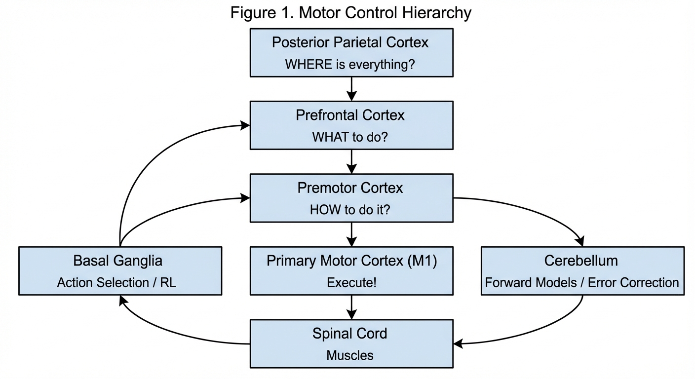
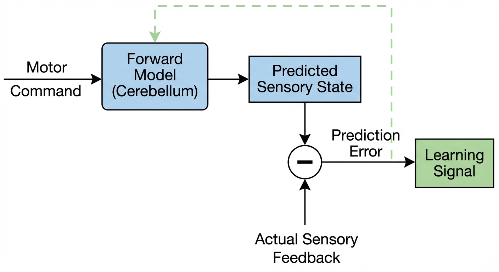
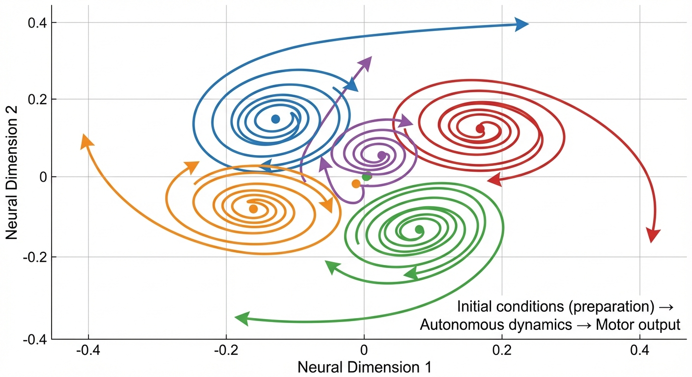
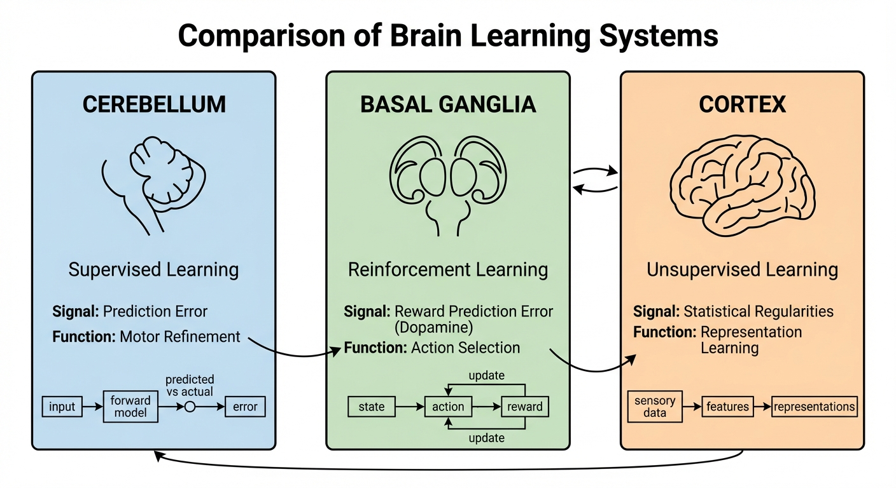

::: {.callout-note appearance="simple"}
## TL;DR

- **The brain's motor hierarchy** transforms goals into muscle commands through progressive refinement: Posterior Parietal Cortex → Premotor Cortex → Primary Motor Cortex → Spinal Cord
- **Dynamical systems view**: Motor cortex functions as a dynamical system where preparatory activity sets initial conditions — directly analogous to how diffusion/flow policies generate trajectories
- **Three learning systems work together**: Cerebellum (supervised learning via forward models), Basal ganglia (reinforcement learning via dopamine), Cortex (unsupervised representation learning)
- **Motor primitives and synergies** solve the degrees-of-freedom problem through dimensionality reduction — the biological basis for DMPs and skill-based learning in robotics
- **Key design principle**: The brain achieves flexible control through *structured simplification* — manifolds, synergies, and hierarchies that constrain the solution space
:::

## Why Neuroscience for Roboticists? {#sec-why}

As roboticists, we face a fundamental question: how do we build systems that can flexibly control high-dimensional bodies to accomplish diverse tasks? Evolution has already solved this problem. The human motor system can learn to play piano, throw a baseball, and perform surgery — all with the same hardware.

In this post, we'll explore how the brain plans and executes movements, with specific attention to insights that inform modern robot learning approaches. We'll see that many ideas in contemporary robotics — hierarchical control, motor primitives, forward models, reinforcement learning — have direct neural correlates. Understanding these connections can both validate our approaches and inspire new ones.

::: {.callout-tip appearance="simple"}
## Connections to the Series

This post connects neuroscience to concepts from previous posts:

- **[Diffusion Policy](../1-diffusion-policy/)**: Neural trajectory generation shares deep parallels with iterative denoising
- **[ACT (Action Chunking)](../1.5-action-chunking/)**: Motor primitives and synergies provide biological grounding for action chunks
- **[VLA Models](../3-vla-models/)**: Brain multimodal integration offers insights for vision-language-action fusion
:::

## The Motor Hierarchy: From Goals to Muscles {#sec-hierarchy}

The brain doesn't directly control individual muscles. Instead, a cascade of processing stages progressively transforms abstract goals into concrete motor commands — much like a corporate hierarchy where the CEO sets strategy, managers plan execution, and workers perform specific tasks.

### The Cortical Motor System

{#fig-motor-hierarchy}

| Brain Region | Primary Function | Robotics Analog |
|--------------|------------------|-----------------|
| **Posterior Parietal Cortex (PPC)** | Sensorimotor integration, spatial representation | Visual state estimation |
| **Prefrontal Cortex** | Goal selection, planning, consequences | Task planning, MDP formulation |
| **Premotor Cortex (PMC)** | Movement planning, coordinate transformation | Motion planning, trajectory optimization |
| **Supplementary Motor Area (SMA)** | Sequence generation, timing, self-initiated movement | Action sequencing, finite state machines |
| **Primary Motor Cortex (M1)** | Movement execution, output to spinal cord | Low-level motor control, torque commands |

: Brain regions and their robotics analogs {#tbl-regions}

### Information Flow

The flow of information follows a clear pattern, answering progressively more specific questions:

1. **Sensory Integration (PPC)**: Visual, tactile, and proprioceptive information converge. The PPC answers "*where is everything?*" — both the target and the body.

2. **Goal Selection (Prefrontal)**: Higher-level cognitive processing determines *what* to do based on context, rules, and anticipated consequences.

3. **Motor Planning (PMC/SMA)**: *How* to achieve the goal. PMC handles spatially-guided movements; SMA handles internally-generated sequences (like playing a memorized piano piece).

4. **Execution (M1)**: The final cortical output stage generates commands for spinal motor neurons.

Crucially, this isn't a rigid pipeline. Two major "side loops" modulate the flow:

- **Basal ganglia loop**: Selects which actions to execute (or suppress) based on expected reward
- **Cerebellar loop**: Refines execution using prediction errors

::: {.callout-note appearance="simple"}
## Key Insight: Coordinate Transformations

A central problem in motor control is **coordinate transformation**. When you reach for a coffee cup, your brain must convert:

1. **Visual coordinates** (where the cup appears on your retina)
2. **Head-centered coordinates** (accounting for eye position)
3. **Body-centered coordinates** (accounting for head position)
4. **Joint coordinates** (required joint angles)
5. **Muscle coordinates** (which muscles contract, how hard)

The brain solves this through **gradual transformation**: posterior parietal areas encode in extrinsic (world) coordinates, premotor areas show mixed coding, and M1 increasingly reflects intrinsic (muscle-like) representations. This suggests that multi-stage networks for visuomotor control may be more robust than direct end-to-end mappings.$^{[1]}$
:::

## The Cerebellum: Forward Models and Error Correction {#sec-cerebellum}

The cerebellum, containing more neurons than the rest of the brain combined, plays a crucial role in motor control through **predictive processing**. Understanding this system provides key insights for model-based control in robotics.

### Why Prediction Matters

Here's a simple thought experiment: sit in a dark theater watching a scary movie. If you accidentally bump your own arm reaching for popcorn, you won't be startled. But if the person next to you does the same thing, you might jump. Why?

The answer is **forward models**. Your brain predicts the sensory consequences of your own actions *before* sensory feedback arrives. When prediction matches reality, the sensation is suppressed.

### The Forward Model Hypothesis

The cerebellum implements **forward models** — neural circuits that predict sensory outcomes from motor commands:

{#fig-forward-model}

**Why is this critical?** Sensory delays are substantial:

- Visual feedback: 100-200ms
- Proprioception: 50-100ms

If you relied solely on feedback control, you'd perpetually lag behind reality — like trying to drive a car by looking in the rearview mirror. Forward models solve this by predicting where your limb *will be*, enabling anticipatory corrections.$^{[2]}$

### Cerebellar Learning

The cerebellum learns through **supervised learning** using a unique circuit:

- **Climbing fibers** from the inferior olive carry error signals (the teaching signal)
- Each Purkinje cell receives input from exactly one climbing fiber
- This error signal drives synaptic changes that improve future predictions
- Result: The forward model minimizes prediction errors over time

This is remarkably similar to supervised learning in neural networks, where backpropagation updates weights to minimize loss.$^{[3]}$

### Robotics Implications

| Cerebellar Function | Robotics Application |
|---------------------|---------------------|
| Forward models | Model Predictive Control (MPC), learned dynamics |
| Error-driven adaptation | Online motor adaptation, trajectory refinement |
| Timing precision | Coordinated multi-joint movements |
| Predictive correction | Disturbance rejection, feedforward control |

: Cerebellar functions and robotics applications {#tbl-cerebellum}

::: {.callout-warning appearance="simple"}
## The Online Adaptation Gap

The cerebellum enables continuous motor adaptation *during* movement — but most robot learning systems only adapt during *training*. At deployment, weights are frozen.

**Current state of the field:**

- **Locomotion**: RMA (Rapid Motor Adaptation) achieves true online adaptation without backpropagation — adjusting to terrain, payload, and damage in real-time$^{[14]}$
- **Manipulation**: No equivalent exists. Most "adaptation" means fine-tuning (requires gradient descent) or in-context learning (limited to demonstrations, not sensorimotor errors)

This is a **critical open problem**. The cerebellum's architecture suggests a path: use prediction errors (not just reward signals) to drive fast, local weight updates during deployment. Methods like feedback alignment or forward-forward learning may eventually enable this, but they currently trail backpropagation by 5-15% on vision benchmarks and haven't been validated for motor control.
:::

::: {.callout-tip appearance="simple"}
## Design Principle: Predict Then Correct

The cerebellar architecture suggests: **always predict sensory consequences of actions, then use prediction errors for rapid adaptation**. This is more robust than pure feedback control and faster than waiting for actual sensory feedback.

In robotics, this translates to:

- **Auxiliary prediction losses** during policy training (predict next state as a secondary task)
- **Model-based control** with learned dynamics (world models)
- **Online adaptation** using prediction errors when deployed
:::

## The Basal Ganglia: Reinforcement Learning in the Brain {#sec-basal-ganglia}

The basal ganglia implement action selection and reinforcement learning — arguably the most well-established bridge between neuroscience and ML.

### Dopamine and Reward Prediction Errors

In 1997, Schultz, Dayan, and Montague made a landmark discovery: dopamine neurons encode **temporal difference (TD) errors** — the same signal used in Q-learning and actor-critic algorithms.$^{[4]}$

Here's the intuition: imagine someone taps your shoulder and hands you a candy. Your dopamine neurons fire — that's a pleasant surprise! If they keep doing this every day, your dopamine neurons stop responding to the candy (it's expected now). Instead, they fire when you feel the shoulder tap — the *predictor* of reward.

**Dopamine neuron responses:**

- **Unpredicted reward**: Burst of activity (positive TD error)
- **Predicted reward received**: No change (TD error = 0)
- **Expected reward omitted**: Depression (negative TD error)

This is precisely the update signal in TD learning. The TD error measures surprise — how much better or worse things turned out than expected:

$$\delta_t = r_t + \gamma V(s_{t+1}) - V(s_t)$$ {#eq-td-error}

where $r_t$ is the reward, $\gamma$ is the discount factor, and $V(s)$ is the estimated value of state $s$.

### Go/NoGo Pathways

The basal ganglia implement action selection through competing pathways — think of it as a "gas pedal" and "brake pedal" for actions:

- **Direct Pathway (Go)**: D1 receptor neurons that promote selected actions
- **Indirect Pathway (NoGo)**: D2 receptor neurons that suppress competing actions

When dopamine bursts (positive surprise), it strengthens the Go pathway and weakens the NoGo pathway for that action — "do that again!" When dopamine dips (negative surprise), the opposite happens — "avoid that."

This architecture resembles the **advantage function** in actor-critic algorithms:

$$A(s,a) = Q(s,a) - V(s)$$ {#eq-advantage}

The direct pathway learns which actions have positive advantage (do this); the indirect pathway learns which have negative advantage (don't do that).

### Habits vs. Goal-Directed Behavior

The basal ganglia also mediate the transition from **goal-directed** to **habitual** behavior:

- **Goal-directed (dorsomedial striatum)**: Sensitive to outcome devaluation, requires deliberation
- **Habitual (dorsolateral striatum)**: Automatic stimulus-response, efficient but inflexible

With practice, control shifts from medial to lateral striatum — computationally expensive planning is "compiled" into fast, automatic routines. This is why experts can perform complex skills without conscious thought.$^{[5]}$

::: {.callout-warning appearance="simple"}
## Common Misconception: RL Does Everything

A common assumption in robot learning is that end-to-end RL should handle all aspects of motor control. But the brain maintains **separate systems for "what to do" (value-based) and "how to do it" (motor skill)**:

1. **RL (basal ganglia)**: Which skill to execute, when to switch
2. **Supervised learning (cerebellum)**: How to execute each skill precisely
3. **Habit formation**: Compile deliberate actions into fast routines

This separation may explain why end-to-end RL struggles with dexterous manipulation — it's trying to do multiple jobs at once. Consider architectures that separate action selection from motor execution.
:::

## Dynamical Systems View of Motor Cortex {#sec-dynamics}

Perhaps the most revolutionary recent insight is that motor cortex functions as a **dynamical system**, not a representational map. This perspective has profound implications for how we design robot control policies.

### The Traditional View (Challenged)

Classically, motor cortex neurons were thought to represent movement parameters:

- Direction (Georgopoulos' population vector)
- Velocity, force, muscle activity

Under this view, decoding movement is like reading a map — each neuron tells you something specific about the intended movement.

### The Dynamical Systems View

Churchland, Shenoy, and colleagues showed that motor cortex population activity exhibits **rotational dynamics** — lawful oscillatory patterns during reaching, even though reaching itself is non-periodic.$^{[6]}$

{#fig-dynamics}

**Key findings:**

1. Neural activity lies on a **low-dimensional manifold** (~10-20 dimensions for arm movements)
2. Preparatory activity sets **initial conditions** that seed subsequent dynamics
3. The system evolves **autonomously** according to intrinsic network dynamics
4. ~50-70% of variance is captured by rotational structure

### The "Whirlpool" Analogy

Imagine dropping a rubber duck into a whirlpool. Where the duck enters determines its subsequent path — but once it's in the water, the whirlpool's dynamics take over. You don't need to continuously guide the duck; you just set the initial position correctly.

Motor cortex works similarly:

- **Preparation** = positioning the duck (setting initial conditions)
- **Execution** = the whirlpool dynamics (autonomous evolution)
- **Movement** = where the duck goes (motor output)

This reframes the question from "what does preparatory activity encode?" to "what initial state does it establish?"

### Why This Matters for Robotics

| Neural Finding | Robotics Implication |
|----------------|---------------------|
| Low-dimensional manifolds | Policy latent spaces should be ~10-20 dimensions |
| Rotational dynamics | RNNs with complex eigenvalues may capture motor cortex computation |
| Initial condition hypothesis | Allow "preparation time" for policy networks to settle into correct states |
| Autonomous evolution | Once initialized, minimal top-down control needed |

: Dynamical systems findings and robotics implications {#tbl-dynamics}

::: {.callout-tip appearance="simple"}
## Connection to Diffusion and Flow Models

The dynamical systems view of motor cortex resonates deeply with **diffusion and flow-based policies** from [Part 1](../1-diffusion-policy/):

- **Flow matching** learns velocity fields that transport distributions — analogous to motor cortex dynamics generating trajectories
- **Diffusion policies** iteratively refine noise into actions — like neural states progressively specifying movements
- **Conditioning** sets the initial state of the generative process, just as preparatory activity seeds motor cortex dynamics

This suggests current policy architectures may be more neurally plausible than previously thought. The success of these methods may partly reflect their alignment with how biological motor systems actually work.
:::

## Motor Primitives and Muscle Synergies {#sec-primitives}

How does the brain handle the enormous redundancy in motor control? Through **modularity** — composable building blocks that dramatically simplify the control problem.

### Bernstein's Degrees of Freedom Problem

The human body has hundreds of degrees of freedom: the elbow has 2 (flexion/extension), the shoulder has 6 (flexion, extension, abduction, adduction, internal/external rotation). Add in all joints and the many muscles controlling them, and you have an enormous **inverse kinematics** problem — infinite solutions exist for most tasks.

This is Bernstein's famous "degrees of freedom problem" (1967): how does the CNS manage this complexity?$^{[7]}$

**Bernstein's insight**: The CNS doesn't control each degree of freedom independently. Instead, it couples them into **synergies** — coordinated patterns that reduce the effective dimensionality.

### Motor Primitives: The Building Blocks

**Motor primitives** are hypothesized building blocks of movement — like LEGO pieces that can be combined to build complex structures, or words that combine into sentences.

**Evidence from spinal cord studies:**

- Stimulating different spinal regions produces distinct **force fields**
- Simultaneous stimulation results in **vector summation** of fields
- Spinalized frogs can still produce coordinated movements

This suggests that even at the spinal level, movement is constructed from modular components — a "vocabulary" of primitives.$^{[8]}$

### Muscle Synergies

**Muscle synergies** formalize this idea mathematically. Instead of controlling $M$ muscles independently, the CNS activates $K$ synergies (where $K \ll M$):

$$\mathbf{m}(t) = \sum_{i=1}^{K} c_i(t) \cdot \mathbf{s}_i$$ {#eq-synergy}

where:

- $\mathbf{m}(t)$ = muscle activation vector at time $t$
- $\mathbf{s}_i$ = fixed synergy vector (which muscles activate together)
- $c_i(t)$ = time-varying activation coefficient

**Key finding**: Studies show >10-fold dimensionality reduction — controlling dozens of muscles through just a handful of synergy activations.

### Dynamic Movement Primitives (DMPs)

The robotics community has formalized motor primitives as **Dynamic Movement Primitives**. The core idea is to take a stable dynamical system (like a damped spring) and add a learned "forcing function" that shapes the trajectory:

$$\tau \ddot{y} = \alpha(\beta(g - y) - \dot{y}) + f(x)$$ {#eq-dmp}

where:

- $g$ = goal position (the attractor)
- $\alpha, \beta$ = damping parameters (ensure stability)
- $f(x)$ = learned forcing function (shapes the path)
- $\tau$ = time scaling factor

**Properties that make DMPs powerful:**

- **Stability guarantees**: Always converges to goal (attractor dynamics)
- **Temporal scaling**: Speed up or slow down by adjusting $\tau$
- **Spatial scaling**: Adapt to different goal positions
- **Learning from demonstration**: $f(x)$ can be learned from a single demo$^{[9]}$

::: {.callout-note appearance="simple"}
## The Compositional Advantage

Motor primitives enable **skill composition** — building complex behaviors from simple parts:

1. **Sequential composition**: Chain primitives into complex sequences (like phonemes → words → sentences)
2. **Parallel composition**: Combine primitives for multi-effector coordination
3. **Weighted blending**: Interpolate between primitives for novel movements

This is precisely the approach used in hierarchical RL and skill-based learning. The biological evidence validates the computational utility of modular, composable representations.
:::

## The Neural Manifold Hypothesis {#sec-manifold}

Neural activity in motor cortex doesn't fill the full space of possible firing patterns. Instead, it's constrained to **low-dimensional manifolds** — a finding with direct implications for robot learning.

### What Are Neural Manifolds?

Despite motor cortex containing millions of neurons, population activity during reaching can be described by ~10-20 dimensions. These dimensions are spanned by **neural modes** — patterns of correlated activity that reflect network connectivity.

Think of it like this: if you recorded 1000 neurons but their activity was perfectly correlated, you'd really only have 1 dimension of information. Neural manifolds capture this redundancy — high-dimensional recordings collapse onto low-dimensional structure.

### Within-Manifold vs. Outside-Manifold Learning

Brain-machine interface experiments reveal a striking dissociation:

- **Within-manifold perturbations**: Require adjusting the relative activation of existing neural modes → **Fast learning** (minutes to hours)
- **Outside-manifold perturbations**: Require acquiring entirely new neural modes → **Slow learning** (days to weeks)

This suggests that rapid skill acquisition operates within existing neural structure, while learning fundamentally new skills requires restructuring the manifold itself.$^{[10]}$

### Implications for Robot Learning

| Neural Manifold Finding | Robotics Application |
|------------------------|---------------------|
| Low-dimensional structure | VAEs, latent space policies |
| Within-manifold learning is fast | Fine-tuning within learned representations |
| Outside-manifold learning is slow | Pre-training matters; new skills may require architectural changes |
| Manifolds reflect network connectivity | Network architecture constrains learnable behaviors |

: Neural manifold findings and robotics applications {#tbl-manifold}

::: {.callout-warning appearance="simple"}
## Common Misconception: More Dimensions = Better

It might seem that higher-dimensional latent spaces would be more expressive. But neural manifold research suggests otherwise — **constraining to low-dimensional manifolds may actually improve learning** by reducing the search space while preserving task-relevant structure.

This aligns with the success of VAEs and other dimensionality-reduction approaches in robot learning. The "right" dimensionality appears to be task-dependent but often surprisingly small (~10-20 for many manipulation tasks).
:::

## Three Learning Systems in Synergy {#sec-three-systems}

The brain implements three distinct learning mechanisms that work together — a "super-learning" system that robotics might emulate.

{#fig-three-systems}

| Structure | Learning Type | Signal | Function |
|-----------|---------------|--------|----------|
| **Cerebellum** | Supervised | Prediction error (climbing fibers) | Motor refinement, forward models |
| **Basal Ganglia** | Reinforcement | Reward prediction error (dopamine) | Action selection, value learning |
| **Cortex** | Unsupervised | Statistical regularities | Representation learning |

: The brain's three learning systems {#tbl-learning}

### The Super-Learning Hypothesis

Recent computational models propose these systems form an **integrated super-learner**:$^{[11]}$

1. **Cortex** extracts useful representations from sensory data (unsupervised)
2. **Basal ganglia** learn which actions are valuable given those representations (RL)
3. **Cerebellum** refines execution using prediction errors (supervised)

Each system's output influences the others:

- Cortical representations define the state space for basal ganglia RL
- Basal ganglia action selection determines which movements get cerebellar refinement
- Cerebellar predictions shape cortical expectations

### When Systems Switch

Research shows the brain can dynamically switch between learning modes. When visual feedback is reliable, the cerebellum dominates (error-based learning). When visual feedback is distorted or unreliable, the system shifts to basal ganglia reinforcement learning (reward-based learning).$^{[12]}$

::: {.callout-tip appearance="simple"}
## Design Principle: Division of Learning Labor

Don't use a single learning algorithm for everything. Consider:

- **World models** (cerebellum-like): Predict dynamics, enable MPC
- **RL** (basal ganglia-like): Learn which skills to deploy when
- **Representation learning** (cortex-like): Extract useful features from perception

This separation may be key to scaling robot learning. Each component can be trained with the most appropriate algorithm and data.
:::

## Optimal Feedback Control {#sec-ofc}

Todorov and Jordan's **Optimal Feedback Control (OFC)** theory provides a normative framework that explains many features of biological motor control — and offers principles for robotics.$^{[13]}$

### The Minimum Intervention Principle

OFC proposes that the CNS optimizes a cost function while following the **minimum intervention principle**:

> Only correct deviations that interfere with task goals.

**Intuition**: If you're reaching for a cup and your hand drifts slightly left (but will still reach the cup), the brain doesn't waste effort correcting it. But if you're threading a needle, tiny deviations matter and get corrected immediately.

**Implications:**

- **Task-irrelevant variability** is allowed (and expected)
- **Task-relevant errors** are quickly corrected
- Feedback gains are tuned to task demands, not generically

### Motor Equivalence

OFC explains **motor equivalence** — achieving the same goal with different movements. If you hold a pen and someone bumps your elbow, you don't just correct the elbow; you coordinate the whole arm to keep the pen on target.

This requires:

1. Knowing the task goal (pen position)
2. Predicting how perturbations affect the goal
3. Distributing corrections across redundant DOFs optimally

### Robotics Applications

| OFC Concept | Robotics Application |
|-------------|---------------------|
| Minimum intervention | Null-space optimization |
| Task-space control | Operational space control |
| State-dependent feedback | Model Predictive Control |
| Redundancy exploitation | Manipulability optimization |

: OFC concepts and robotics applications {#tbl-ofc}

## Connections to Modern Robot Learning {#sec-connections}

Let's explicitly connect the neuroscience we've covered to contemporary robotics approaches.

### Diffusion Models and Neural Stochastic Processes

**Neural parallel**: Motor planning involves sampling from multimodal trajectory distributions; the brain doesn't commit to a single trajectory but represents distributions over possible movements.

**Connection**: Diffusion policies generate action trajectories by iteratively denoising — similar to how preparatory neural states progressively specify movements. The score function may be analogous to how the brain computes gradients in state space to guide trajectory selection.

### Flow Matching and Trajectory Generation

**Neural parallel**: Motor cortex exhibits smooth rotational dynamics — trajectories through neural state space that generate motor commands.

**Connection**: Flow matching learns velocity fields that transport noise to actions. The learned velocity field is analogous to the vector field governing neural population dynamics. Both produce smooth, continuous trajectories from initial conditions.

### Hierarchical Control

**Neural parallel**: The motor hierarchy operates at different timescales — slow goal selection in prefrontal cortex (~seconds), faster motor planning in premotor areas (~100ms), rapid execution in M1 (~10ms).

**Connection**: Hierarchical RL with temporal abstraction mirrors this organization. High-level policies operate slowly (selecting options/skills); low-level policies execute rapidly. The biological evidence suggests this separation is computationally beneficial, not just convenient.

### VLA Models and Multimodal Integration

**Neural parallel**: The brain integrates vision and language in specific regions (superior temporal cortex, inferior parietal cortex), with action-specific representations in dorsal stream areas.

**Connection**: [VLA models](../3-vla-models/) might benefit from:

- Maintaining separate action-specific visual representations (dorsal stream-like)
- Learning to predict sensory consequences (forward models)
- Incorporating temporal dynamics rather than single-frame processing

## Principles for Neurally-Inspired Robotics {#sec-principles}

Based on this neuroscience review, here are actionable principles for robot learning:

### 1. Structure Latent Spaces to Reflect Neural Manifolds

Design policy architectures where the latent space has similar dimensionality to motor cortex manifolds (~10-20 dimensions for arm movements). Consider initializing RNN dynamics with rotational structure (complex eigenvalues).

### 2. Implement Dual Timescale Control

- **Fast inner loop**: Reactive control with forward model predictions (cerebellum-like, ~10-50Hz)
- **Slow outer loop**: Goal-directed planning with value estimates (cortex/basal ganglia-like, ~1-5Hz)

Train these separately, then combine.

### 3. Use Stochastic Policies with Structured Noise

The brain's motor variability is structured — exploration is task-relevant. Consider diffusion/flow policies that represent trajectory distributions, allowing multimodal solutions.

### 4. Incorporate Predictive Error Signals

Add sensory prediction as an auxiliary task during policy learning. Use prediction errors for online adaptation (like cerebellar learning). This enables faster adaptation to perturbations.

### 5. Design Modular Primitive Libraries

Learn dictionaries of movement primitives (DMPs, skills) that can be flexibly combined. High-level policies select and sequence primitives rather than generating raw actions — similar to the ACT approach in [Part 1.5](../1.5-action-chunking/).

### 6. Respect Biological Timing Constraints

Incorporate realistic sensor delays (50-100ms visual, 10-20ms proprioception). This encourages learning predictive control strategies and may improve sim-to-real transfer by matching biological sensorimotor loops.

## Summary {#sec-summary}

::: {.callout-note appearance="simple"}
## Summary

The brain's motor system reveals elegant solutions to problems that roboticists grapple with daily. Rather than brute-force controlling every degree of freedom, the brain employs **structured simplification**:

**Key mechanisms:**

- **Hierarchical processing** progressively transforms goals into muscle commands
- **Forward models** (cerebellum) enable predictive control despite sensory delays
- **Reinforcement learning** (basal ganglia) selects valuable actions
- **Motor primitives and synergies** reduce dimensionality by >10×
- **Neural manifolds** constrain activity to low-dimensional, learnable subspaces
- **Dynamical systems** generate trajectories from initial conditions

**The unifying insight**: The brain achieves flexible, robust control not through brute-force computation, but through **constraints that simplify while maintaining flexibility**.

Modern robot learning is converging on similar principles:

| Challenge | Neural Solution | Robotics Implementation |
|-----------|-----------------|------------------------|
| High-dimensional control | Synergies, manifolds | Latent space policies, DMPs |
| Sensor delays | Forward models | MPC, learned dynamics |
| Action selection | Basal ganglia RL | Actor-critic, hierarchical RL |
| Trajectory generation | Dynamical systems | Flow matching, diffusion policies |
| Coordinate transformation | Gradual hierarchy | Multi-stage networks |
| Compositionality | Motor primitives | Skill libraries, options |

The neuroscience validates these approaches and suggests further directions — particularly the importance of **separating learning systems** (supervised, reinforcement, unsupervised) and **respecting natural timescales** in hierarchical control.
:::

::: {.callout-note appearance="simple"}
## What's Next?

In future posts, we'll explore:

- **Part 5**: Specific implementations of neurally-inspired robot learning systems
- **Part 6**: The remaining gaps between biological and artificial motor intelligence
:::

## References {#sec-references}

[1] [Scott (2004). Optimal feedback control and the neural basis of volitional motor control. *Nature Reviews Neuroscience*.](https://www.nature.com/articles/nrn1427)

[2] [Wolpert, Miall & Kawato (1998). Internal models in the cerebellum. *Trends in Cognitive Sciences*.](https://www.cell.com/trends/cognitive-sciences/abstract/S1364-6613(98)01221-2)

[3] [Marr (1969). A theory of cerebellar cortex. *Journal of Physiology*.](https://www.ncbi.nlm.nih.gov/pmc/articles/PMC1351491/)

[4] [Schultz, Dayan & Montague (1997). A neural substrate of prediction and reward. *Science*.](https://www.science.org/doi/abs/10.1126/science.275.5306.1593)

[5] [Doya (2000). Complementary roles of basal ganglia and cerebellum in learning and motor control. *Current Opinion in Neurobiology*.](https://www.sciencedirect.com/science/article/abs/pii/S0959438800001537)

[6] [Churchland et al. (2012). Neural population dynamics during reaching. *Nature*.](https://www.nature.com/articles/nature11129)

[7] Bernstein (1967). *The Coordination and Regulation of Movements*. Pergamon Press.

[8] [Bizzi & Cheung (2013). The neural origin of muscle synergies. *Frontiers in Computational Neuroscience*.](https://www.frontiersin.org/journals/computational-neuroscience/articles/10.3389/fncom.2013.00051/full)

[9] [Ijspeert et al. (2013). Dynamical Movement Primitives: Learning Attractor Models for Motor Behaviors. *Neural Computation*.](https://direct.mit.edu/neco/article-abstract/25/2/328/7850/Dynamical-Movement-Primitives-Learning-Attractor)

[10] [Sadtler et al. (2014). Neural constraints on learning. *Nature*.](https://www.nature.com/articles/nature13665)

[11] [Baladron et al. (2023). The contribution of the basal ganglia and cerebellum to motor learning. *PLOS Computational Biology*.](https://journals.plos.org/ploscompbiol/article?id=10.1371/journal.pcbi.1011024)

[12] [Izawa & Shadmehr (2011). Learning from sensory and reward prediction errors during motor adaptation. *PLOS Computational Biology*.](https://journals.plos.org/ploscompbiol/article?id=10.1371/journal.pcbi.1002012)

[13] [Todorov & Jordan (2002). Optimal feedback control as a theory of motor coordination. *Nature Neuroscience*.](https://www.nature.com/articles/nn963)

[14] [Kumar et al. (2021). RMA: Rapid Motor Adaptation for Legged Robots. *RSS*.](https://arxiv.org/abs/2107.04034)

### Additional Resources

- [Merel et al. (2019). Hierarchical motor control in mammals and machines. *Nature Communications*.](https://www.nature.com/articles/s41467-019-13239-6) — Connecting neural hierarchies to hierarchical RL.

- [Vyas et al. (2020). Computation through neural population dynamics. *Annual Review of Neuroscience*.](https://www.annualreviews.org/doi/10.1146/annurev-neuro-092619-094115) — Comprehensive review of the dynamical systems perspective.

---

*This post synthesizes insights from motor neuroscience for robotics researchers. For background on the robot learning approaches mentioned here, see [Part 1: Diffusion Policy](../1-diffusion-policy/), [Part 1.5: ACT](../1.5-action-chunking/), and [Part 3: VLA Models](../3-vla-models/).*
