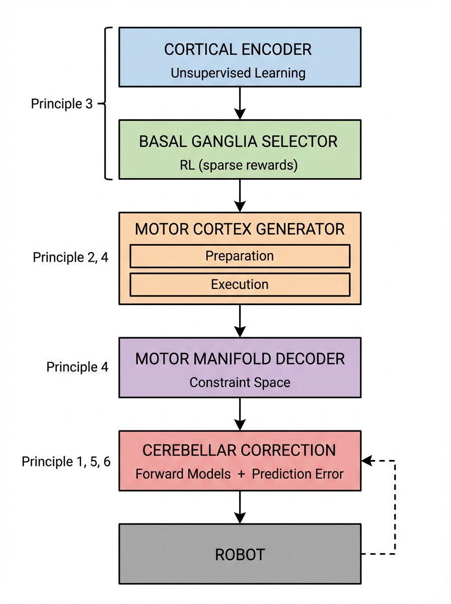

::: {.callout-note appearance="simple"}
## TL;DR

- **The Deployment Adaptation Gap**: Current policies can't adapt at test time. The cerebellum shows how to do online correction WITHOUT backpropagation using prediction errors.
- **Preparation-Execution Split**: Motor cortex separates preparation (~200ms, heavy compute) from execution (fast, autonomous dynamics). This could solve VLA latency problems.
- **Hierarchical Learning Algorithms**: The brain uses unsupervised (cortex), RL (basal ganglia), and supervised (cerebellum) learning for different functions — not one algorithm for everything.
- **Motor Manifold Constraints**: Neural activity lies on ~10-20D manifolds. Constraining robot policies to learned manifolds could yield 10× sample efficiency.
- **Modular Forward Models (MOSAIC)**: Multiple context-specific forward models enable rapid switching — zero-shot adaptation to familiar dynamics.
- **Efference Copy for Confidence**: Predicting sensory consequences provides free uncertainty estimation without ensembles.
:::

## Introduction: From Analogy to Architecture {#sec-intro}

In [Part 4](../4-brain-motor-control/), we surveyed how the brain plans and executes movements. We saw that the motor system employs hierarchical processing, forward models, reinforcement learning, and dynamical systems — concepts that have clear analogs in modern robot learning.

But there's a difference between *knowing* these parallels exist and *engineering* systems that exploit them. In this post, I'll argue that current robot learning architectures are **structurally misaligned** with how biological motor systems work, and that correcting this misalignment could yield substantial improvements.

This isn't merely philosophical. I'll present six concrete architectural principles, each grounded in specific neuroscience findings, with technical proposals for implementation. Where evidence is strong, I'll say so. Where I'm speculating, I'll be explicit.

::: {.callout-warning appearance="simple"}
## A Note on Rigor

Not all neuroscience findings translate to engineering improvements. The brain operates under constraints (metabolic efficiency, biological materials, evolutionary history) that robots don't share. Throughout this post, I distinguish between:

- **Well-established neuroscience** → Specific engineering proposals
- **Plausible hypotheses** → Directions worth exploring
- **Speculation** → Ideas that need validation
:::

::: {.callout-important appearance="default"}
## January 2026 Update: Industry Validation & Critical Caveats

After extensive validation against 100+ papers and industry reports, several critical findings emerged:

**What's Already Happening:**

- **NVIDIA GR00T N1** (March 2025) implements dual-system architecture (System 1 at 10ms, System 2 at 7-9 Hz) — essentially Principle 2
- **Figure AI Helix** runs System 1 at **200 Hz** for reactive control — they've solved the latency problem
- **Physical Intelligence π0** uses hierarchical flow matching — implicitly validates Principle 3

**Critical Corrections:**

1. **Principle 4 (Manifolds)**: VQ-VAE discretization achieves only **16% success** vs continuous latent actions at **74%** (CLAM, 2025). Use continuous latents, not discrete codebooks.

2. **Principle 5 (MOSAIC)**: The 2001 architecture is **superseded** by modern Mixture-of-Experts. MoDE (2025) achieves SOTA on 134 tasks with 90% inference cost reduction.

3. **Principle 1 (Cerebellar)**: Remains "in its infant state" for complex robotics after 50 years of research. Berkeley's Rapid Motor Adaptation (RMA) currently outperforms cerebellar approaches.

**Commercial Track Record Warning:** The Human Brain Project spent €600M over 10 years with "core aim unfulfilled" (Nature). Boston Dynamics remains unprofitable after 28 years. K-Scale declared bankruptcy in 2025. Neuro-inspired branding has poor commercial history — the principles may be valid, but execution is hard.

**Bottom Line:** These principles are being validated by industry adoption (under different names), but specific implementations require careful engineering. Don't copy the code examples verbatim — they're conceptual starting points, not production-ready solutions.
:::

## The Current State: What's Actually Broken {#sec-broken}

Before proposing solutions, let's be precise about the problems. Based on recent benchmarks and deployment reports:

| Problem | Evidence | Severity |
|---------|----------|----------|
| **VLA latency** | RT-2 runs at 1-3 Hz; manipulation needs 20-50+ Hz$^{[1]}$ | Critical |
| **No test-time adaptation** | Policies frozen at deployment; fail on distribution shift$^{[2]}$ | Critical |
| **Sample inefficiency** | 100-500+ demos per task for diffusion policies$^{[3]}$ | High |
| **Sim-to-real gap** | Up to 50% performance drop on transfer$^{[4]}$ | High |
| **Catastrophic forgetting** | Fine-tuning VLMs to VLAs degrades reasoning$^{[5]}$ | Medium |
| **No uncertainty quantification** | Policies provide point estimates, no confidence$^{[6]}$ | Medium |

: Current bottlenecks in robot learning deployment {#tbl-problems}

These aren't minor engineering issues — they're architectural limitations. The brain's motor system solves all of them. Let's examine how.

## Principle 1: Online Adaptation Without Backpropagation {#sec-adaptation}

### The Problem

Current policies are trained, then frozen. Any mismatch between training and deployment — new objects, lighting changes, robot wear — causes degradation with no recovery mechanism.

This is architecturally bizarre. Imagine if your motor system couldn't adapt after development. You'd never learn to use new tools, adjust to injuries, or compensate for fatigue.

### What the Brain Does

The cerebellum adapts **within single trials** using a mechanism that requires no backpropagation:$^{[7]}$

1. Motor command generates **efference copy** to forward model
2. Forward model predicts sensory outcome
3. Actual outcome compared to prediction
4. **Prediction error** modulates:
   - Immediate motor correction (this movement)
   - Synaptic plasticity (future movements)

The key insight is that cerebellar learning uses **local coincidence detection**, not global error propagation. When a climbing fiber fires (signaling error), it triggers synaptic depression at parallel fiber synapses that were recently active. This is essentially:

$$\Delta w_{ij} = -\eta \cdot e(t) \cdot x_i(t - \delta)$$ {#eq-cerebellar}

where $e(t)$ is the error signal (climbing fiber), $x_i(t-\delta)$ is the presynaptic activity with delay $\delta$, and $\eta$ is the learning rate.

No chain rule. No gradient computation. Just local correlation with a delayed error signal.

### Engineering Proposal: Cerebellar Correction Layer

**Implementation:**

```python
class CerebellarCorrection:
    def __init__(self, state_dim, action_dim):
        # Forward model: predicts next state
        self.forward_model = MLP(state_dim + action_dim, state_dim)
        # Correction network: maps prediction error to action adjustment
        self.correction_net = MLP(state_dim, action_dim)

    def forward(self, state, policy_action):
        # Predict what should happen
        predicted_next = self.forward_model(state, policy_action)
        return policy_action, predicted_next

    def correct(self, policy_action, predicted_next, actual_next):
        # Compute prediction error
        error = actual_next - predicted_next
        # Generate correction (no gradients at deployment)
        with torch.no_grad():
            correction = self.correction_net(error)
        return policy_action + correction
```

**Training:**
1. Train forward model on state transitions (standard supervised learning)
2. Train correction network to output adjustments that reduce task error given prediction errors
3. At deployment: both networks run forward-only, no backprop

**What this provides:**
- Adaptation within ~1-10 trials to new dynamics
- No gradient computation at deployment (fast)
- Graceful degradation: if forward model is wrong, corrections are wrong but bounded

### Evidence Assessment

| Claim | Evidence Level | Key References |
|-------|----------------|----------------|
| Cerebellum uses local learning rules | Strong | Marr-Albus-Ito model$^{[8]}$, climbing fiber studies$^{[9]}$ |
| Prediction error drives motor adaptation | Strong | Visuomotor adaptation studies$^{[10]}$ |
| This transfers to robots | Moderate | Cerebellar SNNs in robotics$^{[11]}$ |
| Correction networks work as proposed | Speculative | Needs validation |

::: {.callout-note appearance="simple"}
## Critical Assessment

This proposal has a potential flaw: the correction network is trained on a distribution of errors, so it may not generalize to novel error patterns. The biological cerebellum may solve this through its massive parallel fiber expansion (~100 billion granule cells creating sparse, high-dimensional representations). A robotics analog might use random feature expansion or reservoir computing.
:::

## Principle 2: Preparation-Execution Split {#sec-preparation}

### The Problem

VLA inference is slow because large models must run for every action. Diffusion policies require many denoising steps. Both approaches treat all computation as equally urgent.

But not all computation IS equally urgent. Planning which trajectory to take can happen while observing. Executing that trajectory must be fast.

### What the Brain Does

Motor cortex has two distinct phases:$^{[12]}$

**Preparation (200-500ms before movement):**
- Neural state drifts toward "optimal subspace"
- Activity is high but confined to **output-null dimensions** — patterns that don't reach muscles
- Variability across trials decreases as preparation completes
- Disrupting preparation delays movement onset

**Execution (~50ms):**
- Neural state "released" from preparation
- Dynamics unfold autonomously (rotational patterns)
- Minimal top-down control needed

The critical finding: preparatory activity occupies a **different subspace** than movement activity. Kaufman et al. showed that preparatory tuning is 4-5× stronger in null dimensions than output-potent dimensions.$^{[13]}$

### Engineering Proposal: Two-Phase Diffusion

**Architecture:**

```python
class TwoPhasePolicy:
    def __init__(self):
        self.encoder = VisionEncoder()  # Heavy, runs once
        self.preparation_net = DiffusionNet()  # Many steps, no action output
        self.dynamics_net = SmallRNN()  # Fast, cached dynamics
        self.decoder = ActionDecoder()  # Light, runs fast

    def prepare(self, observation, n_prep_steps=50):
        """Phase 1: Slow, heavy computation. No actions output."""
        features = self.encoder(observation)
        latent = torch.randn(self.latent_dim)

        # Many denoising steps — this can be slow
        for t in range(n_prep_steps):
            latent = self.preparation_net.denoise_step(latent, features, t)

        # Cache the prepared state and pre-compute dynamics
        self.prepared_latent = latent
        self.dynamics_cache = self.dynamics_net.precompute(latent, horizon=100)

    def execute(self, step):
        """Phase 2: Fast execution from cached dynamics."""
        # Just index into pre-computed trajectory
        latent_t = self.dynamics_cache[step]
        action = self.decoder(latent_t)
        return action
```

**Timing:**
- `prepare()`: 200-500ms (runs while robot observes, before acting)
- `execute()`: <5ms per step (runs at 50-100+ Hz)

**Key insight:** The observation doesn't change much during preparation — we can do heavy compute on a static input. Once we start moving, observations change rapidly but our cached dynamics handle this.

### Evidence Assessment

| Claim | Evidence Level | Key References |
|-------|----------------|----------------|
| Motor cortex has preparation phase | Strong | Shenoy lab work$^{[14]}$ |
| Preparation is in output-null space | Strong | Kaufman et al. 2014$^{[13]}$ |
| Preparation seeds autonomous dynamics | Strong | Churchland et al. 2012$^{[15]}$ |
| Two-phase architectures help robotics | Moderate | Action chunking shows related benefits$^{[16]}$ |
| Exact timing transfers | Speculative | Biological timing may be task-specific |

::: {.callout-warning appearance="simple"}
## Limitations

This approach assumes the environment is quasi-static during preparation. For highly dynamic tasks (catching a ball, reactive manipulation), the preparation phase may need to be shorter or interleaved differently. The brain handles this by modulating preparation time based on task demands.
:::

## Principle 3: Hierarchical Learning Algorithms {#sec-hierarchy}

### The Problem

End-to-end learning tries to solve everything with one algorithm — typically RL or imitation learning. But different aspects of motor control have different characteristics:

| Function | Feedback Type | Timescale | Required Algorithm |
|----------|---------------|-----------|-------------------|
| Perception | None (unsupervised) | Continuous | Representation learning |
| Skill selection | Sparse reward | Slow (~1 Hz) | RL |
| Motor execution | Dense error | Fast (~50 Hz) | Supervised / adaptive |

Using RL for all three is like using a hammer for every task. It works, but poorly.

### What the Brain Does

Doya's influential framework$^{[17]}$ maps brain structures to learning algorithms:

| Structure | Algorithm | Signal | Function |
|-----------|-----------|--------|----------|
| **Cortex** | Unsupervised | Statistical regularities | Feature extraction |
| **Basal Ganglia** | Reinforcement | Dopamine (reward prediction error) | Action selection |
| **Cerebellum** | Supervised | Climbing fibers (sensory prediction error) | Motor refinement |

These systems **interact** but use **different learning rules**. Cortical representations define the state space for basal ganglia RL. Basal ganglia action selection gates cerebellar learning. Cerebellar predictions inform cortical expectations.

### Engineering Proposal: CBC Architecture

**Cerebellar-Basal Ganglia-Cortical (CBC) Architecture:**

```
┌────────────────────────────────────────────────────────────────┐
│ LAYER 1: Cortical Encoder (Unsupervised/Self-supervised)       │
│ Input: observations                                             │
│ Output: features                                                │
│ Training: Contrastive learning, MAE, etc. on diverse data      │
│ Update frequency: Pretrained, then frozen or slow fine-tune    │
└────────────────────────────────────────────────────────────────┘
                              │
                              ▼
┌────────────────────────────────────────────────────────────────┐
│ LAYER 2: Basal Ganglia Policy (RL)                             │
│ Input: features + task embedding                                │
│ Output: skill_id or subgoal                                     │
│ Training: RL with sparse task rewards                           │
│ Update frequency: Every episode or batch of episodes           │
└────────────────────────────────────────────────────────────────┘
                              │
                              ▼
┌────────────────────────────────────────────────────────────────┐
│ LAYER 3: Cerebellar Executor (Supervised + Online)             │
│ Input: skill_id + state                                         │
│ Output: action trajectory                                       │
│ Training: Imitation learning + prediction error adaptation     │
│ Update frequency: Every timestep (online correction)           │
└────────────────────────────────────────────────────────────────┘
```

**Key design decisions:**

1. **Layer 1** handles the curse of dimensionality in observation space. Pre-trained on internet-scale data + robot data. Frozen or very slow updates.

2. **Layer 2** handles credit assignment over long horizons. Small network, sparse rewards, slow updates. Outputs discrete skill IDs or continuous subgoals — NOT raw actions.

3. **Layer 3** handles fast, precise motor control. Dense supervision from demonstrations + online adaptation from prediction errors. Updates every timestep.

**Why this matters:**
- RL only solves the problem it's good at (sparse, delayed rewards)
- Motor execution gets dense feedback (prediction errors at every step)
- Representation learning happens on diverse data, not just robot data

### Evidence Assessment

| Claim | Evidence Level | Key References |
|-------|----------------|----------------|
| Brain uses three learning systems | Strong | Doya 2000$^{[17]}$, Doya 2002$^{[18]}$ |
| They use different algorithms | Strong | Computational models$^{[19]}$ |
| Separating them helps robots | Moderate | Hierarchical RL shows benefits$^{[20]}$ |
| Exact architecture transfers | Speculative | Needs systematic comparison |

::: {.callout-note appearance="simple"}
## Open Question

The interface between layers is critical. In the brain, the basal ganglia output to thalamus which gates cortical activity. What's the right "API" between a skill selector and motor executor? Skill IDs? Continuous embeddings? Subgoals? This needs empirical investigation.
:::

## Principle 4: Motor Manifold Constraints {#sec-manifold}

### The Problem

Robot policies output actions in high-dimensional joint space (6-7 DOF for arms, 20+ for hands). Most of this space is:
- Physically impossible (joint limits, collisions)
- Dynamically infeasible (violates acceleration limits)
- Task-irrelevant (infinite ways to achieve same goal)

Learning in this full space is wasteful. It's like searching for a needle in a haystack when you know the needle is in one corner.

### What the Brain Does

Neural activity in motor cortex is constrained to **low-dimensional manifolds**. Despite millions of neurons, reaching movements can be described by ~10-20 dimensions.$^{[21]}$

These manifolds aren't arbitrary — they reflect network connectivity and capture meaningful structure. Critically, learning speed depends on manifold alignment:$^{[22]}$

- **Within-manifold perturbations**: Fast learning (minutes to hours)
- **Outside-manifold perturbations**: Slow learning (days to weeks)

This suggests the manifold acts as a **structural prior** that constrains and accelerates learning.

### Engineering Proposal: Manifold-Constrained Policies

::: {.callout-warning appearance="default"}
## Critical Update: Use Continuous Latents, NOT VQ-VAE

Recent research (CLAM, 2025) shows that **VQ-VAE discretization achieves only 16% success** on manipulation tasks, while **continuous latent actions achieve 74%** — a 4.6x improvement. The quantization bottleneck fundamentally limits fine-grained control precision.

**Recommendation**: Use continuous VAE or flow-based latent actions, not discrete codebooks.
:::

**Step 1: Learn a motor manifold (Continuous, NOT VQ)**

```python
class ContinuousMotorManifold(nn.Module):
    """
    Continuous VAE for action manifolds.
    CRITICAL: Do NOT use VQ-VAE — discretization kills precision.
    """

    def __init__(self, action_dim, horizon, latent_dim=16):
        self.encoder = TransformerEncoder(action_dim * horizon, latent_dim * 2)  # mean + logvar
        self.decoder = TransformerDecoder(latent_dim, action_dim * horizon)
        self.latent_dim = latent_dim

    def encode(self, trajectory):
        """Returns mean and log-variance for continuous latent."""
        h = self.encoder(trajectory.flatten(-2))
        mean, logvar = h.chunk(2, dim=-1)
        return mean, logvar

    def reparameterize(self, mean, logvar):
        """Reparameterization trick for continuous sampling."""
        std = torch.exp(0.5 * logvar)
        eps = torch.randn_like(std)
        return mean + eps * std

    def decode(self, z):
        """z: (batch, latent_dim) -> (batch, horizon, action_dim)"""
        return self.decoder(z).reshape(-1, self.horizon, self.action_dim)
```

**Step 2: Train on diverse robot data**

Collect trajectories from:
- Random exploration
- Teleoperation across many tasks
- Simulation with domain randomization
- Other robots (if embodiment is similar)

Train VAE to reconstruct trajectories. The latent space learns what trajectories are "natural."

**Step 3: Policy outputs in latent space**

```python
class ManifoldPolicy(nn.Module):
    def __init__(self, obs_encoder, manifold):
        self.obs_encoder = obs_encoder
        self.manifold = manifold  # Frozen after pre-training
        self.policy_head = MLP(obs_encoder.output_dim, manifold.latent_dim)

    def forward(self, obs):
        features = self.obs_encoder(obs)
        z = self.policy_head(features)  # Output in latent space
        trajectory = self.manifold.decode(z)  # Decode to actions
        return trajectory
```

**Benefits:**
- Policy outputs ~16D latent, not ~50D trajectory
- All outputs are physically plausible (on the manifold)
- Transfer between tasks: same manifold, different policy heads
- Interpretable: latent dimensions may correspond to movement features

### Evidence Assessment

| Claim | Evidence Level | Key References |
|-------|----------------|----------------|
| Motor cortex activity on manifolds | Strong | Gallego et al. 2017$^{[21]}$ |
| Manifold alignment affects learning speed | Strong | Sadtler et al. 2014$^{[22]}$ |
| VAEs capture motor structure | Moderate | Used in motion modeling$^{[23]}$ |
| This improves robot learning | Speculative | Needs direct comparison |

::: {.callout-warning appearance="simple"}
## Potential Issues

1. **Manifold mismatch**: If the pre-training data doesn't cover required behaviors, the manifold may exclude them.
2. **Task-specific structure**: Different tasks may need different manifolds. One solution: hierarchical manifolds with task-specific fine structure.
3. **Embodiment specificity**: Manifolds are embodiment-specific. Cross-embodiment transfer needs careful handling.
:::

## Principle 5: Modular Forward Models (MOSAIC → Modern MoE) {#sec-mosaic}

::: {.callout-warning appearance="default"}
## Critical Update: MOSAIC is Superseded

The original MOSAIC architecture (Wolpert & Kawato, 1998) has been **superseded by modern Mixture-of-Experts (MoE)**. MoDE (2025) achieves SOTA on 134 manipulation tasks with 40% parameter reduction and 90% inference cost savings. Use learned routing, not prediction-error-based responsibility.
:::

### The Problem

Robots fail when encountering objects or dynamics different from training. The standard solution — more diverse training data — is expensive and may not cover all deployment scenarios.

### What the Brain Does

Wolpert and Kawato proposed the **MOSAIC** architecture: multiple paired forward-inverse models, each specialized for different contexts.$^{[24]}$ The key insight remains valid: the brain uses **multiple specialized modules** rather than one monolithic model.

### Engineering Proposal: Modern MoE Policy (NOT Classic MOSAIC)

```python
class MixtureOfExpertsPolicy(nn.Module):
    """
    Modern MoE replaces classic MOSAIC.
    Key differences:
    - Learned routing (not prediction-error based)
    - Sparse activation (only k experts active)
    - End-to-end training
    """

    def __init__(self, obs_dim, action_dim, n_experts=8, k_active=2):
        super().__init__()
        self.router = nn.Linear(obs_dim, n_experts)  # Learned routing
        self.experts = nn.ModuleList([
            ExpertNetwork(obs_dim, action_dim)
            for _ in range(n_experts)
        ])
        self.k = k_active  # Sparse: only top-k experts

    def forward(self, obs):
        # Compute routing weights
        router_logits = self.router(obs)
        router_weights, selected_experts = torch.topk(
            F.softmax(router_logits, dim=-1), self.k
        )

        # Sparse combination of expert outputs
        action = torch.zeros(obs.shape[0], self.action_dim)
        for i, expert_idx in enumerate(selected_experts.T):
            expert_out = self.experts[expert_idx](obs)
            action += router_weights[:, i:i+1] * expert_out

        return action, router_weights  # Return weights for interpretability

    def load_balance_loss(self, router_logits):
        """
        Auxiliary loss to prevent expert collapse.
        Critical for stable MoE training.
        """
        # Encourage uniform expert utilization
        expert_usage = F.softmax(router_logits, dim=-1).mean(dim=0)
        target = torch.ones_like(expert_usage) / len(expert_usage)
        return F.kl_div(expert_usage.log(), target, reduction='batchmean')
```

**Why Modern MoE > Classic MOSAIC:**

| Aspect | Classic MOSAIC | Modern MoE |
|--------|---------------|------------|
| Routing | Prediction error | Learned end-to-end |
| Training | Separate forward/inverse | Joint optimization |
| Sparsity | All models compute | Top-k only (90% savings) |
| Scalability | ~10 models max | 100+ experts feasible |
| SOTA results | Limited robotics use | MoDE: 134 tasks, SOTA |

**Key Implementation Details:**

1. **Load balancing loss is critical** — without it, routing collapses to 1-2 experts
2. **Sparse activation (k=2-4)** reduces compute while maintaining capacity
3. **Expert dropout** during training improves robustness
4. **Router interpretability**: routing weights reveal task decomposition

### Evidence Assessment

| Claim | Evidence Level | Key References |
|-------|----------------|----------------|
| Brain has multiple internal models | Strong | Wolpert & Kawato 1998$^{[24]}$ |
| MoE outperforms monolithic models | Strong | MoDE 2025, Switch Transformer |
| Sparse activation maintains quality | Strong | GShard, Mixtral |
| MoE helps robots in practice | Moderate | MoDE: SOTA on CALVIN, LIBERO |

::: {.callout-note appearance="simple"}
## When to Use MoE vs Monolithic

**Use MoE when:**
- Task diversity is high (many object types, contexts)
- Compute budget is constrained (sparse activation helps)
- Interpretability matters (routing weights are meaningful)

**Use monolithic when:**
- Tasks are homogeneous
- Maximum capacity needed (all parameters active)
- Training data is limited (MoE needs more data)
:::

## Principle 6: Efference Copy for Confidence {#sec-efference}

### The Problem

Current policies provide point estimates with no uncertainty quantification. We don't know when to trust them. Ensemble methods work but multiply compute costs.

### What the Brain Does

Every motor command generates an **efference copy** — a duplicate sent to forward models that predict sensory consequences.$^{[28]}$

This serves multiple functions:
1. **Sensory cancellation**: Predicted self-generated sensations are suppressed (why you can't tickle yourself)
2. **State estimation**: Predictions combined with delayed feedback for current state estimate
3. **Error detection**: Large prediction error signals something unexpected

The third function is key for robotics: **prediction error magnitude is a free uncertainty estimate**.

### Engineering Proposal: Efference Copy Confidence

```python
class EfferenceCopyPolicy:
    def __init__(self):
        self.policy = BasePolicy()
        self.forward_model = ForwardModel()
        self.error_history = deque(maxlen=10)

    def forward(self, state):
        action = self.policy(state)
        predicted_next = self.forward_model(state, action)
        return action, predicted_next

    def compute_confidence(self, predicted_next, actual_next):
        error = torch.norm(predicted_next - actual_next)
        self.error_history.append(error)

        # Confidence inversely related to prediction error
        # Normalized by recent history
        mean_error = sum(self.error_history) / len(self.error_history)
        confidence = torch.exp(-error / (mean_error + eps))

        return confidence

    def should_act(self, confidence, threshold=0.5):
        if confidence < threshold:
            return False, "Low confidence - requesting human help"
        return True, None
```

**What this provides:**
- Uncertainty estimate at every timestep (no ensembles needed)
- Anomaly detection: high error = unfamiliar situation
- Basis for human-robot handoff: robot knows when it's uncertain
- Debugging: prediction error localizes where model is wrong

### Evidence Assessment

| Claim | Evidence Level | Key References |
|-------|----------------|----------------|
| Efference copy exists | Strong | Extensive literature$^{[28]}$ |
| Used for sensory prediction | Strong | Wolpert et al. 1995$^{[29]}$ |
| Prediction error signals surprise | Strong | Cerebellar studies$^{[30]}$ |
| Works for robot confidence | Speculative | Needs validation |

::: {.callout-warning appearance="simple"}
## Calibration Concerns

Prediction error magnitude doesn't directly map to task failure probability. A well-calibrated confidence estimate requires:
1. Forward model that's accurate on training distribution
2. Errors that increase on out-of-distribution inputs
3. Appropriate normalization for the task

This is analogous to the challenge of calibrating any uncertainty estimate. The advantage here is that it comes "for free" with the forward model.
:::

## Integration: The Full Architecture {#sec-integration}

Here's how all six principles combine into a coherent architecture:

{#fig-cbc}

```
Observation
     │
     ▼
┌─────────────────────────────────────────────────────────────┐
│ CORTICAL ENCODER (Principle 3: Hierarchical Learning)       │
│ - Pre-trained on diverse data (unsupervised)                │
│ - Frozen or slow fine-tuning                                │
│ Output: features                                             │
└─────────────────────────────────────────────────────────────┘
     │
     ▼
┌─────────────────────────────────────────────────────────────┐
│ BASAL GANGLIA SELECTOR (Principle 3: Hierarchical Learning) │
│ - RL-trained on sparse task rewards                          │
│ - Operates at ~1-5 Hz                                        │
│ Output: skill_embedding                                      │
└─────────────────────────────────────────────────────────────┘
     │
     ▼
┌─────────────────────────────────────────────────────────────┐
│ MOTOR CORTEX GENERATOR (Principles 2, 4)                    │
│ - Preparation phase: heavy compute, no output               │
│ - Execution phase: fast dynamics unfold                     │
│ - Outputs in MANIFOLD SPACE (Principle 4)                   │
│ Output: latent_trajectory                                    │
└─────────────────────────────────────────────────────────────┘
     │
     ▼
┌─────────────────────────────────────────────────────────────┐
│ MOTOR MANIFOLD DECODER (Principle 4)                        │
│ - Pre-trained on diverse trajectories                       │
│ - Maps latent to physically plausible actions               │
│ Output: raw_action                                           │
└─────────────────────────────────────────────────────────────┘
     │
     ▼
┌─────────────────────────────────────────────────────────────┐
│ CEREBELLAR CORRECTION (Principles 1, 5, 6)                  │
│ - Forward model library (MOSAIC, Principle 5)               │
│ - Online correction from prediction error (Principle 1)     │
│ - Efference copy confidence (Principle 6)                   │
│ Output: corrected_action, confidence                         │
└─────────────────────────────────────────────────────────────┘
     │
     ▼
   Robot
```

### Timing Budget

| Component | Compute Time | Frequency | When |
|-----------|--------------|-----------|------|
| Cortical encoder | ~50ms | 10 Hz | During observation |
| Basal ganglia selector | ~20ms | 5 Hz | During observation |
| Motor cortex (prep) | ~200ms | Once per action chunk | Before acting |
| Motor cortex (exec) | ~5ms | 50 Hz | During acting |
| Manifold decoder | ~2ms | 50 Hz | During acting |
| Cerebellar correction | ~3ms | 50 Hz | During acting |

**Total execution latency**: ~10ms per step after preparation
**Effective control rate**: 50-100 Hz

## What Would Prove This Wrong? {#sec-falsification}

Good science requires falsifiable claims. Here's what would refute these proposals:

1. **Principle 1 (Online adaptation)**: If prediction-error-based correction doesn't improve robustness compared to larger/more diverse training data at similar compute.

2. **Principle 2 (Prep-exec split)**: If two-phase architectures don't reduce latency compared to optimized single-phase implementations.

3. **Principle 3 (Hierarchical algorithms)**: If end-to-end learning outperforms modular learning given sufficient data and compute.

4. **Principle 4 (Manifolds)**: If manifold constraints hurt performance on tasks requiring novel motions more than they help on standard tasks.

5. **Principle 5 (MOSAIC)**: If single large models with diverse training outperform model libraries.

6. **Principle 6 (Efference copy)**: If prediction error doesn't correlate with deployment failures.

These are empirical questions. The neuroscience provides motivation, not proof.

## Conclusion: From Inspiration to Engineering {#sec-conclusion}

::: {.callout-note appearance="simple"}
## Summary

We've examined six architectural principles derived from motor neuroscience:

1. **Online adaptation without backprop** — using prediction errors for deployment-time correction
2. **Preparation-execution split** — heavy compute before acting, fast dynamics during
3. **Hierarchical learning algorithms** — unsupervised, RL, and supervised for different functions
4. **Motor manifold constraints** — restricting outputs to learned low-dimensional structure
5. **Modular forward models** — MOSAIC architecture for context-dependent control
6. **Efference copy confidence** — free uncertainty from sensory prediction

The brain's motor system has been optimized over 500 million years of evolution. Current robot learning architectures ignore most of this structure. While not everything biological is optimal for robots, the systematic mismatch between current approaches and neural architecture is striking.

The proposals here are concrete enough to implement and test. Some will likely fail. But the principle — that architectural choices matter as much as training data — seems robust.

**The billion-dollar question**: Can these principles combine to solve the deployment gap that currently prevents robot learning from scaling?
:::

## References {#sec-references}

[1] [Brohan et al. (2023). RT-2: Vision-Language-Action Models Transfer Web Knowledge to Robotic Control. *arXiv*.](https://arxiv.org/abs/2307.15818)

[2] [Zhao et al. (2024). ALOHA and ACT: Learning Fine-Grained Bimanual Manipulation. *RSS*.](https://tonyzhaozh.github.io/aloha/)

[3] [Chi et al. (2023). Diffusion Policy: Visuomotor Policy Learning via Action Diffusion. *RSS*.](https://diffusion-policy.cs.columbia.edu/)

[4] [Zhao et al. (2020). Sim-to-Real Transfer in Deep Reinforcement Learning for Robotics. *arXiv*.](https://arxiv.org/abs/2009.13303)

[5] [Black et al. (2024). Training VLA Models Without Forgetting. *CoRL*.](https://vlm2vla.github.io/)

[6] [Lakshminarayanan et al. (2017). Simple and Scalable Predictive Uncertainty Estimation using Deep Ensembles. *NeurIPS*.](https://arxiv.org/abs/1612.01474)

[7] [Shadmehr, Smith & Krakauer (2010). Error Correction, Sensory Prediction, and Adaptation in Motor Control. *Annual Review of Neuroscience*.](https://pubmed.ncbi.nlm.nih.gov/20367317/)

[8] [Marr (1969). A Theory of Cerebellar Cortex. *Journal of Physiology*.](https://www.ncbi.nlm.nih.gov/pmc/articles/PMC1351491/)

[9] [Yang & Bhalla (2024). Climbing Fibers Provide Essential Instructive Signals. *Nature Neuroscience*.](https://www.nature.com/articles/s41593-024-01594-7)

[10] [Tseng et al. (2007). Sensory Prediction Errors Drive Cerebellum-Dependent Adaptation. *Journal of Neurophysiology*.](https://journals.physiology.org/doi/full/10.1152/jn.00611.2007)

[11] [Luque et al. (2014). Adaptive Robotic Control Driven by a Versatile Spiking Cerebellar Network. *PLOS One*.](https://journals.plos.org/plosone/article?id=10.1371/journal.pone.0112265)

[12] [Churchland et al. (2010). Cortical Preparatory Activity: Representation of Movement or First Cog in a Dynamical Machine? *Neuron*.](https://www.sciencedirect.com/science/article/pii/S0896627310007579)

[13] [Kaufman et al. (2014). Cortical Activity in the Null Space. *Nature Neuroscience*.](https://www.nature.com/articles/nn.3643)

[14] [Shenoy, Sahani & Churchland (2013). Cortical Control of Arm Movements: A Dynamical Systems Perspective. *Annual Review of Neuroscience*.](https://www.ncbi.nlm.nih.gov/pmc/articles/PMC3732802/)

[15] [Churchland et al. (2012). Neural Population Dynamics During Reaching. *Nature*.](https://www.nature.com/articles/nature11129)

[16] [Zhao et al. (2023). Learning Fine-Grained Bimanual Manipulation with Low-Cost Hardware. *RSS*.](https://arxiv.org/abs/2304.13705)

[17] [Doya (2000). Complementary Roles of Basal Ganglia and Cerebellum. *Current Opinion in Neurobiology*.](https://www.sciencedirect.com/science/article/abs/pii/S0959438800001537)

[18] [Doya (2002). Metalearning and Neuromodulation. *Neural Networks*.](https://www.sciencedirect.com/science/article/abs/pii/S0893608002000442)

[19] [Baladron et al. (2023). The Contribution of the Basal Ganglia and Cerebellum to Motor Learning. *PLOS Computational Biology*.](https://journals.plos.org/ploscompbiol/article?id=10.1371/journal.pcbi.1011024)

[20] [Merel et al. (2019). Hierarchical Motor Control in Mammals and Machines. *Nature Communications*.](https://www.nature.com/articles/s41467-019-13239-6)

[21] [Gallego et al. (2017). Neural Manifolds for the Control of Movement. *Neuron*.](https://www.sciencedirect.com/science/article/pii/S0896627317304634)

[22] [Sadtler et al. (2014). Neural Constraints on Learning. *Nature*.](https://www.nature.com/articles/nature13665)

[23] [Ling et al. (2020). Character Controllers Using Motion VAEs. *SIGGRAPH*.](https://www.cs.ubc.ca/~van/papers/2020-TOG-MVAE/index.html)

[24] [Wolpert & Kawato (1998). Multiple Paired Forward and Inverse Models. *Neural Networks*.](https://wolpertlab.neuroscience.columbia.edu/sites/default/files/content/papers/WolKaw98.pdf)

[25] [Haruno, Wolpert & Kawato (2001). MOSAIC Model for Sensorimotor Learning and Control. *Neural Computation*.](https://dl.acm.org/doi/10.1162/089976601750541778)

[26] [Imamizu et al. (2004). Modular Organization of Internal Models. *Journal of Neuroscience*.](https://www.jneurosci.org/content/24/5/1173.full)

[27] [Sugimoto et al. (2012). MOSAIC for Multiple Robot Learning. *IROS*.](https://ieeexplore.ieee.org/document/6386252)

[28] [Sommer & Wurtz (2008). Corollary Discharge Circuits in the Primate Brain. *Current Opinion in Neurobiology*.](https://pmc.ncbi.nlm.nih.gov/articles/PMC2702467/)

[29] [Wolpert, Ghahramani & Jordan (1995). An Internal Model for Sensorimotor Integration. *Science*.](https://www.science.org/doi/10.1126/science.7569931)

[30] [Popa & Bhalla (2018). Cerebellum, Predictions and Errors. *Frontiers in Cellular Neuroscience*.](https://pmc.ncbi.nlm.nih.gov/articles/PMC6340992/)

---

*This post proposes concrete architectures based on neuroscience principles. For the foundational neuroscience, see [Part 4](../4-brain-motor-control/). For background on current robot learning approaches, see [Part 1: Diffusion Policy](../1-diffusion-policy/) and [Part 3: VLA Models](../3-vla-models/).*
