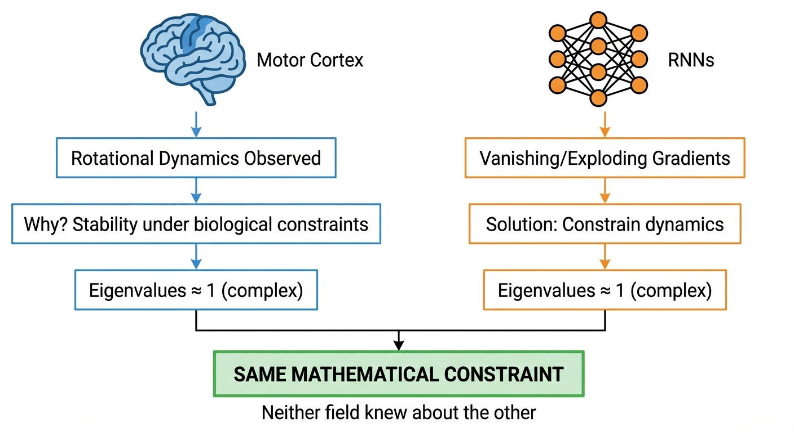

::: {.callout-note appearance="simple"}
## TL;DR

- **The same math governs both problems**: Motor cortex rotational dynamics and RNN gradient flow are both controlled by the eigenvalue spectrum of recurrent weight matrices
- **Eigenvalues near the unit circle with imaginary components** = stable, oscillatory dynamics (motor cortex) = gradients that neither vanish nor explode (RNNs)
- **Convergent discovery**: Evolution optimized for stable motor dynamics; ML theory derived the same constraint for trainable RNNs — neither knew about the other
- **State Space Models (S4, Mamba)** explicitly exploit complex eigenvalues and are now achieving SOTA in robotics (3-5x faster, 80% fewer parameters)
- **Research opportunity**: The connection between biological oscillatory dynamics and modern SSMs is underexplored — CPG-RL, LinOSS, and oscillator-based architectures may offer untapped potential for robot control
:::

## Introduction: A Surprising Convergence {#sec-intro}

In [Part 4](../4-brain-motor-control/), we discussed how motor cortex exhibits **rotational dynamics** — lawful oscillatory patterns during reaching, even though reaching itself is non-periodic. Churchland et al. (2012) showed that 50-70% of neural variance during movement can be captured by rotational structure.$^{[1]}$

This raises a natural question: **why rotations?** Why not some other dynamical pattern?

At first glance, this seems like a neuroscience question with little relevance to machine learning. But it turns out that the answer — eigenvalues of the recurrent connectivity matrix — is the *exact same mathematics* that governs why RNNs are hard to train.

This post explores this convergence. We'll see that:

1. **Evolution** arrived at eigenvalues near the unit circle because they produce stable, sustained dynamics for motor control
2. **ML optimization theory** arrived at the same constraint because it prevents vanishing/exploding gradients
3. **Modern State Space Models** (S4, Mamba) explicitly parameterize around this insight
4. **Robotics applications** are now exploiting this — with substantial gains over Transformers

This isn't just a curiosity. It suggests that certain mathematical structures are **universally optimal** for recurrent computation under stability constraints, whether discovered through evolution or derived from first principles. Understanding this may guide the design of novel robot learning architectures.

::: {.callout-tip appearance="simple"}
## For Your Research

This post is written with an eye toward identifying **novel research directions**. I'll highlight gaps in the literature, unexplored connections, and concrete hypotheses worth testing. If you're looking to develop new models for robot control, the eigenvalue perspective may offer fresh architectural insights.
:::

## The Mathematical Foundation {#sec-math}

Let's build intuition for why eigenvalues matter, starting from basics.

### Linear Dynamical Systems

Consider a simple linear recurrent system:

$$\frac{dx}{dt} = Ax$$ {#eq-linear-dynamics}

where $x \in \mathbb{R}^n$ is the state and $A \in \mathbb{R}^{n \times n}$ is the dynamics matrix. The solution is:

$$x(t) = e^{At} x(0)$$ {#eq-solution}

The behavior is entirely determined by the **eigenvalues** $\lambda_i$ of $A$:

- **Real part** $\text{Re}(\lambda_i)$: Controls growth/decay rate
- **Imaginary part** $\text{Im}(\lambda_i)$: Controls oscillation frequency

::: {.callout-note appearance="simple"}
## Intuition: What Eigenvalues Mean Physically

Think of eigenvalues as describing **modes** of the system:

- $\lambda = -1$ (real, negative): Exponential decay — state collapses to zero
- $\lambda = +1$ (real, positive): Exponential growth — state explodes
- $\lambda = \pm i$ (purely imaginary): Sustained oscillation — state rotates forever
- $\lambda = -0.1 + i$ (complex, small negative real): Slowly decaying oscillation

**Important nuance**: The jPCA method$^{[1]}$ fits a **skew-symmetric** matrix, which by construction has purely imaginary eigenvalues (Re λ = 0). This captures idealized rotation. Real biological circuits likely have eigenvalues with **small negative real parts** for stability, but the dominant structure jPCA reveals is rotational. The "sweet spot" is eigenvalues very close to the imaginary axis.
:::

{#fig-eigenvalue-spectrum}

### Interactive: Explore Eigenvalue Dynamics {#sec-interactive}

Use the controls below to explore how eigenvalue structure affects dynamical system behavior. Adjust the real and imaginary parts of the eigenvalue to see how trajectories change.

::: {.callout-tip appearance="simple"}
## How to Use This Visualization

- **Real part** controls growth/decay: negative = decay (stable), positive = growth (unstable)
- **Imaginary part** controls oscillation frequency: larger = faster rotation
- **Green dot** = starting point, **Red dot** = ending point
- Watch for the **sweet spot**: real part near 0, imaginary part non-zero → sustained rotations
:::

```{ojs}
//| echo: false

// Main eigenvalue controls
viewof realPart = Inputs.range([-1.5, 0.5], {
  value: -0.1,
  step: 0.01,
  label: "Real part (Re λ): growth/decay rate"
})

viewof imagPart = Inputs.range([0, 3], {
  value: 1.0,
  step: 0.05,
  label: "Imaginary part (Im λ): oscillation frequency"
})

viewof x0 = Inputs.range([-2, 2], {value: 1.5, step: 0.1, label: "Initial x₀"})
viewof y0 = Inputs.range([-2, 2], {value: 0, step: 0.1, label: "Initial y₀"})
viewof duration = Inputs.range([5, 30], {value: 15, step: 1, label: "Simulation time"})
```

```{ojs}
//| echo: false

// Compute eigenvalue info
eigenvalueInfo = {
  const magnitude = Math.sqrt(realPart * realPart + imagPart * imagPart);
  const discreteMag = Math.exp(realPart * 0.05); // dt = 0.05

  let behavior = "";
  if (realPart < -0.5) behavior = "🔵 Fast decay — state collapses quickly";
  else if (realPart < -0.05) behavior = "🟢 Slow decay — sustained rotations (motor cortex sweet spot!)";
  else if (realPart < 0.05) behavior = "🟡 Near-neutral — very slow decay, almost sustained";
  else behavior = "🔴 Unstable growth — state explodes";

  let oscInfo = "";
  if (imagPart < 0.1) oscInfo = "No oscillation (real eigenvalue)";
  else if (imagPart < 1) oscInfo = "Slow oscillation";
  else if (imagPart < 2) oscInfo = "Moderate oscillation";
  else oscInfo = "Fast oscillation";

  return html`
    <div style="background: #f8f9fa; padding: 12px; border-radius: 8px; margin: 10px 0; font-family: monospace;">
      <strong>Eigenvalue:</strong> λ = ${realPart.toFixed(2)} ${imagPart >= 0 ? '+' : ''}${imagPart.toFixed(2)}i<br>
      <strong>Magnitude:</strong> |λ| = ${magnitude.toFixed(3)}<br>
      <strong>Behavior:</strong> ${behavior}<br>
      <strong>Oscillation:</strong> ${oscInfo}
    </div>
  `;
}
```

```{ojs}
//| echo: false

// Phase portrait - main visualization
phasePortrait = {
  const dt = 0.02;
  const steps = Math.floor(duration / dt);

  // For complex eigenvalue λ = a + bi, the 2D dynamics matrix is:
  // A = [a, -b; b, a] which gives rotation + scaling
  const a = realPart;
  const b = imagPart;

  let x = x0;
  let y = y0;
  const trajectory = [{x: x, y: y, t: 0}];

  for (let i = 1; i < steps; i++) {
    // dx/dt = Ax where A = [a, -b; b, a]
    const dx = a * x - b * y;
    const dy = b * x + a * y;
    x = x + dt * dx;
    y = y + dt * dy;

    // Stop if exploding
    if (Math.abs(x) > 50 || Math.abs(y) > 50) break;

    trajectory.push({x: x, y: y, t: i * dt});
  }

  // Determine plot bounds
  const maxVal = Math.max(
    3,
    Math.max(...trajectory.map(p => Math.abs(p.x))),
    Math.max(...trajectory.map(p => Math.abs(p.y)))
  ) * 1.1;

  const bound = Math.min(maxVal, 20);

  return Plot.plot({
    width: 550,
    height: 500,
    style: {fontSize: "12px"},
    title: "Phase Portrait: State Space Trajectory",
    x: {domain: [-bound, bound], label: "x₁"},
    y: {domain: [-bound, bound], label: "x₂"},
    marks: [
      // Grid
      Plot.ruleX([0], {stroke: "#ccc"}),
      Plot.ruleY([0], {stroke: "#ccc"}),

      // Trajectory with color gradient by time
      Plot.line(trajectory, {
        x: "x",
        y: "y",
        stroke: "t",
        strokeWidth: 2.5,
        curve: "natural"
      }),

      // Start point (green)
      Plot.dot([trajectory[0]], {
        x: "x",
        y: "y",
        fill: "#22c55e",
        r: 8,
        stroke: "white",
        strokeWidth: 2
      }),

      // End point (red)
      Plot.dot([trajectory[trajectory.length - 1]], {
        x: "x",
        y: "y",
        fill: "#ef4444",
        r: 8,
        stroke: "white",
        strokeWidth: 2
      }),

      // Origin marker
      Plot.dot([{x: 0, y: 0}], {
        x: "x",
        y: "y",
        fill: "none",
        stroke: "#666",
        r: 4,
        strokeWidth: 2
      })
    ],
    color: {
      scheme: "viridis",
      legend: true,
      label: "Time"
    }
  })
}
```

```{ojs}
//| echo: false

// Time series plot
timeSeries = {
  const dt = 0.02;
  const steps = Math.floor(duration / dt);

  const a = realPart;
  const b = imagPart;

  let x = x0;
  let y = y0;
  const data = [{t: 0, x: x, y: y, type: "x₁"}, {t: 0, x: x, y: y, type: "x₂"}];

  for (let i = 1; i < steps; i++) {
    const dx = a * x - b * y;
    const dy = b * x + a * y;
    x = x + dt * dx;
    y = y + dt * dy;

    if (Math.abs(x) > 100 || Math.abs(y) > 100) break;

    const t = i * dt;
    data.push({t: t, value: x, type: "x₁"});
    data.push({t: t, value: y, type: "x₂"});
  }

  const xData = data.filter(d => d.type === "x₁").map(d => ({t: d.t, value: d.value || d.x}));
  const yData = data.filter(d => d.type === "x₂").map(d => ({t: d.t, value: d.value || d.y}));

  return Plot.plot({
    width: 550,
    height: 250,
    style: {fontSize: "12px"},
    title: "Time Evolution: State Components",
    x: {label: "Time"},
    y: {label: "State value"},
    marks: [
      Plot.ruleY([0], {stroke: "#ccc"}),
      Plot.line(xData, {x: "t", y: "value", stroke: "#3b82f6", strokeWidth: 2}),
      Plot.line(yData, {x: "t", y: "value", stroke: "#f97316", strokeWidth: 2}),
      Plot.text([{t: 0.5, value: xData[Math.min(10, xData.length-1)]?.value || x0}], {
        x: "t", y: "value", text: d => "x₁", fill: "#3b82f6", dy: -10, fontWeight: "bold"
      }),
      Plot.text([{t: 0.5, value: yData[Math.min(10, yData.length-1)]?.value || y0}], {
        x: "t", y: "value", text: d => "x₂", fill: "#f97316", dy: -10, fontWeight: "bold"
      })
    ]
  })
}
```

#### Eigenvalue Location in the Complex Plane

The plot below shows where your eigenvalue sits in the complex plane. The **unit circle** (dashed) is the critical boundary for discrete-time systems.

```{ojs}
//| echo: false

eigenvaluePlot = {
  // Create unit circle points
  const circlePoints = [];
  for (let theta = 0; theta <= 2 * Math.PI; theta += 0.05) {
    circlePoints.push({x: Math.cos(theta), y: Math.sin(theta)});
  }

  // Stability regions for continuous-time: Re(λ) < 0 is stable
  const stableRegion = [];
  for (let y = -2; y <= 2; y += 0.1) {
    stableRegion.push({x: -2, y: y});
  }

  return Plot.plot({
    width: 400,
    height: 400,
    style: {fontSize: "12px"},
    title: "Eigenvalue in Complex Plane",
    x: {domain: [-2, 1], label: "Real part (Re λ)"},
    y: {domain: [-2.5, 2.5], label: "Imaginary part (Im λ)"},
    marks: [
      // Stable region shading
      Plot.rect([{x1: -2, x2: 0, y1: -2.5, y2: 2.5}], {
        x1: "x1", x2: "x2", y1: "y1", y2: "y2",
        fill: "#22c55e",
        fillOpacity: 0.1
      }),

      // Unstable region shading
      Plot.rect([{x1: 0, x2: 1, y1: -2.5, y2: 2.5}], {
        x1: "x1", x2: "x2", y1: "y1", y2: "y2",
        fill: "#ef4444",
        fillOpacity: 0.1
      }),

      // Axes
      Plot.ruleX([0], {stroke: "#333", strokeWidth: 1.5}),
      Plot.ruleY([0], {stroke: "#333", strokeWidth: 1.5}),

      // Labels
      Plot.text([{x: -1, y: 2.2}], {
        x: "x", y: "y", text: d => "STABLE", fill: "#22c55e", fontWeight: "bold"
      }),
      Plot.text([{x: 0.5, y: 2.2}], {
        x: "x", y: "y", text: d => "UNSTABLE", fill: "#ef4444", fontWeight: "bold"
      }),

      // Current eigenvalue (and its conjugate)
      Plot.dot([
        {x: realPart, y: imagPart},
        {x: realPart, y: -imagPart}
      ], {
        x: "x", y: "y",
        fill: "#8b5cf6",
        r: 10,
        stroke: "white",
        strokeWidth: 2
      }),

      // Eigenvalue label
      Plot.text([{x: realPart + 0.15, y: imagPart + 0.2}], {
        x: "x", y: "y",
        text: d => `λ = ${realPart.toFixed(2)}+${imagPart.toFixed(2)}i`,
        fill: "#8b5cf6",
        fontWeight: "bold"
      })
    ]
  })
}
```

#### Presets: Try These Eigenvalue Configurations

```{ojs}
//| echo: false

presetButtons = html`
<div style="display: flex; gap: 10px; flex-wrap: wrap; margin: 15px 0;">
  <button onclick=${() => {
    viewof realPart.value = -0.05;
    viewof imagPart.value = 1.0;
    viewof realPart.dispatchEvent(new Event('input'));
    viewof imagPart.dispatchEvent(new Event('input'));
  }} style="padding: 8px 16px; background: #22c55e; color: white; border: none; border-radius: 6px; cursor: pointer; font-weight: bold;">
    🧠 Motor Cortex Sweet Spot
  </button>

  <button onclick=${() => {
    viewof realPart.value = -1.0;
    viewof imagPart.value = 0.0;
    viewof realPart.dispatchEvent(new Event('input'));
    viewof imagPart.dispatchEvent(new Event('input'));
  }} style="padding: 8px 16px; background: #3b82f6; color: white; border: none; border-radius: 6px; cursor: pointer; font-weight: bold;">
    📉 Overdamped (Fast Decay)
  </button>

  <button onclick=${() => {
    viewof realPart.value = 0.0;
    viewof imagPart.value = 1.5;
    viewof realPart.dispatchEvent(new Event('input'));
    viewof imagPart.dispatchEvent(new Event('input'));
  }} style="padding: 8px 16px; background: #f59e0b; color: white; border: none; border-radius: 6px; cursor: pointer; font-weight: bold;">
    🔄 jPCA Rotations (Re=0)
  </button>

  <button onclick=${() => {
    viewof realPart.value = 0.1;
    viewof imagPart.value = 1.0;
    viewof realPart.dispatchEvent(new Event('input'));
    viewof imagPart.dispatchEvent(new Event('input'));
  }} style="padding: 8px 16px; background: #ef4444; color: white; border: none; border-radius: 6px; cursor: pointer; font-weight: bold;">
    💥 Unstable (Exploding)
  </button>

  <button onclick=${() => {
    viewof realPart.value = -0.3;
    viewof imagPart.value = 2.0;
    viewof realPart.dispatchEvent(new Event('input'));
    viewof imagPart.dispatchEvent(new Event('input'));
  }} style="padding: 8px 16px; background: #8b5cf6; color: white; border: none; border-radius: 6px; cursor: pointer; font-weight: bold;">
    🌀 Decaying Spiral
  </button>
</div>
`
```

::: {.callout-note appearance="simple"}
## What You're Seeing

This visualization shows the continuous-time linear system $\frac{dx}{dt} = Ax$ where $A$ has eigenvalue $\lambda = \text{Re}(\lambda) + i \cdot \text{Im}(\lambda)$.

- **Phase portrait**: The 2D trajectory through state space
- **Time series**: How each state component evolves over time
- **Complex plane**: Where the eigenvalue sits relative to the stability boundary

Try the presets:

- **jPCA Rotations (Re=0)**: What Churchland et al.'s jPCA analysis finds — purely imaginary eigenvalues from a skew-symmetric matrix, giving perfect circles
- **Motor Cortex Sweet Spot**: A biologically realistic version with slight decay (Re λ = -0.05), ensuring stability while maintaining sustained oscillations during movement
:::

### Why This Matters for RNNs: The Bridge {#sec-bridge}

You might wonder: "I came here to learn about neural networks, not differential equations. How does $\frac{dx}{dt} = Ax$ relate to RNNs?"

The answer is direct: **an RNN is literally a discrete-time dynamical system**. The same mathematics governs both.

::: {.callout-important appearance="default"}
## The Core Connection: A Formal Derivation

We will prove that **eigenvalues control both forward dynamics and backward gradients** in RNNs.

### Part 1: Forward Dynamics

Consider the simplest linear RNN (no nonlinearity, no input):

$$h_t = W h_{t-1}$$ {#eq-simple-rnn}

where $h_t \in \mathbb{R}^n$ is the hidden state and $W \in \mathbb{R}^{n \times n}$ is the recurrent weight matrix.

**Unrolling the recurrence:**

$$h_1 = W h_0$$
$$h_2 = W h_1 = W(W h_0) = W^2 h_0$$
$$h_t = W^t h_0 \quad \text{(by induction)}$$ {#eq-forward-unroll}

**Using eigendecomposition:** Assume $W$ is diagonalizable with eigendecomposition $W = V \Lambda V^{-1}$, where:

- $V = [v_1 | v_2 | \cdots | v_n]$ contains eigenvectors as columns
- $\Lambda = \text{diag}(\lambda_1, \lambda_2, \ldots, \lambda_n)$ contains eigenvalues on the diagonal

Then:
$$W^t = (V \Lambda V^{-1})^t = V \Lambda V^{-1} \cdot V \Lambda V^{-1} \cdots V \Lambda V^{-1} = V \Lambda^t V^{-1}$$ {#eq-power-eigendecomp}

where $\Lambda^t = \text{diag}(\lambda_1^t, \lambda_2^t, \ldots, \lambda_n^t)$.

**Expressing $h_t$ in eigenbasis:** Let $\tilde{h}_0 = V^{-1} h_0$ be the initial state in the eigenbasis. Then:

$$h_t = V \Lambda^t V^{-1} h_0 = V \Lambda^t \tilde{h}_0 = V \begin{bmatrix} \lambda_1^t \tilde{h}_{0,1} \\ \lambda_2^t \tilde{h}_{0,2} \\ \vdots \\ \lambda_n^t \tilde{h}_{0,n} \end{bmatrix} = \sum_{i=1}^{n} \lambda_i^t \tilde{h}_{0,i} v_i$$ {#eq-forward-eigenbasis}

**Key observation:** Each eigenmode evolves as $\lambda_i^t$. The norm of $h_t$ is bounded by:

$$\|h_t\| \leq \|V\| \cdot \|V^{-1}\| \cdot \max_i |\lambda_i|^t \cdot \|h_0\| = \kappa(V) \cdot \rho(W)^t \cdot \|h_0\|$$

where $\rho(W) = \max_i |\lambda_i|$ is the **spectral radius** and $\kappa(V)$ is the condition number of $V$.

::: {.callout-note appearance="simple"}
## Forward Dynamics Result

- If $\rho(W) < 1$: $\|h_t\| \to 0$ exponentially (state decays)
- If $\rho(W) > 1$: $\|h_t\| \to \infty$ exponentially (state explodes)
- If $\rho(W) = 1$: $\|h_t\|$ remains bounded (state is sustained)
:::

### Part 2: Backward Gradient Flow

Now consider a loss $L = \ell(h_T)$ at the final timestep. We want $\frac{\partial L}{\partial h_0}$.

**Applying the chain rule backward:**

$$\frac{\partial L}{\partial h_{T-1}} = \frac{\partial h_T}{\partial h_{T-1}}^\top \frac{\partial L}{\partial h_T} = W^\top \frac{\partial L}{\partial h_T}$$ {#eq-grad-step}

Note: We use the convention that $\frac{\partial L}{\partial h}$ is a column vector, and $\frac{\partial h_t}{\partial h_{t-1}} = W$ (Jacobian).

**Unrolling the gradient:**

$$\frac{\partial L}{\partial h_{T-1}} = W^\top \frac{\partial L}{\partial h_T}$$
$$\frac{\partial L}{\partial h_{T-2}} = W^\top \frac{\partial L}{\partial h_{T-1}} = (W^\top)^2 \frac{\partial L}{\partial h_T}$$
$$\frac{\partial L}{\partial h_0} = (W^\top)^T \frac{\partial L}{\partial h_T}$$ {#eq-grad-unroll}

**Eigenvalues of $W^\top$:** If $W$ has eigenvalue $\lambda_i$ with eigenvector $v_i$, then $W^\top$ has eigenvalue $\lambda_i$ with eigenvector $(V^{-1})^\top e_i$ (the $i$-th row of $V^{-1}$ transposed).

**Crucially:** $W$ and $W^\top$ have the **same eigenvalues**.

Therefore, $(W^\top)^T$ has eigenvalues $\lambda_1^T, \lambda_2^T, \ldots, \lambda_n^T$ — identical to $W^T$.

**Gradient norm bound:**

$$\left\|\frac{\partial L}{\partial h_0}\right\| \leq \|(W^\top)^T\| \cdot \left\|\frac{\partial L}{\partial h_T}\right\| \leq \kappa(V) \cdot \rho(W)^T \cdot \left\|\frac{\partial L}{\partial h_T}\right\|$$

::: {.callout-note appearance="simple"}
## Backward Gradient Result

- If $\rho(W) < 1$: $\left\|\frac{\partial L}{\partial h_0}\right\| \to 0$ exponentially (**vanishing gradients**)
- If $\rho(W) > 1$: $\left\|\frac{\partial L}{\partial h_0}\right\| \to \infty$ exponentially (**exploding gradients**)
- If $\rho(W) = 1$: Gradients remain bounded (**stable training**)
:::

### Part 3: The Unified Condition

::: {.callout-tip appearance="default"}
## Theorem: Eigenvalue Duality

For a linear RNN $h_t = W h_{t-1}$, let $\rho(W) = \max_i |\lambda_i(W)|$ be the spectral radius. Then:

1. **Forward stability**: $\|h_T\| = O(\rho(W)^T)$
2. **Backward stability**: $\left\|\frac{\partial L}{\partial h_0}\right\| = O(\rho(W)^T)$

Both are controlled by **the same quantity** — the spectral radius $\rho(W)$.

**Corollary**: For stable forward dynamics AND trainable gradients, we need $\rho(W) \approx 1$.
:::

### Part 4: Why Complex Eigenvalues?

If $\rho(W) = 1$ and eigenvalues are **real**, we only have $\lambda = \pm 1$:
- $\lambda = 1$: Constant mode ($\lambda^t = 1$ for all $t$)
- $\lambda = -1$: Alternating mode ($\lambda^t = (-1)^t$)

Neither generates smooth, time-varying dynamics.

**Complex eigenvalues** with $|\lambda| = 1$ can be written as $\lambda = e^{i\theta}$ for some angle $\theta$. Then:

$$\lambda^t = e^{it\theta} = \cos(t\theta) + i\sin(t\theta)$$

This produces **oscillations** at frequency $\theta$. In real coordinates, a complex conjugate pair $\lambda, \bar{\lambda} = re^{\pm i\theta}$ (where $r = |\lambda|$) produces:

$$\begin{bmatrix} x_t \\ y_t \end{bmatrix} = r^t \begin{bmatrix} \cos(t\theta) & -\sin(t\theta) \\ \sin(t\theta) & \cos(t\theta) \end{bmatrix} \begin{bmatrix} x_0 \\ y_0 \end{bmatrix}$$

- $r < 1$: Inward spiral (decaying oscillation)
- $r > 1$: Outward spiral (exploding oscillation)
- $r = 1$: Circle (sustained oscillation) ← **The sweet spot**
:::

::: {.callout-tip appearance="simple"}
## Intuition: The Scalar Case

The derivation above may seem abstract. Here's the core insight in the simplest possible case — a 1D "RNN":

$$h_t = \lambda h_{t-1} \implies h_T = \lambda^T h_0$$

The gradient:
$$\frac{\partial L}{\partial h_0} = \lambda^T \frac{\partial L}{\partial h_T}$$

Both scale as $\lambda^T$. Numerically:

| $\lambda$ | $\lambda^{100}$ | Interpretation |
|-----------|-----------------|----------------|
| 0.9 | $\approx 0.00003$ | Vanished! |
| 1.1 | $\approx 13{,}781$ | Exploded! |
| 1.0 | $= 1$ | Preserved |

For matrices, each eigenvalue acts like an independent scalar mode. The **largest eigenvalue magnitude** (spectral radius) dominates.
:::

**The punchline**: The eigenvalue spectrum of $W$ controls **both**:

1. **Forward dynamics**: $h_T = W^T h_0$ — eigenvalues determine growth/decay/oscillation
2. **Backward gradients**: $\frac{\partial L}{\partial h_0} = (W^\top)^T \frac{\partial L}{\partial h_T}$ — same eigenvalues, same exponential behavior

This mathematical identity explains why motor cortex exhibits rotational dynamics (eigenvalues near unit circle → stable oscillations) AND why ML needs the same constraint for trainable RNNs (eigenvalues near unit circle → stable gradients). **Same math, different entry points.**

### The Eigenvalue Spectrum Determines Everything

For a discrete-time system (like an RNN):

$$h_t = \sigma(W h_{t-1} + U x_t)$$ {#eq-rnn}

The key quantity is the **magnitude** of eigenvalues $|\lambda_i|$ of the weight matrix $W$:

| Eigenvalue Magnitude | Forward Dynamics | Backward Gradients |
|---------------------|------------------|-------------------|
| $|\lambda| < 1$ | State decays exponentially | Gradients vanish |
| $|\lambda| > 1$ | State grows exponentially | Gradients explode |
| $|\lambda| \approx 1$ | State is sustained | Gradients propagate |
| $|\lambda| \approx 1$, complex | **Rotational dynamics** | Gradients propagate with phase |

: The eigenvalue spectrum controls both forward dynamics and backward gradient flow {#tbl-eigenvalues}

**The sweet spot is the same for both problems**: eigenvalues with magnitude close to 1.

### Why Complex Eigenvalues?

Real eigenvalues on the unit circle (i.e., $\lambda = \pm 1$) produce either:
- Constant state ($\lambda = 1$)
- Alternating state ($\lambda = -1$)

Neither is useful for generating smooth, time-varying motor commands.

**Complex eigenvalues** with $|\lambda| \approx 1$ produce **rotations** in state space — smooth, continuous trajectories that can drive time-varying outputs without exploding or collapsing.

This is why motor cortex exhibits rotational dynamics: it's the natural solution for generating smooth temporal patterns with a recurrent circuit.

![**Left**: Motor cortex neural activity during reaching, projected onto principal components (PC1, PC2, PC3) via PCA. The axes represent linear combinations of ~100 neurons' spike rates — directions that capture the most variance in population activity. **Right**: Hidden state trajectories (h₁, h₂, h₃) from a State Space Model during a control task. Both exhibit spiral trajectories because both have eigenvalues with imaginary components near the unit circle. The mathematical structure is identical; the origin differs — evolution vs. gradient descent. See @sec-neuroscience-methods for how neuroscientists derive these plots from raw spike recordings.](rotational-comparison.png){#fig-rotational-comparison}

::: {.callout-tip appearance="simple"}
## The Neural Manifold: Geometry Beyond Dynamics

Eigenvalue dynamics tell only half the story. The other half is **geometry** — the shape of the space where neural activity lives.

Sara Solla's group at Northwestern$^{[24,25,26,27,28]}$ has shown that motor cortex activity lives on **low-dimensional manifolds** with remarkable properties:

- **Task clustering**: Different tasks form distinct clusters in the manifold — task similarity = spatial proximity
- **Multi-year stability**: The manifold persists even as individual neurons turn over
- **Intrinsic nonlinearity**: Manifolds are curved, not flat, especially during complex tasks
- **Learning constraints**: Within-manifold adaptation takes minutes; outside-manifold learning takes days

These findings suggest robot policies should have **nonlinear latent manifolds** with **stable geometric structure** during continual learning.

For a deep dive into manifold geometry and its implications for robot learning, see [Part 7: Neural Manifolds](../7-neural-manifolds/).
:::

## How Neuroscientists Discover Rotational Dynamics {#sec-neuroscience-methods}

Before we ask *why* motor cortex exhibits rotational dynamics, we need to understand *how* neuroscientists discovered them in the first place. This section bridges the gap between raw neural recordings and the elegant spiral trajectories you see in papers like Churchland et al. (2012)$^{[1]}$.

### Step 1: Recording Neural Spikes

Neuroscientists implant **multi-electrode arrays** (like the Utah array) into motor cortex. Each electrode records the **action potentials** (spikes) of nearby neurons — brief electrical impulses (~1 ms) that occur when a neuron "fires."

::: {.callout-note appearance="simple"}
## What's a Spike?

When a neuron's membrane potential crosses a threshold (~-55 mV), it generates an all-or-nothing action potential — a spike. The timing and frequency of spikes encode information. A single neuron might fire 10-100 times per second during movement.
:::

A typical experiment records from **96-192 neurons simultaneously** while a monkey performs a reaching task (e.g., move arm to one of 8 targets). Each trial captures spike times for all neurons during the ~500 ms of movement.

### Step 2: Computing Spike Rates

Raw spike times are converted to **spike rates** by counting spikes in time bins (e.g., 10-50 ms windows). For neuron $i$ at time $t$:

$$r_i(t) = \frac{\text{number of spikes in }[t, t+\Delta t]}{\Delta t}$$

This gives a continuous-valued rate (spikes/second) rather than discrete spike times.

### Step 3: Building the Population Activity Matrix

Stack all neurons' spike rates into a **population activity matrix**:

$$X = \begin{bmatrix} r_1(t_1) & r_1(t_2) & \cdots & r_1(t_T) \\ r_2(t_1) & r_2(t_2) & \cdots & r_2(t_T) \\ \vdots & \vdots & \ddots & \vdots \\ r_N(t_1) & r_N(t_2) & \cdots & r_N(t_T) \end{bmatrix}$$

Each column is the **population state** at one time point — a point in $N$-dimensional space where $N$ is the number of neurons (e.g., 100).

### Step 4: Dimensionality Reduction via PCA

With 100+ neurons, visualization is impossible. **Principal Component Analysis (PCA)** finds the directions of greatest variance:

$$X_{\text{reduced}} = W_{\text{PCA}}^\top X$$

where $W_{\text{PCA}}$ contains the top $k$ principal components (typically $k = 6-12$).

::: {.callout-tip appearance="simple"}
## Key Insight: The Neural Manifold

PCA reveals that despite having 100+ neurons, population activity lives on a **low-dimensional manifold** — typically 6-12 dimensions capture 80-90% of the variance. This isn't just dimensionality reduction for visualization; it suggests the brain operates in a low-dimensional computational space.
:::

After PCA, each time point is a vector in this low-dimensional space. Plotting the first 2-3 principal components (PC1, PC2, PC3) over time traces a **trajectory** through this space.

### Step 5: jPCA Reveals Rotational Structure

Here's where it gets interesting. Churchland et al. (2012)$^{[1]}$ didn't just apply PCA — they asked: *what dynamics govern these trajectories?*

**jPCA** fits a linear dynamical system to the PCA-reduced data:

$$\frac{dx}{dt} = M_{\text{skew}} x$$

where $M_{\text{skew}}$ is constrained to be **skew-symmetric** ($M = -M^\top$). This is crucial because skew-symmetric matrices have **purely imaginary eigenvalues** — meaning they produce rotations without growth or decay.

::: {.callout-note appearance="simple"}
## Why Skew-Symmetric?

A skew-symmetric matrix produces rotation only. If you find that $M_{\text{skew}}$ fits the data well, you've shown the dynamics are fundamentally rotational. Churchland et al. found that 50-70% of neural variance during reaching could be explained by such rotational dynamics.
:::

### The Resulting Picture

After this pipeline (spikes → rates → population matrix → PCA → jPCA), we get:

1. **Principal components** (PC1, PC2, ...) that capture the main patterns in neural activity
2. **Trajectories** through this low-dimensional space that exhibit **spiral/rotational structure**
3. **Eigenvalues** of the fitted dynamics matrix that are purely imaginary (rotations) or nearly so

::: {.callout-important appearance="default"}
## Understanding Figure 2: Motor Cortex vs. SSM

When you see plots with axes labeled "n₁, n₂, n₃" or "PC1, PC2, PC3" in neuroscience papers, these are **principal component dimensions** — linear combinations of raw spike rates that capture the dominant patterns.

In the SSM comparison (right side of @fig-rotational-comparison), "h₁, h₂, h₃" are **hidden state dimensions** of the model. The analogy is:

| Motor Cortex | State Space Model |
|-------------|-------------------|
| 100 neurons with spike rates | $n$-dimensional hidden state vector |
| PCA reduces to 6-12 dimensions | Hidden state is $n$-dimensional (e.g., 64) |
| PC1, PC2, PC3 (top components) | h₁, h₂, h₃ (selected hidden dimensions) |
| Rotational trajectories from neural dynamics | Rotational trajectories from learned dynamics |

Both show spirals because both have eigenvalues with imaginary components near the unit circle. The math is identical; the origin is different (biology vs. learning).
:::

---

## Motor Cortex: Why Rotations? {#sec-motor-cortex}

Now that we understand *how* rotational dynamics are discovered, let's dig deeper into *why* the brain exhibits them.

### The Constraints of Neural Hardware

Motor cortex is a **recurrent circuit** — neurons connect to each other, forming loops. The connectivity matrix has certain properties:

1. **Excitation/inhibition balance**: Roughly equal amounts of positive and negative connections
2. **Sparse connectivity**: Each neuron connects to a small fraction of others
3. **Dale's law**: Individual neurons are either excitatory or inhibitory, not both

These constraints, combined with the need for stable dynamics, naturally produce connectivity matrices with complex eigenvalues.$^{[2]}$

### Why Not Other Dynamics?

Let's consider alternatives:

| Dynamics Type | Eigenvalue Structure | Problem for Motor Control |
|--------------|---------------------|--------------------------|
| **Fixed point** | Real, negative | Can't generate time-varying output |
| **Exponential growth** | Real, positive | Unstable — activity explodes |
| **Exponential decay** | Real, small negative | State collapses — loses information |
| **Chaos** | Mixed, sensitive to initial conditions | Unpredictable — can't reliably control |
| **Rotations** | Complex, $|\lambda| \approx 1$ | ✓ Stable, smooth, time-varying |

Rotations are a **sweet spot**: bounded (won't explode), non-trivial (won't collapse), smooth (no discontinuities), and time-varying (can drive movement).

### The Fourier Intuition

Here's another way to think about it: rotational dynamics provide a **temporal basis set**.

Any smooth trajectory can be decomposed into oscillations at different frequencies (Fourier decomposition). If motor cortex has oscillators at various frequencies, it can combine them through a linear readout to produce arbitrary smooth outputs:

$$\text{muscle command}(t) = \sum_i w_i \cdot \text{oscillator}_i(t)$$

The oscillators are the **internal representation**; the readout weights determine the **output**. Different movements = different readout weights on the same oscillatory basis.

This is computationally elegant:
- **Compact**: Just need oscillator phases + readout weights
- **Flexible**: Change weights → change movement
- **Smooth by construction**: Oscillations can't jump discontinuously

::: {.callout-important appearance="default"}
## Key Insight

The brain doesn't "choose" rotational dynamics because they're optimal in some abstract sense. Rather, **rotations are what emerge** when you build a recurrent circuit under biological constraints (stability, metabolic efficiency, connectivity limits) that needs to produce smooth, time-varying outputs.

Evolution didn't solve an optimization problem with "rotations" as the answer — it stumbled into the only stable solution that works.
:::

## RNNs: The Vanishing Gradient Problem {#sec-rnn}

Now let's see how ML arrived at the same mathematics from a completely different direction.

### The Training Problem

When training an RNN via backpropagation through time (BPTT), gradients must flow backward through many timesteps. The gradient at time $t$ depends on the gradient at time $t+1$ multiplied by the Jacobian of the transition:

$$\frac{\partial L}{\partial h_t} = \frac{\partial L}{\partial h_{t+1}} \cdot \frac{\partial h_{t+1}}{\partial h_t}$$ {#eq-bptt}

Over $T$ timesteps, this becomes:

$$\frac{\partial L}{\partial h_0} = \frac{\partial L}{\partial h_T} \cdot \prod_{t=0}^{T-1} \frac{\partial h_{t+1}}{\partial h_t}$$

The product of Jacobians is the problem. If eigenvalues of these Jacobians have magnitude $< 1$, gradients **vanish**. If $> 1$, they **explode**.

### The Same Eigenvalue Condition

For a linear RNN, the Jacobian is just the weight matrix $W$. The gradient magnitude scales as:

$$\left\| \frac{\partial L}{\partial h_0} \right\| \propto \prod_{t=0}^{T-1} |\lambda_{\max}|^t = |\lambda_{\max}|^T$$

- $|\lambda_{\max}| < 1$: Gradients vanish as $T \to \infty$
- $|\lambda_{\max}| > 1$: Gradients explode as $T \to \infty$
- $|\lambda_{\max}| \approx 1$: Gradients propagate

**This is identical to the dynamics stability condition.** The mathematics doesn't care whether you're running forward (dynamics) or backward (gradients).

### Solutions in ML

ML researchers discovered this independently and developed several solutions:

| Solution | How It Enforces $|\lambda| \approx 1$ |
|----------|--------------------------------------|
| **LSTM** | Gating creates "constant error carousel" — effective eigenvalue = 1 for cell state |
| **GRU** | Similar gating mechanism |
| **Orthogonal RNNs**$^{[3]}$ | Constrain $W$ to be orthogonal → eigenvalues exactly on unit circle |
| **Unitary RNNs**$^{[4]}$ | Constrain $W$ to be unitary (complex orthogonal) → eigenvalues on unit circle |
| **State Space Models**$^{[5]}$ | Parameterize eigenvalues directly, initialize near unit circle |

The key paper is Arjovsky et al. (2016)$^{[4]}$, which explicitly derived that unitary weight matrices (eigenvalues on unit circle) prevent gradient vanishing/explosion.

### Interactive: Discrete-Time Dynamics and the Unit Circle {#sec-discrete-interactive}

In discrete-time systems (like RNNs), the **unit circle** is the stability boundary. Eigenvalues inside decay; outside explode. Explore how the eigenvalue magnitude affects gradient propagation over many timesteps.

```{ojs}
//| echo: false

viewof eigenMagnitude = Inputs.range([0.5, 1.5], {
  value: 0.98,
  step: 0.01,
  label: "Eigenvalue magnitude |λ|"
})

viewof eigenPhase = Inputs.range([0, Math.PI], {
  value: Math.PI / 4,
  step: 0.05,
  label: "Eigenvalue phase (radians)"
})

viewof numTimesteps = Inputs.range([10, 100], {
  value: 50,
  step: 5,
  label: "Number of timesteps T"
})
```

```{ojs}
//| echo: false

discreteInfo = {
  const gradientScale = Math.pow(eigenMagnitude, numTimesteps);

  let status = "";
  let color = "";
  if (eigenMagnitude < 0.95) {
    status = "⚠️ Vanishing gradients — RNN cannot learn long-range dependencies";
    color = "#3b82f6";
  } else if (eigenMagnitude <= 1.02) {
    status = "✅ Stable gradients — RNN can learn from distant timesteps";
    color = "#22c55e";
  } else {
    status = "💥 Exploding gradients — training will diverge";
    color = "#ef4444";
  }

  const formattedGrad = gradientScale > 1000 ? gradientScale.toExponential(2) :
                        gradientScale < 0.001 ? gradientScale.toExponential(2) :
                        gradientScale.toFixed(4);

  return html`
    <div style="background: #f8f9fa; padding: 12px; border-radius: 8px; margin: 10px 0; font-family: monospace;">
      <strong>Eigenvalue:</strong> λ = ${eigenMagnitude.toFixed(3)} × e<sup>i${eigenPhase.toFixed(2)}</sup><br>
      <strong>After ${numTimesteps} timesteps:</strong> |λ|<sup>T</sup> = ${formattedGrad}<br>
      <span style="color: ${color}; font-weight: bold;">${status}</span>
    </div>
  `;
}
```

```{ojs}
//| echo: false

// Gradient magnitude over time
gradientPlot = {
  const data = [];
  for (let t = 0; t <= numTimesteps; t++) {
    data.push({
      t: t,
      gradient: Math.pow(eigenMagnitude, t)
    });
  }

  // Determine y-axis scale
  const maxGrad = Math.max(...data.map(d => d.gradient));
  const yMax = Math.min(maxGrad * 1.1, 100);

  return Plot.plot({
    width: 550,
    height: 300,
    style: {fontSize: "12px"},
    title: "Gradient Magnitude Over Time: |λ|^T",
    x: {label: "Timestep T"},
    y: {label: "Gradient scale |λ|^T", domain: [0, yMax]},
    marks: [
      Plot.ruleY([1], {stroke: "#22c55e", strokeWidth: 2, strokeDasharray: "5,5"}),
      Plot.line(data, {
        x: "t",
        y: "gradient",
        stroke: eigenMagnitude > 1 ? "#ef4444" : eigenMagnitude > 0.95 ? "#22c55e" : "#3b82f6",
        strokeWidth: 3
      }),
      Plot.text([{t: numTimesteps * 0.7, y: 1.1}], {
        x: "t", y: "y", text: d => "Ideal: gradient = 1", fill: "#22c55e"
      })
    ]
  })
}
```

```{ojs}
//| echo: false

// Unit circle visualization
unitCirclePlot = {
  // Create unit circle
  const circlePoints = [];
  for (let theta = 0; theta <= 2 * Math.PI + 0.1; theta += 0.05) {
    circlePoints.push({x: Math.cos(theta), y: Math.sin(theta)});
  }

  // Current eigenvalue position
  const eigX = eigenMagnitude * Math.cos(eigenPhase);
  const eigY = eigenMagnitude * Math.sin(eigenPhase);

  // Conjugate eigenvalue
  const eigX2 = eigenMagnitude * Math.cos(-eigenPhase);
  const eigY2 = eigenMagnitude * Math.sin(-eigenPhase);

  return Plot.plot({
    width: 400,
    height: 400,
    style: {fontSize: "12px"},
    title: "Unit Circle: Discrete-Time Stability Boundary",
    x: {domain: [-1.8, 1.8], label: "Re(λ)"},
    y: {domain: [-1.8, 1.8], label: "Im(λ)"},
    marks: [
      // Stable region (inside circle)
      Plot.dot(Array.from({length: 50}, (_, i) => {
        const r = Math.random() * 0.95;
        const theta = Math.random() * 2 * Math.PI;
        return {x: r * Math.cos(theta), y: r * Math.sin(theta)};
      }), {
        x: "x", y: "y", fill: "#22c55e", fillOpacity: 0.1, r: 15
      }),

      // Unit circle
      Plot.line(circlePoints, {
        x: "x", y: "y",
        stroke: "#333",
        strokeWidth: 2,
        strokeDasharray: "8,4"
      }),

      // Axes
      Plot.ruleX([0], {stroke: "#ccc"}),
      Plot.ruleY([0], {stroke: "#ccc"}),

      // Labels
      Plot.text([{x: 0, y: 1.5}], {
        x: "x", y: "y", text: d => "|λ| < 1: Stable", fill: "#22c55e", fontWeight: "bold"
      }),
      Plot.text([{x: 0, y: -1.5}], {
        x: "x", y: "y", text: d => "|λ| > 1: Unstable", fill: "#ef4444", fontWeight: "bold"
      }),

      // Eigenvalue points
      Plot.dot([{x: eigX, y: eigY}, {x: eigX2, y: eigY2}], {
        x: "x", y: "y",
        fill: eigenMagnitude > 1 ? "#ef4444" : "#8b5cf6",
        r: 12,
        stroke: "white",
        strokeWidth: 2
      }),

      // Magnitude arc
      Plot.link([{x1: 0, y1: 0, x2: eigX, y2: eigY}], {
        x1: "x1", y1: "y1", x2: "x2", y2: "y2",
        stroke: "#8b5cf6",
        strokeWidth: 2,
        strokeDasharray: "3,3"
      })
    ]
  })
}
```

::: {.callout-tip appearance="simple"}
## Discrete vs Continuous Time

- **Continuous-time** (differential equations): Stability boundary is the **imaginary axis** (Re λ = 0)
- **Discrete-time** (difference equations/RNNs): Stability boundary is the **unit circle** (|λ| = 1)

The conversion between them involves the matrix exponential: if $A_c$ is continuous-time with eigenvalue $\lambda_c$, then the discrete-time system with timestep $\Delta t$ has eigenvalue $\lambda_d = e^{\lambda_c \Delta t}$.

For RNNs, we care about $|\lambda_d|$: eigenvalues inside the unit circle cause vanishing gradients; outside cause explosion.
:::

::: {.callout-warning appearance="simple"}
## The Connection Was NOT Explicit

Here's what's surprising: the ML literature derived the eigenvalue condition from gradient flow analysis. The neuroscience literature described rotational dynamics from neural recordings. **Neither cited the other.**

The convergence is implicit — both fields arrived at "eigenvalues near unit circle with imaginary components" for different reasons:
- Neuroscience: Stable dynamics for motor control
- ML: Stable gradients for training

This suggests the constraint is **fundamental**, not an artifact of either field's particular concerns.
:::

{#fig-convergent-discovery}

## State Space Models: The Explicit Parameterization {#sec-ssm}

State Space Models (SSMs) make the eigenvalue structure explicit, and this is why they're succeeding in robotics.

### The S4 Architecture

S4$^{[5]}$ (Structured State Space Sequence model) parameterizes dynamics as:

$$h'(t) = Ah(t) + Bx(t)$$
$$y(t) = Ch(t) + Dx(t)$$

The key innovation is how $A$ is structured. In S4D (diagonal S4)$^{[6]}$, $A$ is diagonal with complex entries:

$$A = \text{diag}(\lambda_1, \lambda_2, ..., \lambda_n)$$

Each $\lambda_i$ is a **complex number** controlling:
- **Magnitude**: How fast information decays
- **Phase**: Oscillation frequency

### HiPPO Initialization

The HiPPO framework$^{[7]}$ provides principled initialization for these eigenvalues based on optimal polynomial projections. The HiPPO-LegS matrix has eigenvalues that enable long-range memory while remaining stable.

**Key insight**: The eigenvalue distribution is **directly controllable**. You can tune how much the model "remembers" by placing eigenvalues closer to or farther from the unit circle.

### Mamba: Selective State Spaces

Mamba$^{[8]}$ extends S4 by making the SSM parameters **input-dependent**:

$$A(x), B(x), C(x) = \text{functions of input } x$$

This allows the model to selectively propagate or forget information based on content. The eigenvalue structure is preserved, but the specific eigenvalues adapt to the input.

### Linear Recurrent Units (LRU)

The LRU paper$^{[9]}$ (ICML 2023) is particularly clear about the eigenvalue perspective:

> "It is the eigenvalue distribution of the recurrent layer at initialization that determines if the model can capture long-range reasoning."

They sample eigenvalues uniformly on an **annulus** (ring) in the complex plane:

$$\lambda_i = r_i \cdot e^{i\theta_i}, \quad \text{where } r_i \sim \text{Uniform}(r_{\min}, r_{\max}), \quad \theta_i \sim \text{Uniform}(0, 2\pi)$$

::: {.callout-note appearance="simple"}
## What Does "Ring in the Complex Plane" Mean?

The **complex plane** has real numbers on the horizontal axis and imaginary numbers on the vertical axis. Any complex number $\lambda = a + bi$ is a point at coordinates $(a, b)$.

The **magnitude** $|\lambda| = \sqrt{a^2 + b^2}$ is the distance from the origin. A "ring" or annulus is the region between two circles:

```
                    Im(λ)
                      ↑
                      |     ●   ← eigenvalue
              ╭───────┼───────╮
             ╱   ╭────┼────╮   ╲
            │   ╱     │     ╲   │   ← outer circle: |λ| = r_max
            │  │      │      │  │
        ────┼──│──────┼──────│──┼──→ Re(λ)
            │  │      │      │  │
            │   ╲     │     ╱   │   ← inner circle: |λ| = r_min
             ╲   ╰────┼────╯   ╱
              ╰───────┼───────╯
                      │
           Ring: r_min ≤ |λ| ≤ r_max
```

LRU samples eigenvalues uniformly inside this ring. Because $r_{\min} < r_{\max} < 1$, all eigenvalues are **inside the unit circle** (stable), but not too close to zero (which would cause fast decay and forget everything).

Typical values: $r_{\min} = 0.9$, $r_{\max} = 0.999$. This places eigenvalues close to the unit circle but strictly inside it — stable yet long-memory.
:::

::: {.callout-tip appearance="simple"}
## Why SSMs Work

SSMs succeed because they **directly parameterize what matters** — the eigenvalue spectrum. Instead of hoping that training finds good eigenvalues (as in vanilla RNNs), they:

1. Initialize eigenvalues in the stable regime (near unit circle)
2. Parameterize in terms of eigenvalues (diagonal $A$)
3. Allow input-dependent modulation (Mamba)

This is arguably what LSTMs discovered implicitly through gating — SSMs make it explicit.
:::

::: {.callout-warning appearance="simple"}
## Common Misconception: "RNNs Are Dead"

A common belief is that RNNs are obsolete — replaced by Transformers. This is true for **NLP benchmarks** but misleading for **robotics**:

| Context | Reality |
|---------|---------|
| NLP/LLMs | Transformers dominate (scaling, parallelization) |
| Computational neuroscience | RNNs remain central for modeling brain circuits |
| Robotics control | SSMs (linear RNNs) are outperforming Transformers |
| Real-time systems | Recurrence offers $O(1)$ per-step vs $O(n)$ Transformer KV cache |

The "death of RNNs" narrative is domain-specific. For continuous-time control with real-time constraints, recurrent architectures are **coming back** in the form of SSMs.
:::

## SSMs in Robotics: Current Applications {#sec-robotics}

The robotics community has noticed. SSMs are achieving strong results with substantial efficiency gains.

### Key Papers

| Paper | Venue | Key Result |
|-------|-------|------------|
| **MaIL**$^{[10]}$ | CoRL 2024 | Beats Transformers with **20% of training data** on LIBERO |
| **RoboMamba**$^{[11]}$ | NeurIPS 2024 | **3x faster inference**, VLA with Mamba backbone |
| **Mamba Policy**$^{[12]}$ | IROS 2025 | **80% fewer params**, 90% less FLOPs than DP3 |
| **Decision S4**$^{[13]}$ | ICLR 2023 | **5x faster** than Decision Transformer |
| **LRAM**$^{[14]}$ | NeurIPS 2024 | xLSTM matches Transformers with constant-time inference |
| **MTIL**$^{[15]}$ | 2025 | Encodes full trajectory history, beats ACT and Diffusion Policy |

### Why SSMs Excel for Robot Control

Several properties make SSMs well-suited for motor control:

1. **Continuous-time formulation**: Robot control is inherently continuous; SSMs naturally model this
2. **Linear complexity**: $O(n)$ vs $O(n^2)$ for Transformers — critical for high-frequency control
3. **Smooth outputs**: Recurrent state evolution produces naturally smooth trajectories
4. **State compression**: History compressed into fixed-size state — no growing KV cache
5. **Eigenvalue control**: Can tune memory/forgetting for different control timescales

### Benchmark Results

From MaIL (CoRL 2024) on LIBERO benchmark:

| Model | LIBERO-Spatial | LIBERO-Object | LIBERO-Goal | LIBERO-Long |
|-------|---------------|---------------|-------------|-------------|
| Transformer | 78.2% | 82.4% | 68.3% | 45.1% |
| **Mamba (MaIL)** | **84.6%** | **88.1%** | **74.2%** | **53.8%** |

With only **20% of training data**, MaIL matches Transformer performance.

## Oscillatory Architectures for Robot Control {#sec-oscillatory}

Beyond SSMs, explicitly oscillatory architectures are emerging.

### Central Pattern Generators (CPGs)

CPGs are neural circuits that generate rhythmic motor patterns (walking, breathing, swimming). They're naturally oscillatory — implemented by coupled oscillators with specific eigenvalue structure.

**CPG-RL**$^{[16]}$ integrates CPGs into deep RL for quadruped locomotion:

- Agent learns to modulate oscillator parameters (frequency, amplitude, phase)
- CPG provides rhythmic "backbone"; RL learns task-specific modulation
- Results: More robust locomotion, better generalization to terrain changes

### LinOSS: Linear Oscillatory State Space

**LinOSS**$^{[17]}$ (ICLR 2025 Oral, **Top 1%**) explicitly builds on biological oscillatory dynamics:

- Based on **forced harmonic oscillators** observed in biological neural networks
- Stable and expressive without restrictive parameter constraints
- Developed by Rusch & Rus at MIT CSAIL

This is the most explicit bridge between neuroscience oscillatory dynamics and modern ML architecture design.

### coRNN: Coupled Oscillatory RNN

**coRNN**$^{[18]}$ (ICLR 2021) designs RNNs as coupled nonlinear oscillators:

- Precise bounds on hidden state gradients — provable stability
- Competitive with LSTMs on long-range dependency tasks
- Directly inspired by biological coupled oscillator networks

### The Oscillating Latent Dynamics Paper

The most direct bridge to robotics is **"Oscillating Latent Dynamics in Robot Systems"**$^{[19]}$ (Scientific Reports, 2024):

- Studies rotational trajectories in monkeys and robots during walking/reaching
- Shows **oscillatory dynamics learned in robot latent spaces resemble motor cortex dynamics**
- First demonstration of rotational dynamics driving a real robot arm (Franka Panda) during reaching

This validates the neuroscience-to-robotics transfer: the same dynamics that work in motor cortex also work in robot control.

## Why Transformers Dominated Anyway {#sec-transformers}

If eigenvalue-constrained recurrence is so fundamental, why did Transformers win?

### The Scaling Story

| Factor | Transformers | RNNs |
|--------|-------------|------|
| **Training parallelization** | All positions at once | Sequential bottleneck |
| **Hardware fit** | Matrix multiplies (GPUs love these) | Sequential ops |
| **Scaling with compute** | Excellent | Poor |
| **Long-range dependencies** | Direct attention | Vanishing gradients (if not constrained) |

Transformers won on **scaling efficiency**, not architectural elegance. Given enough compute and data, their disadvantages become irrelevant.

### When Recurrence Matters

But robotics has different constraints:

1. **Inference efficiency**: Robots need real-time control (50-1000 Hz). Transformers' $O(n^2)$ attention doesn't scale.
2. **Streaming/online**: Robots process continuous streams, not fixed-length sequences.
3. **Energy efficiency**: Embodied systems have power budgets. Brain uses ~20W.
4. **Continuous-time**: Control is inherently continuous; Transformers discretize.

For these reasons, recurrent architectures (SSMs) are making a comeback in robotics specifically.

### The Hybrid Future

The likely future is **hybrid architectures**:
- Transformers for "slow thinking" (VLM reasoning, planning)
- SSMs for "fast acting" (motor control, real-time adaptation)

This mirrors the brain's organization:
- Cortical Transformers-like processing for flexible cognition
- Subcortical/cerebellar SSM-like processing for fast, automatic control

## Conclusion: The Eigenvalue Bridge {#sec-conclusion}

::: {.callout-note appearance="simple"}
## Summary

We've traced a surprising convergence:

1. **Motor cortex** exhibits rotational dynamics because recurrent circuits under stability constraints naturally produce eigenvalues near the unit circle with imaginary components

2. **RNN training** requires eigenvalues near the unit circle to prevent vanishing/exploding gradients — the same mathematical constraint, derived independently

3. **State Space Models** (S4, Mamba) make eigenvalue structure explicit and are achieving strong results in robotics: 3-5x faster inference, 80% fewer parameters, better sample efficiency

4. **Oscillatory architectures** (CPG-RL, LinOSS, coRNN) explicitly leverage biological dynamics and show promise for locomotion and motor control

The meta-insight: **certain mathematical structures are universally optimal for recurrent computation under stability constraints**. Evolution discovered this through natural selection; ML theory derived it from gradient flow analysis. Neither field fully exploited the connection until recently.

For robotics, the implication is clear: **parameterize your dynamics around eigenvalues**. Don't hope training finds good dynamics — constrain and initialize them directly. The brain figured this out 500 million years ago.
:::

::: {.callout-note appearance="simple"}
## What's Next

This series has covered:

- [Part 1: Diffusion Policy](../1-diffusion-policy/) — Generative models for action
- [Part 1.5: ACT](../1.5-action-chunking/) — Action chunking with Transformers
- [Part 3: VLA Models](../3-vla-models/) — Vision-language-action integration
- [Part 4: Brain Motor Control](../4-brain-motor-control/) — Neuroscience foundations
- [Part 5: Architectural Principles](../5-neuro-inspired-architectures/) — Engineering implications
- **Part 6: Eigenvalue Dynamics** — The mathematical bridge (this post)
- [Part 7: Neural Manifolds](../7-neural-manifolds/) — The geometry of skill representation
:::

## References {#sec-references}

[1] [Churchland et al. (2012). Neural Population Dynamics During Reaching. *Nature*.](https://www.nature.com/articles/nature11129)

[2] [Hennequin, Vogels & Gerstner (2014). Optimal Control of Transient Dynamics in Balanced Networks. *Neuron*.](https://www.sciencedirect.com/science/article/pii/S0896627314003602)

[3] [Helfrich et al. (2018). Orthogonal Recurrent Neural Networks with Scaled Cayley Transform. *ICML*.](https://arxiv.org/abs/1707.09520)

[4] [Arjovsky, Shah & Bengio (2016). Unitary Evolution Recurrent Neural Networks. *ICML*.](https://arxiv.org/abs/1511.06464)

[5] [Gu et al. (2022). Efficiently Modeling Long Sequences with Structured State Spaces. *ICLR*.](https://arxiv.org/abs/2111.00396)

[6] [Gu et al. (2022). On the Parameterization and Initialization of Diagonal State Space Models. *NeurIPS*.](https://arxiv.org/abs/2206.11893)

[7] [Gu et al. (2020). HiPPO: Recurrent Memory with Optimal Polynomial Projections. *NeurIPS*.](https://arxiv.org/abs/2008.07669)

[8] [Gu & Dao (2024). Mamba: Linear-Time Sequence Modeling with Selective State Spaces. *COLM*.](https://arxiv.org/abs/2312.00752)

[9] [Orvieto et al. (2023). Resurrecting Recurrent Neural Networks for Long Sequences. *ICML*.](https://arxiv.org/abs/2303.06349)

[10] [Jia et al. (2024). MaIL: Improving Imitation Learning with Mamba. *CoRL*.](https://arxiv.org/abs/2406.08234)

[11] [RoboMamba (2024). Multimodal State Space Model for Efficient Robot Reasoning and Manipulation. *NeurIPS*.](https://arxiv.org/abs/2406.04339)

[12] [Cao et al. (2025). Mamba Policy: Towards Efficient 3D Diffusion Policy with Hybrid Selective State Models. *IROS*.](https://arxiv.org/abs/2409.07163)

[13] [Decision S4 (2023). Efficient Sequence-Based RL via State Spaces Layers. *ICLR*.](https://arxiv.org/abs/2306.05167)

[14] [LRAM (2024). Large Recurrent Action Model. *NeurIPS Workshop*.](https://arxiv.org/abs/2410.22391)

[15] [MTIL (2025). Encoding Full History with Mamba for Temporal Imitation Learning.](https://arxiv.org/abs/2505.12410)

[16] [Bellegarda et al. (2022). CPG-RL: Learning Central Pattern Generators for Quadruped Locomotion.](https://arxiv.org/abs/2211.00458)

[17] [Rusch & Rus (2025). LinOSS: Linear Oscillatory State Space Models. *ICLR*.](https://news.mit.edu/2025/novel-ai-model-inspired-neural-dynamics-from-brain-0502)

[18] [Rusch & Mishra (2021). Coupled Oscillatory Recurrent Neural Network. *ICLR*.](https://arxiv.org/abs/2010.00951)

[19] [Oscillating Latent Dynamics in Robot Systems (2024). *Scientific Reports*.](https://www.nature.com/articles/s41598-024-61610-5)

[20] [Sussillo et al. (2015). A Neural Network That Finds a Naturalistic Solution for Muscle Activity. *Nature Neuroscience*.](https://pubmed.ncbi.nlm.nih.gov/26075643/)

[21] [Kalidindi et al. (2021). Rotational Dynamics in Motor Cortex are Consistent with a Feedback Controller. *eLife*.](https://elifesciences.org/articles/67256)

[22] [Vyas et al. (2020). Computation Through Neural Population Dynamics. *Annual Review of Neuroscience*.](https://www.annualreviews.org/doi/10.1146/annurev-neuro-092619-094115)

[23] [Shenoy, Sahani & Churchland (2013). Cortical Control of Arm Movements: A Dynamical Systems Perspective. *Annual Review of Neuroscience*.](https://www.ncbi.nlm.nih.gov/pmc/articles/PMC3732802/)

[24] [Gallego, Perich, Miller & Solla (2017). Neural Manifolds for the Control of Movement. *Neuron*.](https://www.sciencedirect.com/science/article/pii/S0896627317304634)

[25] [Gallego, Perich, Chowdhury, Solla & Miller (2020). Long-term Stability of Cortical Population Dynamics Underlying Consistent Behavior. *Nature Neuroscience*.](https://www.nature.com/articles/s41593-019-0555-4)

[26] [Fortunato, Bennasar-Vázquez, Park, Chang, Miller, Dudman, Perich & Gallego (2024). Nonlinear Manifolds Underlie Neural Population Activity During Behaviour. *bioRxiv*.](https://www.biorxiv.org/content/10.1101/2023.07.18.549575v3)

[27] [Sadtler et al. (2014). Neural Constraints on Learning. *Nature*.](https://www.nature.com/articles/nature13665)

[28] [Gallego et al. (2018). Cortical Population Activity Within a Preserved Neural Manifold Underlies Multiple Motor Behaviors. *Nature Communications*.](https://www.nature.com/articles/s41467-018-06560-z)

---

*This post explores the mathematical connection between motor cortex dynamics and RNN training. For neuroscience background, see [Part 4](../4-brain-motor-control/). For architectural implications, see [Part 5](../5-neuro-inspired-architectures/). For practical robot learning methods, see [Part 1: Diffusion Policy](../1-diffusion-policy/) and [Part 3: VLA Models](../3-vla-models/).*
