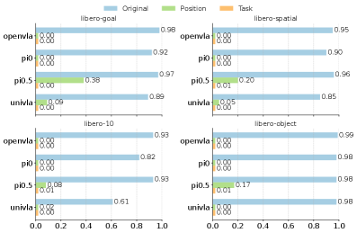
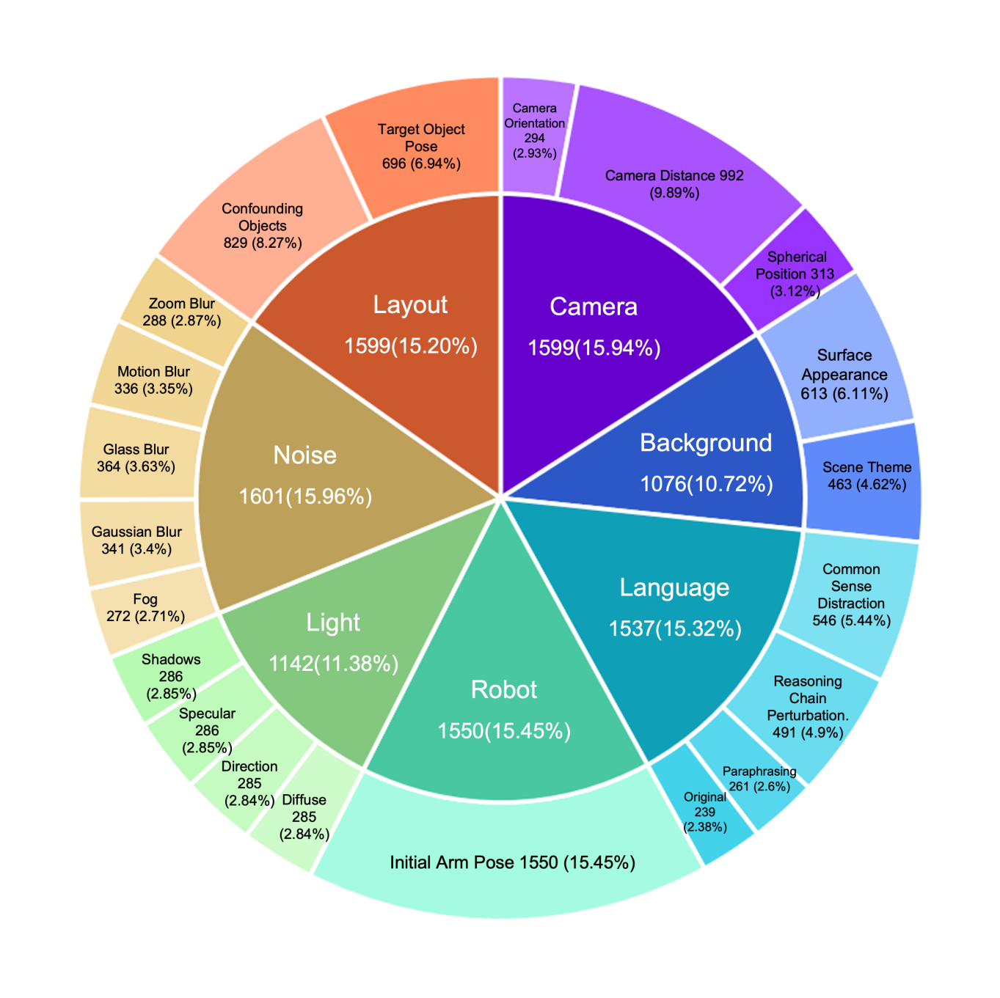

State-of-the-art robot policies score 95%+ on LIBERO. Impressive, right?

Move the target object 2 centimeters. Success drops to **0%**.

This isn't cherry-picked. It's the systematic finding from two papers that exposed what "95%+ accuracy" actually means: your model memorized the training trajectories. It learned nothing about manipulation.

{#fig-overview}

::: {.callout-note appearance="simple"}
## TL;DR

**LIBERO** (NeurIPS 2023)$^{[1]}$ is a benchmark for lifelong robot learning with 130 tasks. Two follow-up papers exposed critical flaws:

- **LIBERO-PRO**$^{[2]}$: Models scoring 95%+ drop to **0%** under tiny perturbations
- **LIBERO-Plus**$^{[3]}$: Systematic testing across 7 robustness dimensions reveals models ignore language instructions entirely
- **The problem**: Current VLA models memorize trajectories, they don't understand tasks
:::

## Why LIBERO Matters {#sec-why-libero}

Before LIBERO, robot learning benchmarks like Meta-World focused on **multi-task learning** — can one policy solve 50 different tasks? But real robots face a harder problem: **lifelong learning**. They need to learn new tasks without forgetting old ones, and transfer knowledge across tasks.

LIBERO (Liu et al., NeurIPS 2023)$^{[1]}$ was designed specifically to study this. The key insight: robot manipulation requires transferring two types of knowledge:

::: {.callout-tip appearance="simple"}
## Two Types of Knowledge Transfer

- **Declarative knowledge**: *What* things are — object identities, spatial relationships, scene layouts
- **Procedural knowledge**: *How* to do things — grasping motions, pushing behaviors, manipulation primitives

Traditional lifelong learning in vision/NLP mainly tests declarative transfer. Robots need both.
:::

## The LIBERO Benchmark {#sec-benchmark}

LIBERO contains **130 language-conditioned manipulation tasks** using a Franka Panda arm in MuJoCo simulation. Each task comes with 50 human-teleoperated demonstrations. The tasks are organized into four suites that isolate different types of distribution shift:

| Suite | Tasks | What Changes | Tests |
|-------|-------|--------------|-------|
| **LIBERO-Spatial** | 10 | Object positions | Spatial declarative knowledge |
| **LIBERO-Object** | 10 | Object types | Object declarative knowledge |
| **LIBERO-Goal** | 10 | Task objectives | Procedural knowledge |
| **LIBERO-100** | 100 | Everything | Entangled transfer |

This decomposition is LIBERO's main contribution. Instead of lumping all variations together, you can diagnose *which type* of knowledge transfer is failing.

### Example Tasks

Consider LIBERO-Spatial: all 10 tasks might involve "pick up the red cube and place it in the bowl." But the cube starts in different positions — left corner, center, right edge. A policy that truly understands spatial relationships should generalize. One that memorized specific trajectories will fail.

### The Lifelong Learning Protocol

LIBERO tests agents on **sequential task learning**:

1. Train on Task 1
2. Train on Task 2 (without access to Task 1 data)
3. ... continue for N tasks
4. Evaluate on all tasks

Key metrics:

- **Forward Transfer (FWT)**: Does learning Task 1 help with Task 2?
- **Negative Backward Transfer (NBT)**: Does learning Task 2 hurt Task 1 performance?

::: {.callout-warning appearance="default"}
## Surprising Finding

In the original LIBERO paper, **naive sequential finetuning outperformed specialized lifelong learning methods** (EWC, PackNet, Experience Replay) on forward transfer. Methods designed to prevent forgetting often hurt learning quality.
:::

## The 95% Illusion {#sec-illusion}

Fast forward to 2024. Vision-Language-Action (VLA) models like OpenVLA and Pi0 report **95%+ success rates** on LIBERO. Problem solved?

Not quite. Two papers — LIBERO-PRO$^{[2]}$ and LIBERO-Plus$^{[3]}$ — independently discovered the same disturbing pattern: these scores are meaningless.

### LIBERO-PRO: The Memorization Exposé

LIBERO-PRO (Zhou et al., 2024)$^{[2]}$ tested what happens under minimal perturbations:

{#fig-collapse}

| Model | Standard LIBERO | With Perturbations |
|-------|-----------------|-------------------|
| OpenVLA | 98% | **0%** |
| Pi0 | 92% | **0%** |
| UniVLA | 89% | **0%** |

The perturbations weren't extreme — just repositioning objects slightly or rephrasing instructions. The complete collapse reveals that models **memorized action sequences** rather than learning task structure.

### Three Damning Experiments

{#fig-trajectories}

**Experiment 1: Object Replacement**

Replace the target object (e.g., red cube) with an irrelevant object (e.g., banana). The model should recognize "there's no red cube" and fail gracefully. Instead, models **executed identical grasping trajectories** — reaching for empty space where the cube used to be (@fig-trajectories).

**Experiment 2: Instruction Corruption**

Feed the model corrupted language instructions — random tokens, gibberish, or completely different task descriptions. Performance was **unchanged**. Models ignore the language channel entirely.

**Experiment 3: Position Displacement**

Move the target object by 0.2 units (a few centimeters). Performance collapsed from 98% to near 0%. Models memorized *positions*, not object identities.

::: {.callout-important appearance="default"}
## The Core Problem

VLA models function as **Vision-Action models**, not Vision-Language-Action models. The "Language" component is decorative. They're executing memorized trajectories conditioned on visual patterns, not understanding task semantics.
:::

## LIBERO-Plus: Systematic Robustness Testing {#sec-plus}

LIBERO-Plus (OpenMOSS, 2024)$^{[3]}$ went further, creating a comprehensive robustness framework with **10,030 tasks** testing **7 dimensions** and **21 sub-dimensions** of perturbation:

{#fig-plus-arch}

### The Seven Dimensions

1. **Object Layout** (2 sub-dims): Distractor objects, target pose changes
2. **Camera Viewpoints** (3 sub-dims): Distance, angle, orientation
3. **Robot Initial States** (1 sub-dim): Joint angle perturbations
4. **Language Instructions** (3 sub-dims): Rephrasing, reasoning chains, distractors
5. **Lighting** (4 sub-dims): Color, direction, specular, shadows
6. **Background** (2 sub-dims): Textures, scene themes
7. **Sensor Noise** (5 sub-dims): Motion blur, Gaussian blur, fog, etc.

### Difficulty Levels (L1-L5)

Tasks are stratified by how many baseline models succeed:

- **L1**: All 4 reference models succeed (easiest)
- **L5**: No models succeed (hardest)

This lets you pinpoint exactly where models fail — not just "it doesn't work" but "it fails specifically on camera viewpoint changes of >30 degrees."

### Key Findings

| Perturbation Type | Baseline | After Perturbation | Drop |
|-------------------|----------|-------------------|------|
| Camera viewpoint | ~95% | 0.3% - 16.8% | -78 to -95% |
| Robot initial state | ~95% | 4.1% - 30% | -65 to -96% |
| Language variations | ~95% | ~73% | -22% |
| Lighting changes | ~95% | 30-60% | -30 to -60% |

Notice that **language variations cause the smallest drop**. This confirms the LIBERO-PRO finding: models barely use language anyway, so corrupting it doesn't matter much.

::: {.callout-tip appearance="simple"}
## One Bright Spot

Models with **wrist-mounted cameras** showed significantly better robustness (+37 percentage points on viewpoint changes). First-person views provide more stable reference frames than third-person observations alone.
:::

::: {.callout-warning appearance="default"}
## Common Misconceptions

1. **"High LIBERO scores = ready for real robots"** — No. LIBERO is simulation-only. Even robust LIBERO performance doesn't guarantee sim-to-real transfer.

2. **"LIBERO-PRO/Plus made LIBERO obsolete"** — No. Standard LIBERO is still useful for comparing methods under controlled conditions. PRO/Plus add robustness testing, they don't replace the original.

3. **"The memorization problem is unique to VLAs"** — No. Smaller policies (Diffusion Policy, ACT) can also memorize. VLAs just made it more visible because they're evaluated more broadly.
:::

## What This Means for Your Research {#sec-implications}

### If You're Evaluating Models

**Don't trust standard benchmark numbers.** A model scoring 95% on LIBERO tells you almost nothing about real-world capability. At minimum:

- Test with object repositioning (even small displacements)
- Test with instruction paraphrasing
- Test with camera viewpoint variations

LIBERO-PRO and LIBERO-Plus provide ready-made evaluation suites for this.

### If You're Building Models

The failure modes point to architectural gaps:

1. **No geometric understanding**: Models fail on viewpoint/position changes because they lack 3D scene representations
2. **No language grounding**: The vision-language fusion is broken — language features aren't actually conditioning behavior
3. **No compositional generalization**: Combined perturbations cause worse-than-additive failures, suggesting entangled representations

### If You're Writing Papers

Be honest about limitations. Report performance under perturbations, not just standard test sets. The field needs to stop celebrating memorization as intelligence.

## The Path Forward {#sec-forward}

The LIBERO suite (original + PRO + Plus) provides a template for rigorous evaluation:

1. **Isolate failure modes**: Test each type of generalization separately before mixing them
2. **Use controlled perturbations**: Systematic variation beats random noise
3. **Report robustness alongside accuracy**: A model that's 80% accurate but robust beats one that's 95% accurate but brittle

Current VLA models are impressive demonstrations of scaling. They're not yet intelligent manipulation systems. LIBERO-PRO and LIBERO-Plus give us the tools to measure the gap.

::: {.callout-note appearance="simple"}
## Summary

LIBERO exposed that lifelong robot learning is harder than expected. LIBERO-PRO and LIBERO-Plus exposed that our "solutions" were mostly memorization. The 95% accuracy numbers were an illusion — shift anything slightly, and models fail completely.

This is actually good news. We now have precise diagnostics for what's broken: geometric reasoning, language grounding, compositional generalization. The next generation of robot policies needs to address these specifically, not just scale up on benchmark-matched data.
:::

## References {#sec-references}

1. Liu, B., Zhu, Y., Gao, C., Feng, Y., Liu, Q., Zhu, Y., & Stone, P. (2023). [LIBERO: Benchmarking Knowledge Transfer for Lifelong Robot Learning](https://arxiv.org/abs/2306.03310). NeurIPS 2023.

2. Zhou, X., Xu, Y., Tie, G., Chen, Y., Zhang, G., Chu, D., Zhou, P., & Sun, L. (2024). [LIBERO-PRO: Towards Robust and Fair Evaluation of Vision-Language-Action Models Beyond Memorization](https://arxiv.org/abs/2510.03827). arXiv preprint.

3. OpenMOSS. (2024). [LIBERO-Plus: In-depth Robustness Analysis of Vision-Language-Action Models](https://arxiv.org/abs/2510.13626). arXiv preprint.

4. Yu, T., Quillen, D., He, Z., Julian, R., Hausman, K., Finn, C., & Levine, S. (2020). [Meta-World: A Benchmark and Evaluation for Multi-Task and Meta Reinforcement Learning](https://arxiv.org/abs/1910.10897). CoRL 2020.

**Code & Resources:**

- [LIBERO GitHub](https://github.com/Lifelong-Robot-Learning/LIBERO)
- [LIBERO-PRO GitHub](https://github.com/Zxy-MLlab/LIBERO-PRO)
- [LIBERO-Plus GitHub](https://github.com/sylvestf/LIBERO-plus)
- [LIBERO on HuggingFace LeRobot](https://huggingface.co/docs/lerobot/en/libero)
