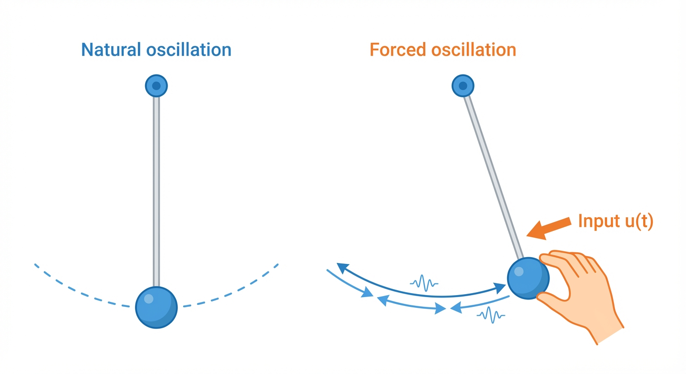
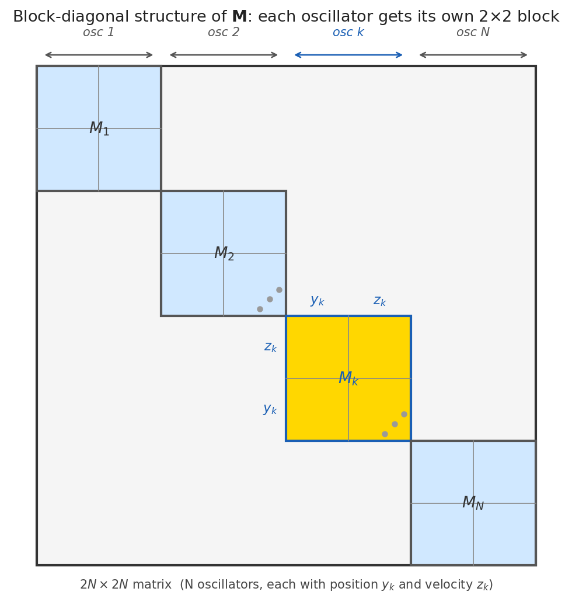
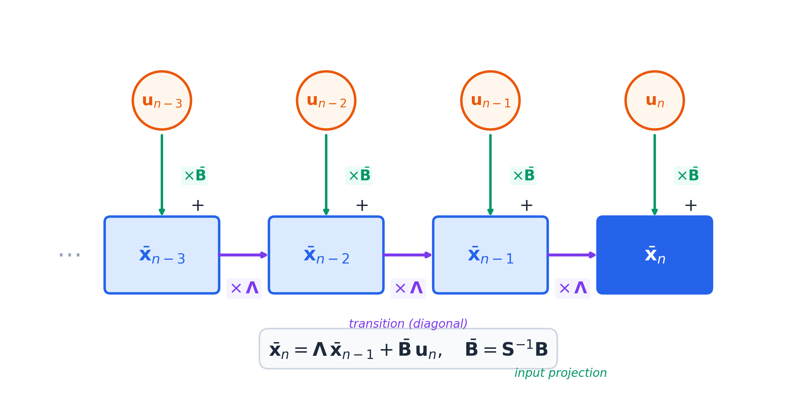
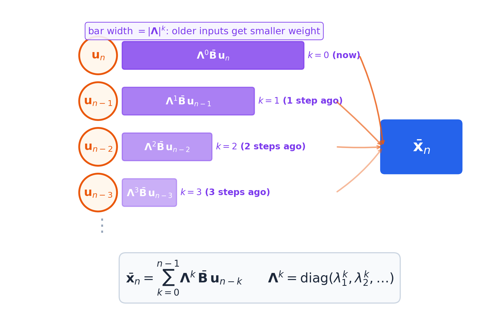
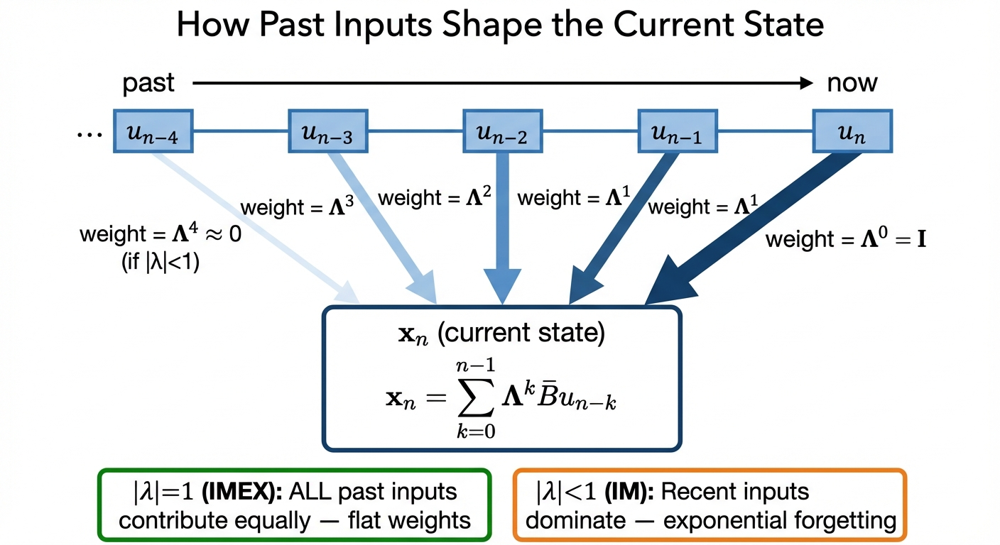
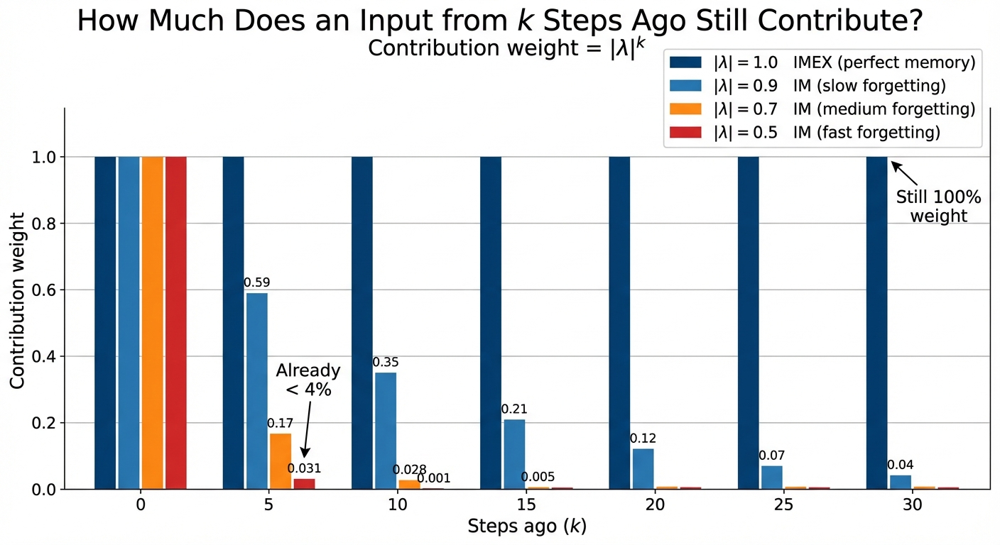
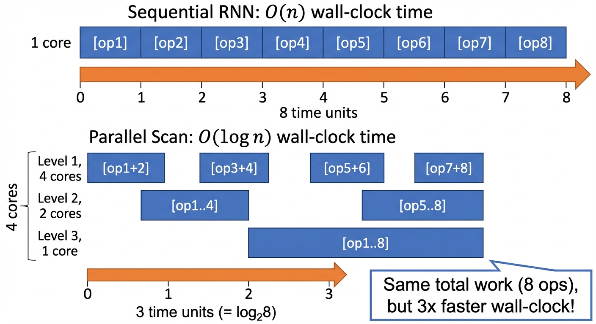
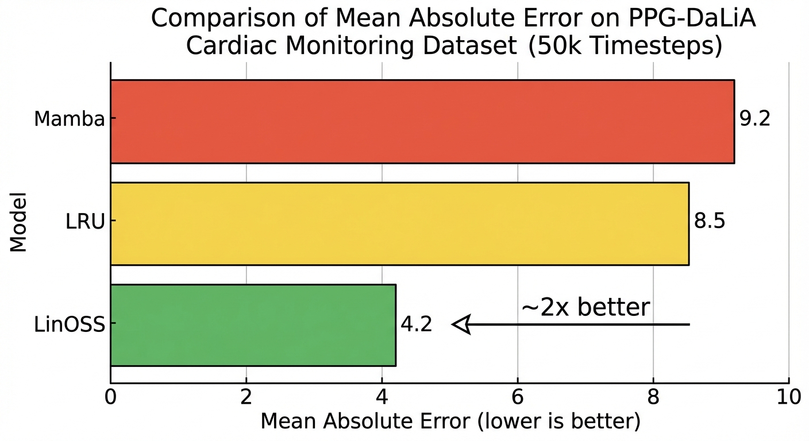

State Space Models were supposed to handle long sequences. Mamba processes 1M tokens. S4 has mathematical elegance. LRU is fast.

So why do all of them fail on 50,000-step cardiac monitoring data, while a model built from 17th-century spring physics cuts the error by 40%?

The problem is deeper than hyperparameter tuning. These models engineer stability by hand, and on very long sequences that engineering breaks down. Small numerical errors compound over thousands of steps until the model either explodes or forgets.

**LinOSS** (ICLR 2025 Oral, **Top 1%** of submissions) takes a different path: start from physics that already has stability built in. The result beats Mamba by 66% on 50k-step sequences and achieves 95% accuracy on a benchmark where the previous best SSM scored 87.8%.

The physics: the forced harmonic oscillator. The same equation that governs a guitar string, a playground swing, and (remarkably) the rotational dynamics of motor cortex during movement.

::: {.callout-note appearance="simple"}
## TL;DR

- **The problem**: State Space Models (SSMs, the architecture family behind Mamba and S4) struggle on ultra-long sequences (50k+ steps) because maintaining numerical stability over thousands of steps is hard to engineer: small errors compound and the model either explodes or forgets everything
- **The solution**: LinOSS uses uncoupled harmonic oscillators with one constraint (diagonal, nonnegative frequency matrix) to guarantee stability by construction, no tuning required
- **The results**: ~1.7x lower error than Mamba on 50k-step cardiac data; **95% vs 87.8%** on EigenWorms vs LRU (best prior SSM)
- **Why robotics**: At 100 Hz control, a 30-second task is 3,000 steps; a laundry sequence is 60,000: squarely where LinOSS wins
:::

::: {.callout-note appearance="simple"}
## Full derivations

This is the Substack-friendly version. The [full blog post](https://layernorm.dev/posts/robotics/linoss/) includes complete eigenvalue proofs, step-by-step discretization derivations, and the stability theorem with worked examples.
:::

## Why SSMs Struggle on Ultra-Long Sequences

Every SSM (and the RNN it generalizes) multiplies its hidden state by a matrix **M** at each timestep:

$$\mathbf{x}_n = \mathbf{M} \cdot \mathbf{x}_{n-1} + \mathbf{B} \cdot \mathbf{u}_n$$

Here **x**ₙ is the hidden state at step n, **M** is the learned transition matrix, **B** is the input projection, and **u**ₙ is the input at step n. Applying the recurrence n times gives xₙ = **M**ⁿx₀ + (input terms), so a signal from the past is scaled by **M**ⁿ. Because **M** is applied repeatedly, each eigendirection grows or shrinks as λⁿ. Everything depends on the eigenvalues λ of **M**:

- |λ| > 1 → state explodes exponentially
- |λ| < 1 → model forgets the distant past
- |λ| = 1 exactly → stable long-range memory

To see how bad this gets in practice: if λ = 1.01, then λ^1000 ≈ 10,000 (explosion). If λ = 0.99, then λ^1000 ≈ 0.00004 (vanished). Getting eigenvalues to land exactly on the unit circle and *stay* there over 50,000 steps is surprisingly hard to engineer. Prior SSMs each found their own workaround: S4 uses a Legendre polynomial initialization designed to spread eigenvalues optimally, Mamba keeps A diagonal with log-space arithmetic to prevent negative magnitudes, LRU reparameterizes eigenvalues as exp(-ν+iθ) where ν ≥ 0 controls decay and θ sets frequency. Each works, but each is brittle. On very long sequences, small numerical errors in those constraints accumulate, and the model breaks.

**LinOSS's insight**: instead of engineering eigenvalue constraints, start from physics where the constraint is *automatically* satisfied.

## Why Harmonic Oscillators Work

The forced harmonic oscillator is:

$$\ddot{\mathbf{y}} = -\mathbf{A} \cdot \mathbf{y} + \mathbf{B} \cdot \mathbf{u}$$

Here **y** is position, **ÿ** is acceleration (second time derivative of position), **A** is a diagonal matrix whose k-th diagonal entry Aₖₖ sets oscillator k's squared frequency, **B** is a learned input projection matrix, and **u** is the external input driving the system. This equation governs springs, pendulums, and (remarkably) motor cortex dynamics.

Rewriting as a first-order system with state [**y**, **ẏ**], the transition matrix for oscillator k has eigenvalues:

$$\pm i\sqrt{A_{kk}}$$

These are purely imaginary (zero real part), meaning no exponential growth and no decay: the system oscillates at constant amplitude. When this ODE is discretized using a symplectic method, the discrete eigenvalues map exactly to the unit circle. Energy is conserved.

The key is using **symplectic discretization**: a numerical method that preserves this "no decay, no explosion" property when converting from continuous math to discrete computer operations. Other discretization methods (like Euler's method) add numerical "friction" that corrupts the stability guarantee.

**Why does forcing not break this?** LinOSS uses *forced* harmonic oscillators, where external input drives the system. You might expect adding energy from outside would destabilize it. Here is why it does not:

The eigenvalues we care about are eigenvalues of the *dynamics matrix* **A** (the spring restoring force), not of the whole system. The forcing term **B**·**u**(t) is additive: it adds energy on top, but it does not change the spring's restoring force. Compare three swings:

- **Swing with friction**: energy decreases, slows down and stops (eigenvalues decay inside unit circle)
- **Swing with rocket booster**: energy increases uncontrollably, speeds up forever (eigenvalues explode outside unit circle)
- **Swing with someone pushing**: energy varies but stays bounded (you control the amplitude); eigenvalues stay on unit circle

LinOSS is the third case. The person pushing is the input **u**(t). They can add or remove energy, but the swing's natural frequency (set by the spring constant **A**) is unchanged. Eigenvalues stay purely imaginary.

## The 5-Year Path to LinOSS

LinOSS didn't appear out of nowhere. T. Konstantin Rusch (first author, now at MIT) spent five years building the mathematical foundation.

**2021: coRNN** (ICLR): What if RNN neurons were oscillators? Proved gradient bounds, showing oscillator-based networks avoid vanishing/exploding gradients by construction. But coRNN was slow because the oscillators were coupled (each one depended on all the others).

**2021: UniCoRNN** (ICML): Cut the connections between oscillators. Make each one independent. Same stability guarantees, much faster.

**2022: GraphCON** (ICML): Extended oscillators to graph neural networks, solving oversmoothing.

**2023: "Neural Oscillators are Universal"** (NeurIPS): The key theoretical breakthrough: proved that forced harmonic oscillators with a nonlinear readout can approximate *any* continuous function. And if nonlinearity only happens *between* oscillator blocks, the oscillator core stays entirely linear. Linear means closed-form recurrence. Closed-form means parallel computation. That's the unlock for LinOSS.

**2025: LinOSS** (ICLR Oral): Combined the universality proof with SSM-style parallelization. Physics solves stability; the theorem says you're not giving up expressiveness.

## The Architecture

So what does this actually look like? LinOSS models *N* uncoupled forced harmonic oscillators. Each oscillator has its own frequency (a diagonal entry of the matrix **A**), evolves independently, and receives input through a learned projection matrix **B**.

The critical constraint: **A must be diagonal with nonnegative entries**. This is the *only* structural requirement LinOSS imposes, and it's where all the magic comes from.

**Why diagonal?** A full weight matrix would couple every oscillator to every other one, making parallel computation impossible. Diagonal means each oscillator evolves from itself alone. No cross-oscillator dependencies = no sequential bottleneck. As Rusch put it: "In a standard RNN, each hidden neuron is connected to each other hidden neuron. So we have a very dense connectivity. Our approach is very different: we only have hidden connections for each neuron to itself. Some sort of sparse representation."

**Why nonnegative?** Recall that the oscillator's eigenvalues are ±i√Aₖₖ. If Aₖₖ ≥ 0, √Aₖₖ is real and the eigenvalues are purely imaginary: the oscillator oscillates without growing. If Aₖₖ < 0, √Aₖₖ becomes imaginary, so ±i√Aₖₖ becomes real and positive or negative. A real eigenvalue greater than 1 means exponential blowup. The paper enforces Aₖₖ ≥ 0 via **A** = ReLU(Â), where  is the learned parameter. This makes stability automatic: any learned value that would cause instability gets clamped to zero.

**How input reaches the oscillators: the B matrix.** The B matrix projects input to each oscillator. Each oscillator receives a *different* linear combination of input channels. Think of 3 kids on 3 separate swings (3 uncoupled oscillators) and 2 hands (2 input channels). Kid 1 gets pushed by the left hand only. Kid 2 by the right hand only. Kid 3 by both equally. During training, LinOSS *learns* this wiring. The swings don't affect each other, but they all respond to the input through different learned combinations.

**What about expressiveness?** Multiple oscillators at different frequencies act like a Fourier basis: any smooth function of time can be decomposed into oscillatory components. The learned **B** (input projection) and **C** (output readout) matrices then mix these components to produce the desired output. Stacking multiple LinOSS blocks creates deep nonlinear networks.

## Two Stability Flavors

LinOSS comes in two variants, corresponding to two discretization schemes. The choice matters: one gives perfect memory, the other gives learned forgetting, and the leaky one often wins in practice.

Recall the LinOSS ODE: ÿ = −**A**y + **B**u, where **y** is position, **A** is the diagonal frequency matrix, and **u** is the input. This continuous-time equation must be converted to discrete timesteps before a computer can run it.

**First, rewrite as a first-order system.** Let **z** = d**y**/dt (velocity). The second-order ODE becomes two coupled first-order equations: d**z**/dt = −**A**y + **B**u and d**y**/dt = **z**. The state is now the pair [**y**, **z**] (position and velocity) of dimension 2N.

**Discretization** replaces these continuous derivatives with finite-difference updates at each timestep Δt. The question: which timestep's values do you use, old (n−1) or new (n)? The answer determines the eigenvalue structure of the resulting recurrence **x**ₙ = **M**·**x**ₙ₋₁ + **F**·uₙ.

**LinOSS-IM (Implicit Euler)**: Use the *new* position and velocity in both update equations:

- **z**ₙ = **z**ₙ₋₁ + Δt(−**A**·**y**ₙ + **B**·uₙ)  ← uses new **y**ₙ
- **y**ₙ = **y**ₙ₋₁ + Δt·**z**ₙ  ← uses new **z**ₙ

This creates a circular dependency: **z**ₙ depends on **y**ₙ which depends on **z**ₙ. Substituting **y**ₙ = **y**ₙ₋₁ + Δt·**z**ₙ into the velocity equation and collecting **z**ₙ on one side:

$$(\mathbf{I} + \Delta t^2 \mathbf{A})\,\mathbf{z}_n = \mathbf{z}_{n-1} - \Delta t\,\mathbf{A}\mathbf{y}_{n-1} + \Delta t\,\mathbf{B}\mathbf{u}_n$$

Define **S** ≜ (**I** + Δt²**A**)⁻¹ and multiply both sides by **S** to solve for **z**ₙ. Since **A** is diagonal, each entry is simply:

$$S_{kk} = \frac{1}{1 + \Delta t^2 A_{kk}}$$

Substituting back gives the recurrence **x**ₙ = **M**_IM·**x**ₙ₋₁ + **F**·uₙ with:

$$\mathbf{M}_\text{IM} = \begin{bmatrix} \mathbf{S} & \Delta t\,\mathbf{S} \\ -\Delta t\,\mathbf{A}\mathbf{S} & \mathbf{S} \end{bmatrix}$$

Since **A** and **S** are diagonal, this 2N×2N matrix is block-diagonal: N independent 2×2 blocks, one per oscillator. The eigenvalues of each 2×2 block are:

$$\lambda_k = S_{kk} \pm i \cdot \Delta t \cdot S_{kk} \cdot \sqrt{A_{kk}}$$

Their magnitude squared (using Sₖₖ = 1/(1 + Δt²Aₖₖ), so Sₖₖ²·(1 + Δt²Aₖₖ) = Sₖₖ):

$$|\lambda_k|^2 = S_{kk} = \frac{1}{1 + \Delta t^2 A_{kk}} \leq 1$$

Higher frequency (larger Aₖₖ) → smaller Sₖₖ → faster forgetting. This acts as learned regularization. Here is the counterintuitive result: **LinOSS-IM often outperforms LinOSS-IMEX in practice.** A little damping prevents the model from holding onto noise indefinitely, for the same reason regularization beats perfect fit on test data.

**LinOSS-IMEX (Symplectic)**: Use the *old* position in the velocity update, but the *new* velocity in the position update:

- **z**ₙ = **z**ₙ₋₁ + Δt(−**A**·**y**ₙ₋₁ + **B**·uₙ)  ← uses OLD **y**ₙ₋₁ (no circular dependency)
- **y**ₙ = **y**ₙ₋₁ + Δt·**z**ₙ  ← uses NEW **z**ₙ

No circular dependency. Substituting directly gives the recurrence with:

$$\mathbf{M}_\text{IMEX} = \begin{bmatrix} \mathbf{I} - \Delta t^2\mathbf{A} & \Delta t\,\mathbf{I} \\ -\Delta t\,\mathbf{A} & \mathbf{I} \end{bmatrix}$$

For each 2×2 oscillator block, det(**M**ₖ) = (1 − Δt²Aₖₖ)·1 − (Δt)(−Δt·Aₖₖ) = 1 − Δt²Aₖₖ + Δt²Aₖₖ = 1. The Δt²A terms cancel exactly. For any 2×2 real matrix whose eigenvalues come in conjugate pairs λ and λ̄, the determinant equals their product. So det = 1 gives |λ| = 1 directly:

$$\det(\mathbf{M}_k) = \lambda\bar\lambda = |\lambda|^2 = 1 \quad \Rightarrow \quad |\lambda| = 1$$

Perfect memory: an input from 50,000 steps ago contributes equally to the current output as one from a single step ago.

To see exactly how past inputs survive, diagonalize **M** = **S**Λ**S**⁻¹ (Λ diagonal with eigenvalues, **S** holds eigenvectors). Change coordinates: **x̄**ₙ = **S**⁻¹**x**ₙ. The recurrence simplifies to:

$$\bar{\mathbf{x}}_n = \mathbf{\Lambda}\,\bar{\mathbf{x}}_{n-1} + \bar{\mathbf{B}}\,\mathbf{u}_n \quad \text{where } \bar{\mathbf{B}} = \mathbf{S}^{-1}\mathbf{B}$$

Since Λ is diagonal, each coordinate evolves independently. Unrolling from **x̄**₀ = **0**:

$$\bar{\mathbf{x}}_n = \sum_{k=0}^{n-1} \underbrace{\mathbf{\Lambda}^k}_{\text{memory decay}} \bar{\mathbf{B}}\, \mathbf{u}_{n-k}$$

Each past input **u**ₙ₋ₖ is weighted by Λᵏ: eigenvalues raised to the k-th power. Since Λ is diagonal, raising it to the k-th power just raises each entry independently:

$$\mathbf{\Lambda}^k = \begin{bmatrix}\lambda_1^k & & \\ & \lambda_2^k & \\ & & \ddots\end{bmatrix}$$

Each component j of **x̄**ₙ is scaled by the scalar λⱼᵏ, independently. If |λⱼ| > 1, that component explodes. If |λⱼ| ≤ 1, it stays bounded. The stability condition is per-eigenvalue, and the memory profile is determined entirely by |λ|.

The physics analogy: IM is like a pendulum with slight friction (energy slowly dissipates), while IMEX is a pendulum in a vacuum (oscillates forever without losing amplitude).

::: {.callout-tip appearance="simple"}
## The Neuroscience Connection

Motor cortex during reaching shows the same pattern. Churchland et al. (2012) discovered that neural activity follows rotational dynamics: trajectories spiral through state space with slight inward decay. Eigenvalues with small negative real parts, close to but not exactly on the unit circle.

This matches LinOSS-IM: oscillatory but slightly dissipative. Biology's "imperfect" oscillators may be optimal for motor control, where forgetting yesterday's plans is useful. Some forgetting is actually a feature, not a bug.
:::

## Why It's Fast

Stability without speed is useless for 50k-step sequences. The standard way to compute a recurrence requires sequential processing: step 2 depends on step 1, step 3 depends on step 2, and so on. For 50,000 timesteps, that's 50,000 sequential operations. The oscillator core being linear is what makes parallelization possible: linear recurrences satisfy an associative property, so you can combine any two consecutive chunks without knowing the internal steps.

The recurrence **x**ₙ = **M**·**x**ₙ₋₁ + **B**·**u**ₙ can be rewritten as an associative binary operation over pairs (**M**, **b**), where **M** is the transition matrix for a chunk and **b** is its accumulated input contribution:

$$(\mathbf{M}_2, \mathbf{b}_2) \oplus (\mathbf{M}_1, \mathbf{b}_1) = (\mathbf{M}_2 \cdot \mathbf{M}_1,\; \mathbf{M}_2 \cdot \mathbf{b}_1 + \mathbf{b}_2)$$

Associativity unlocks a tree-reduction pattern: instead of 50,000 sequential steps, process the sequence in log₂(50000) ≈ 16 parallel stages.

The diagonal structure makes this even faster: **M** is diagonal, so the "matrix multiply" at each merge step is elementwise (no actual matrix multiply). Wall-clock time for T timesteps: O(N × log₂T) for LinOSS versus O(N³ × log₂T) for a dense SSM (where each merge requires a full N×N matrix multiply). Here T is the sequence length and N is the state dimension.

## Results

Theory is nice. Here's what LinOSS actually achieves.

**Ultra-long sequences (50k tokens).** On PPG-DaLiA (cardiac monitoring, ~50,000 timesteps):

**Time series classification.** On six UEA multivariate datasets (the six with the longest sequences):

- Log-NCDE (neural controlled differential equations): 64.3%
- S5 (SSM baseline, Smith et al. 2023): 61.8%
- **LinOSS-IM: 67.8%**

**EigenWorms (sequences of length 17,984):**

- LRU (best prior SSM): 87.8%
- **LinOSS-IM: 95.0%** (+7.2 points)

**Efficiency.** LinOSS matches Mamba's wall-clock time in practice despite a 2x larger state (tracking both position and velocity). The diagonal structure offsets the size penalty.

::: {.callout-note appearance="simple"}
## Pattern across benchmarks

LinOSS's advantages are most pronounced on very long sequences (10k-100k tokens), tasks requiring stable long-range memory, and continuous/smooth temporal dynamics. These are exactly the characteristics of robot control tasks.
:::

## Why This Matters for Robotics

Robot control sequences are longer than they appear. A 30-second cloth folding task sounds short. But at 100 Hz (standard for modern arms), that's 3,000 control steps. A full laundry sequence at 100 Hz is 60,000 steps, well within LinOSS's demonstrated range.

- **30 Hz**: cloth folding = 900 steps, full laundry = 18,000 steps
- **100 Hz**: cloth folding = 3,000 steps, full laundry = 60,000 steps
- **500 Hz**: cloth folding = 15,000 steps, full laundry = 300,000 steps

At 500 Hz force/impedance control, even a single 30-second task exceeds what LSTMs handle reliably.

From Rusch's TED talk on the humanoid kitchen demo:

> "We trained a humanoid robot to perform kitchen chores (pouring water, scooping material into a pan). Training data was only human tactile data. LinOSS was the **only model** that led to physically meaningful representations, extremely close to the human trajectories."

When they visualized the hidden neuron activations during inference: "you can see these very beautiful oscillatory dynamics emerge."

## Three Common Objections

**"Second-order ODEs are more expensive."** Yes, LinOSS tracks both position and velocity, doubling state size. But the diagonal structure means computation is still O(N) per step, just with a factor of 2. The benchmarks bear this out: the diagonal structure offsets the size penalty.

**"Linear models can't capture complex dynamics."** The oscillator core is linear, but the full model isn't. The oscillators span a Fourier-like basis; stacking blocks with nonlinear activations creates deep nonlinear networks. The paper proves a universality theorem: with enough oscillators and stacked blocks, LinOSS can approximate any continuous causal operator to arbitrary precision.

**"Oscillators are only good for periodic data."** LinOSS excels on non-periodic data too: text, weather, cardiac monitoring. The same way Fourier analysis works on arbitrary waveforms (not just pure tones), the oscillator basis can represent any smooth temporal signal.

## The Takeaway

LinOSS demonstrates something striking: classical physics provides a better foundation for sequence modeling than clever ML engineering.

Not because physics is magic, but because it already solved the stability problem. The forced harmonic oscillator has purely imaginary eigenvalues by construction. Symplectic discretization preserves that property. One structural constraint (diagonal nonnegative **A**) is all you need.

For robotics, this means an architecture that's simultaneously principled (grounded in physics), biologically plausible (matching motor cortex dynamics), and practical (SOTA on 50k+ sequences).

The convergence is the interesting part: evolution optimized motor cortex for oscillatory dynamics; physicists understood these dynamics centuries ago; and now ML is rediscovering them for sequence modeling. LinOSS makes this connection explicit and shows it works.

::: {.callout-note appearance="simple"}
## Go deeper

The [full blog post](https://layernorm.dev/posts/robotics/linoss/) covers:

- Complete eigenvalue derivations for IM and IMEX variants
- Step-by-step discretization (why explicit Euler fails, why symplectic works)
- The parallel scan with worked merge operator derivation
- Full stability proofs with the Schur complement argument
- Universal approximation theorem statement
:::

## References

[1] [Rusch & Rus (2025). Oscillatory State-Space Models. ICLR 2025 Oral.](https://arxiv.org/abs/2410.03943)

[2] [Churchland et al. (2012). Neural Population Dynamics During Reaching. Nature.](https://www.nature.com/articles/nature11129)

[3] [Bellegarda et al. (2022). CPG-RL: Learning Central Pattern Generators for Quadruped Locomotion.](https://arxiv.org/abs/2211.00458)

[4] [Gu et al. (2022). S4: Efficiently Modeling Long Sequences with Structured State Spaces. ICLR.](https://arxiv.org/abs/2111.00396)

[5] [Gu & Dao (2024). Mamba: Linear-Time Sequence Modeling with Selective State Spaces. COLM.](https://arxiv.org/abs/2312.00752)

[6] [Orvieto et al. (2023). Resurrecting Recurrent Neural Networks for Long Sequences. ICML.](https://arxiv.org/abs/2303.06349) (LRU)

[7] [MIT News: Novel AI Model Inspired by Neural Dynamics from the Brain. May 2025.](https://news.mit.edu/2025/novel-ai-model-inspired-neural-dynamics-from-brain-0502)

[8] [Rusch & Mishra (2021). coRNN: Coupled Oscillatory Recurrent Neural Network. ICLR 2021.](https://arxiv.org/abs/2010.00951)

[9] [Rusch (2025). TED Talk: Oscillatory State Space Models.](https://www.youtube.com/watch?v=_MpDy6bL0XE)

[10] [Jia et al. (2024). MaIL: Improving Imitation Learning with Mamba. CoRL 2024.](https://arxiv.org/abs/2406.08234)

[11] [Liu et al. (2025). MTIL: Multi-Task Imitation Learning with Mamba. RA-L 2025.](https://arxiv.org/abs/2501.05905)

[12] [Shi et al. (2025). Mamba Policy: Towards Efficient 3D Diffusion Policy. IROS 2025.](https://arxiv.org/abs/2409.07163)

[13] [Zhu et al. (2024). Decision Mamba: Reinforcement Learning via Sequence Modeling. NeurIPS 2024.](https://arxiv.org/abs/2403.19925)

[14] [Yoo et al. (2025). RoboSSM: In-Context Imitation Learning with State Space Models.](https://arxiv.org/abs/2509.19658)
