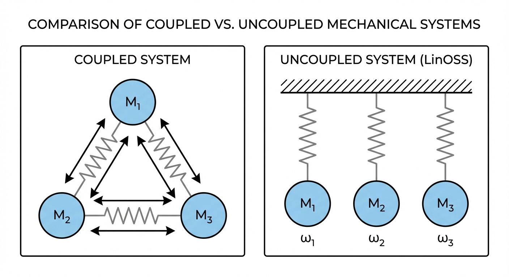
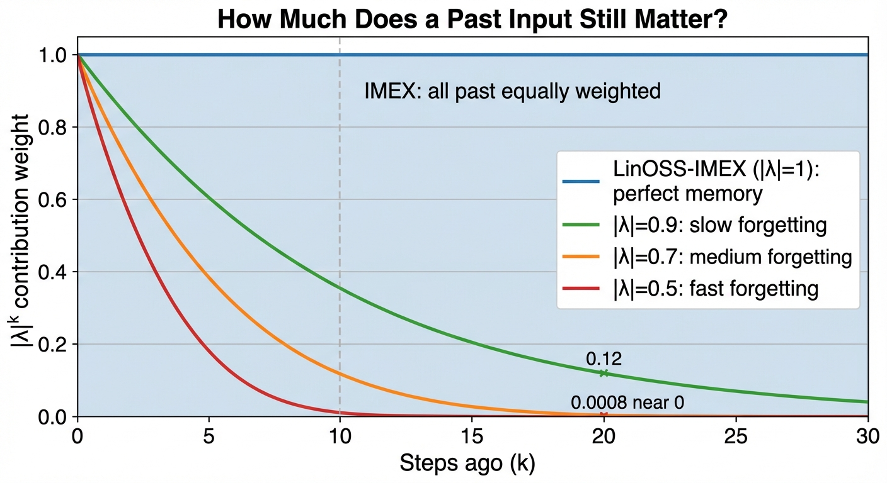

State Space Models were supposed to handle long sequences. Mamba processes 1M tokens. S4 has mathematical elegance. LRU is fast.

But on 50,000-step cardiac monitoring data, Mamba's prediction error is **~66% higher** than a model based on 17th-century physics.

{#fig-overview}

**LinOSS**$^{[1]}$ (ICLR 2025 Oral, **Top 1%** of submissions) doesn't engineer eigenvalue constraints like S4. It doesn't use input-dependent gating like Mamba. Instead, it starts from a 400-year-old equation: the forced harmonic oscillator.

The same physics that governs a guitar string. A playground swing. And (remarkably) the rotational dynamics of motor cortex during movement.

::: {.callout-note appearance="simple"}
## TL;DR

- **The problem**: SSMs struggle on ultra-long sequences (50k+): small numerical errors compound over thousands of steps
- **The solution**: LinOSS uses uncoupled harmonic oscillators with one constraint ($\mathbf{A}$ diagonal, nonnegative) to guarantee stability by construction
- **The results**: ~1.7x lower error than Mamba on 50k-step cardiac data; **95% vs 87.8%** on EigenWorms vs LRU (best prior SSM)
- **Why robotics**: At 100 Hz control, a 30-second task is 3,000 steps; a laundry sequence is 60,000: squarely where LinOSS wins
:::

## Why SSMs Struggle on Ultra-Long Sequences {#sec-intro}

In [Part 6: Eigenvalue Dynamics](../6-eigenvalue-dynamics/), we explored a surprising convergence: motor cortex exhibits rotational dynamics because eigenvalues near the unit circle with imaginary components produce stable oscillations. Independently, ML researchers discovered the same constraint prevents vanishing/exploding gradients in RNNs.

State Space Models (S4, Mamba, LRU) exploit this insight by parameterizing eigenvalues directly. But they still require careful initialization and constraints to maintain stability. On very long sequences, small numerical errors compound over thousands of steps.

**LinOSS** takes a different approach: instead of engineering eigenvalue constraints, they start from **physics**. Forced harmonic oscillators (the equations governing springs, pendulums, and countless physical systems) naturally produce the oscillatory dynamics we need.

The result is an architecture that:

1. **Achieves stability by construction**: no careful tuning required
2. **Outperforms Mamba** on very long sequences (50k+ tokens)
3. **Proves universal approximation**: can learn any causal operator
4. **Mirrors biological neural dynamics** more closely than prior SSMs

::: {.callout-tip appearance="simple"}
## Why This Paper Matters for Robotics

LinOSS connects three worlds:

| Domain | Key Concept | LinOSS Connection |
|--------|-------------|-------------------|
| **Physics** | Forced harmonic oscillator | The core dynamical system |
| **Neuroscience** | Motor cortex rotations | Same oscillatory dynamics |
| **ML** | Stable SSMs | Efficient sequence modeling |

For robot learning, this suggests architectures that are simultaneously **principled** (grounded in physics), **biologically plausible** (matching brain dynamics), and **practical** (fast, stable, SOTA performance).

As Rusch noted in his TED talk$^{[9]}$: "The human brain is really unmatched when it comes to energy efficiency... my brain was operating on nothing else than probably a few mugs of coffee or sandwiches." LinOSS aims to capture some of that efficiency.
:::

## The Path to LinOSS: A Detective Story {#sec-path}

How did the authors arrive at "use harmonic oscillators"? This wasn't a lucky guess; it's the culmination of a 5-year research program and centuries of physics. Here's how the pieces fit together.

### The Problem Everyone Knew

By 2020, the SSM community had identified the core issue: **eigenvalue stability** in RNNs.

#### Step 1: The RNN Stability Problem (Discrete Time)

RNNs process sequences by multiplying the hidden state by a matrix at each timestep:

$$x_{n} = A \cdot x_{n-1} = A^n \cdot x_0$$

For each eigenvalue $\lambda$ of the matrix $A$, its contribution after $n$ steps scales as $\lambda^n$. What happens over thousands of steps?

| Magnitude | $\lambda^n$ as $n \to \infty$ | Behavior |
|-----------|------------------------------|----------|
| $|\lambda| > 1$ | $\to \infty$ | **Explodes** (gradients blow up) |
| $|\lambda| = 1$ | stays bounded | **Stable** (long-range memory) |
| $|\lambda| < 1$ | $\to 0$ | **Vanishes** (gradients disappear) |

**Example:** If $\lambda = 1.01$, then $\lambda^{1000} \approx 10^{4}$ (explosion). If $\lambda = 0.99$, then $\lambda^{1000} \approx 10^{-4}$ (vanished).

**The goal:** Keep eigenvalues on the unit circle ($|\lambda| = 1$). But this is hard to engineer directly.

#### Step 2: LinOSS's Insight: Start from Physics Instead

In continuous systems, stability is determined by the **real part** of eigenvalues. If the real part is zero, amplitude stays constant; positive means explosion, negative means decay. LinOSS starts from continuous-time physics, where this property is easier to guarantee than in discrete systems.

#### Step 3: Why Harmonic Oscillators Are Magic

Harmonic oscillators (springs, pendulums) have purely imaginary eigenvalues: $\lambda = \pm i\omega$. The real part is exactly zero, so the amplitude stays constant forever. We'll derive this below.

#### Step 4: Discretization Connects the Two Worlds

Symplectic discretization maps purely imaginary continuous eigenvalues ($\lambda = i\omega$) to the unit circle in discrete time ($|\lambda| = 1$). The stability guarantee transfers automatically. Naive methods (Euler's method) break this property; symplectic integrators preserve it by design.

### The Engineering Approaches (What Others Did)

Before LinOSS, the SSM community solved the eigenvalue problem by engineering constraints. All of these approaches work, but they're fragile: the constraints are ad hoc, and small numerical errors accumulate over very long sequences.

| Model | The Trick | Philosophy |
|-------|-----------|------------|
| **S4** | Hand-craft HiPPO matrix from Legendre polynomials | Optimal polynomial projection theory |
| **S4D** | Fix Re(λ) = -1/2, tune imaginary parts | Approximate HiPPO spectrum |
| **Mamba** | Keep A diagonal, use log-space, high precision | Pragmatic: hope it works |
| **LRU** | Parameterize as exp(-ν+iθ), enforce ν > 0 | Clever reparameterization |

### Rusch's Insight: Ask Physics

T. Konstantin Rusch (first author) took a different path: ask physics to solve the problem instead of engineering around it. His path to LinOSS spans five years of work.

In 2021, Rusch published **coRNN** (ICLR), which asked a simple question: what if the neurons in an RNN were oscillators? The paper proved gradient bounds, showing that oscillator-based networks avoid the vanishing/exploding gradient problem by construction. But coRNN was slow, because the oscillators were coupled to each other through a dense connectivity matrix.

The same year, Rusch addressed this in **UniCoRNN** (ICML 2021): cut the connections between oscillators. Make each one independent, with a diagonal A matrix. This gave the same stability guarantees at a fraction of the cost.

In 2022, **GraphCON** (ICML) extended the oscillator idea to graph neural networks, where it solved oversmoothing (a failure mode in graph networks where node representations become indistinguishable after many layers).

The theoretical foundation arrived in 2023 with **"Neural Oscillators are Universal"** (NeurIPS). This paper proved that forced harmonic oscillators with a nonlinear readout layer can approximate any continuous function. The key realization: if nonlinearity only happens *between* oscillator blocks (in the readout), the oscillator core can stay entirely linear. Linear means the recurrence has a closed form. Closed form means parallel scan. That's LinOSS.

**LinOSS** (ICLR 2025) combined this universality proof with SSM-style parallelization. The oscillator core stays linear; expressiveness comes from the GELU+GLU layers between blocks. Physics solves the stability problem, and the universality theorem says you're not giving up anything in terms of what the model can represent.

### Why Harmonic Oscillators? From Second-Order to First-Order

The harmonic oscillator is the second-order ODE: $y'' = -\omega^2 y$

To analyze eigenvalues, we convert to a first-order system. Define $z = y'$ (velocity). Then $z' = y''$, so:

$$y'' = -\omega^2 y \quad \Rightarrow \quad \begin{cases} y' = z \\ z' = -\omega^2 y \end{cases}$$

In matrix form with state $\mathbf{x} = [y, z]^T$:

$$\frac{d}{dt}\begin{bmatrix} y \\ z \end{bmatrix} = \begin{bmatrix} 0 & 1 \\ -\omega^2 & 0 \end{bmatrix} \begin{bmatrix} y \\ z \end{bmatrix}$$

**Now let's find the eigenvalues.**

Eigenvalues satisfy $\mathbf{A}\mathbf{v} = \lambda\mathbf{v}$, which rearranges to $(\mathbf{A} - \lambda\mathbf{I})\mathbf{v} = 0$. For a non-zero $\mathbf{v}$ to exist, the matrix $(\mathbf{A} - \lambda\mathbf{I})$ must be singular (not invertible), which means det$(\mathbf{A} - \lambda\mathbf{I}) = 0$.

(This is universal: a square matrix is singular iff its determinant is zero. So det$(\mathbf{A} - \lambda\mathbf{I}) = 0$ is the standard way to find eigenvalues for any matrix.)

Subtract $\lambda\mathbf{I}$ from $\mathbf{A}$:

$$\mathbf{A} - \lambda\mathbf{I} = \begin{bmatrix} 0 & 1 \\ -\omega^2 & 0 \end{bmatrix} - \begin{bmatrix} \lambda & 0 \\ 0 & \lambda \end{bmatrix} = \begin{bmatrix} -\lambda & 1 \\ -\omega^2 & -\lambda \end{bmatrix}$$

Set the determinant to zero (recall: det of 2×2 is $ad - bc$):

$$\det\begin{bmatrix} -\lambda & 1 \\ -\omega^2 & -\lambda \end{bmatrix} = (-\lambda)(-\lambda) - (1)(-\omega^2) = \lambda^2 + \omega^2 = 0$$

Solving: $\lambda^2 = -\omega^2$, so $\lambda = \pm i\omega$. Purely imaginary!

**But why does the harmonic oscillator give imaginary eigenvalues, while other systems don't?**

| Equation | Physical system | Matrix | Eigenvalues |
|----------|-----------------|--------|-------------|
| $y'' = -\omega^2 y$ | Oscillator (spring) | $\begin{bmatrix} 0 & 1 \\ -\omega^2 & 0 \end{bmatrix}$ | $\pm i\omega$ (imaginary) |
| $y'' = +\omega^2 y$ | Unstable (inverted pendulum) | $\begin{bmatrix} 0 & 1 \\ +\omega^2 & 0 \end{bmatrix}$ | $\pm\omega$ (real, explodes) |
| $y'' = -\omega^2 y - \gamma y'$ | Damped oscillator | $\begin{bmatrix} 0 & 1 \\ -\omega^2 & -\gamma \end{bmatrix}$ | Complex with Re < 0 (decays) |

The harmonic oscillator is special because it **conserves energy**: it oscillates forever without growing or decaying.

{#fig-eigenvalue-stability}

::: {.callout-note collapse="true"}
## The Deeper Connection: Hamiltonian Mechanics

A **Hamiltonian system** is one where total energy $H$ is conserved. The harmonic oscillator has energy:

$$H = \underbrace{\frac{1}{2}p^2}_{\text{kinetic}} + \underbrace{\frac{1}{2}\omega^2 q^2}_{\text{potential}}$$

where $q$ is position and $p$ is momentum (velocity).

**Why does energy conservation force imaginary eigenvalues?**

Recall that eigenvalues control how solutions evolve: $x(t) \sim e^{\lambda t}$.

- If $\lambda$ has **positive real part** → solution grows → energy grows → contradicts conservation
- If $\lambda$ has **negative real part** → solution decays → energy decays → contradicts conservation
- Only option: **zero real part** → purely imaginary → energy stays constant ✓

**Why doesn't the inverted pendulum work?** It's also Hamiltonian, but with energy $H = \frac{1}{2}p^2 - \frac{1}{2}\omega^2 q^2$. This energy is **not positive definite**: it can be negative. Trajectories aren't bounded, so eigenvalues are real $\pm\omega$.

**The full statement:** Hamiltonian + positive definite energy → purely imaginary eigenvalues.
:::

**What about damping?** Adding a damping term $y'' = -\omega^2 y - \gamma y'$ breaks energy conservation (energy dissipates as heat). The matrix becomes:

$$\begin{bmatrix} 0 & 1 \\ -\omega^2 & -\gamma \end{bmatrix}$$

Now the eigenvalues have negative real parts, so oscillations decay over time. This is fine for modeling physical systems, but bad for sequence models (we'd lose long-range memory).

### Wait: LinOSS Has Forcing. Why Are Eigenvalues Still Imaginary?

This confused me too. LinOSS uses **forced** harmonic oscillators:

$$y'' = -\omega^2 y + b \cdot u(t)$$

{#fig-forcing}

Energy is being pumped in by $u(t)$! So how can we talk about "energy conservation" and "Hamiltonian"?

**Step 1: What are we finding eigenvalues OF?**

When we convert to first-order:

$$\frac{d}{dt}\begin{bmatrix} y \\ z \end{bmatrix} = \underbrace{\begin{bmatrix} 0 & 1 \\ -\omega^2 & 0 \end{bmatrix}}_{\mathbf{A}} \begin{bmatrix} y \\ z \end{bmatrix} + \underbrace{\begin{bmatrix} 0 \\ b \end{bmatrix}}_{\mathbf{B}} u(t)$$

The eigenvalues we care about are eigenvalues of **A** (the dynamics matrix), not of the whole system. The forcing term $\mathbf{B}u(t)$ is separate: it's an **input**, not part of the dynamics.

**Step 2: Where does the forcing term go?**

Look at the two equations:

- $y' = z$ (no forcing here; just says velocity = derivative of position)
- $z' = -\omega^2 y + b \cdot u(t)$ (forcing is **additive**, separate from $-\omega^2 y$)

The $-\omega^2 y$ term (which creates the oscillation) is unchanged. The forcing just adds energy on top.

**Step 3: Why does the A matrix still have imaginary eigenvalues?**

The A matrix is:
$$\mathbf{A} = \begin{bmatrix} 0 & 1 \\ -\omega^2 & 0 \end{bmatrix}$$

This is **exactly the same** as the unforced oscillator! The eigenvalues are still $\pm i\omega$.

**Step 4: Here's the catch: the forced system isn't energy-conserving!**

Correct! When you push a swing (apply forcing), you're adding energy. Energy is NOT conserved.

So why do we still get stable dynamics?

**The key insight:** We don't need energy conservation. We need something weaker: **no friction**.

Think about it:

| System | Energy | What happens |
|--------|--------|--------------|
| Swing with friction | Decreases | Slows down, stops (eigenvalues decay) |
| Swing with rocket booster | Increases | Speeds up forever (eigenvalues explode) |
| Swing with someone pushing | Varies (they control it) | **Bounded**: you control the amplitude |

The forced harmonic oscillator is like the third case. Energy goes up and down depending on the input $u(t)$, but there's **no friction** built into the system itself. The system doesn't naturally decay or explode; it just responds to whatever you push it with.

**Step 5: Why does "no friction" guarantee stability?**

Mathematically, "no friction" means the **A matrix** has no damping term:

$$\mathbf{A} = \begin{bmatrix} 0 & 1 \\ -\omega^2 & 0 \end{bmatrix} \quad \text{(no friction)}$$

Compare to a damped system:

$$\mathbf{A}_{\text{damped}} = \begin{bmatrix} 0 & 1 \\ -\omega^2 & -\gamma \end{bmatrix} \quad \text{(friction coefficient } \gamma \text{)}$$

The $-\gamma$ term is what causes decay. Without it, eigenvalues are purely imaginary → no decay, no explosion.

**Step 6: What about after discretization?**

When we discretize for computers, we need to be careful not to accidentally add numerical "friction" or "anti-friction".

The LinOSS paper uses **symplectic integrators**: numerical methods specifically designed to preserve the "no friction" property. The paper shows (Remark 3.2 / Appendix Proposition A.2):

> "All absolute eigenvalues of $\mathbf{M}^{\text{IMEX}}$ are exactly 1"

This means the discrete system also has no decay and no explosion, exactly what we want for sequence modeling.

::: {.callout-note appearance="simple"}
## Summary: Why Forcing Doesn't Break Stability

| What | Unforced oscillator | Forced oscillator (LinOSS) |
|------|---------------------|---------------------------|
| Energy | Conserved | NOT conserved (pumped in by input) |
| A matrix eigenvalues | $\pm i\omega$ | $\pm i\omega$ (unchanged!) |
| Hamiltonian? | Yes (time-independent) | Yes (time-dependent) |
| Phase space volume | Preserved | Preserved |
| Discrete eigenvalues | $\|λ\| = 1$ | $\|λ\| = 1$ |

The forcing changes **trajectories** but not **stability**. The oscillator structure guarantees bounded dynamics regardless of what input you feed it.
:::

### The Neuroscience Connection

Oscillations aren't just a curiosity in neuroscience; they're everywhere. As Rusch put it in his TED talk$^{[9]}$:

> "Already 100 years ago, in 1924, Hans Berger, who was the inventor of the EEG, found in one of the very first EEG recordings on a human, these very beautiful, very complicated oscillatory dynamics emerge... gamma waves. So oscillations are really everywhere in neuroscience."

From single neurons (action potentials are relaxation oscillators) to whole cortical columns, the brain runs on oscillations.

Churchland et al. (2012)$^{[2]}$ discovered that motor cortex activity during reaching follows **rotational dynamics**: trajectories spiral through neural state space. They used jPCA, which fits a skew-symmetric matrix to the data. The trajectories show slight decay (spiral inward), suggesting eigenvalues with **small negative real parts**, close to but not exactly on the imaginary axis.

**Why does biology use slight damping?** Forgetting is *useful* for motor control. You don't want yesterday's reach plan interfering with today's. The slight decay acts as a natural "reset": activity returns to baseline after each movement.

The shared insight with biology is **oscillatory dynamics as a computational primitive**. In LinOSS, each oscillator evolves independently; coupling between oscillators happens through the learned B and C matrices and the nonlinear layers between blocks, not within the oscillator core. This is what enables the parallel scan efficiency.

::: {.callout-important appearance="simple"}
## The Implication for Sequence Models

| System | Eigenvalues | Memory behavior |
|--------|-------------|-----------------|
| Motor cortex | Small negative real part | Gradual forgetting (useful for motor control) |
| LinOSS-IMEX | Exactly imaginary | Perfect memory, no decay |
| LinOSS-IM | Slightly damped | Controlled forgetting (regularization) |

Biology's "imperfect" oscillators are actually well-suited for their task: motor control needs forgetting.

But here's the twist: **LinOSS-IM often outperforms LinOSS-IMEX** in practice. A little damping acts as regularization, preventing the model from holding onto noise indefinitely. The brain's solution (near-imaginary eigenvalues with slight decay) may be optimal for generalization, not just a biological limitation.

LinOSS-IMEX gives you the *option* of perfect memory. LinOSS-IM gives you tunable forgetting. The physics framework provides both.
:::

## The LinOSS Architecture {#sec-architecture}

If you want to train LinOSS on a GPU, you need to translate the physics into concrete matrix operations. Here's how Rusch & Rus turn that 400-year-old equation into a neural network.

### The Continuous-Time Model

LinOSS models $N$ **uncoupled** forced harmonic oscillators:

$$
\frac{d^2\mathbf{y}}{dt^2} =
\underbrace{-\mathbf{A}\,\mathbf{y}(t)}_{\text{oscillation}} +
\underbrace{\mathbf{B}\,\textcolor{orange}{\mathbf{u}(t)} + \mathbf{b}}_{\text{forcing}}
$$ {#eq-linoss-continuous}

$\textcolor{orange}{\mathbf{u}(t)}$ is the **external input** driving the oscillators. Left: spring physics. Right: what LinOSS adds as an ML model.

with linear readout:

$$\mathbf{o}(t) = \mathbf{C}\,\mathbf{y}(t) + \mathbf{D}\,\textcolor{orange}{\mathbf{u}(t)}$$ {#eq-linoss-readout}

where:

| Symbol | Dimension | Description |
|--------|-----------|-------------|
| $\mathbf{y}(t)$ | $N \times 1$ | Hidden state (oscillator positions) |
| $\mathbf{u}(t)$ | $D_{in} \times 1$ | Input at time $t$ |
| $\mathbf{A}$ | $N \times N$ | **Diagonal** frequency matrix |
| $\mathbf{B}$ | $N \times D_{in}$ | Input projection |
| $\mathbf{b}$ | $N \times 1$ | Bias term |
| $\mathbf{C}$ | $D_{out} \times N$ | Output projection |
| $\mathbf{D}$ | $D_{out} \times D_{in}$ | Direct feedthrough (input bypass) |

The critical word in that table is **Diagonal** next to $\mathbf{A}$. That constraint is where all of LinOSS's efficiency comes from, and it needs a real explanation.

### Why Is A Diagonal? {#sec-uncoupled}

A standard RNN uses a full weight matrix $W_{hh}$: every hidden unit at step $t$ feeds into every hidden unit at step $t+1$. That dense connectivity is also what makes parallelization impossible, because computing step $t+1$ requires completing step $t$ first. LinOSS breaks that dependency by constraining $\mathbf{A}$ to be diagonal, so each oscillator evolves only from itself, never from its neighbors. Rusch describes what this looks like in practice$^{[9]}$:

> "In a standard RNN, each hidden neuron is connected to each other hidden neuron. So we have a very dense connectivity. Our approach is very different: we only have hidden connections for each neuron to itself. Some sort of sparse representation."

To see what this means, let's start with a physical picture before the math.

{#fig-coupled-uncoupled}

#### Coupled System (General A Matrix)

If $\mathbf{A}$ were a **full** matrix, we'd have a **coupled** system where each oscillator's motion depends on all the others:

$$\begin{bmatrix} y_1'' \\ y_2'' \\ y_3'' \end{bmatrix} = -\begin{bmatrix} a_{11} & a_{12} & a_{13} \\ a_{21} & a_{22} & a_{23} \\ a_{31} & a_{32} & a_{33} \end{bmatrix} \begin{bmatrix} y_1 \\ y_2 \\ y_3 \end{bmatrix}$$

Expanding the first row: $y_1'' = -a_{11}y_1 - a_{12}y_2 - a_{13}y_3$

Oscillator 1's acceleration depends on the positions of oscillators 2 and 3! Imagine three masses connected by springs to each other: pull one, and they all move together.

#### Uncoupled System (Diagonal A Matrix): What LinOSS Uses

LinOSS constrains $\mathbf{A}$ to be **diagonal**:

$$\mathbf{A} = \begin{bmatrix} a_1 & 0 & 0 \\ 0 & a_2 & 0 \\ 0 & 0 & a_3 \end{bmatrix}$$

Now each oscillator evolves **independently**:

$$y_k'' = -a_k y_k + (\mathbf{B}\mathbf{u})_k + b_k$$

This is literally **N separate harmonic oscillators**, each with its own natural frequency $\omega_k = \sqrt{a_k}$.

::: {.callout-important appearance="default"}
## The Key Constraint: Diagonal A with Nonnegative Entries

The critical design choice is that $\mathbf{A}$ is **diagonal** with **nonnegative entries**:

$$\mathbf{A} = \text{diag}(a_1, a_2, ..., a_N), \quad a_k \geq 0$$

Why nonnegative? Each uncoupled oscillator satisfies $y_k'' = -a_k y_k$. As a first-order system, its 2x2 matrix has eigenvalues $\lambda = \pm\sqrt{-a_k}$:

- $a_k > 0$: eigenvalues are $\pm i\sqrt{a_k}$ (purely imaginary) -- stable oscillation at frequency $\sqrt{a_k}$
- $a_k = 0$: eigenvalues are $0, 0$ -- constant velocity, marginally stable
- $a_k < 0$: eigenvalues are $\pm\sqrt{|a_k|}$ (real) -- exponential growth, unstable

So $a_k \geq 0$ is precisely the condition for purely imaginary eigenvalues, which is what keeps the system on or inside the unit circle after discretization.

This single constraint provides:

1. **Oscillatory dynamics**: When $a_k > 0$, the $k$-th mode oscillates at frequency $\sqrt{a_k}$
2. **Stability guarantee**: Eigenvalues stay on or inside the unit circle
3. **Efficient computation**: Diagonal matrices enable parallel scans
4. **No restrictive parameterizations**: Unlike S4/Mamba, no need for complex eigenvalue engineering

Compare this to prior SSMs:

| Model | State Matrix Constraint | Complexity |
|-------|------------------------|------------|
| S4 | HiPPO initialization + specific structure | High |
| S4D | Diagonal, complex eigenvalues | Medium |
| Mamba | Diagonal, input-dependent | Medium |
| LRU | Eigenvalues on annulus | Medium |
| **LinOSS** | Diagonal, $a_k \geq 0$ | **Low** |
:::

The same idea expressed as a neural network: each hidden unit connects only to itself across time steps, giving a sparse O(m) connectivity instead of the O(m²) dense weight matrix of a standard RNN. This sparse structure is what enables the speed.

{#fig-dense-sparse}

#### How Input Reaches the Oscillators: The B Matrix

The $\mathbf{B}$ matrix ($N \times D_{in}$) projects input to each oscillator. Each oscillator receives a **different linear combination** of the input channels.

{#fig-b-matrix}

Here's the math for a concrete example with $u_1 = 5$ (temperature) and $u_2 = 2$ (pressure):

| Oscillator | Receives | Interpretation |
|------------|----------|----------------|
| 1 | $5.0$ | Only "listens" to temperature (weights: 1, 0) |
| 2 | $2.0$ | Only "listens" to pressure (weights: 0, 1) |
| 3 | $3.5$ | Listens to both equally (weights: 0.5, 0.5) |

::: {.callout-tip appearance="simple"}
## Physical Analogy: Three Kids on Swings

Imagine 3 kids on 3 **separate** swings (3 uncoupled oscillators). You have 2 hands (2 input channels).

- **Kid 1**: You only push with your left hand
- **Kid 2**: You only push with your right hand
- **Kid 3**: You push with both hands equally

The B matrix defines **who gets pushed by which hand, and how strongly**. The swings don't affect each other (uncoupled), but they all respond to your hands through different "wiring."

During training, LinOSS **learns** the B matrix, figuring out which oscillators should respond to which input combinations.
:::

### The Full Multi-Layer Model {#sec-full-block}

A single LinOSS block (ODE + readout) is linear. To build a full deep network, the paper stacks $L$ blocks with nonlinearities between them. The exact algorithm from the paper (Appendix A):

$$
\begin{aligned}
\mathbf{u}^0 &= \mathbf{W}_{\text{enc}}\,\mathbf{u} + \mathbf{b}_{\text{enc}} && \text{(linear encoder)} \\
\mathbf{y}^l &= \text{LinOSS-ODE}(\mathbf{u}^{l-1}) && \text{(parallel scan)} \\
\mathbf{x}^l &= \mathbf{C}\mathbf{y}^l + \mathbf{D}\mathbf{u}^{l-1} && \text{(linear readout)} \\
\mathbf{x}^l &= \text{GELU}(\mathbf{x}^l) && \text{(smooth nonlinearity)} \\
\mathbf{u}^l &= \text{GLU}(\mathbf{x}^l) + \mathbf{u}^{l-1} && \text{(gating + skip)} \\
\mathbf{o} &= \mathbf{W}_{\text{dec}}\,\mathbf{y}^L + \mathbf{b}_{\text{dec}} && \text{(linear decoder)}
\end{aligned}
$$

where:
- $\mathbf{W}_{\text{enc}} \in \mathbb{R}^{D_h \times D_{in}}$, $\mathbf{b}_{\text{enc}} \in \mathbb{R}^{D_h}$: learned encoder weights and bias
- $\mathbf{C} \in \mathbb{R}^{D_h \times N}$: output projection (reads oscillator positions)
- $\mathbf{D} \in \mathbb{R}^{D_h \times D_h}$: skip-connection weight (direct passthrough from input)
- $\mathbf{W}_{\text{dec}} \in \mathbb{R}^{D_{out} \times D_h}$, $\mathbf{b}_{\text{dec}} \in \mathbb{R}^{D_{out}}$: learned decoder weights and bias
- $\text{GLU}(\mathbf{x}) = \sigma(\mathbf{W}_1\mathbf{x}) \odot \mathbf{W}_2\mathbf{x}$: sigmoid-gated linear unit, where $\mathbf{W}_1, \mathbf{W}_2 \in \mathbb{R}^{D_h \times D_h}$ are learned

{#fig-architecture}

**Why GELU?** GELU (Gaussian Error Linear Unit: $x \cdot \Phi(x)$) is a smooth approximation to ReLU. Unlike ReLU it has a nonzero gradient everywhere, which helps gradient flow through many stacked layers. It "softly" suppresses near-zero activations without hard-clipping them.

**Why GLU?** The sigmoid branch $\sigma(\mathbf{W}_1\mathbf{x}) \in (0,1)$ learns a *gate* (which features to pass through). The linear branch $\mathbf{W}_2\mathbf{x}$ provides the content. Element-wise multiplication means the model can adaptively zero out irrelevant dimensions at each timestep. This is the same mechanism as SwiGLU in LLaMA/PaLM, which empirically outperforms plain MLP activations.

**Why GELU then GLU?** GELU is a global, parameter-free thresholding of the readout. GLU is a learned, adaptive gate with its own weight matrices $\mathbf{W}_1, \mathbf{W}_2$. Together they form a two-stage nonlinear transformation: first compress the linear oscillator output, then selectively gate it.

**Why skip connection?** The residual $+ \mathbf{u}^{l-1}$ means each block only needs to learn a *correction* to the input, not a full transformation. This is the same reason residual networks train reliably to depth: gradient flows through the skip path even if the block is near-zero.

This is the "nonlinear readout" that the universality theorem (Section [Universal Approximation](#sec-theory)) requires. The oscillatory core stays linear (and stable); the expressiveness comes from the GELU + GLU layers stacked between blocks.

::: {.callout-note}
## Comparison to Mamba and Modern Transformers

Each LinOSS block follows the same pattern as modern sequence models:

| Component | LinOSS | Mamba | Modern Transformer (LLaMA) |
|-----------|--------|-------|---------------------------|
| Temporal mixing | ODE via parallel scan | Selective SSM | Multi-head attention |
| Per-position nonlinearity | GELU + GLU | SiLU + multiplicative gate | SwiGLU in FFN |
| Skip connection | ✓ | ✓ | ✓ |
| Stability guarantee | ✓ (eigenvalue bounds) | ✗ | ✗ |
| Compute complexity | $O(N \log N)$ | $O(N \log N)$ | $O(N^2)$ |

The original 2017 Transformer used a plain `Dense → ReLU → Dense` FFN with no gating. Modern Transformers (LLaMA, PaLM) adopted SwiGLU in ~2022 because gating empirically outperforms fixed activations. LinOSS uses the same insight.

The key LinOSS-specific advantage: the temporal mixer (ODE) has **physics-grounded eigenvalue guarantees** that neither Mamba nor any Transformer can claim.
:::

### Why Multiple Blocks? {#sec-why-depth}

A natural question: why stack $L$ identical blocks instead of one big one?

**A single LinOSS block is a linear function of input history.** The ODE computes a weighted sum of all past inputs (oscillators at different frequencies), but still a linear combination. No matter how many oscillators you add *within* one block, one composition of linear-then-nonlinear can only learn one "level" of feature.

**The deeper answer comes from Mamba interpretability.** A 2025 mechanistic study of Mamba (Airlangga et al., [arXiv:2506.15156](https://arxiv.org/abs/2506.15156)) found that different layers spontaneously specialize in different timescales during training:

- **Shallow blocks** develop large Δ for slowly-varying inputs, quickly resetting and re-injecting; they handle fast, high-frequency dynamics
- **One specific deep layer (Layer 17 in Mamba-7B)** concentrates "long-memory channels" (channels where the cumulative forget gate product stays near 1 across the *entire* sequence). This layer is causally responsible for first-position (primacy) recall; ablating it destroys long-term memory while leaving short-term intact
- **Deeper layers progressively increase** their Δ for low-frequency inputs, meaning each additional depth level picks up a slower timescale

This is not designed-in; it **emerges from training**. The model self-organizes depth to cover the full frequency spectrum.

**For robot manipulation**, this maps directly:

| Depth | Timescale | Robot example |
|-------|-----------|---------------|
| Shallow blocks | Fast (~10ms) | Fingertip contact forces, vibrations |
| Middle blocks | Medium (~100ms) | Arm joint trajectories |
| Deep blocks | Slow (~seconds) | Task-level strategy, cloth fold sequence |

**HiSS ([arXiv:2402.10211](https://arxiv.org/abs/2402.10211)) confirmed this explicitly**: a designed 2-level SSM (one layer for local features, one for global) outperformed flat stacking by **+23% on robotics benchmarks**. When you engineer the timescale hierarchy instead of letting it emerge, performance improves further.

One LinOSS block can represent oscillators at many frequencies, but it applies a single GELU+GLU gate to all of them. Multiple blocks let *each block's nonlinearity* specialize: early blocks compress fast contact dynamics into features, late blocks compose those features into task-level representations.

## Discretization: Three Flavors {#sec-discretization}

The physics gives us continuous equations. But a GPU can't integrate an ODE; it needs discrete update rules. The choice turns out to matter more than you'd expect: naive discretization breaks the stability guarantee, while the right choice preserves it exactly.

### First-Order Form

To implement LinOSS, we rewrite the second-order ODE as a first-order system. Let $\mathbf{z} = \frac{d\mathbf{y}}{dt}$:

$$
\frac{d}{dt}\begin{bmatrix} \mathbf{y} \\ \mathbf{z} \end{bmatrix} = \begin{bmatrix} 0 & I \\ -\mathbf{A} & 0 \end{bmatrix} \begin{bmatrix} \mathbf{y} \\ \mathbf{z} \end{bmatrix} + \begin{bmatrix} 0 \\ \mathbf{B} \end{bmatrix} \textcolor{orange}{\mathbf{u}(t)}
$$ {#eq-linoss-first-order}

The combined state $[\mathbf{y}, \mathbf{z}]^\top$ has dimension $2N$, doubling the hidden size compared to first-order SSMs. But the diagonal structure means computation scales linearly.

### The Core Problem: How Do We Update Position and Velocity?

At each timestep, we have two variables to update:
- **Position** $y$: where the oscillator is
- **Velocity** $z$: how fast it's moving

The continuous equations say:
$$\frac{dy}{dt} = z, \quad \frac{dz}{dt} = -\omega^2 y + \text{input}$$

To discretize, we approximate these derivatives. The question is: **which values do we use: old or new?**

### Three Options, Three Fates

::: {.callout-note appearance="simple"}
## Notation: Scalar vs Matrix

Below we use **scalar notation** ($\omega^2$, scalar $y$, $z$) for a single oscillator, which is easier to see what's happening.

The paper uses **matrix notation** for $N$ oscillators: replace $\omega^2 \to \mathbf{A}$ (diagonal), $y \to \mathbf{y}$, $z \to \mathbf{z}$. Same math, just $N$ copies running in parallel.
:::

{#fig-discretization-comparison}

| Method | LinOSS variant | Order | Position uses | Velocity uses | Causal? | Result |
|--------|----------------|-------|---------------|---------------|---------|--------|
| **Explicit Euler** | (not used) | 1st | old $z$ | old $y$ | Yes | Explodes (det > 1) |
| **Implicit Euler** | **LinOSS-IM** | 1st | new $z$ | new $y$ | Yes | Decays (det < 1) |
| **Symplectic** | **LinOSS-IMEX** | 1st | **new** $z$ | old $y$ | Yes | Stable (det = 1) |
| **Velocity Verlet** | **LinOSS-VV** | 2nd | old $z$ + acceleration | avg of old & new | No* | Stable (det = 1) |

*VV needs $\mathbf{u}_{n+1}$, not usable for causal sequence modeling.

We'll work through all three methods; the first two show WHY naive approaches fail, and the third (IMEX) is what LinOSS actually uses.

### Option A: Explicit Euler (All Old Values) → NOT used by LinOSS

LinOSS doesn't use this, as it would explode. But it's the most intuitive approach, so let's see why it fails.

**Update equations** (using old values for everything):
$$\mathbf{z}_n = \mathbf{z}_{n-1} + \Delta t(-\mathbf{A}\mathbf{y}_{n-1} + \mathbf{B}\mathbf{u}_n)$$
$$\mathbf{y}_n = \mathbf{y}_{n-1} + \Delta t \mathbf{z}_{n-1}$$

**Recurrence form** $\mathbf{x}_n = \mathbf{M}\mathbf{x}_{n-1} + \mathbf{F}\mathbf{u}_n$ where $\mathbf{x} = [\mathbf{y}, \mathbf{z}]^T$:

$$\mathbf{M}_{\text{explicit}} = \begin{bmatrix} \mathbf{I} & \Delta t \mathbf{I} \\ -\Delta t \mathbf{A} & \mathbf{I} \end{bmatrix}, \quad \mathbf{F}_{\text{explicit}} = \begin{bmatrix} \mathbf{0} \\ \Delta t \mathbf{B} \end{bmatrix}$$

**Determinant:** $\det(\mathbf{M}) = \det(\mathbf{I})\det(\mathbf{I} + \Delta t^2 \mathbf{A}) = \prod_k (1 + \Delta t^2 a_k) > 1$

**Problem:** Area grows every step. The oscillator spirals outward.

### Option B: Implicit Euler (All New Values) → LinOSS-IM {#sec-option-b}

This is what the LinOSS paper calls **"IM" (Implicit)**. Use the new values you're computing:

**Update equations** (using new $\mathbf{y}_n$ in velocity update):
$$\mathbf{z}_n = \mathbf{z}_{n-1} + \Delta t(-\mathbf{A}\mathbf{y}_n + \mathbf{B}\mathbf{u}_n)$$
$$\mathbf{y}_n = \mathbf{y}_{n-1} + \Delta t \mathbf{z}_n$$

This is a chicken-and-egg problem: $\mathbf{z}_n$ depends on $\mathbf{y}_n$ which depends on $\mathbf{z}_n$. To solve, substitute $\mathbf{y}_n = \mathbf{y}_{n-1} + \Delta t\mathbf{z}_n$ into the velocity equation:

$$\mathbf{z}_n = \mathbf{z}_{n-1} + \Delta t\bigl(-\mathbf{A}(\mathbf{y}_{n-1} + \Delta t\mathbf{z}_n) + \mathbf{B}\mathbf{u}_n\bigr)$$

Collect $\mathbf{z}_n$ on the left:

$$(\mathbf{I} + \Delta t^2\mathbf{A})\,\mathbf{z}_n = \mathbf{z}_{n-1} - \Delta t\mathbf{A}\mathbf{y}_{n-1} + \Delta t\mathbf{B}\mathbf{u}_n$$

Define $\mathbf{S} \triangleq (\mathbf{I} + \Delta t^2\mathbf{A})^{-1}$ and multiply both sides by $\mathbf{S}$. Since $\mathbf{A}$ is diagonal, $S_{kk} = \frac{1}{1+\Delta t^2 A_{kk}}$ (just the reciprocal of each diagonal entry). Substituting $\mathbf{z}_n$ back into $\mathbf{y}_n = \mathbf{y}_{n-1} + \Delta t\mathbf{z}_n$ gives:

$$\mathbf{y}_n = \mathbf{S}(\mathbf{y}_{n-1} + \Delta t \mathbf{z}_{n-1}) + \Delta t^2 \mathbf{S}\mathbf{B}\mathbf{u}_n$$
$$\mathbf{z}_n = \mathbf{z}_{n-1} - \Delta t \mathbf{A}\mathbf{S}(\mathbf{y}_{n-1} + \Delta t \mathbf{z}_{n-1}) + \Delta t \mathbf{S}\mathbf{B}\mathbf{u}_n$$

**Recurrence form** $\mathbf{x}_n = \mathbf{M}\mathbf{x}_{n-1} + \mathbf{F}\mathbf{u}_n$, where the state vector is:

$$\mathbf{x}_n = \begin{bmatrix} \mathbf{y}_n \\ \mathbf{z}_n \end{bmatrix} = \begin{bmatrix} y_1 \\ \vdots \\ y_N \\ z_1 \\ \vdots \\ z_N \end{bmatrix}$$

Positions occupy rows $1..N$, velocities occupy rows $N+1..2N$. This stacking choice directly determines how M is laid out: **column $k$ of M = "how does old $y_k$ affect everything?"** (so it lives in the top half), and **column $N+k$ = "how does old $z_k$ affect everything?"** (bottom half).

$$\mathbf{M}_{\text{IM}} = \begin{bmatrix} \mathbf{S} & \Delta t \mathbf{S} \\ -\Delta t \mathbf{A}\mathbf{S} & \mathbf{S} \end{bmatrix}, \quad \mathbf{F}_{\text{IM}} = \begin{bmatrix} \Delta t^2 \mathbf{S}\mathbf{B} \\ \Delta t \mathbf{S}\mathbf{B} \end{bmatrix}$$

$\mathbf{S} = (\mathbf{I} + \Delta t^2 \mathbf{A})^{-1}$ is the **shrinkage operator**: it scales each mode by $S_{kk} = \frac{1}{1+\Delta t^2 A_{kk}} < 1$, producing the slight dissipation that makes IM forget. Note both diagonal blocks are $\mathbf{S}$ -- the bottom-right simplifies from $\mathbf{I}-\Delta t^2\mathbf{AS}$ to $\mathbf{S}$ via the same identity ($\mathbf{I}-\Delta t^2\mathbf{AS} = \mathbf{S}$ follows directly from the definition).

**What does this matrix actually look like?** $\mathbf{M}_{\text{IM}}$ is a 2×2 block matrix of N×N sub-matrices -- but each sub-matrix ($\mathbf{S}$, $\Delta t\mathbf{S}$, $-\Delta t\mathbf{A}\mathbf{S}$, and the bottom-right $\mathbf{S}$ that simplifies from $\mathbf{I}-\Delta t^2\mathbf{A}\mathbf{S}$) is **diagonal** because $\mathbf{A}$ and $\mathbf{S}$ are diagonal. So the full 2N×2N matrix has nonzero entries only where oscillator $k$ talks to itself: row/column $y_k$ and $z_k$. No oscillator ever affects another.

Here's what M actually looks like as a $2N \times 2N$ matrix -- each color is one oscillator, and you can see each quadrant is diagonal:

{#fig-m-step1}

**Why oscillators are independent -- and how to find eigenvalues.** Because $\mathbf{A}$ and $\mathbf{S}$ are diagonal, oscillator $k$ only appears in rows/columns $k$ and $N+k$ of $\mathbf{M}$. So $\det(\mathbf{M}_{\text{IM}} - \lambda\mathbf{I})$ factorizes into $N$ independent scalar quadratics. Here's the derivation (following the paper directly):

**Step 1: Write the block determinant.** Since both diagonal blocks of $\mathbf{M}_{\text{IM}}$ are $\mathbf{S}$:

$$\det(\mathbf{M}_{\text{IM}} - \lambda\mathbf{I}) = \begin{vmatrix} \mathbf{S} - \lambda\mathbf{I} & \Delta t\,\mathbf{S} \\ -\Delta t\,\mathbf{A}\mathbf{S} & \mathbf{S} - \lambda\mathbf{I} \end{vmatrix}$$

**Step 2: Row-reduce to zero out the bottom-left block.** Adding $\Delta t\,\mathbf{AS}(\mathbf{S}-\lambda\mathbf{I})^{-1}$ times Row$_1$ to Row$_2$ leaves the determinant unchanged and zeros the bottom-left:

$$= \begin{vmatrix} \mathbf{S} - \lambda\mathbf{I} & \Delta t\,\mathbf{S} \\ \mathbf{0} & (\mathbf{S}-\lambda\mathbf{I}) + \Delta t^2\mathbf{A}\mathbf{S}^2(\mathbf{S}-\lambda\mathbf{I})^{-1} \end{vmatrix}$$

(Since $\mathbf{S}$ is diagonal, $(\mathbf{S}-\lambda\mathbf{I})^{-1}$ is elementwise $\frac{1}{S_{kk}-\lambda}$ -- no matrix inversion needed.) The determinant of an upper-triangular block matrix is the product of the diagonal blocks. Since all blocks are diagonal, expand entry-wise for oscillator $k$:

$$= \prod_{k=1}^N (S_{kk}-\lambda)\left[(S_{kk}-\lambda) + \frac{\Delta t^2 A_{kk} S_{kk}^2}{S_{kk}-\lambda}\right] = \prod_{k=1}^N \bigl[(S_{kk}-\lambda)^2 + \Delta t^2 A_{kk} S_{kk}^2\bigr] = 0$$

Setting each factor to zero: $(S_{kk}-\lambda)^2 = -\Delta t^2 A_{kk} S_{kk}^2$. Taking the square root (and noting $\sqrt{-1} = i$):

$$S_{kk} - \lambda = \pm\, i\,\Delta t\, S_{kk}\sqrt{A_{kk}} \quad\Rightarrow\quad \boxed{\lambda_k = S_{kk} \pm i\,\Delta t\,S_{kk}\sqrt{A_{kk}}}$$

The magnitude: for a complex number $a + ib$, $|a+ib|^2 = a^2 + b^2$. Here $a = S_{kk}$, $b = \Delta t\,S_{kk}\sqrt{A_{kk}}$, so:

$$|\lambda_k|^2 = S_{kk}^2 + \Delta t^2 S_{kk}^2 A_{kk} = S_{kk}^2(1 + \Delta t^2 A_{kk}) = S_{kk} \cdot \underbrace{S_{kk}(1+\Delta t^2 A_{kk})}_{=\,1 \text{ by definition of }S_{kk}} = S_{kk}$$

Since $A_{kk} \geq 0$, we have $S_{kk} = \frac{1}{1+\Delta t^2 A_{kk}} \leq 1$, so $|\lambda_k| \leq 1$. All $2N$ eigenvalues lie inside the unit circle.

::: {.callout-note appearance="simple"}
## Why This Is Still Fast

Normally $\mathbf{S}^{-1}$ costs $O(N^3)$. But since $\mathbf{A}$ is **diagonal** (uncoupled oscillators!):

$$S_{kk} = \frac{1}{1 + \Delta t^2 A_{kk}}, \quad k = 1,\ldots,N$$

Just $O(N)$ elementwise operations.
:::

**Result:** All eigenvalues satisfy $|\lambda_k| \leq 1$. Information decays: a "forgetting mechanism."

### Option C: Symplectic / IMEX (The Trick) → LinOSS-IMEX {#sec-option-c}

This is what the LinOSS paper calls **"IMEX" (Implicit-Explicit)**. The trick: do updates **in order**, using step 1's result in step 2.

**Update equations** (using old $\mathbf{y}_{n-1}$ in velocity, but NEW $\mathbf{z}_n$ in position):
$$\text{Step 1: } \mathbf{z}_n = \mathbf{z}_{n-1} + \Delta t(-\mathbf{A}\mathbf{y}_{n-1} + \mathbf{B}\mathbf{u}_n)$$
$$\text{Step 2: } \mathbf{y}_n = \mathbf{y}_{n-1} + \Delta t \mathbf{z}_n \quad \leftarrow \text{uses NEW } \mathbf{z}_n \text{ from Step 1!}$$

Substituting step 1 into step 2 gives the closed-form:

$$\mathbf{y}_n = \mathbf{y}_{n-1} + \Delta t \mathbf{z}_{n-1} - \Delta t^2 \mathbf{A}\mathbf{y}_{n-1} + \Delta t^2 \mathbf{B}\mathbf{u}_n$$
$$\mathbf{z}_n = \mathbf{z}_{n-1} - \Delta t \mathbf{A}\mathbf{y}_{n-1} + \Delta t \mathbf{B}\mathbf{u}_n$$

**Recurrence form** $\mathbf{x}_n = \mathbf{M}\mathbf{x}_{n-1} + \mathbf{F}\mathbf{u}_n$ (same $\mathbf{x} = [\mathbf{y}, \mathbf{z}]^T$ stacking as above):

$$\mathbf{M}_{\text{IMEX}} = \begin{bmatrix} \mathbf{I} - \Delta t^2 \mathbf{A} & \Delta t \mathbf{I} \\ -\Delta t \mathbf{A} & \mathbf{I} \end{bmatrix}, \quad \mathbf{F}_{\text{IMEX}} = \begin{bmatrix} \Delta t^2 \mathbf{B} \\ \Delta t \mathbf{B} \end{bmatrix}$$

**Why det = 1:** This M is the product of two shear matrices (each with det = 1):

$$\mathbf{M}_{\text{IMEX}} = \underbrace{\begin{bmatrix} \mathbf{I} & \Delta t \mathbf{I} \\ \mathbf{0} & \mathbf{I} \end{bmatrix}}_{\text{Shear 2}} \times \underbrace{\begin{bmatrix} \mathbf{I} & \mathbf{0} \\ -\Delta t \mathbf{A} & \mathbf{I} \end{bmatrix}}_{\text{Shear 1}}$$

$\det(\text{Shear 1}) = 1$, $\det(\text{Shear 2}) = 1$ → $\det(\mathbf{M}) = 1$

**Result:** All eigenvalues satisfy $|\lambda| = 1$ exactly. No dissipation, no explosion: perfect memory.

Same structure as IM: $\mathbf{A}$ is diagonal, so each oscillator $k$ only appears in rows/columns $k$ and $N+k$. Following the same det approach:

**Step 1: Write the block determinant.** Subtracting $\lambda\mathbf{I}$ from both diagonal blocks:

$$\det(\mathbf{M}_{\text{IMEX}} - \lambda\mathbf{I}) = \begin{vmatrix} (1-\lambda)\mathbf{I} - \Delta t^2\mathbf{A} & \Delta t\,\mathbf{I} \\ -\Delta t\,\mathbf{A} & (1-\lambda)\mathbf{I} \end{vmatrix}$$

**Step 2: Expand entry-wise.** Since $\mathbf{A}$ is diagonal, each oscillator $k$ contributes an independent $2\times 2$ block. Multiplying out that block:

$$= \prod_{k=1}^N \bigl[(1-\lambda-\Delta t^2 A_{kk})(1-\lambda) + \Delta t^2 A_{kk}\bigr] = \prod_{k=1}^N \bigl[\lambda^2 - (2-\Delta t^2 A_{kk})\lambda + 1\bigr] = 0$$

Setting each factor to zero and applying the quadratic formula with $c_k = 2 - \Delta t^2 A_{kk}$:

$$\lambda^2 - c_k\lambda + 1 = 0 \quad\Rightarrow\quad \boxed{\lambda_k = \frac{c_k \pm i\sqrt{4 - c_k^2}}{2} = \frac{2-\Delta t^2 A_{kk}}{2} \pm \frac{i}{2}\sqrt{\Delta t^2 A_{kk}(4 - \Delta t^2 A_{kk})}}$$

(assuming $0 < \Delta t^2 A_{kk} < 4$, so the discriminant is negative and roots are complex).

**Magnitude:** $|\lambda_k|^2 = \left(\frac{2-\Delta t^2 A_{kk}}{2}\right)^2 + \frac{\Delta t^2 A_{kk}(4-\Delta t^2 A_{kk})}{4}$. Expanding:

$$= \frac{4 - 4\Delta t^2 A_{kk} + \Delta t^4 A_{kk}^2 + 4\Delta t^2 A_{kk} - \Delta t^4 A_{kk}^2}{4} = \frac{4}{4} = 1$$

All cancellations exact: $|\lambda_k| = 1$ for every oscillator.

### Option D: Velocity Verlet (Second-Order Symplectic) → LinOSS-VV

Velocity Verlet uses a Taylor expansion to achieve second-order accuracy: position gets a $\frac{\Delta t^2}{2}$ acceleration term; velocity averages acceleration at both endpoints. This keeps det(M) = 1 (symplectic), but requires $\mathbf{u}_{n+1}$ (the **next** input) in the velocity update.

For causal sequence modeling, that's a dealbreaker: you can't know input $n+1$ when computing step $n$. The paper includes VV for theoretical completeness (Appendix D), but **all experiments use IMEX**.

::: {.callout-note collapse="true"}
## The Geometric View: Shear Transformations

A shear is like pushing the top of a deck of cards sideways while holding the bottom fixed. The shape changes, but the area doesn't.

**Explicit Euler** does both updates simultaneously with old values. This is NOT a composition of shears; it's a single transformation that stretches area.

**Symplectic Euler** does updates sequentially:

1. **Shear 1 (update velocity):** Horizontal shear based on position → determinant = 1
2. **Shear 2 (update position):** Vertical shear based on NEW velocity → determinant = 1

Product of two shears: $\det = 1 \times 1 = 1$. Area preserved.

This is why the order matters. The sequential update creates two area-preserving transformations instead of one area-growing transformation.
:::

::: {.callout-note collapse="true"}
## The Physics View: Hamiltonian and Liouville's Theorem

The LinOSS paper gives the rigorous justification (Equation 7):

> "ODE system (2) represents a Hamiltonian system... The numerical approximation using the IMEX discretization is symplectic, i.e., it preserves a Hamiltonian close to the Hamiltonian of the continuous system."

**The logic chain:**

1. LinOSS is a Hamiltonian system (even with forcing, it's a time-dependent Hamiltonian)
2. The IMEX discretization is **symplectic**: it preserves Hamiltonian structure
3. **Liouville's theorem:** Any Hamiltonian system preserves phase space volume
4. Volume preserved → $|\det(\mathbf{M})| = 1$
5. For oscillators with conjugate eigenvalue pairs: $\det = |\lambda|^2 = 1$ → $|\lambda| = 1$

This also enables **memory-efficient backpropagation**: since the transformation is invertible, you can reconstruct intermediate states by running backward, saving memory during training.
:::

### Why "All Old Values" Seems Right But Fails

Your intuition says: "I know where I am. I know how fast I'm moving. Use those to compute the next state."

This works for most systems! Falling balls, cooling coffee, population growth: explicit Euler is fine.

**Oscillators are special.** The position and velocity are coupled: when one changes, it immediately affects the other. Using "stale" values means you're always slightly behind reality, and for oscillators, these errors don't cancel; they accumulate in the same direction (outward spiral).

The symplectic trick accounts for this coupling by using the updated velocity immediately when computing the new position.

---

{#fig-discretization}

::: {.callout-tip appearance="simple"}
## Discretization Summary

| Variant | Order | Eigenvalues | Causal? | Best For |
|---------|-------|-------------|---------|----------|
| **LinOSS-IM** | 1st | $|\lambda| \leq 1$ | Yes | Most tasks: slight forgetting helps generalization |
| **LinOSS-IMEX** | 1st | $|\lambda| = 1$ | Yes | Very long sequences, reversible dynamics |
| **LinOSS-VV** | 2nd | $|\lambda| = 1$ | No* | Physics simulation with known future forcing |

*VV needs $\mathbf{u}_{n+1}$, not usable for causal sequence modeling.

Higher-order isn't always better: a first-order symplectic method (IMEX) bounds total error across millions of steps; a fourth-order non-symplectic method can drift unboundedly. Structure matters more than order.
:::

### Parallel Scan for Efficiency

All three LinOSS variants produce a **linear recurrence**:

$$\mathbf{x}_t = \textcolor{purple}{\mathbf{M}}\,\mathbf{x}_{t-1} + \mathbf{F}\,\textcolor{orange}{\mathbf{u}_t}$$

$\textcolor{purple}{\mathbf{M}}$ carries the **learned dynamics**; $\textcolor{orange}{\mathbf{u}_t}$ is the **external input** at each step.

where:
- $\mathbf{x}_t = [\mathbf{y}_t, \mathbf{z}_t]^T \in \mathbb{R}^{2N}$: full state at timestep $t$ (position + velocity, $N$ oscillators)
- $\mathbf{M} \in \mathbb{R}^{2N \times 2N}$: transition matrix (from the IMEX/IM discretization)
- $\mathbf{F} \in \mathbb{R}^{2N \times p}$: input matrix ($p$ = number of input channels)
- $\mathbf{u}_t \in \mathbb{R}^p$: input at timestep $t$
- $n$: total sequence length

To compute $\mathbf{x}_{n}$, you naively need $\mathbf{x}_{n-1}$ first, which needs $\mathbf{x}_{n-2}$, and so on: **$n$ steps, one at a time**. Same bottleneck as RNNs.

**The fix: treat each timestep as an operator, then compose them in a tree.**

**Why a tree works:** Each timestep is a linear map encoded as a pair $(\mathbf{M}_n, \mathbf{F}_n)$. Two consecutive steps can be merged into one by substituting step 1 into step 2:

$$\mathbf{x}_1 = \mathbf{M}_1\mathbf{x}_0 + \mathbf{F}_1$$
$$\mathbf{x}_2 = \mathbf{M}_2\mathbf{x}_1 + \mathbf{F}_2 = \mathbf{M}_2(\mathbf{M}_1\mathbf{x}_0 + \mathbf{F}_1) + \mathbf{F}_2 = \underbrace{\mathbf{M}_2\mathbf{M}_1}_{M_{\text{new}}}\,\mathbf{x}_0 + \underbrace{\mathbf{M}_2\mathbf{F}_1 + \mathbf{F}_2}_{F_{\text{new}}}$$

Two steps = one step with a new $(M, F)$ pair. Write this merge as $\otimes$:

$$(\mathbf{M}_2, \mathbf{F}_2) \otimes (\mathbf{M}_1, \mathbf{F}_1) := \left(\mathbf{M}_2 \mathbf{M}_1,\ \bbox[border: 2px dashed orange]{\mathbf{M}_2\mathbf{F}_1} + \mathbf{F}_2\right)$$

The boxed term $\mathbf{M}_2\mathbf{F}_1$ is the non-obvious part: it propagates chunk 1's **accumulated forcing** through chunk 2's dynamics before adding chunk 2's own forcing.

This $\otimes$ is **associative** (because matrix multiplication is associative), so we can merge in any order, exactly like $(a+b)+(c+d)$ instead of $((a+b)+c)+d$.

**Where does $O(\log n)$ come from?** Each tree level halves the number of chunks ($n$ = sequence length, $k$ = number of levels):

| Level | Merges (all parallel) | Chunks remaining |
|-------|----------------------|-----------------|
| 1 | $n/2$ | $n/2$ |
| 2 | $n/4$ | $n/4$ |
| $\vdots$ | $\vdots$ | $\vdots$ |
| $k$ | $1$ | done |

After $k$ levels: $n / 2^k = 1 \implies k = \log_2 n$. So **number of parallel stages = $\log_2 n$**.

**Important distinction: work vs. wall-clock time:**

Total merges across all levels: $n/2 + n/4 + \cdots + 1 = n - 1 = O(n)$, same as sequential!

The parallel scan doesn't save *work*, it saves *time* by doing merges simultaneously:

| | Total work (merges) | Wall-clock time |
|--|---------------------|-----------------|
| Sequential RNN | $O(n)$ | $O(n)$ (one at a time) |
| Parallel scan | $O(n)$ | $O(\log n)$ (simultaneous) |

With enough GPU cores, $O(n)$ work spread across $O(\log n)$ stages = $O(\log n)$ wall-clock. $n = 100{,}000$ timesteps → **17 parallel stages**.

**Why LinOSS is especially fast:** Each merge costs $O(N^3)$ in general (matrix multiply). Because $\mathbf{A}$ is diagonal, each merge costs only $O(N)$:

| | Total work | Wall-clock (parallel) |
|--|-----------|----------------------|
| Sequential RNN | $O(Nn)$ | $O(Nn)$ |
| LinOSS parallel scan | $O(Nn)$ | $O(N \log n)$ |

Same asymptotic cost as S4 and Mamba, derived from physical oscillators rather than complex number engineering.

::: {.callout-note appearance="simple"}
## Further reading
[GPU Gems Ch. 39: Parallel Prefix Sum](https://developer.nvidia.com/gpugems/gpugems3/part-vi-gpu-computing/chapter-39-parallel-prefix-sum-scan-cuda) (NVIDIA): "All-prefix-sums looks inherently sequential, but has an efficient parallel algorithm when the binary operator is associative."
:::

## Stability and Long-Range Memory {#sec-stability}

We've shown that LinOSS eigenvalues satisfy $|\lambda| \leq 1$ by construction (from the physics). That answers the stability question. But there's a second, harder question:

**Can LinOSS actually *learn* from inputs 10,000 steps ago, or do gradients vanish before reaching them?**

This section answers that. The key is that LinOSS uses a *linear* recurrence (no tanh squashing), which means gradients flow freely, but only if eigenvalues are controlled.

### The Unrolled Recurrence: How Past Inputs Survive

The recurrence $\mathbf{x}_n = \mathbf{M}\mathbf{x}_{n-1} + \mathbf{F}\mathbf{u}_n$ can be unrolled to see exactly how each past input contributes to the current state.

**Diagonalize** $\mathbf{M} = \mathbf{S}\mathbf{\Lambda}\mathbf{S}^{-1}$ (where $\mathbf{\Lambda}$ is diagonal with eigenvalues, $\mathbf{S}$ holds eigenvectors). Change coordinates: $\bar{\mathbf{x}}_n = \mathbf{S}^{-1}\mathbf{x}_n$. The dynamics simplify to:

::: {.callout-note appearance="simple" collapse="true"}
## When is M not diagonalizable?

Each oscillator $k$ contributes a 2×2 block to $\mathbf{M}$ (one dimension for position, one for velocity). Everything else is zero: oscillators don't talk to each other inside $\mathbf{M}$.

A 2×2 matrix is diagonalizable when its two eigenvalues are distinct. They coincide -- making diagonalization impossible -- in one specific case: when the discretization timestep $\Delta t$ happens to equal exactly $2/\omega_k$, the Nyquist period of that oscillator.

Physically, this is like sampling a pendulum at exactly twice its natural frequency: your measurement grid accidentally locks onto the oscillator's resonance. The 2×2 block then has a repeated eigenvalue and takes a **Jordan block** form $\mathbf{J}_k^n = \begin{bmatrix} \lambda^n & n\lambda^{n-1} \\ 0 & \lambda^n \end{bmatrix}$ instead of just $\text{diag}(\lambda^n, \lambda^n)$.

The extra term $n\lambda^{n-1}$ grows polynomially, not exponentially. For LinOSS-IM where $|\lambda| < 1$, exponential decay wins over polynomial growth and hidden states still remain bounded. The stability conclusion is unchanged. For LinOSS-IMEX where $|\lambda| = 1$ exactly, the Jordan block would cause slow drift, but hitting the exact Nyquist resonance during training requires a continuous parameter $a_k$ to land on a single value -- a probability-zero event in practice.

The paper (Rusch & Rus, 2024) notes this in passing: "if not [diagonalizable], one can make a similar argument leveraging the Jordan normal form."
:::

$$\bar{\mathbf{x}}_n = \mathbf{\Lambda}\bar{\mathbf{x}}_{n-1} + \bar{\mathbf{B}}\mathbf{u}_n \quad \text{where } \bar{\mathbf{B}} = \mathbf{S}^{-1}\mathbf{B}$$

Since $\mathbf{\Lambda}$ is diagonal, each coordinate evolves independently. Unrolling from $\mathbf{x}_0 = \mathbf{0}$:

$$\mathbf{x}_n = \sum_{k=0}^{n-1} \underbrace{\mathbf{\Lambda}^k}_{\text{memory decay}} \bar{\mathbf{B}}\, \textcolor{orange}{\mathbf{u}_{n-k}}$$

Each past input $\textcolor{orange}{\mathbf{u}_{n-k}}$ is weighted by $\mathbf{\Lambda}^k$: eigenvalues raised to the $k$-th power. That exponent is what makes the memory flat ($|\lambda|=1$, IMEX) or exponentially decaying ($|\lambda|<1$, IM).

Here $\mathbf{u}_{n-k}$ is the input from $k$ steps ago. $\mathbf{\Lambda}^k$ is a **diagonal matrix**: since $\mathbf{\Lambda}$ is diagonal, raising it to the $k$-th power just raises each diagonal entry independently:

$$\mathbf{\Lambda}^k = \begin{bmatrix}\lambda_1^k & & \\ & \lambda_2^k & \\ & & \ddots\end{bmatrix}$$

So each component $j$ of $\bar{\mathbf{x}}_n$ is scaled by the scalar $\lambda_j^k$, independently. The stability condition follows per-component: if $|\lambda_j| > 1$, then $\lambda_j^k \to \infty$ and that component explodes. If $|\lambda_j| \leq 1$, it stays bounded.

How fast do past inputs fade? That depends entirely on $|\lambda|$:

### LinOSS-IM: Dissipative (Slight Forgetting)

::: {.callout-tip appearance="simple"}
## Proposition (LinOSS-IM eigenvalues)

Given $A_{kk} \geq 0$ and $\Delta t > 0$, the derivation in [-@sec-option-b] gives the exact eigenvalues of $\mathbf{M}^{\text{IM}}$:

$$\lambda_j = S_{kk} \pm i\,\Delta t\,S_{kk}\sqrt{A_{kk}} = \frac{1}{1+\Delta t^2 A_{kk}} \pm i\frac{\Delta t\sqrt{A_{kk}}}{1+\Delta t^2 A_{kk}}$$

where $k = j \bmod N$ (each oscillator $k$ gives one complex-conjugate pair). Their magnitude:

$$\boxed{|\lambda_j|^2 = S_{kk} = \frac{1}{1 + \Delta t^2 A_{kk}} \leq 1}$$

Larger $A_{kk}$ (higher frequency) → smaller $|\lambda_j|$ → faster forgetting.
:::

::: {.callout-warning appearance="simple"}
## Why $A_{kk} \geq 0$ is required

If $A_{kk} < 0$, the term $\sqrt{A_{kk}}$ becomes imaginary, turning the $\pm i\sqrt{A_{kk}}$ factor into a **real** number. The two eigenvalues are then $S_{kk} \pm \Delta t\,S_{kk}\sqrt{|A_{kk}|}$: both real, and the larger one exceeds 1, causing that oscillator's state to diverge.

LinOSS enforces this by parameterizing $A_{kk} = \text{ReLU}(\hat{A}_{kk})$, where $\hat{A}_{kk}$ is the learned parameter. ReLU clamps any negative value to zero, so $A_{kk} \geq 0$ holds by construction -- no runtime check needed, and stability is guaranteed throughout training.
:::

### LinOSS-IMEX: Conservative (Perfect Memory)

::: {.callout-tip appearance="simple"}
## Proposition (LinOSS-IMEX eigenvalues)

Given $A_{kk} > 0$ and $0 < \Delta t \leq \frac{2}{\sqrt{A_{kk}}}$, the derivation in [-@sec-option-c] gives the exact eigenvalues of $\mathbf{M}^{\text{IMEX}}$:

$$\lambda_j = \frac{2-\Delta t^2 A_{kk}}{2} \pm \frac{i}{2}\sqrt{\Delta t^2 A_{kk}(4 - \Delta t^2 A_{kk})}$$

where $k = j \bmod N$. All eigenvalues satisfy $|\lambda_j| = 1$ exactly.
:::

### Comparison

| Variant | $|\lambda_j|$ | Gradient over $N$ steps | Behavior |
|---------|--------------|------------------------|----------|
| **LinOSS-IM** | $< 1$ (depends on $A_{kk}$) | Decays, but non-zero in expectation | Slight forgetting, acts as regularization |
| **LinOSS-IMEX** | $= 1$ exactly | Always 1, no vanishing | Perfect memory, no forgetting |

### Guaranteeing $A_{kk} \geq 0$: Parameterization and Initialization

Both variants require $A_{kk} \geq 0$. The paper considers two parameterizations:

| Parameterization | Formula | Notes |
|-----------------|---------|-------|
| **Squaring** | $\mathbf{A} = \hat{\mathbf{A}}^2$ | Always $\geq 0$, but oscillator can never turn off |
| **ReLU** | $\mathbf{A} = \text{ReLU}(\hat{\mathbf{A}})$ | Always $\geq 0$, and $\hat{A}_{kk} < 0$ silences that oscillator |

The paper uses **ReLU**: the network can set $\hat{A}_{kk} < 0$ to completely deactivate the $k$-th oscillator, a natural pruning mechanism learned during training.

**Initialization:** Since LinOSS-IMEX has $|\lambda| = 1$ regardless of $\mathbf{A}$, and LinOSS-IM benefits from eigenvalues spread across the unit disk (not collapsed near 0 or 1), both variants use:

$$A_{kk} \sim \mathcal{U}([0, 1]), \quad \Delta t = 1$$

### Does LinOSS-IM Actually Learn at 100k Steps?

For IMEX, gradients never vanish ($|\lambda|=1$ always), so there is no concern. For IM, since $|\lambda| < 1$, past inputs decay as $|\lambda|^k$. With a fixed $|\lambda| = 0.99$ and $N = 100{,}000$ steps: $0.99^{100000} \approx 10^{-436}$, effectively zero.

But $A_{kk}$ is *random at initialization*, so different oscillators have different $|\lambda|$. The paper computes the **expected** contribution after $N$ steps averaged over initialization:

$$\mathbb{E}(|\lambda_j|^N) = \frac{(\Delta t^2 A_{\max}+1)^{1-\frac{N}{2}} - 1}{\Delta t^2 A_{\max}(1-\frac{N}{2})}$$

where $A_{kk} \sim \mathcal{U}([0, A_{\max}])$.

With the default initialization ($\Delta t = A_{\max} = 1$) and $N = 100{,}000$:

$$\mathbb{E}(|\lambda_j|^{100k}) = \frac{1}{49{,}999} \approx 2 \times 10^{-5}$$

Not zero. Tiny but **non-vanishing**: enough for SGD to make progress. Even though any single oscillator might forget quickly, the *distribution* ensures some always carry long-range signal.

::: {.callout-important appearance="simple"}
## Why IM Outperforms IMEX in Practice

LinOSS-IMEX has $|\lambda|=1$ (no forgetting) which sounds ideal. But LinOSS-IM's slight forgetting acts as **implicit regularization**: the model learns to focus on the most relevant timescales and discard noise. In practice, IM consistently outperforms IMEX on benchmarks.
:::

## Universal Approximation {#sec-theory}

Stability and good benchmark numbers are useful, but they don't rule out the possibility that LinOSS simply can't represent certain functions. This section answers that: can LinOSS represent *anything*, or are there inherent blind spots? Good empirical results could be a fluke of the datasets chosen; a theoretical guarantee rules that out.

::: {.callout-tip appearance="default"}
## Theorem: Universal Approximation of Causal Operators

LinOSS can approximate any **continuous, causal operator** $\mathcal{G}: C([0,T]; \mathbb{R}^{D_{in}}) \to C([0,T]; \mathbb{R}^{D_{out}})$ to arbitrary precision.

That is, for any $\epsilon > 0$, there exists a LinOSS model such that:

$$\sup_{t \in [0,T]} \|\mathcal{G}[\mathbf{u}](t) - \mathbf{o}(t)\| < \epsilon$$

for all inputs $\mathbf{u}$ in a compact set.
:::

**What this means**: LinOSS isn't just expressive; it's **universally expressive** for the class of operators relevant to sequence modeling. Any continuous mapping from input sequences to output sequences can be learned.

This is stronger than function approximation (which maps vectors to vectors). **Operator approximation** maps entire functions to functions, exactly what sequence models do.

## Results: Outperforming Mamba {#sec-results}

Theory tells us LinOSS *can* approximate any target. Benchmarks tell us whether it actually does, and whether the physics-grounded stability translates to real accuracy gains. LinOSS demonstrates strong empirical results across diverse benchmarks.

### Ultra-Long Sequences (50k+ tokens)

On the **PPG-DaLiA** dataset (cardiac monitoring, ~50,000 timesteps):

{#fig-ppg-results}

**LinOSS reduces error by ~40%** compared to Mamba on this very long sequence task (6.4 vs 10.6 MSE×10⁻², a ~1.7x improvement).

### Time Series Classification

On six datasets from the **UEA Multivariate Time Series Classification Archive** (the six with the longest sequences):

| Model | Average Accuracy |
|-------|-----------------|
| Log-NCDE | 64.3% |
| S5 | 61.8% |
| **LinOSS-IM** | **67.8%** |

### Very Long Classification (EigenWorms)

The **EigenWorms** dataset has sequences of length 17,984:

| Model | Accuracy |
|-------|----------|
| LRU | 87.8% |
| **LinOSS-IM** | **95%** |

LRU was the strongest prior SSM on this dataset at 87.8%. LinOSS-IM improves by over **7 percentage points**, a large jump on this challenging long-sequence task.

### Weather Forecasting

LinOSS outperforms both Transformer-based and SSM baselines on long-horizon weather prediction, demonstrating practical utility for real-world forecasting.

### Efficiency

Beyond accuracy, LinOSS is computationally efficient thanks to the parallel scan. The key improvement is in wall-clock time, not total work:

| Comparison | LinOSS |
|------------|--------|
| Computational complexity | O(n) work → O(log₂ n) wall-clock |
| vs sequential RNN | Same total ops, ~log₂(n) fewer serial steps |

The O(log₂ n) comes from the parallel scan: instead of processing 50,000 timesteps sequentially, you can process them in ~16 parallel stages. Per-dataset runtime comparisons to other models vary; see Table 6 in the paper appendix for specific numbers across all six UEA datasets.

::: {.callout-note appearance="simple"}
## Pattern Across Benchmarks

LinOSS's advantages are most pronounced on:

1. **Very long sequences** (10k-100k tokens)
2. **Tasks requiring stable long-range memory**
3. **Continuous/smooth temporal dynamics**

These are exactly the characteristics of robot control tasks: long trajectories, stable execution, smooth movements.
:::

## Implications for Robot Learning {#sec-robotics}

LinOSS's stability at 50k+ timesteps is only useful for robotics if robot tasks actually involve sequences that long. This section makes that case concrete, then explores what oscillatory dynamics offer that other SSMs don't.

### Why Control Frequency Is the Key Variable

When thinking about sequence length for robot policies, the right unit isn't time; it's **control steps**. And control frequency is determined by hardware response time: the faster a robot can sense-plan-act, the better its performance (smoother trajectories, faster reactions, finer control).

A cloth folding task takes about 30 seconds. But how many steps that is depends entirely on the control loop:

| Control frequency | Use case | Cloth folding (30s) | Full laundry (10min) |
|---|---|---|---|
| 30 Hz | Slow manipulation | 900 steps | 18,000 steps |
| 100 Hz | Standard arm control | 3,000 steps | 60,000 steps |
| 500 Hz | Reactive/fast control | 15,000 steps | 300,000 steps |
| 1000 Hz | Force/impedance control | 30,000 steps | 600,000 steps |

At **100 Hz** (the standard for modern robot arms) cloth folding alone is 3,000 steps, where LSTMs are already struggling. A full laundry sequence at 100 Hz is 60,000 steps: squarely in LinOSS's demonstrated range. At 500 Hz force control, even a single 30-second task exceeds what LSTMs can handle reliably.

This is the concrete robotics argument: it's not that tasks are long in seconds, it's that **high control frequency turns short tasks into very long sequences**.

{#fig-eigenvalue-memory}

::: {.callout-tip appearance="simple"}
## Real-World Demo: Humanoid Kitchen Tasks

From Rusch's TED talk$^{[9]}$:

> "We trained a humanoid robot in our lab to perform some kitchen chores (pouring water, scooping material into a pan). The training data was only based on human tactile data. LinOSS was the **only model** that led to physically meaningful representations: representations which were extremely close to the human trajectories."

When they visualized the hidden neuron activations during inference, "you can see these very beautiful oscillatory dynamics emerge."

This is the payoff: oscillatory dynamics don't just improve benchmarks; they produce **physically meaningful representations** for robot control.
:::

## Common Misconceptions {#sec-misconceptions}

Several intuitive objections to LinOSS turn out to be wrong. Here are the three that come up most often.

::: {.callout-warning appearance="default"}
## Misconception: "Second-order ODEs are more expensive than first-order"

LinOSS uses a second-order ODE, which requires tracking both position $\mathbf{y}$ and velocity $\mathbf{z}$, doubling the state size compared to first-order SSMs like Mamba.

**Reality**: The diagonal structure means computation is still $O(N)$ per step, just with a factor of 2. The parallel scan remains $O(\log L)$. In practice, LinOSS matches Mamba's wall-clock time on the benchmarks.
:::

::: {.callout-warning appearance="default"}
## Misconception: "Linear models can't capture complex dynamics"

LinOSS is linear in the state evolution. How can it compete with nonlinear models?

**Reality**: The expressiveness comes from:

1. **Multiple oscillators** at different frequencies act like a Fourier basis
2. **Learned input/output projections** ($\mathbf{B}$, $\mathbf{C}$) are full dense matrices
3. **Stacking layers** creates deep nonlinear networks overall

The universal approximation theorem guarantees LinOSS can represent any continuous causal operator; linearity in the dynamics is not a limitation.
:::

::: {.callout-warning appearance="default"}
## Misconception: "Oscillators are only good for periodic data"

The word "oscillatory" suggests LinOSS only works on rhythmic signals.

**Reality**: LinOSS excels on non-periodic data too (text, weather, cardiac monitoring). The oscillators provide a **rich temporal basis**: different frequencies combine to represent arbitrary smooth functions. It's like Fourier analysis: any signal can be decomposed into oscillatory components.
:::

## Conclusion {#sec-conclusion}

::: {.callout-note appearance="simple"}
## Summary

**LinOSS** demonstrates that classical physics (the forced harmonic oscillator) provides an excellent foundation for sequence modeling:

1. **Simplicity**: Just require $\mathbf{A}$ diagonal with nonnegative entries
2. **Stability**: Eigenvalues automatically bounded by unit circle
3. **Expressiveness**: Universal approximation of causal operators
4. **Performance**: ~1.7x better than Mamba on ultra-long sequences (6.4 vs 10.6 MSE)
5. **Biological plausibility**: Matches motor cortex oscillatory dynamics

For robotics, LinOSS offers a principled architecture that's simultaneously grounded in physics, aligned with neuroscience, and competitive with modern deep learning.

The convergence is striking: evolution optimized motor cortex for oscillatory dynamics; physicists understood these dynamics centuries ago; and now ML is rediscovering them for sequence modeling. LinOSS makes this connection explicit.

The open empirical question is whether these gains transfer to real robot hardware. LinOSS has the theory; Mamba has the robotics benchmarks. Whether an oscillatory model beats Mamba on a manipulation task is the natural next experiment.
:::

::: {.callout-note appearance="simple"}
## Series Context

This post connects to the Robot Learning series:

- [Part 4: Brain Motor Control](../4-brain-motor-control/): Neuroscience foundations
- [Part 5: Neuro-Inspired Architectures](../5-neuro-inspired-architectures/): Engineering principles
- [Part 6: Eigenvalue Dynamics](../6-eigenvalue-dynamics/): Mathematical bridge (mentions LinOSS)
- [Part 7: Neural Manifolds](../7-neural-manifolds/): Geometry of skill representation

LinOSS is the most explicit implementation of the eigenvalue insights from Part 6.
:::

## References {#sec-references}

[1] [Rusch, T. K., & Rus, D. (2025). Oscillatory State-Space Models. *ICLR 2025* (Oral, Top 1%).](https://arxiv.org/abs/2410.03943)

[2] [Churchland, M. M., et al. (2012). Neural Population Dynamics During Reaching. *Nature*.](https://www.nature.com/articles/nature11129)

[3] [Bellegarda, G., et al. (2022). CPG-RL: Learning Central Pattern Generators for Quadruped Locomotion.](https://arxiv.org/abs/2211.00458)

[4] [Gu, A., et al. (2022). Efficiently Modeling Long Sequences with Structured State Spaces. *ICLR*.](https://arxiv.org/abs/2111.00396) (S4)

[5] [Gu, A., & Dao, T. (2024). Mamba: Linear-Time Sequence Modeling with Selective State Spaces. *COLM 2024*.](https://arxiv.org/abs/2312.00752)

[6] [Orvieto, A., et al. (2023). Resurrecting Recurrent Neural Networks for Long Sequences. *ICML*.](https://arxiv.org/abs/2303.06349) (LRU)

[7] [MIT News: Novel AI Model Inspired by Neural Dynamics from the Brain. May 2025.](https://news.mit.edu/2025/novel-ai-model-inspired-neural-dynamics-from-brain-0502)

[8] [Rusch, T. K., & Mishra, S. (2021). Coupled Oscillatory Recurrent Neural Network (coRNN): An Accurate and (Gradient) Stable Architecture for Learning Long Time Dependencies. *ICLR 2021*.](https://arxiv.org/abs/2010.00951)

[9] [Rusch, T. K. (2025). TED Talk: Oscillatory State Space Models.](https://www.youtube.com/watch?v=_MpDy6bL0XE)

[10] [Jia, X., et al. (2024). MaIL: Improving Imitation Learning with Mamba. *CoRL 2024*.](https://arxiv.org/abs/2406.08234)

[11] [Liu, Y., et al. (2025). MTIL: Multi-Task Imitation Learning with Mamba. *RA-L 2025*.](https://arxiv.org/abs/2501.05905)

[12] [Shi, J., et al. (2025). Mamba Policy: Towards Efficient 3D Diffusion Policy with Hybrid SSM-Diffusion Models. *IROS 2025*.](https://arxiv.org/abs/2409.07163)

[13] Wen, C., et al. (2026). DiSPo: Diffusion-SSM Planning for Long-Horizon Tasks. *ICRA 2026*. (arXiv link to be verified)

[14] [Zhu, Z., et al. (2024). Decision Mamba: Reinforcement Learning via Sequence Modeling with Selective State Spaces. *NeurIPS 2024*.](https://arxiv.org/abs/2403.19925)

[15] [Yoo, Y., et al. (2025). RoboSSM: In-Context Imitation Learning with State Space Models. *2025*.](https://arxiv.org/abs/2509.19658)

---

*This post explores LinOSS, a state-space model based on forced harmonic oscillators. For the mathematical foundation connecting eigenvalues to motor cortex dynamics, see [Part 6](../6-eigenvalue-dynamics/). For broader architectural principles from neuroscience, see [Part 5](../5-neuro-inspired-architectures/).*
