Now that we're a few weeks into 2026, I want to look back at the most important developments in robot learning from last year, reflect on the limitations and open problems that remain, and share a few thoughts on what might come next.

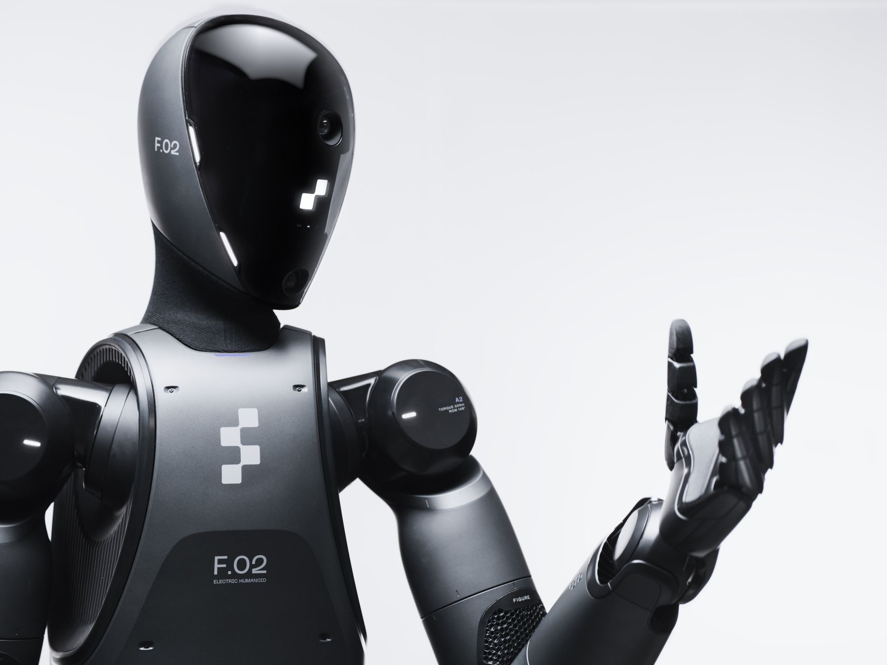{#fig-hero}

If 2023 was the year ChatGPT changed how we think about language AI, **2025 was the year robots got their foundation models**. For decades, robots excelled at repetitive factory tasks but struggled with everyday manipulation — folding laundry, cooking meals, clearing tables. That changed this year.

::: {.callout-note appearance="simple"}
## 📝 Note — TL;DR

- **The big shift**: Vision-Language-Action (VLA) models went from research curiosity to production systems
- **The breakthrough method**: Diffusion Policy and its variants became the dominant approach for robot learning
- **The bottleneck**: It's not algorithms anymore — it's data. The 120,000x gap between robot and LLM datasets is the defining challenge
- **The prediction**: 2026 will see robots-as-a-service go mainstream, but true general-purpose humanoids remain 2-3 years away
:::

## 1. The Year of Foundation Models for Robotics

There are many interesting topics I want to cover, but let's start chronologically in early 2025.

Before this year, training a robot for a new task meant starting from scratch: collect demonstrations, train a policy, deploy, repeat. Each task was isolated. What made 2025 different was the emergence of **Vision-Language-Action (VLA) models** — foundation models that understand language, perceive the world, and output robot actions.

### 1.1 The DeepMind Moment

In March 2025, Google DeepMind released **Gemini Robotics** — their first foundation model specifically designed for robot control. This wasn't just another research paper. It was a production-ready system with a key capability: **zero-shot cross-embodiment transfer**.

Train on an ALOHA2 dual-arm robot. Deploy directly on:

- Franka bi-arm robot
- Apptronik's Apollo humanoid
- No retraining required

By September, they released **Gemini Robotics 1.5**, which added "embodied reasoning" — the ability to use digital tools (web search, calculators) while planning physical tasks. A robot could look up a recipe, then execute it.

### 1.2 Physical Intelligence and π0

While DeepMind focused on integration with their ecosystem, **Physical Intelligence (π)** emerged as the dedicated robotics foundation model company. Their π0 model, open-sourced in February 2025, became the research community's go-to baseline.

{#fig-pi0-arch}

What made π0 notable:

- Trained on **7 robotic platforms** and **68 unique tasks**
- Uses **flow matching** instead of DDPM for faster inference (50Hz continuous actions)
- Released open weights, enabling academic research at scale

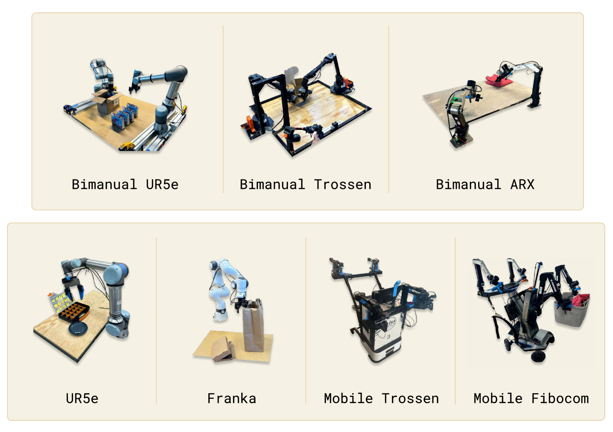{#fig-pi0-robots}

By late 2025, they released π0.5 with improved open-world generalization, and π0.6 with RL fine-tuning for better success rates. Their \$600M Series B (total funding now exceeding \$1B) signals investor confidence that foundation models for robotics are the path forward.

### 1.3 OpenVLA: Democratizing Robot Intelligence

The biggest shift for the open-source community was **OpenVLA** — a 7B parameter model that outperformed Google's RT-2-X (55B parameters) by 16.5% with **7x fewer parameters**.

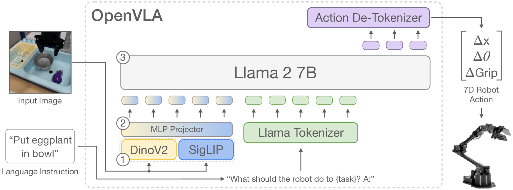{#fig-openvla-arch}

**Model comparison:**

- **RT-2-X** — 55B parameters, baseline performance, closed weights
- **OpenVLA** — 7B parameters, +16.5% vs baseline, open weights
- **SmolVLA** — 450M parameters, ~85% of OpenVLA, open weights

The 2025 updates made it practical:

- **March**: OFT (Optimized Fine-Tuning) recipe for 25-50x faster training
- **January**: FAST tokenizer enabling 15x inference speedup

For the first time, startups and academic labs could train competitive robot policies without billion-dollar compute budgets.

### 1.4 The Efficiency Revolution: SmolVLA and GR00T N1

Two releases in 2025 pushed VLAs in opposite directions — smaller and larger — both successfully.

**SmolVLA** (Hugging Face) proved you don't need billions of parameters, as shown below.

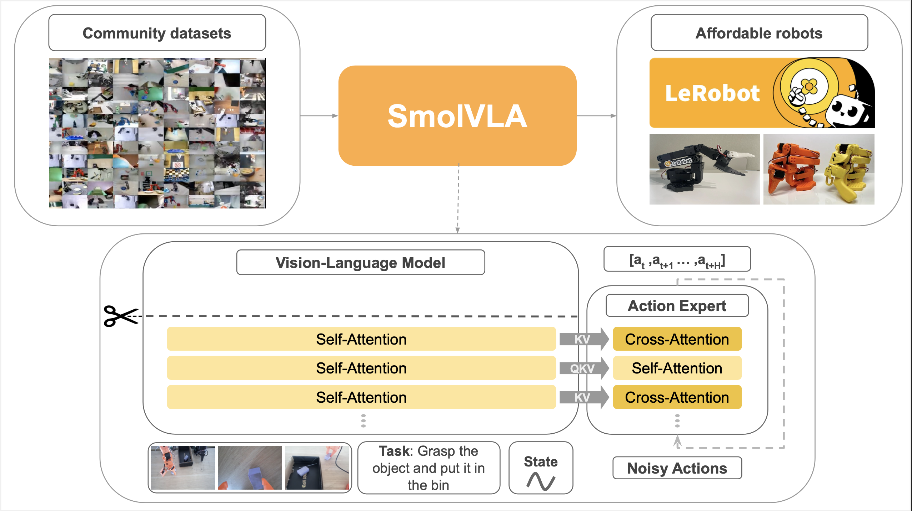{#fig-smolvla}

- **450M parameters** — runs on MacBook CPUs
- Trained entirely on **LeRobot community datasets** (10M frames, 487 datasets)
- Matches OpenVLA performance on LIBERO and MetaWorld benchmarks
- Enables hobbyists and students to experiment with VLAs

**GR00T N1** (NVIDIA) became the first open foundation model for humanoids, as shown below.

{#fig-groot-arch}

- **2.2B parameters** with Eagle-2 VLM backbone
- **120Hz action generation** — fast enough for dynamic balance
- Trained on 780,000 synthetic trajectories (equivalent to 9 months of human demos)
- Open-sourced via Isaac GR00T, adopted by Boston Dynamics, Agility, and others

**Figure AI's Helix** represents the proprietary frontier, as shown below.

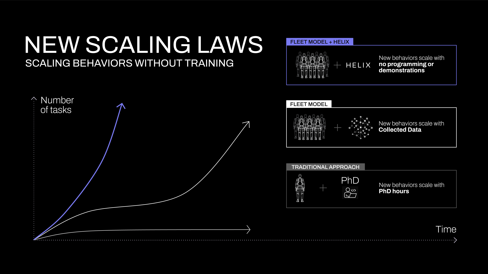{#fig-helix-scaling}

- First VLA controlling a **full humanoid upper body** (35 DoF including individual fingers)
- Dual system: 7B VLA at 7-9Hz (planning) + reactive policy at **200Hz** (motor control)
- Runs entirely onboard on embedded GPUs — no cloud dependency
- First VLA enabling coordinated two-robot manipulation

### 1.5 Focus Points by Year

If I were to summarize the robot learning focus points for each year, my list would look like this:

- **2020 — Sim-to-Real**: Domain randomization, Isaac Gym
- **2021 — Imitation Learning**: Behavior cloning at scale
- **2022 — Transformers for Robotics**: RT-1, Decision Transformer
- **2023 — Diffusion Policy**: Action diffusion, multimodal distributions
- **2024 — VLA Models**: RT-2, OpenVLA, π0
- **2025 — Cross-Embodiment Transfer**: Zero-shot transfer, foundation models

Note that this is cumulative — diffusion policy is still the dominant approach, but it's now combined with VLA backbones. The field didn't abandon what worked; it built on it.

## 2. Diffusion Policy: The Research Darling (Still)

In 2023, [Diffusion Policy](https://aheadofrobotics.substack.com/p/why-robots-keep-crashing-into-walls) showed that the same technique generating Stable Diffusion images could teach robots to move — and outperformed everything before it by 46.9%. Two years later, it's still the foundation of nearly every state-of-the-art system.

### 2.1 Why Diffusion Won

The core insight remains powerful: robot actions are **multimodal**. When approaching an obstacle, both "go left" and "go right" are valid. Traditional behavioral cloning averages these into "go straight" — directly into the wall.

{#fig-diffusion-multimodal}

Diffusion solves this by starting from noise and iteratively denoising into a coherent action sequence. Different random initializations converge to different modes. The robot "commits" to one valid strategy per episode.

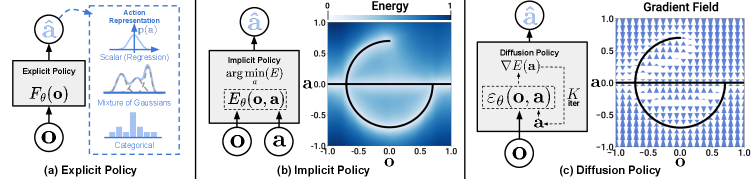{#fig-diffusion-representations}

### 2.2 Algorithmic Improvements in 2025

This year saw substantial refinements to the core diffusion approach, as shown below.

{#fig-diffusion-arch}

**Speed improvements:**

- **Original Diffusion Policy** (RSS 2023) — ~1000ms, 1x baseline
- **Consistency Policy** (RSS 2024) — ~100ms, 10x speedup
- **OneDP** (ICLR 2025) — 16ms (62Hz), 41x speedup
- **LightDP** (ICCV 2025) — 2.7ms, 93x speedup
- **DiffuserLite** (NeurIPS 2024) — 8.2ms (122Hz), 112x speedup

DiffuserLite achieves **122Hz** decision-making through coarse-to-fine planning refinement — fast enough for highly dynamic tasks. LightDP achieves <10ms on *mobile hardware* (iPhone 13). Real-time control is no longer a concern.

**Scaling to humanoids:**

- **iDP3 on Fourier GR1** — 25 DoF (Academic)
- **Boston Dynamics Atlas** — 50 DoF (Industry)
- **RDT-1B** — 14+ DoF (Research)

Boston Dynamics + Toyota Research Institute deployed a **450M parameter Diffusion Transformer** controlling the full Atlas humanoid. The same architecture that generates images now controls a 50-DoF robot doing industrial tasks.

### 2.3 The Surprising Finding

The most interesting research finding this year came from Simchowitz et al.: diffusion policies do **NOT** owe their success primarily to capturing multimodality.

The actual mechanism is **iterative computation with supervised intermediate steps**. A simple two-step regression policy matches flow-based policy performance on most benchmarks.

This suggests the "diffusion" framing may be less important than:

- Multiple refinement steps
- Intermediate supervision during training
- Appropriate stochasticity for exploration

The field is still unpacking what this means. But it's a reminder that our explanations for *why* things work often lag behind the empirical results.

## 3. The Industry: Who's Building What?

Beyond research papers, 2025 saw real deployments at scale.

### 3.1 Agility Digit: First Commercial RaaS Humanoid

Before discussing the flashier humanoids, credit where due: **Agility Robotics' Digit** became the first humanoid to complete a commercial Robots-as-a-Service (RaaS) deployment.

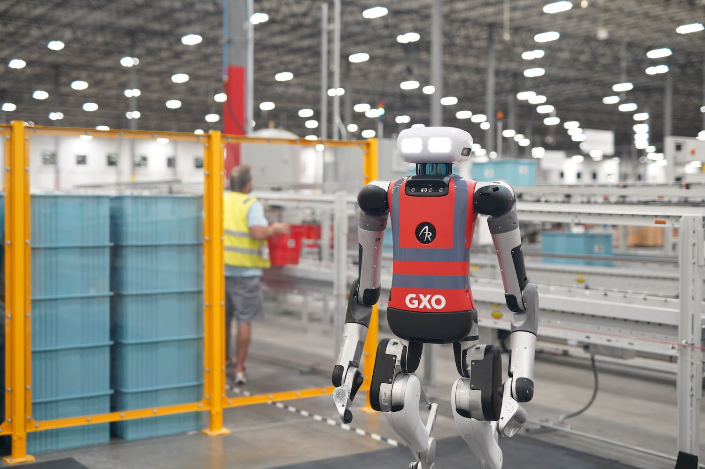{#fig-digit-gxo}

At GXO Logistics' Flowery Branch facility, Digit moved over **100,000 totes** in actual warehouse operations. This isn't a demo — it's a first revenue-generating humanoid deployment, with robots working alongside human workers.

### 3.2 Figure AI: From Demo to Production

Figure AI's Figure 02 robots completed an **11-month deployment at BMW's Spartanburg plant** — working 10-hour shifts alongside human workers. They contributed to the production of over **30,000 X3 vehicles**. This is a first for humanoid robots outside of carefully controlled demos.

Their Figure 03, unveiled in October 2025, demonstrated:

- Laundry folding
- Dishwasher loading
- Trash removal
- Verbal task understanding

Price point for early partners: ~\$80,000. Expected production capacity: 100,000 units within four years via their BotQ factory.

### 3.3 Boston Dynamics: The Comeback

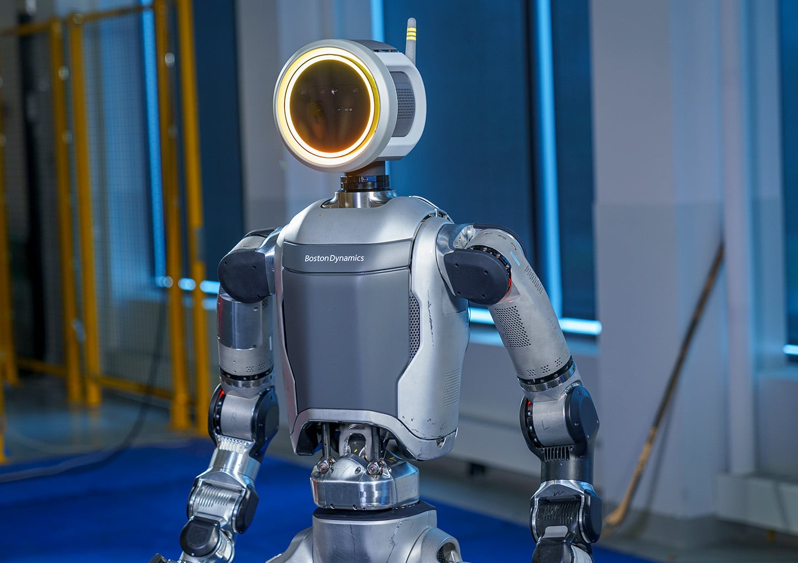{#fig-atlas}

Boston Dynamics, now backed by Hyundai, announced a production-ready Atlas at CES 2026 — designed for commercial deployment with a partnership with Google DeepMind to integrate Gemini Robotics foundation models.

Key metrics:

- **56 DoF** — highest of any commercial humanoid
- **4-hour battery life** with hot-swappable packs
- New factory capable of producing **30,000 Atlas units/year**
- All 2026 production committed to Hyundai and DeepMind partners

Their "Large Behavior Model" demo in August 2025 showed continuous complex task sequences — combining manipulation and locomotion in ways not possible with traditional planning.

### 3.4 Tesla Optimus: The Reality Check

Tesla aimed for 5,000 Optimus units in 2025. They didn't meet it.

In Q4 2025, Elon Musk admitted no Optimus robots are doing "useful work" at Tesla facilities — despite earlier claims. The V3 generation is now targeted for Q1 2026.

Meanwhile, **China controls 90% of the global humanoid robot market**. Unitree and Agibot have outsold Tesla's entire output. The gap isn't algorithmic — it's manufacturing and supply chain.

### 3.5 The Chinese Surge

The numbers tell the story:

- **AgiBot** — ~5,168 units shipped, #1 globally by volume, largest robot dataset (1M+ trajectories)
- **Unitree** — ~5,500 units shipped, most affordable humanoids (\$21K-\$128K), planning \$7B IPO
- **Fourier** — 1,000+ units shipped, GR-2 deployed at SAIC-GM automotive
- **ByteDance** — R&D stage, GR-3 model achieves 77% on abstract instructions

Chinese companies now account for roughly **two-thirds of global humanoid shipments**. If 2024 was the year of "DeepSeek moment" for LLMs, 2025 saw a similar dynamic in robotics. Western labs have the flashiest demos. Chinese companies have the manufacturing scale and are closing the AI gap fast.

AgiBot's GO-1 model claims 78% success rate — a **32% improvement** over prior SOTA — using their ViLLA (Vision-Language-Latent-Action) architecture trained on 1M+ real robot demonstrations.

## 4. The Data Wall

The biggest constraint in robot learning isn't algorithms. It's data.

### 4.1 The Scale Gap

Consider the numbers:

- **GPT-4** — ~10 trillion tokens
- **Stable Diffusion** — ~5 billion images
- **Open X-Embodiment** (largest robot dataset) — ~1 million episodes

The gap between robot foundation models and LLMs is approximately **120,000x** in data scale. High-quality text data on the internet will be exhausted by 2026-2028. Robot data is even more scarce because every episode requires physical execution.

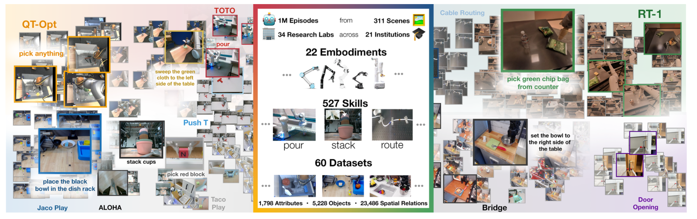{#fig-open-x-overview}

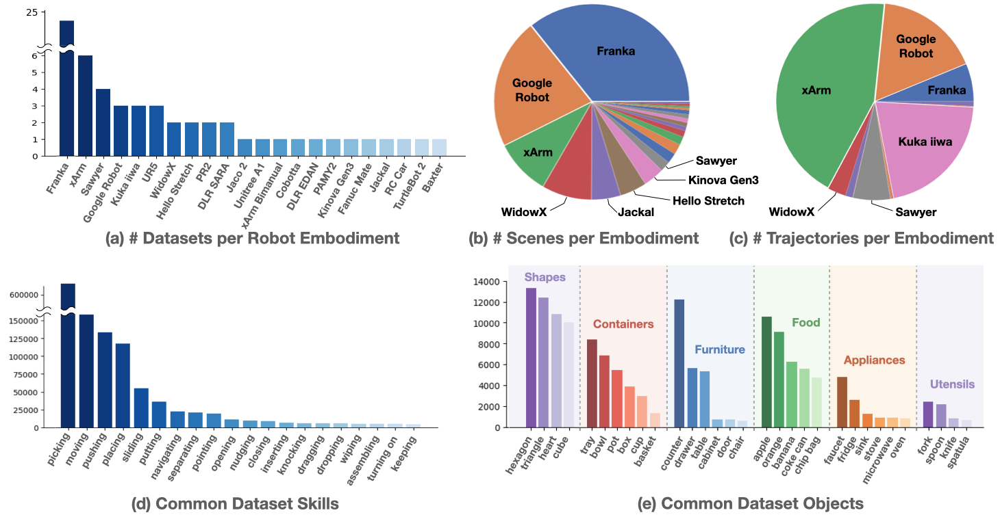{#fig-open-x-analysis}

### 4.2 Why Robot Data Is Different

Unlike text (which exists passively on the internet), robot data requires:

1. **Physical hardware** to execute actions
2. **Skilled teleoperators** to demonstrate tasks
3. **Safety protocols** to prevent damage
4. **Environment setup** for each new task

Scale AI's Physical AI Data Engine has collected 100,000+ hours of real-world robotics data in 2025. But that's still orders of magnitude less than what LLMs train on.

### 4.3 Solutions Being Explored

**Simulation at scale:**

- NVIDIA Isaac Lab enables parallel training across 1000s of environments
- Domain randomization helps sim-to-real transfer
- But the sim-to-real gap remains significant for contact-rich tasks

**Real-world fleet data:**

- Ambi Robotics collects warehouse data during operations
- Physical Intelligence uses fleet deployment for continuous improvement
- The Waymo model: let deployed robots generate training data

**Synthetic demonstration generation:**

- LLMs generating robot plans
- Video prediction models for motion synthesis
- But verification remains challenging

## 5. How We Evaluate: SimplerEnv and the Benchmark Problem

Before discussing sim-to-real, we need to address how we know these models work at all.

### 5.1 SimplerEnv: The New Gold Standard

**SimplerEnv** (CoRL 2024) has become the de facto standard for VLA evaluation. It provides simulated versions of real robot setups (Google Robot, WidowX) with validated correlation to real-world performance.

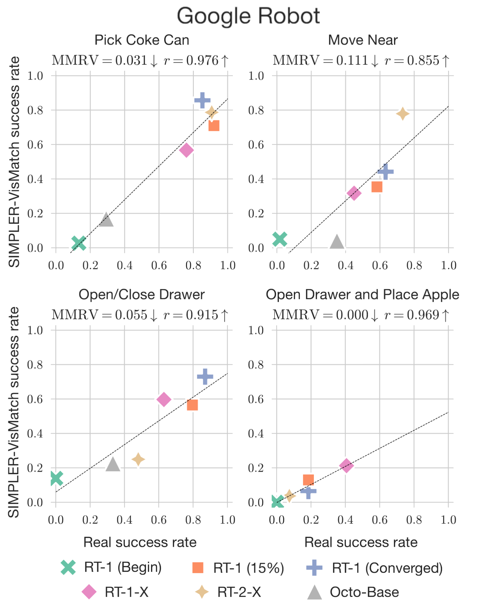{#fig-simpler-correlation}

Why it matters:

- **Validated sim-to-real correlation** via Pearson coefficient and Mean Maximum Rank Violation (MMRV)
- Tests across **visual, semantic, motion, and physical** generalization axes
- Reproducible evaluation for RT-1, RT-1-X, RT-2-X, Octo, and OpenVLA

### 5.2 The LIBERO Warning

A sobering finding from 2025: **LIBERO-PRO** revealed that models scoring >95% on standard LIBERO benchmarks achieve **0% success** under realistic perturbations.

This isn't a minor gap — it's complete failure. Standard benchmarks let models memorize task-specific patterns rather than learning generalizable skills. The research community is now moving toward:

- **Real-to-sim validated benchmarks** (REALM, SimplerEnv)
- **Perturbation testing** as default evaluation
- **Long-horizon task suites** (VLABench, RoboCerebra)

::: {.callout-warning}
## ⚠️ Warning: Benchmark Inflation
When a paper reports 98% on LIBERO, ask: which LIBERO? Standard LIBERO metrics are now considered unreliable indicators of real-world performance.
:::

## 6. The Sim-to-Real Gap (Still)

Training in simulation is cheap. Deploying in reality is hard. The gap persists.

### 6.1 Current Limitations

**Perception issues:**

- Lack of HDR backgrounds creates unrealistic lighting
- Difficulty distinguishing static vs. dynamic objects
- Fine-grained recognition tasks fail

**Physics modeling gaps:**

- Manufacturing tolerances, material wear, mechanical backlash rarely modeled
- Discrete time-step evaluations limit accuracy
- Contact simulation uses simplified approximations

### 6.2 Progress in 2025

The most promising approach this year: **dynamic digital twins**.

"Real-is-Sim" (Toyota Research) keeps a correctable simulator always-in-the-loop during deployment. The simulation synchronizes with the physical world using real-time sensor data. When reality diverges from simulation, the sim updates.

NVIDIA's AutoMate framework achieved **84.5% success rate** on real-world part assembly with zero-shot sim-to-real transfer. For industrial tasks with well-defined geometry, the gap is closing.

## 7. Hardware vs. Software: Where's the Bottleneck?

This year shifted my thinking on what actually limits robot deployment.

### 7.1 The Manufacturing Constraint

Multiple experts now argue the defining constraint is **manufacturing capacity**, not AI/software.

Specific bottlenecks:

- **High-precision planetary roller screws**: Require specialized grinding machines in extremely limited global supply
- **Magnets, gearheads, batteries**: Will remain constrained for years
- **Production scale**: Low volume of precision components slows humanoid scaling

### 7.2 The Cost Challenge

- **Tesla Optimus** (target) — \$20,000-\$30,000
- **Figure 03** — \$80,000+
- **Boston Dynamics Atlas** — \$140,000-\$150,000

For robots to replace human labor economically, they need to cost less than ~\$50,000 and work reliably for 3+ years. We're not there yet.

### 7.3 Safety and Reliability

Industrial customers expect **99.99% uptime reliability**. Production line downtime costs tens of thousands of dollars per minute.

Current gaps:

- No standardized regulations for humanoid robots
- Fall dynamics introduce unique safety challenges
- Cybersecurity for AI-controlled robots is immature

## 8. Predictions for 2026

Based on the trends I've observed, here's where I think we're heading:

### 8.1 What Will Happen

**Robots-as-a-Service (RaaS) goes mainstream:**

The shift from large upfront purchases to monthly fees will lower adoption barriers. Expect more "warehouse automation subscriptions" than one-time robot purchases.

**Foundation models become the default:**

Training task-specific policies from scratch will become rare. Fine-tuning VLA models on domain data will be the standard workflow — just like fine-tuning LLMs.

**Diffusion gets faster, not replaced:**

Despite the theoretical findings questioning why diffusion works, no alternative has emerged that's clearly better. Expect 1-4 step inference with consistency distillation to become standard.

**Data collection scales:**

Fleet deployment for data collection will accelerate. Physical Intelligence, Figure, and others will use deployed robots to continuously improve their models.

### 8.2 What Won't Happen (Yet)

**General-purpose household humanoids:**

The reliability, cost, and safety requirements aren't met. We'll see continued factory/warehouse deployments, not robots folding your laundry at home.

**Full autonomy in unstructured environments:**

Even with foundation models, robots struggle with truly novel situations. The long tail of edge cases remains unsolved.

**Data problem "solved":**

The 120,000x data gap won't close in one year. Simulation, synthetic data, and clever augmentation will help, but the fundamental scarcity persists.

### 8.3 My 2027 Prediction

If 2025 was the year of foundation models for robotics, I think **2027 will be the year of robotic continual learning**.

Just as LLM research is moving toward models that learn without forgetting, robot learning will need systems that:

- Learn from deployment without catastrophic forgetting
- Incorporate new objects and tasks without full retraining
- Maintain safety guarantees while adapting

The algorithmic foundations exist (experience replay, regularization, etc.), but nobody has made it work reliably for embodied systems. That's the next frontier.

## 9. Surprises and Reflections

### 9.1 What Surprised Me This Year

**Boston Dynamics pivoting to foundation models:**

For years, they focused on classical control and optimization. Seeing them partner with DeepMind and train 450M parameter transformers signals a genuine paradigm shift.

**Chinese companies leading in manufacturing:**

I expected the algorithmic leaders (DeepMind, OpenAI) to translate research into products. Instead, companies with manufacturing expertise are shipping more robots.

**The speed of VLA adoption:**

In January 2025, VLA was still niche. By December, every major robotics lab either uses or is developing VLA-based systems. The shift was faster than I anticipated.

**How much "diffusion" matters (or doesn't):**

The Simchowitz et al. finding that iterative refinement — not diffusion specifically — drives performance changes how I think about the field. We may have been telling ourselves the wrong story about why these methods work.

### 9.2 What I Got Wrong

In early 2025, I thought:

- Humanoid robots would remain primarily research platforms. **Wrong** — Figure 02 did real factory work.
- Sim-to-real would remain the biggest bottleneck. **Partially wrong** — data and manufacturing matter more.
- OpenVLA would be outpaced by proprietary models. **Wrong** — open models remain competitive.

### 9.3 What I'm Still Uncertain About

**Will foundation models truly generalize?**

Current results show impressive few-shot learning on seen task categories. But will a model trained on kitchen tasks generalize to construction? The jury is out.

**Is the humanoid form factor right?**

Humanoids are intuitive (designed for human environments) but complex. Purpose-built robots (like Boston Dynamics' Stretch for warehouses) may be more practical for specific deployments.

**When will reliability reach industrial standards?**

99.99% uptime seems years away. But the pace of improvement in 2025 exceeded my expectations. Maybe 2027-2028?

## 10. Looking Forward

If there's one meta-lesson from 2025, it's that progress in robot learning is accelerating on multiple fronts simultaneously:

- **Algorithms**: Diffusion policy refinements, consistency models, flow matching
- **Models**: VLAs combining language understanding with motor control
- **Data**: Fleet deployment, simulation at scale, synthetic augmentation
- **Hardware**: Cheaper actuators, better sensors, manufacturing scale-up
- **Deployment**: Real factory work, not just demos

The field feels different than it did a year ago. In 2024, "foundation models for robotics" was aspirational. In 2025, it's the default approach for new research.

My hope for 2026 is that we continue to see improvements while being honest about what remains hard. The data gap is real. The sim-to-real gap persists. Safety and reliability aren't solved. But the trajectory is unmistakably upward.

::: {.callout-note appearance="simple"}
## 📝 Note — Summary

2025 was the year robot learning got its foundation models. The key developments:

1. **VLA models matured**: Gemini Robotics, π0, OpenVLA moved from papers to production
2. **Diffusion policy dominated**: Still the core method, now 93x faster with LightDP
3. **Real deployments happened**: Figure 02 at BMW, Atlas for commercial work
4. **Data became the bottleneck**: The 120,000x gap with LLMs defines the challenge
5. **Manufacturing matters**: China leads in production; algorithms alone aren't enough

For 2026, expect RaaS to go mainstream, foundation models to become the default, and the data collection race to intensify. General-purpose household humanoids remain 2-3 years away.

The field is moving fast. Staying current requires following not just papers but deployments, manufacturing developments, and the evolving data landscape. That's what I'll continue documenting in this series.
:::

## References

### Key Papers (2025)

- [Gemini Robotics 1.5](https://deepmind.google/blog/gemini-robotics-15-brings-ai-agents-into-the-physical-world/) — DeepMind's embodied reasoning model
- [OpenVLA](https://openvla.github.io/) — Open-source 7B VLA model
- [π0](https://arxiv.org/abs/2410.24164) — Physical Intelligence's flow matching VLA
- [GR00T N1](https://arxiv.org/abs/2503.14734) — NVIDIA's open humanoid foundation model
- [SmolVLA](https://huggingface.co/blog/smolvla) — 450M parameter VLA for consumer hardware
- [Helix](https://www.figure.ai/news/helix) — Figure AI's full-body humanoid VLA

### Diffusion Policy Papers

- [LightDP](https://arxiv.org/abs/2508.00697) — 2.7ms inference (ICCV 2025)
- [DiffuserLite](https://arxiv.org/abs/2401.15443) — 122Hz planning (NeurIPS 2024)
- [OneDP](https://arxiv.org/abs/2410.21257) — One-step distillation (ICLR 2025)
- [iDP3](https://github.com/YanjieZe/Improved-3D-Diffusion-Policy) — 3D diffusion for humanoids
- [RDT-1B](https://arxiv.org/abs/2410.07864) — 1.2B robotics diffusion transformer
- [Simchowitz et al.](https://arxiv.org/abs/2503.09722) — Why diffusion policies work (COLT 2025)

### Benchmarks

- [SimplerEnv](https://simpler-env.github.io/) — Sim-to-real validated VLA benchmark (CoRL 2024)
- [LIBERO-PRO](https://arxiv.org/abs/2510.03827) — Robust evaluation revealing benchmark inflation
- [Open X-Embodiment](https://robotics-transformer-x.github.io/) — 1M+ episode cross-embodiment dataset

### Industry Sources

- [Figure AI at BMW](https://www.figure.ai/news/production-at-bmw) — 30,000+ vehicles produced
- [Agility Digit at GXO](https://www.agilityrobotics.com/content/digit-moves-over-100k-totes) — 100K+ totes moved
- [Boston Dynamics Atlas](https://bostondynamics.com/products/atlas/) — CES 2026 commercial launch
- [AgiBot GO-1](https://www.globenewswire.com/news-release/2025/03/11/3040608/0/en/AgiBot-GO-1-The-Evolution-of-Generalist-Embodied-Foundation-Model-from-VLA-to-ViLLA.html) — ViLLA architecture

### Surveys

- [Vision-Language-Action Models Survey](https://arxiv.org/html/2510.07077v1) — Comprehensive VLA review
- [Diffusion Models for Robotic Manipulation](https://www.frontiersin.org/journals/robotics-and-ai/articles/10.3389/frobt.2025.1606247/full) — 2025 survey with taxonomy
- [World Models for Embodied AI](https://arxiv.org/abs/2510.16732) — Planning and prediction

### Background Reading

- [My Diffusion Policy Deep Dive](https://aheadofrobotics.substack.com/p/why-robots-keep-crashing-into-walls) — Technical explanation
- [Diffusion Series](https://aheadofrobotics.substack.com/p/diffusion-and-flow-matching-part) — Mathematical foundations
